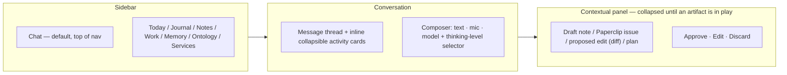
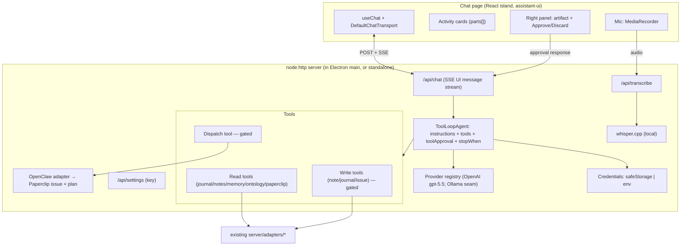
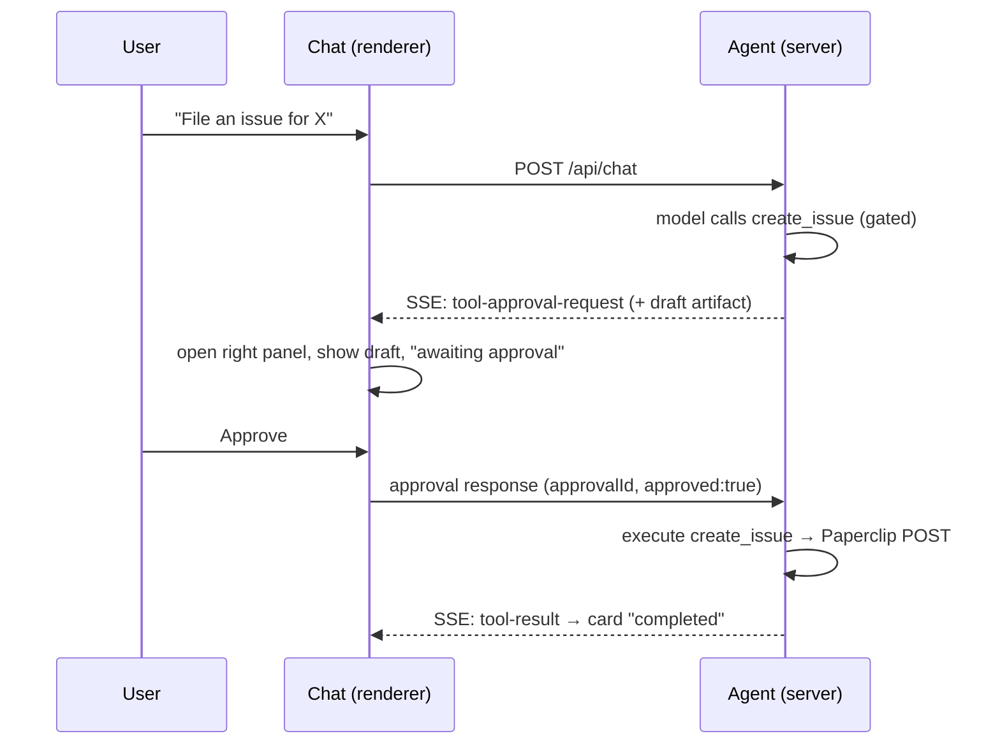

<!-- markdownlint-disable-next-line MD025 -->
# Chat Agent Page - Plan

## Goal Capsule

- **Objective:** Add a default **Chat** page to jarvOS Desktop — a Codex/Claude-Code-style agent that runs gpt-5.5, takes text or voice, streams its actions inline, and acts on the user's jarvOS data (vault, notes, Paperclip) through a propose-and-approve right panel. It can also dispatch heavy work to a chosen execution runtime, starting with OpenClaw.
- **Product authority:** Andrew. Product shape confirmed in brainstorm dialogue 2026-06-29; planning forks (voice backend, chat UI kit) confirmed 2026-06-29.
- **Open blockers:** None. Implementation-time unknowns are listed under Open Questions.
- **Product Contract preservation:** Requirements unchanged. One assumption refined during planning — the voice backend moves from browser-native speech-to-text (not viable in Electron) to local whisper.cpp; product behavior in R5 (dictate by voice → text in composer) is preserved.

---

## Product Contract

### Summary

A new Chat page becomes the app's landing surface and the top item in the left sidebar. It hosts an agentic assistant — model in a loop, calling jarvOS tools, streaming what it does — that answers over and acts on the user's real journal, notes, memory, ontology, and Paperclip. Writes are gated for approval in a contextual right panel. The same chat can hand heavy execution to a backend runtime through a runtime picker that mirrors the model picker.

### Problem Frame

jarvOS Desktop today is a read-only viewer: seven pages that show the journal, notes, work, memory, ontology, and service health, but offer no way to act. To do anything — capture a note, file an issue, ask a question that spans sources — the user leaves the app for a separate agent or the terminal. The data the agents already operate on is right there; what's missing is a conversational surface that can read it, reason over it, and change it in place, with the user in the loop. This is the interactive counterpart to the existing autonomous clawd runtime, not a replacement for it.

### Key Decisions (product)

- **Agentic harness, not a model wrapper.** The "specialized on jarvOS" feel comes from the harness — a curated jarvOS tool set plus primed context — not from fine-tuning. Swapping the underlying model leaves the specialization intact.
- **One agent, shared substrate, not a second runtime.** The desktop agent reads and writes the same `MEMORY.md`, vault, and Paperclip the clawd agents use, so state does not diverge. Genuinely heavy execution is dispatched out rather than re-implemented here.
- **Provider-agnostic backbone via the Vercel AI SDK.** A provider-agnostic agent/tool-calling loop is what makes the later multi-model future (local models via Ollama, then Zai/Grok) reachable without rework.
- **Adopt the mainstream stack on the Chat page only.** The Chat page uses the AI SDK plus a React chat UI kit; the existing six pages stay zero-dependency vanilla JS.
- **Auth: API key for the in-chat agent, OAuth via runtime dispatch.** The conversational agent calls gpt-5.5 directly via an API key (stored encrypted in the OS keychain). The "Sign in with ChatGPT / Claude" subscription experience is first-party to Codex and Claude Code; jarvOS reaches it by dispatching to those runtimes. A per-provider auth-method seam lets a provider switch to OAuth/device-code later without touching the chat or tool layers.
- **Tiered approval.** Reads and drafts run automatically; writes, deletes, and external/dispatch actions require an explicit click.
- **Live data, protected by the write-gate.** The agent points at the user's real jarvOS data, not a sandbox — the approval gate is the safety net.
- **Runtime as a parameter.** The dispatch tool takes a `runtime` argument. v1 ships only the OpenClaw/clawd adapter; Codex and Claude Code are fast-follow adapters behind the same seam.

### Actors

- A1. **User** — Andrew, conversing by text or voice, approving gated actions.
- A2. **Desktop agent** — the gpt-5.5 harness in the Chat page; reads jarvOS data, proposes and (on approval) performs writes, dispatches heavy work.
- A3. **Execution runtime** — the backend that performs dispatched heavy work; OpenClaw/clawd (Michael/Charlie) in v1, under its own gates.

### Layout



### Requirements

**Chat page and navigation**

- R1. A new Chat page is added with route `#/chat`, and `#/chat` is the application's default landing route.
- R2. A "Chat" link appears at the top of the left sidebar, above "Today".
- R3. The existing six pages remain functional and unchanged in behavior.

**Conversation and input**

- R4. The user can type a message into a composer and send it to the agent.
- R5. The user can dictate input by voice via a microphone control; transcribed text populates the composer before sending.
- R6. The composer exposes a model selector and a thinking-level (reasoning effort) selector; gpt-5.5 is the initial supported model.

**Agent behavior and tools**

- R7. The agent runs as a tool-calling loop: it can read the user's journal, notes, memory, ontology, and Paperclip data to answer questions and ground its actions.
- R8. The agent can take write actions against jarvOS — at minimum create a note, append to the journal, and create or update a Paperclip issue.
- R9. Reads and drafts execute without prompting; writes, deletes, and external/dispatch actions are presented for explicit approval before they take effect.
- R10. The agent's actions render inline in the conversation as live, collapsible activity cards showing what it is doing (reading, drafting, awaiting approval, completed). The cards reflect real tool calls — no fabricated steps.

**Right panel (review surface)**

- R11. A right panel is collapsed by default and opens when there is an artifact in play (a draft note, an issue being filed, a proposed edit/diff, a plan).
- R12. The right panel presents the pending artifact with Approve, Edit, and Discard controls; approving is what commits a gated action.

**Runtime dispatch**

- R13. The agent has a dispatch tool that takes a target runtime parameter and a task specification.
- R14. v1 implements the OpenClaw/clawd adapter, which files the work into the runtime (Paperclip issue + plan) so it executes under the runtime's gates.
- R15. The dispatch tool's interface accommodates additional runtimes (Codex, Claude Code) without changing its call contract.

**Authentication and providers**

- R16. The user can supply an OpenAI API key; it is stored encrypted in the OS keychain via Electron `safeStorage` and used to authenticate model calls. The key is never written to disk in plaintext and never exposed to the browser/renderer.
- R17. Provider authentication is modeled behind a common interface (an auth method per provider) so a provider can later authenticate by OAuth/device-code without changing the chat, tool, or approval layers. v1 implements the API-key method for OpenAI; the first planned extension is a local Ollama provider.

### Key Flows

- F1. Ask-and-answer (read-only)
  - **Trigger:** User asks a question spanning their jarvOS data.
  - **Steps:** Agent calls read tools across journal/notes/memory/Paperclip; activity cards show each read; agent answers in the thread.
  - **Outcome:** A grounded answer with no approval prompts (reads are auto).
  - **Covered by:** R7, R10.

- F2. Propose-and-approve a write
  - **Trigger:** User asks the agent to create a note or file an issue.
  - **Steps:** Agent drafts the artifact; right panel opens with the draft and Approve/Edit/Discard; activity card shows "awaiting approval"; on Approve the write commits and the card resolves to "completed".
  - **Outcome:** The note/issue exists in the user's live data only after explicit approval.
  - **Covered by:** R8, R9, R11, R12.

- F3. Dispatch heavy work to a runtime
  - **Trigger:** User asks for work heavy enough to hand off.
  - **Steps:** Agent forwards the chosen runtime (OpenClaw in v1) via the dispatch tool; the dispatch is a gated action requiring approval; on approval the task is filed into the runtime; progress streams back into the activity surface.
  - **Outcome:** Heavy execution runs in the runtime under its gates, surfaced in the chat.
  - **Covered by:** R9, R13, R14, R15.

### Acceptance Examples

- AE1. **Covers R9.** **Given** the agent has drafted a new Paperclip issue, **when** it is ready to write, **then** the issue is not created until the user clicks Approve in the right panel.
- AE2. **Covers R7, R9.** **Given** the user asks a question answerable from notes and journal, **when** the agent runs only read tools, **then** it answers without any approval prompt.
- AE3. **Covers R1.** **Given** the user opens jarvOS Desktop, **when** no route is specified, **then** the Chat page is shown.
- AE4. **Covers R14.** **Given** the user approves a dispatch to OpenClaw, **when** the dispatch tool runs, **then** the task is filed into the clawd runtime (issue + plan) rather than executed in the desktop app.
- AE5. **Covers R16.** **Given** no API key has been set, **when** the user opens the Chat page, **then** they are prompted to add a key and the rest of the app remains usable.

### Success Criteria

- The Chat page is the default route and never degrades or blocks the existing six pages.
- The safety invariant holds: no write/delete/external action ever touches the user's data without an explicit approval click.
- Provider secrets never appear in plaintext on disk and never reach the renderer — same trust boundary as the existing server-side Paperclip token handling.
- The activity stream maps one-to-one to real tool calls.
- Swapping the model (and later, the runtime or auth method) requires no change to the tool or approval layers.

### Scope Boundaries

**Deferred for later**

- Zai and Grok model providers, and cross-provider orchestration. (A local Ollama provider is the first planned use of the R17 seam, but not part of v1's Definition of Done.)
- Codex and Claude Code runtime adapters (the seam is built in v1; the adapters are not).
- Direct OAuth/device-code auth for a provider's own API.
- Realtime/streaming voice conversation; v1 is press-to-talk dictation only.
- Deeper memory/handoff unification with the clawd runtime beyond shared read/write of the existing substrate.

**Outside this product's identity**

- The desktop agent is not a second autonomous execution runtime. Heavy, gated, autonomous execution belongs in clawd; this surface is interactive and user-in-the-loop, and it dispatches rather than competes.

**Deferred to Follow-Up Work**

- Note edit/delete tools (v1 write set is create-note, append-journal, create/update-issue).
- Mic permission polish and multi-language transcription.

### Dependencies / Assumptions (product)

- The Chat page assumes an OpenAI account and API key with gpt-5.5 access.
- The subscription/OAuth model experience is reached via the Codex/Claude Code runtime adapters (deferred); direct-provider OAuth is left to the R17 seam.
- **Voice assumes a local whisper.cpp install** (binary + model) reachable by the server. When absent, the mic degrades gracefully and text input is unaffected.
- Shared substrate assumes the desktop agent and clawd agents operate on the same `MEMORY.md`, vault, and Paperclip instance described in the app config.
- **Gate assumption:** the OpenClaw adapter preserves the clawd governance gates because work is filed into the runtime. Non-clawd runtimes, when added, would execute heavy work outside those gates — to be resolved before those adapters ship.

---

## Planning Contract

### Key Technical Decisions

- KTD1. **Agent loop runs server-side.** The `ToolLoopAgent`, the API key, and all model calls live in the existing server process (which Electron boots in-process). The renderer only sends user messages and receives an SSE stream — the secret never reaches the browser. This preserves the existing trust boundary (cf. `AGENT_SAFE_FIELDS` server-side whitelisting in `server/adapters/paperclip.js`).
- KTD2. **Framework-free streaming over `node:http`.** No Next.js/Express/Hono. The AI SDK streams to the existing `http.createServer` response via `pipeAgentUIStreamToResponse` / `pipeUIMessageStreamToResponse` over an SSE **UI Message Stream**, which carries text deltas, tool-call, tool-result, step boundaries, and tool-approval-request parts — everything the activity cards need. Wire `abortSignal` to client disconnect.
- KTD3. **Native tool-approval for propose-and-approve.** Use `ToolLoopAgent` with `toolApproval` mapping write/delete/dispatch tools to `'user-approval'`. The approve/deny→resume mechanic (a `tool-approval-request` part → push a `ToolApprovalResponse` tool message → re-run) maps 1:1 onto the right-panel Approve/Discard. Tools keep their real `execute`; approval only gates whether it runs. Reads/drafts get no approval.
- KTD4. **React island scoped to the Chat page.** A bundler (Vite) builds the Chat page's React/assistant-ui app into static assets the existing server serves at the `#/chat` container. The other six pages stay vanilla; no global framework adoption.
- KTD5. **assistant-ui for the chat UI.** Chosen for prebuilt tool-call/approval cards and a Claude-Artifacts-style right-side workspace panel, which are the two highest-priority, hardest pieces. Its runtime is contained to the Chat bundle.
- KTD6. **Provider registry + reasoning effort.** `createProviderRegistry` addresses models as `"provider:model"` strings; OpenAI reasoning effort is set via `providerOptions.openai.reasoningEffort` (`minimal | low | medium | high`). The model + thinking-level selectors map onto these. A local **Ollama** provider (OpenAI-compatible endpoint) is the seam's first intended extension.
- KTD7. **Local whisper.cpp for voice.** Press-to-talk records audio in the renderer (`MediaRecorder`), POSTs it to a server transcription endpoint that shells to a local whisper.cpp binary, and returns text. Offline, no per-use cost, consistent with local-first. Browser-native Web Speech is rejected — it throws a `network` error in Electron (backend gated to official Chrome builds).
- KTD8. **Credential storage with a run-mode fallback.** Under Electron, the key is encrypted at rest with `safeStorage` (async API) backed by the OS keychain. Under plain `npm run serve` (no Electron, no `safeStorage`), the key is read from an `OPENAI_API_KEY` env var — mirroring the existing Paperclip token pattern (env var OR file). The key is resolved and used only server-side.
- KTD9. **Paperclip write methods are new.** `server/adapters/paperclip.js` is read-only (GET). v1 adds create/update issue methods (POST/PATCH). All writes are exposed only through approval-gated tools.
- KTD10. **Use current AI SDK API surface.** `inputSchema` (not `parameters`), `stopWhen: isStepCount(n)` (not `maxSteps`), `onStepEnd` (not `onStepFinish`). Avoids a later deprecation migration.

### High-Level Technical Design

Component and data flow:



Approval round-trip (F2/AE1):



### Output Structure

```
server/
  agent/
    index.js          # ToolLoopAgent assembly + chat endpoint handler
    providers.js      # provider registry, model + reasoningEffort
    credentials.js    # safeStorage | env key resolution
    transcribe.js     # whisper.cpp invocation
    tools/
      read.js         # jarvOS read tools
      write.js        # gated write tools
      dispatch.js     # gated runtime-dispatch tool
  adapters/
    runtime/
      openclaw.js     # files Paperclip issue + plan into clawd
static/
  chat/               # built React/assistant-ui island (bundler output)
chat-src/             # React/assistant-ui source (Vite)
  main.tsx
  components/         # thread, composer, activity cards, right panel, mic
```

### Assumptions (planning)

- The local Paperclip API exposes issue create/update endpoints under the same `/api/companies/:cid/...` base used for reads; exact shape confirmed during implementation (Open Questions).
- whisper.cpp is invoked as a local binary with a preloaded model; path/model are configurable via `config.json`.
- The Electron window loads the renderer from the localhost server URL (secure context), so `getUserMedia` works for the mic.

### Sequencing

Foundation (U1–U3) → tools (U4–U6) → agent loop (U7) → voice endpoint (U8) → UI shell and components (U9–U12) → voice capture and settings (U13–U14). UI units depend on the streaming endpoint (U7) existing.

---

## Implementation Units

### U1. Chat-page build pipeline

- **Goal:** Introduce a bundler so a React/assistant-ui island can be built and served, without disturbing the vanilla pages.
- **Requirements:** R1, R3.
- **Dependencies:** none.
- **Files:** `package.json` (add `ai`, `@ai-sdk/react`, `@ai-sdk/openai`, `@assistant-ui/react`, `zod`, `vite`, `react`, `react-dom`; add `build`/`dev:chat` scripts), `vite.config.js`, `chat-src/main.tsx` (placeholder mount), `static/chat/` (build output), `server/index.js` (serve `static/chat/` assets).
- **Approach:** Vite builds `chat-src/` to `static/chat/`. The existing static handler already serves `static/`; confirm the SPA fallback does not swallow `/chat/*` asset requests. Keep the six existing pages on their current vanilla path untouched.
- **Patterns to follow:** existing static serving and `STATIC_DIR` guard in `server/index.js`.
- **Test scenarios:** Build produces `static/chat/` assets; `npm run serve` serves them with correct MIME; existing pages still load. `Covers AE3` indirectly (route shell lands in U9). Edge: asset request under `/chat/` returns the file, not the SPA fallback HTML.
- **Verification:** `npm run build` succeeds; a placeholder mounts at `#/chat` without breaking other routes.

### U2. Provider + model registry (server)

- **Goal:** Server-side provider registry exposing gpt-5.5 with selectable reasoning effort, designed for additional providers.
- **Requirements:** R6, R17.
- **Dependencies:** U1.
- **Files:** `server/agent/providers.js`.
- **Approach:** `createProviderRegistry({ openai })`; resolve a model by `"openai:gpt-5.5"`; pass `providerOptions.openai.reasoningEffort` from the request. Expose a small `listModels()` for the selector. Leave a clear extension point for an Ollama provider (OpenAI-compatible base URL) without implementing it.
- **Patterns to follow:** adapter module shape (functions taking config) in `server/adapters/*`.
- **Test scenarios:** `Covers R6.` Given effort `high`, the built call options carry `reasoningEffort: 'high'`. Given an unknown model id, a clear error is returned. Edge: missing effort defaults to a sane value.
- **Verification:** A unit test asserts model resolution and provider-option mapping.

### U3. Credential store (server)

- **Goal:** Resolve and persist the OpenAI key securely, with a run-mode fallback, never exposing it to the renderer.
- **Requirements:** R16, R3.
- **Dependencies:** U1.
- **Files:** `server/agent/credentials.js`, `electron/main.js` (provide `safeStorage` to the in-process server), `server/index.js` (add `/api/settings` GET status / POST key / DELETE key).
- **Approach:** Resolution order: `OPENAI_API_KEY` env → `safeStorage`-decrypted store (when Electron + `isEncryptionAvailable()`). Save path encrypts with `encryptStringAsync` and writes ciphertext under the app data dir. The settings status endpoint returns only `{ hasKey: boolean }` — never the key. Handle `isEncryptionAvailable() === false` (e.g. Linux no-keyring) as an explicit degraded path that asks for the env var.
- **Patterns to follow:** `readToken` env-or-file pattern in `server/adapters/paperclip.js`.
- **Test scenarios:** `Covers R16.` Key set via env resolves without keychain. Status endpoint returns `hasKey` and never the secret. Saved key round-trips through encrypt/decrypt. Edge: encryption unavailable → degraded status surfaced, no crash. Error: malformed stored ciphertext → treated as no key.
- **Verification:** Unit tests for resolution order and the no-secret-leak guarantee.

### U4. jarvOS read tools

- **Goal:** Expose the existing read adapters as AI SDK tools the agent can call without approval.
- **Requirements:** R7.
- **Dependencies:** U2.
- **Files:** `server/agent/tools/read.js`.
- **Approach:** One `tool({ description, inputSchema, execute })` per capability — search/read notes, read journal day/stream, read memory, read ontology, list/read Paperclip issues — delegating to existing adapter functions. Zod `inputSchema`. No `toolApproval`.
- **Patterns to follow:** existing adapter function signatures in `server/adapters/{notes,journal,memory,ontology,paperclip}.js`.
- **Test scenarios:** `Covers AE2.` Each tool returns adapter data for valid input. Edge: missing note title → structured "not found", not a throw. Invalid input → schema rejection before execute.
- **Verification:** Unit tests per tool against the adapters.

### U5. jarvOS write tools (approval-gated)

- **Goal:** Let the agent create a note, append to the journal, and create/update a Paperclip issue — only via approval-gated tools.
- **Requirements:** R8, R9, R12.
- **Dependencies:** U4.
- **Files:** `server/agent/tools/write.js`, `server/adapters/paperclip.js` (add `createIssue`, `updateIssue`), `server/adapters/notes.js` and `server/adapters/journal.js` (add additive write helpers).
- **Approach:** Each write tool produces a draft payload (the artifact shown in the right panel) and, on approval, performs the write. Vault writes are additive (new note; append a journal bullet) consistent with the user's additive-only vault rule. Paperclip writes POST/PATCH with the Bearer token. Mark these tools for `'user-approval'` in U7's `toolApproval` map.
- **Patterns to follow:** `api()` Bearer-token call in `server/adapters/paperclip.js`; additive journal-bullet edit style.
- **Test scenarios:** `Covers AE1.` Approved create-issue calls the Paperclip POST exactly once; denied create-issue performs no write. Append-journal adds a bullet without removing existing content. Edge: Paperclip POST failure surfaces as a tool error, not a silent success. Integration: a write tool's draft payload matches what the right panel renders.
- **Verification:** Unit tests with a stubbed Paperclip endpoint assert write-on-approve / no-write-on-deny.

### U6. Runtime dispatch tool + OpenClaw adapter

- **Goal:** A gated dispatch tool that hands heavy work to a chosen runtime; OpenClaw implemented.
- **Requirements:** R13, R14, R15.
- **Dependencies:** U5.
- **Files:** `server/agent/tools/dispatch.js`, `server/adapters/runtime/openclaw.js`.
- **Approach:** `dispatch({ runtime, task })` with `runtime` an enum; v1 resolves only `openclaw`, which files a Paperclip issue (+ a plan body) into the configured jarvOS-desktop project so it runs under clawd gates. Unknown runtimes return a "not yet available" result. Gated via `toolApproval`.
- **Patterns to follow:** Paperclip issue creation from U5; runtime/governance note in project memory.
- **Test scenarios:** `Covers AE4.` Approved dispatch to `openclaw` files an issue+plan and performs no local execution. `runtime: 'codex'` returns a clear "not available in v1". Edge: dispatch without approval performs nothing.
- **Verification:** Unit test asserts OpenClaw path files the issue and the seam rejects unknown runtimes cleanly.

### U7. Agent loop + streaming endpoint

- **Goal:** Assemble the jarvOS-primed agent and stream it over the existing server, including the approval round-trip.
- **Requirements:** R7, R9, R10.
- **Dependencies:** U2, U3, U4, U5, U6.
- **Files:** `server/agent/index.js`, `server/index.js` (add `/api/chat`).
- **Approach:** `new ToolLoopAgent({ model, instructions, tools, stopWhen: isStepCount(20), toolApproval })` where `toolApproval` maps write/dispatch tools to `'user-approval'`. Stream with `pipeAgentUIStreamToResponse({ response, agent, uiMessages, abortSignal })`. On an approval response from the client, push a `ToolApprovalResponse` tool message and resume. `instructions` prime the agent with jarvOS context (who it is, the tool set, the additive-vault and approval norms). Use `onStepEnd` for server-side step logging only.
- **Patterns to follow:** route-map + `json()` + 127.0.0.1 binding in `server/index.js`.
- **Test scenarios:** `Covers AE2, AE1.` A read-only prompt streams an answer with no approval-request part. A write prompt emits a `tool-approval-request` and does not write until an approval response arrives. Loop halts at the step cap. Edge: client disconnect aborts the run via `abortSignal`. Error: missing key → a clean "add your key" stream event, not a 500 with a stack.
- **Verification:** Integration test drives a scripted tool sequence through the endpoint and asserts the approval gating and stream parts.

### U8. Voice transcription endpoint (local whisper.cpp)

- **Goal:** Transcribe uploaded audio locally and return text.
- **Requirements:** R5.
- **Dependencies:** U1.
- **Files:** `server/agent/transcribe.js`, `server/index.js` (add `/api/transcribe`), `config.json` (whisper binary path + model).
- **Approach:** Accept an audio upload, write to a temp file, invoke the configured whisper.cpp binary, return `{ text }`. If the binary/model is missing, return a structured "voice unavailable" so the UI can disable the mic gracefully.
- **Patterns to follow:** config loading + tilde expansion in `server/config.js`.
- **Test scenarios:** `Covers R5.` A known short clip returns non-empty text. Missing binary → structured unavailable, not a crash. Edge: empty/oversized upload rejected with a clear error.
- **Verification:** Endpoint returns text for a fixture clip when whisper.cpp is present; degrades cleanly when not.

### U9. Chat page shell + routing

- **Goal:** Make Chat the default route with a top-of-sidebar entry and the three-zone shell.
- **Requirements:** R1, R2, R3, R11.
- **Dependencies:** U1.
- **Files:** `static/index.html` (sidebar entry, chat container), `static/app.js` (default route `#/chat`, mount/unmount the React island), `chat-src/main.tsx`.
- **Approach:** Add the "Chat" nav link above "Today"; change the default route from `#/today` to `#/chat`; when the chat route activates, mount the React island into its container and unmount on navigation away (so the vanilla pages are unaffected).
- **Patterns to follow:** the `pages` renderer map, hash router, and `state.after` hook in `static/app.js`.
- **Test scenarios:** `Covers AE3, R2.` Opening the app with no hash shows Chat. "Chat" appears first in the sidebar. Navigating to Notes and back unmounts/remounts cleanly without leaks. Edge: deep-link to `#/journal` still works.
- **Verification:** Manual: default load is Chat; existing pages navigate normally.

### U10. Conversation + composer

- **Goal:** The message thread and composer with model/thinking selectors and send.
- **Requirements:** R4, R6.
- **Dependencies:** U7, U9.
- **Files:** `chat-src/components/Thread.tsx`, `chat-src/components/Composer.tsx`.
- **Approach:** `useChat` with `DefaultChatTransport({ api: '/api/chat' })`; render `message.parts[]` by type; composer posts text plus the selected model id and reasoning effort (via `prepareSendMessagesRequest`). Selectors are populated from the server's `listModels()`.
- **Patterns to follow:** assistant-ui thread/composer composition.
- **Test scenarios:** `Covers R4, R6.` Typing and sending appends a user turn and streams a reply. Changing thinking level changes the request body's effort. Edge: empty submit is a no-op.
- **Verification:** Manual: a text exchange streams; selector changes reach the server.

### U11. Inline activity cards

- **Goal:** Render the agent's tool activity inline as collapsible cards.
- **Requirements:** R10.
- **Dependencies:** U10.
- **Files:** `chat-src/components/ActivityCard.tsx`.
- **Approach:** Map tool-call / tool-result / step parts to assistant-ui tool cards with states (reading, drafting, awaiting approval, completed). One card per real tool call; collapsible.
- **Patterns to follow:** assistant-ui `Tool` component.
- **Test scenarios:** `Covers R10.` A read tool shows a "read" card that resolves to completed. A gated tool shows "awaiting approval" until resolved. Edge: a failed tool renders an error state, not a silent disappearance.
- **Verification:** Manual: cards reflect the streamed parts one-to-one.

### U12. Right-panel workspace + approval

- **Goal:** The contextual right panel that shows pending artifacts and drives approval.
- **Requirements:** R11, R12, R9.
- **Dependencies:** U11.
- **Files:** `chat-src/components/RightPanel.tsx`.
- **Approach:** Collapsed until a `tool-approval-request` (or other artifact part) arrives; render the draft (note/issue/diff/plan) using the existing markdown/diff conventions; Approve/Discard send the `ToolApprovalResponse` back through the chat transport to resume the loop; Edit lets the user adjust the draft before approving.
- **Patterns to follow:** assistant-ui artifacts example; existing markdown rendering conventions in `static/app.js` for parity.
- **Test scenarios:** `Covers AE1, R12.` Approve commits the gated action and resolves the card; Discard cancels with no write; the panel collapses when nothing is pending. Edit changes the payload that gets approved. Edge: a second pending artifact queues rather than clobbering the first.
- **Verification:** Manual: the F2 approval round-trip works end to end.

### U13. Voice capture (renderer)

- **Goal:** Press-to-talk dictation into the composer.
- **Requirements:** R5.
- **Dependencies:** U8, U10.
- **Files:** `chat-src/components/Mic.tsx`, `electron/main.js` (`session.setPermissionRequestHandler` for microphone).
- **Approach:** `MediaRecorder` captures on press, POSTs the blob to `/api/transcribe`, inserts the returned text into the composer. Disable the mic with a tooltip when the server reports voice unavailable.
- **Patterns to follow:** existing fetch-to-server calls in `static/app.js`.
- **Test scenarios:** `Covers R5.` A recording produces text in the composer. Voice-unavailable disables the mic with an explanation. Edge: permission denied surfaces a clear prompt, not a silent failure.
- **Verification:** Manual: dictation populates the composer when whisper.cpp is present.

### U14. No-key / settings + empty states

- **Goal:** Make the missing-key path graceful and let the user manage the key.
- **Requirements:** R16, R3.
- **Dependencies:** U3, U10.
- **Files:** `chat-src/components/Settings.tsx`, `chat-src/components/EmptyState.tsx`.
- **Approach:** On load, query `/api/settings` for `hasKey`; if false, show an add-key prompt and a settings affordance; saving POSTs to `/api/settings`. The rest of the app stays usable throughout.
- **Patterns to follow:** server settings endpoint from U3.
- **Test scenarios:** `Covers AE5.` No key → prompt shown, other pages usable. Saving a key clears the prompt. Edge: clearing the key returns to the prompt state.
- **Verification:** Manual: AE5 holds; key save/clear works.

---

## Verification Contract

| Gate | Command | Applies to | Done signal |
|---|---|---|---|
| Build | `npm run build` | U1, U9–U14 | Chat island builds to `static/chat/`; no errors |
| Unit tests | `npm test` (node:test) | U2–U8 | Tool, adapter, credential, and agent-gating tests pass |
| Smoke | `npm run smoke` | server routes | Existing health/route smoke still green |
| Browser run | `npm run serve` → `http://127.0.0.1:4807` | F1–F3 | Chat default; read answer streams; write/dispatch gated; voice/no-key states behave |
| Desktop run | `npm run desktop` | KTD1, KTD8 | Key encrypted via `safeStorage`; key never in renderer; window loads from localhost |

Manual flows to exercise: F1 (read answer, no prompts), F2 (write proposed → approve → committed; deny → no write), F3 (dispatch approved → Paperclip issue filed), AE5 (no-key path).

---

## Definition of Done

- All of R1–R17 are satisfied; AE1–AE5 demonstrably hold.
- The six existing pages are unchanged in behavior; Chat is the default route.
- No write/delete/dispatch occurs without an explicit approval (the safety invariant), verified by U5/U7 tests and the F2 manual flow.
- The OpenAI key is never present in the renderer or in plaintext on disk; resolution works under both `npm run serve` (env) and `npm run desktop` (`safeStorage`).
- Voice dictation works locally via whisper.cpp when installed and degrades gracefully when not.
- The activity stream reflects real tool calls one-to-one.
- Build, unit, and smoke gates pass; manual flows F1–F3 and AE5 verified.

---

## Risks

- **assistant-ui runtime weight / API fit.** Its runtime is heavier than the vanilla pages and its artifact/approval components must map onto the AI SDK approval parts. Mitigate by containing it to the Chat bundle and validating the approval round-trip early (U7 + U12).
- **whisper.cpp dependency.** Requires a local binary + model; absent on a fresh machine. Mitigate with the graceful-unavailable path (U8/U13) and config-driven paths.
- **Paperclip write API shape unknown.** The read adapter doesn't prove write endpoints exist as assumed. Mitigate by confirming the create/update endpoint shape first in U5 (Open Questions).
- **safeStorage gaps.** `isEncryptionAvailable()` can be false (Linux no-keyring). Mitigate with the env-var degraded path (U3/KTD8).
- **Approval-resume state.** Tracking multiple pending approvals and resuming the loop correctly is the subtlest piece. Mitigate by queueing artifacts (U12) and integration-testing the round-trip (U7).

---

## Open Questions (deferred to implementation)

- Exact Paperclip issue create/update endpoint shape and required fields.
- whisper.cpp invocation specifics (binary path, model, audio format the renderer should send).
- How dispatched OpenClaw progress (reported via Paperclip) maps back into the inline activity cards — v1 may file-and-forget with a link, with live progress a follow-up.
- Whether note edit/delete join the v1 write set (currently deferred to follow-up).
