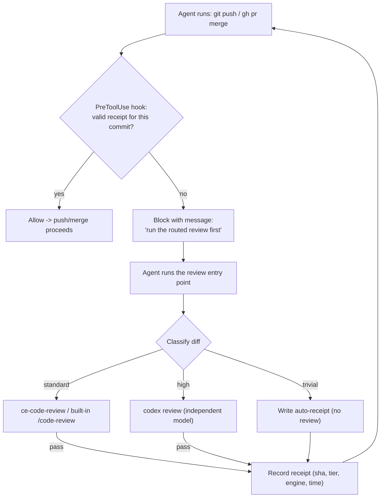

# Risk-Based Review Gate (global Claude Code default) - Plan

**Target:** the user's global Claude Code config under `~/.claude/` (not a single repo). Paths below are `~/.claude/...` deliberately — this is machine-global tooling, so `~`-rooted paths are correct here rather than repo-relative ones.

## Goal Capsule

- **Objective:** Make "every change gets *some* code review before it leaves the machine" the enforced default across all of Andrew's Claude Code work — with a cheap risk classifier that routes important/risky diffs to an independent **codex review** and lighter diffs to **ce-code-review** or the built-in **/code-review**, and a hard gate that blocks a push/merge until a matching review receipt exists.
- **Product authority:** Andrew. Enforcement = hard gate (hook + receipt); scope = global Claude Code default; confirmed 2026-06-30.
- **Open blockers:** None. Implementation-time details (receipt format, exact command-match patterns) are in Open Questions.

---

## Product Contract

### Summary

A global Claude Code setup: a risk classifier scores any diff, a router picks the review engine by risk (codex for important code, ce-code-review/built-in for the rest, skip for trivial), and a PreToolUse hook blocks `git push` / merge to a default branch unless a fresh "review receipt" covers the shipped commits. It is a **forcing function against forgetting** review, not a tamper-proof gate (see KTD8), and it coexists with the existing clawd governance layer rather than fighting it. CodeRabbit is explicitly excluded (private repos). The result: review happens before merge without relying on the agent remembering, and trivial changes aren't over-reviewed.

### Problem Frame

Today, whether a change gets reviewed before merge depends on the agent remembering to run a review — and which engine, at what depth, is ad hoc. There's no floor (some merges get no review) and no ceiling (trivial changes can pull a heavy multi-agent pass). CodeRabbit, the usual automated PR reviewer, can't help on private repos. The fix is a standing, enforced default that right-sizes review to risk and can't be silently skipped.

### Requirements

**Risk classification and routing**

- R1. A classifier reads a diff (the commits about to be pushed/merged) and assigns a tier: `trivial`, `standard`, or `high`.
- R2. `high` is assigned when the diff touches sensitive surfaces (auth/authz, secrets/credentials, crypto, payments, data migrations, env/CI config, process execution or external IO/network) OR is large/cross-cutting (over a configurable changed-line/file threshold).
- R3. `trivial` is assigned only when the diff is exclusively docs, lockfiles, generated/build output, or pure formatting — no behavior-bearing code. Classification **fails toward review**: any ambiguity, or a behavior-bearing change in a file type that otherwise looks trivial, is `standard`, never `trivial`.
- R4. Everything else is `standard`.
- R5. The router maps tiers to engines: `high` → **codex review** (independent model); `standard` → **ce-code-review** (or built-in `/code-review`); `trivial` → no review.

**The gate (enforcement)**

- R6. A global Claude Code PreToolUse hook intercepts Bash commands that push or merge to a default branch (`git push` to the default branch, `git merge` of a feature branch into it, `gh pr merge`) and blocks them unless a valid review receipt covers the commits being shipped. This is a **forcing function** that prevents *forgetting* to review; it is not tamper-proof against a non-compliant agent (see KTD8).
- R7. A review receipt records the **range of commits reviewed** (base..head content), the tier, the engine used, and a timestamp. It is valid for a push/merge only when every commit that push/merge would introduce is covered by the reviewed range; adding any new unreviewed commit invalidates it. A no-fast-forward **merge commit** is covered when its introduced commits were reviewed, even though the merge commit's own SHA is new.
- R8. A `trivial` classification can produce a receipt **without** a review run (so trivial changes pass the gate without over-reviewing), and this auto-pass is recorded as such.
- R9. The gate blocks with an actionable message telling the agent exactly what to run (the routed review command) to obtain a receipt, so a blocked push is self-resolving.

**Routing/recording workflow**

- R10. A single entry point classifies the diff, runs the routed review, and on a passing review records the receipt — so the agent has one command to satisfy the gate.
- R11. For `high`, the codex review path runs `codex review` non-interactively and only records a receipt on a passing result.

**Documentation**

- R12. Global instructions (in `~/.claude/CLAUDE.md`) document the convention, the engine inventory and how to invoke each, the tier→engine mapping, and the explicit exclusion of CodeRabbit on private repos.

**Coexistence with existing governance**

- R13. The gate must not block authorized runtime auto-merges. Sessions running inside the clawd/OpenClaw runtime are exempt (detected via runtime context) OR a recorded clawd autoreview pass counts as a valid receipt — so the autonomous-merge mandate (aligned + gate-clean → auto-merge) keeps working and changes are never double-gated.

### Engine inventory (resolved during planning)

| Engine | Invocation | Model | Weight | Used for |
| --- | --- | --- | --- | --- |
| Built-in `/code-review` | in-session skill (`code-review@claude-plugins-official`, enabled); `low\|medium\|high\|ultra`, `--comment`/`--fix` | Claude (same family) | light | `standard` (cheap path) |
| `ce-code-review` | in-session skill (compound-engineering, enabled); self-sizes (lite roster for small low-risk), multi-persona + optional cross-model pass | Claude + optional peer | medium | `standard` (default) |
| `codex review` | `codex review` CLI (`/usr/local/bin/codex`), non-interactive pass/fail; also wrapped by gstack `/codex` | Codex/GPT (independent) | heavy, independent | `high` |
| CodeRabbit | GitHub app on PRs | — | — | **excluded** — private repo; not relied upon |

### Success Criteria

- A push/merge to a default branch is impossible (blocked by the hook) without a fresh receipt — verified by attempting an unreviewed push and seeing it blocked.
- A trivial-only change (e.g. a docs edit) passes the gate without invoking any review engine.
- A change touching a sensitive surface routes to codex review, and a routine code change routes to ce-code-review/built-in.
- The mechanism is active for any repo Andrew works in from Claude Code (global), not just jarvos-desktop.
- The agent, when blocked, is told the exact command to run and can self-resolve without human help.

### Scope Boundaries

- **In scope:** the classifier, the router, the receipt format + record/verify, the PreToolUse enforcement hook, the codex-review wrapper, and the global docs.
- **Out of scope:** changing what the review engines themselves do; CI/GitHub-Actions-based review; reviewing others' PRs; signing/attesting receipts cryptographically.

**Deferred to Follow-Up Work**

- Per-repo overrides of the sensitive-path list or thresholds (start with a global default set).
- A "force override" escape hatch for emergencies (decide once the gate is in use).

### Dependencies / Assumptions

- `codex` CLI is installed and authenticated (confirmed: `/usr/local/bin/codex`, with a `review` subcommand).
- Claude Code PreToolUse command hooks can block a tool call (deny decision / non-zero exit) — the enforcement mechanism depends on this.
- The agent's pushes/merges go through the Bash tool (so the PreToolUse hook sees them); `permissions.defaultMode` is `bypassPermissions`, so the hook — not a permission prompt — is the gate.
- "Before merge" is enforced at the **push to a default branch** and `gh pr merge` boundary (matching the local-merge-then-push workflow used in this repo).

---

## Planning Contract

### Key Technical Decisions

- KTD1. **Enforce at the Claude Code PreToolUse hook, not a per-repo git hook.** A git `pre-push` hook is per-repo and can't invoke the in-session review skills; a global PreToolUse hook in `~/.claude/settings.json` applies to every repo and can block the agent's push/merge Bash calls with a message that drives the agent to the right in-session review. This is what makes it a true global default.
- KTD2. **Decouple "review ran" from "review engine" via a receipt.** The hook only checks for a valid receipt; the agent (or the codex wrapper) produces it after the routed review. This lets the gate coexist with agent-chosen, in-session engines — the core tension in the brainstorm. The trust asymmetry this creates is made explicit in KTD8.
- KTD3. **Receipt identity = the reviewed commit range, not a single SHA.** A receipt covers `base..head` by the commits it introduces; the hook checks that every commit a push/merge would ship is within a reviewed range. This survives **no-fast-forward merges** (the merge commit's SHA is new, but its introduced commits were reviewed) and `--amend`/rebase that don't add unreviewed work, while still invalidating on genuinely new commits. A single-SHA receipt was the obvious first design but would wrongly block legitimately-reviewed no-ff merges.
- KTD4. **Three tiers, two engines, plus skip.** `high` → codex (independent model is the point — a second model family catches what same-model review misses); `standard` → ce-code-review (self-sizing) or built-in; `trivial` → skip with an auto-receipt. This directly satisfies "don't over-review" and "important code gets codex."
- KTD5. **Risk is path + size + content, classified cheaply and deterministically.** Sensitive-path globs and a changed-line/file threshold are computed from the diff without an LLM, so the classifier is fast and runs inside the hook's latency budget. (Content-risk keywords are a coarse signal; the path and size signals carry most of the weight.)
- KTD6. **Single agent entry point.** One script/command classifies → runs the routed review → records the receipt, so "satisfy the gate" is one action and the blocked-push message can name it exactly.
- KTD7. **CodeRabbit is excluded by design,** documented so neither the agent nor a future setup leans on it for private repos.
- KTD8. **Trust model: a forcing function, not a tamper-proof gate.** The receipt is a file the agent can write, so the gate reliably stops *forgetting* to review but cannot stop a non-compliant agent from recording without reviewing — except the **codex tier**, where the wrapper records only on an actual passing `codex review`. For the standard tier the gate is an honor-system speed bump. This is acceptable for a personal workflow whose goal is "never silently skip review," and the docs (R12) state it plainly rather than implying a guarantee the gate doesn't give.
- KTD9. **Coexist with the clawd governance layer.** This gate sits above autoreview/clawpatch/clawsweeper and the autonomous-merge mandate. The Claude-Code hook never fires for codex-runtime agents (Michael) anyway; the real interaction is with `claude_local` sessions (Charlie) and runtime-context Claude runs. To keep the two systems from fighting, those sessions are exempt (or a clawd autoreview pass is accepted as a receipt), so authorized auto-merges are never blocked and changes aren't reviewed twice (R13).

### High-Level Technical Design

Gate + routing flow:



### Output Structure

```
~/.claude/
  scripts/
    review-classify.<sh|js>    # diff -> {tier, engine, reasons}
    review-record.<sh|js>      # write a receipt for the current commit
    review-verify.<sh|js>      # used by the hook: valid receipt for push target?
    review-route.<sh|js>       # entry point: classify -> review -> record
    review-codex.<sh|js>       # run `codex review`, record receipt on pass
    review-gate-hook.<sh|js>   # PreToolUse hook: match push/merge, call verify, block/allow
  review-receipts/             # receipts (git-ignored, per repo+commit)
  settings.json                # + PreToolUse hook entry (wires review-gate-hook)
  CLAUDE.md                    # + review convention, engine inventory, mapping
```

### Assumptions (planning)

- A shell implementation is sufficient for the classifier/hook (the repo's other hooks use `node`; either is fine — the implementer picks one and stays consistent).
- The default-branch name is resolved per repo (`git symbolic-ref refs/remotes/origin/HEAD`, fallback `main`/`master`).

### Sequencing

Classifier (U1) → receipt record/verify (U2) → entry point + codex wrapper (U3, U4) → enforcement hook + settings wiring (U5) → global docs (U6). The hook (U5) depends on verify (U2) existing.

---

## Implementation Units

### U1. Risk classifier

- **Goal:** Deterministically classify a diff into `trivial` / `standard` / `high` with reasons.
- **Requirements:** R1, R2, R3, R4, R5.
- **Dependencies:** none.
- **Files:** `~/.claude/scripts/review-classify.<sh|js>`, `~/.claude/scripts/__tests__/review-classify.test.<sh|js>`.
- **Approach:** Take a base ref (default: merge-base with the default branch) and compute the changed file list + numstat. `high` if any changed path matches the sensitive-path set (auth, secret/credential, crypto, payment/billing, migration/schema, `.env`/CI/workflow, and process/IO/network modules) OR changed-lines/files exceed thresholds. `trivial` if every changed path is docs/lockfile/generated/whitespace-only. Else `standard`. Emit JSON `{tier, engine, reasons[]}` where engine follows R5.
- **Patterns to follow:** the sensitive-surface list mirrors ce-code-review's own conditional-reviewer triggers (security/data-migration/reliability) and Stage 1b signals.
- **Test scenarios:**
  - `high`: a diff touching an `auth`/secrets path, and separately a diff over the line/file threshold, each classify `high` with a naming reason.
  - `trivial`: a docs-only diff and a lockfile-only diff classify `trivial`.
  - `standard`: a moderate code-only diff with no sensitive paths classifies `standard`.
  - Edge: empty diff; a mixed diff (one trivial + one sensitive file) classifies `high` (most-severe wins).
- **Verification:** Unit tests cover each tier and the most-severe-wins rule.

### U2. Review receipt: record + verify

- **Goal:** Write a receipt for the current commit and verify a receipt against a push/merge target.
- **Requirements:** R7, R8.
- **Dependencies:** U1.
- **Files:** `~/.claude/scripts/review-record.<sh|js>`, `~/.claude/scripts/review-verify.<sh|js>`, tests alongside.
- **Approach:** `record` writes a receipt (repo identity + reviewed `base..head` range + the set/hash of introduced commits + tier + engine + timestamp + `auto:true|false`) under `~/.claude/review-receipts/`. `verify` takes the commits a push/merge would ship and returns valid only when all are covered by a reviewed range — so a no-ff merge commit verifies when its introduced commits were reviewed. Any uncovered shipped commit makes it invalid.
- **Patterns to follow:** keyed-by-`<repo>` receipt files holding reviewed ranges so concurrent repos don't collide.
- **Test scenarios:**
  - Record a reviewed range, then verify a push of those commits → valid.
  - Add a new commit beyond the reviewed range → invalid (uncovered commit).
  - A no-fast-forward merge whose introduced commits were all reviewed → valid (despite a new merge-commit SHA).
  - `auto:true` trivial receipt verifies the same as a reviewed one.
  - Edge: missing receipt dir; malformed receipt file → treated as invalid, not a crash.
- **Verification:** Unit tests for valid/stale/auto/missing paths.

### U3. Review entry point (classify → review → record)

- **Goal:** One command that satisfies the gate: classify, run the routed review, and record the receipt on pass.
- **Requirements:** R5, R10.
- **Dependencies:** U1, U2.
- **Files:** `~/.claude/scripts/review-route.<sh|js>`.
- **Approach:** Run the classifier. `trivial` → record an auto-receipt and exit. `standard`/`high` → print the exact engine command the agent should run in-session (built-in `/code-review`, `ce-code-review`, or — for `high` — delegate to the codex wrapper U4), and, for the in-session engines, expose a `record` step the agent calls after the review passes. (In-session skills can't be spawned from a shell script, so for those tiers this entry point instructs and then records on confirmation; the codex tier runs fully scripted via U4.)
- **Patterns to follow:** the blocked-push message (U5) names this entry point.
- **Test scenarios:**
  - `trivial` → auto-receipt written, no engine invoked.
  - `high` → routes to the codex wrapper.
  - `standard` → emits the ce-code-review/built-in instruction and the record step.
- **Verification:** Each tier produces the right action; trivial fully self-completes.

### U4. codex review wrapper

- **Goal:** Run `codex review` non-interactively and record a receipt only on a pass.
- **Requirements:** R11.
- **Dependencies:** U2.
- **Files:** `~/.claude/scripts/review-codex.<sh|js>`.
- **Approach:** Invoke `codex review` against the diff range, parse its pass/fail result, and on pass call `review-record` with `engine:codex`, `tier:high`. On fail, surface the findings and do **not** record (gate stays closed).
- **Patterns to follow:** gstack `/codex` skill's `codex review` invocation as the reference for flags/parsing.
- **Test scenarios:**
  - Stubbed `codex` returning pass → receipt recorded with `engine:codex`.
  - Stubbed `codex` returning fail/non-zero → no receipt, findings surfaced.
  - Edge: `codex` missing/unauthed → clear error, no receipt.
- **Verification:** Pass records, fail/невозможно does not; receipt carries `codex`.

### U5. Enforcement hook + settings wiring

- **Goal:** Block push/merge to a default branch unless a valid receipt exists, globally.
- **Requirements:** R6, R9, R13.
- **Dependencies:** U2.
- **Files:** `~/.claude/scripts/review-gate-hook.<sh|js>`, `~/.claude/settings.json` (add a `PreToolUse` hook entry).
- **Approach:** The hook fires on every Bash call, so it takes a **fast path that returns immediately for any command that isn't a push/merge to the default branch** (near-zero cost is required). For a match (`git push` targeting the default branch, `git merge <feature>` while on it, `gh pr merge`), first apply the governance exemption (R13: skip when in a clawd runtime context); otherwise resolve the commits the command would ship and call `review-verify`; if invalid, return a block decision naming the `review-route` entry point and the routed tier. Add the hook to `settings.json` alongside the existing `SessionStart` hook without disturbing it.
- **Patterns to follow:** the existing `hooks.SessionStart` command-hook shape in `~/.claude/settings.json`; Claude Code PreToolUse block-decision contract.
- **Test scenarios:**
  - `git push` to default branch with no receipt → blocked with the actionable message.
  - Same push after a valid receipt exists → allowed.
  - A non-push command (`git status`, `git commit`) → never blocked.
  - `gh pr merge` with no receipt → blocked.
  - A clawd runtime-context session pushing → allowed (exempt per R13), not blocked.
  - A no-fast-forward merge whose introduced commits were reviewed → allowed (range-based verify).
  - A non-push command returns via the fast path with negligible overhead.
  - Edge: push to a non-default branch (feature branch) → allowed (gate is about merging to default).
  - Edge: detached/unknown default branch → fail safe (block with a clear reason rather than silently allowing).
- **Verification:** Manual + scripted: unreviewed push blocked, reviewed push allowed, unrelated commands unaffected, the existing SessionStart hook still fires.

### U6. Global convention + engine inventory docs

- **Goal:** Document the convention so the agent applies it and a human understands it.
- **Requirements:** R12.
- **Dependencies:** U1–U5.
- **Files:** `~/.claude/CLAUDE.md` (append a "Code review before merge" section).
- **Approach:** Document: the tier→engine mapping, the engine inventory table and how to invoke each, that the gate blocks push/merge without a receipt and how to satisfy it (the `review-route` entry point), the trivial auto-pass, and the explicit CodeRabbit exclusion for private repos.
- **Patterns to follow:** the existing global `~/.claude/CLAUDE.md` instruction style.
- **Test scenarios:** `Test expectation: none -- documentation.` Manual: a fresh read makes the convention and the unblock path obvious.
- **Verification:** The doc names the gate, the mapping, the engines, and the unblock command.

---

## Verification Contract

| Gate | How | Done signal |
|---|---|---|
| Classifier tests | run the script's unit tests | trivial/standard/high + most-severe-wins pass |
| Receipt tests | run unit tests | record/verify/stale/auto/missing pass |
| Codex wrapper tests | stubbed codex pass/fail | records on pass only |
| Hook behavior | attempt an unreviewed push, then a reviewed one | blocked then allowed; unrelated commands unaffected; SessionStart hook intact |
| End-to-end | trivial change and a sensitive change | trivial passes review-free; sensitive routes to codex; both gate-clean only after a receipt |

---

## Definition of Done

- R1–R12 hold. An unreviewed push/merge to a default branch is blocked in any repo; a reviewed (or trivial) one is allowed.
- Trivial changes pass without invoking an engine; sensitive changes route to codex; routine changes route to ce-code-review/built-in.
- The blocked-push message names the exact command to self-resolve.
- The existing `SessionStart` hook and other `~/.claude` config are untouched apart from the additive hook entry.
- CodeRabbit is documented as excluded; the global CLAUDE.md carries the convention and engine inventory.
- All script unit tests pass; the hook is verified blocking-then-allowing by hand.

---

## Risks

- **Hook latency / false blocks.** The PreToolUse hook runs on every Bash call; it must be cheap and match push/merge precisely, or it will add latency or block unrelated commands. Mitigate: fast path that returns immediately for non-push/merge commands; thorough match tests (U5).
- **Receipt staleness friction.** Range-based receipts (KTD3) survive no-ff merges and no-op amends, but genuinely new commits still force re-review (correct). Mitigate: trivial auto-pass covers the cheap cases.
- **Over-trusting the gate.** Treating the standard-tier gate as tamper-proof would be a mistake (KTD8) — it only prevents forgetting. Mitigate: the docs state the trust model plainly; the codex tier is the only path enforced on a real pass.
- **Conflict with clawd governance.** Without the R13 exemption, this hook would block the runtime's authorized auto-merges or double-review changes. Mitigate: runtime-context exemption / accepting a clawd autoreview pass as a receipt, verified in U5.
- **In-session engines can't be script-driven.** `review-route` can fully automate only the codex tier; for standard tier it instructs the agent and records after. Mitigate: the gate + the actionable message make the agent run it; the receipt is the proof.
- **Global blast radius.** A bug in the hook could block all pushes everywhere. Mitigate: fail-safe behavior, an easy disable (remove the settings.json entry), and a documented override path (deferred).
- **codex auth/availability.** `high` changes depend on a working `codex review`. Mitigate: clear error + no receipt on failure (the change simply can't ship until codex is available or the tier is overridden).

---

## Open Questions (deferred to implementation)

- Exact receipt file format and how to encode the reviewed commit range (commit-set vs `base..head` hash) — the identity is decided (range-based, KTD3); the encoding is not.
- How to detect a clawd runtime context for the R13 exemption (env var / cwd / session marker) — confirm against how the runtime sets up its Claude sessions.
- Exact command-match patterns for the hook (how to robustly detect "push/merge to the default branch" across `git push` argument forms and `gh pr merge`).
- Whether `standard` defaults to ce-code-review or the built-in `/code-review` (and whether to make that configurable).
- The exact `codex review` flags and pass/fail parsing (resolve against the installed `codex` version + the gstack `/codex` skill).
- Whether to add a documented emergency override now or after living with the gate.
