<!-- markdownlint-disable-file MD025 -->
# GBrain Cross-Harness Continuity - Plan

## Goal Capsule

- **Objective:** Give Andrew's private Codex, Hermes, and OpenClaw harnesses one GBrain-backed structured-memory identity, the same recall behavior, and provider-owned Skillify discovery without making GBrain mandatory in public jarvOS.
- **Approved architecture:** Migrate the private brain to host-local, loopback-only Postgres, then connect each harness through GBrain's native local stdio MCP integration. Keep jarvOS responsible for optional adaptation, health evidence, and deployment receipts—not database, resolver, broker, or daemon ownership.
- **Authority:** Andrew has approved the Postgres plus provider-native stdio topology (session-settled, 2026-08-26). GBrain owns structured recall and Skillify; jarvOS owns integration policy and truthful health; harnesses own their native configuration; Paperclip, Vault, and journal owners retain their existing state boundaries. Execution remains gated on the prerequisite, rehearsal, ownership, review, and merge gates named below, not on a further topology choice.
- **Execution profile:** Six ordered units. U1 is the prerequisite, maintenance-owner, provenance, and execution-lane gate; U2 is the reversible migration rehearsal; U3–U5 are the reviewed code changes; U6 is merge, live migration, activation, and native live-turn proof. No host mutation, private-brain migration, harness config change, issue assignment, or service activation occurs during planning.
- **Stop condition:** Stop if the migration cannot be rehearsed and reversed through provider-supported commands, any harness lacks a provider-supported connection path, more than one maintenance owner cannot be reduced to one, provider-owned Skillify cannot be exposed without duplicate ownership, or a receipt cannot prove the same brain without exposing private data.

---

## Product Contract

### Summary

Andrew should be able to move among Codex, Hermes, and OpenClaw while retaining one structured GBrain memory and the same provider-backed capabilities. The private environment requires this continuity. Portable jarvOS keeps GBrain optional and does not absorb GBrain's database, resolver, or service lifecycle.

### Problem Frame

jarvOS already has the optional `@jarvos/gbrain` adapter, `jarvos_recall`, GBrain doctor checks, managed-harness activation, and shared-skill distribution. Those pieces prove neither a live GBrain connection nor one-brain parity across the three private harnesses. They also have different owners: managed-harness activation does not own MCP registration, shared-skill distribution copies jarvOS-managed skills rather than provider-resolved skills, and current GBrain recall shells out to local CLI processes.

Current GBrain v0.46.32 documentation changes the topology facts behind the earlier SUP-3835 plan. A PGLite brain is single-process. One loopback HTTP server can serve several clients from PGLite, but HTTP serving has no sync IPC delegation: it blocks local-only sync and maintenance operations that need the same PGLite store, while current `@jarvos/gbrain` recall also opens the store through CLI subprocesses. Postgres supports concurrent CLI and serve access. A jarvOS broker would duplicate GBrain's supported server and make jarvOS an owner of provider internals.

### Requirements

**Continuity and capability**

- R1. Codex, Hermes, and OpenClaw must connect to the same selected GBrain runtime and authoritative brain, proven by a redacted identity tuple rather than configuration presence.
- R2. The same namespaced synthetic structured fact must be recalled through a live turn in each harness.
- R3. Codex must discover and invoke Skillify through GBrain's resolver-backed capability projection; no GBrain skill file may be copied into jarvOS shared-skill distribution.
- R4. A GBrain outage or mismatch must be explicit. QMD or graph fallback may answer `jarvos_recall`, but may not be labeled GBrain continuity.

**Ownership and portability**

- R5. GBrain owns structured recall and its skill resolver. It does not own Paperclip task state, raw Vault notes, journal mutations, or jarvOS governance.
- R6. Public jarvOS must continue to install and operate without GBrain, a private harness list, Postgres, or an Andrew-specific service.
- R7. jarvOS must not introduce a continuity broker, generic GBrain supervisor, or second skill-projection path.

**Safety and operations**

- R8. The designated dirty GBrain source checkout must remain untouched and non-authoritative. Runtime selection requires exact version, realpath, build/content digest, installation provenance, and owner/mode evidence.
- R9. Any GBrain service and database must remain host-local. Receipts and doctor output must omit credentials, private fact bodies, database URLs, raw config, and private source paths.
- R10. Migration and activation require backup, disposable rehearsal, semantic verification, rollback, and uninstall paths that preserve the previous PGLite brain and harness configurations.
- R11. Doctor must distinguish binary presence, selected-runtime provenance, native harness registration, reachability, same-brain identity, capability proof, freshness, maintenance blocking, and user-visible live-turn proof for each expected private harness.
- R12. SUP-3835 must reuse—not duplicate—the semantic coverage, embed backfill, and scheduler maintenance work tracked in the adjacent issues named in the conflict ledger.

### Acceptance Examples

- AE1. **Covers R1, R2.** Given one non-sensitive structured fixture in the selected brain, when Codex, Hermes, and OpenClaw each receive a native live-turn recall request, then every harness returns the fact and the receipt records the same redacted brain identity tuple.
- AE2. **Covers R3, R7.** Given GBrain skill publication and the selected Codex projection owner, when Codex searches for Skillify and invokes it, then the resolver-backed capability answers and no copied Skillify artifact exists in a jarvOS projection root.
- AE3. **Covers R4, R11.** Given one harness is disconnected or points to the wrong brain, when doctor and `jarvos_recall` run, then doctor names the failing evidence layer and recall identifies the engines that answered without claiming continuity.
- AE4. **Covers R6.** Given a portable install with no GBrain declaration, when jarvOS installs and doctor runs, then GBrain remains optional and no Postgres or private harness requirement is imposed.
- AE5. **Covers R8, R9, R10.** Given the private migration rehearsal fails, when rollback runs, then the prior PGLite data and configuration are restored, the dirty source checkout is unchanged, and receipts contain only digests and status metadata.

### Scope Boundaries

**In scope**

- A supported private GBrain runtime and engine topology.
- Pinned CLI recall provenance and observation seams needed by that topology.
- Native Codex, Hermes, and OpenClaw connections to the same brain.
- Provider-owned Skillify discovery and invocation from Codex.
- Per-harness doctor evidence, reversible activation, and live receipts.

**Out of scope**

- Hosting GBrain or Postgres on a non-loopback interface.
- Replacing Paperclip, Vault, journal, governance, QMD, or graph ownership.
- Resetting, cleaning, switching, upgrading in place, or deleting the dirty GBrain checkout.
- A jarvOS-managed general database platform, MCP broker, or cross-provider skill resolver.
- Declaring parity from configuration, process exit, unit tests, or synthetic MCP calls without native live-turn proof.

### Deferred to Follow-Up Work

- Generic public support for Postgres installation or lifecycle management.
- A GBrain upstream change that makes PGLite HTTP maintenance coexist without quiescing the server.
- Any public OpenClaw capability-parity claim beyond the private receipt proven by this work.

---

## Planning Contract

### Key Technical Decisions

- KTD1. **Use local Postgres plus provider-native stdio connections as the target topology.** Postgres removes the single-process PGLite conflict so native harness connections, `@jarvos/gbrain` CLI recall, sync, embed, and scheduler maintenance can coexist without a jarvOS broker or shared daemon. Local Postgres plus one HTTP server adds a daemon without a demonstrated benefit and is rejected. Governs R1, R6, R7, R10, R12.
  **Session-settled (user-approved, 2026-08-26):** Andrew approved the plan's recommended local Postgres plus provider-native stdio topology after reviewing its consequence and the PGLite HTTP alternative. Rejected alternative: one loopback PGLite HTTP service with maintenance quiesce/restart and an MCP transport seam in `@jarvos/gbrain`. Reason: Postgres adds one host-local service and a reversible migration but avoids a jarvOS broker/daemon, permits CLI recall and maintenance to coexist, and keeps GBrain as the provider owner. This decision is not relitigated by any unit; only evidence that the provider-supported migration is infeasible or destructive (U2 stop condition) reopens it.
- KTD2. **Keep GBrain integration provider-owned and harness-native.** Codex has exactly one GBrain projection owner. Use direct native MCP bound to the U1-pinned runtime by default; select the native plugin only if its effective surface, skill-publication gate, and runtime pin all prove equivalent. Use GBrain doctor's duplicate-registration warning rather than reimplementing owner detection. Hermes and OpenClaw use their supported native MCP registration. jarvOS validates and documents these connections but does not write their config formats directly. Governs R1, R3, R7, R10.
- KTD3. **Keep `@jarvos/gbrain` CLI-only and harden the seam.** Postgres supplies the required concurrency, so the public adapter adds no MCP/HTTP client, transport selector, or provider-connection abstraction; that seam belonged to the rejected PGLite HTTP alternative and is not deferred, it is out of scope. `@jarvos/gbrain` owns pinned executable resolution, neutral invocation context, minimal environment, sanitized failure classes, and machine-readable answering-engine provenance. `@jarvos/agent-context` continues to compose GBrain, QMD, and graph results and never treats its unconditional bundle success as proof that GBrain answered. Governs R2, R4, R6-R9.
- KTD4. **Define logical-brain and selected-store identity separately.** The logical-brain digest comes from an owner-approved, jarvOS-namespaced non-sensitive sentinel slug/content digest written once through GBrain. The selected-store digest comes from engine kind plus canonical host/port/database identity read from owner-only GBrain config without credentials. Runtime version/build digest, effective config digest, transport class, capability set, and observation time accompany those identities. `get_brain_identity` supplies only version and engine. Volatile page/chunk counts and last-sync time never participate in equality. Raw paths, URLs, credentials, private source names, sentinel content, and fact bodies never enter public doctor output or durable receipts. Governs R1, R8-R11.
- KTD5. **Separate evidence production, doctor reduction, and user-visible proof.** A private owner-side producer performs native config inspection and MCP probes, consumes native live-turn receipts, and writes one owner-only `gbrain-continuity` snapshot through the existing `jarvos-health-module-snapshot/v1` contract validated by `lib/jarvos-doctor-modules.js`. That validator is extended minimally—a registered module ID and a bounded per-module facts block—rather than duplicated. Public doctor validates and reduces that data-only snapshot; it never runs native probes or live turns. Machine-proven and live-turn-proven remain distinct snapshot states. Governs R2, R6, R9, R11.
- KTD6. **Preserve adjacent issue ownership.** SUP-3869 must reach a terminal disposition before the engine changes. SUP-3870 remains the sole owner of delta-maintenance scheduling and must be reconciled with the chosen engine. SUP-3867 and SUP-3868 continue to own semantic-recall and doctor-coverage separation. SUP-3835 consumes their resulting contracts and adds no backfill queue, scheduler, or semantic-health policy. Governs R12.
- KTD7. **Do not route GBrain through the jarvOS Streamable HTTP gateway.** GitHub PR #225's gateway projects vault-host `jarvos-mcp` context to a separate-computer Grok Bot runtime; it is not a GBrain authority or a generic provider broker. Reuse its redaction, loopback, session-isolation, and fail-closed test patterns where applicable, but keep its process, credentials, and lifecycle independent. Governs R5-R7, R9.

### Approved Architecture Decision and Remaining Gates

The topology question is closed: Andrew approved local Postgres plus provider-native stdio per harness, with its consequence of one additional host-local database service and a controlled, reversible private-data migration. No unit asks for that choice again.

Execution is still gated, in order, on:

1. Paperclip SUP-3869 reaching a terminal disposition before any engine mutation (U1).
2. Exactly one maintenance owner across GBrain autopilot, per-serve idle sweeps, and SUP-3870's scheduler, with recorded disabling controls for every other actor (U1, re-verified in U6).
3. Selected-runtime provenance frozen independently of the dirty checkout, plus stale-branch and worktree reconciliation (U1).
4. A provider-supported, disposable, reversible PGLite-to-local-Postgres migration rehearsal with stable identity and semantic parity proof (U2).
5. Focused tests and one risk-targeted code review green on the reviewed head (U3–U5).
6. Merge before any private activation, then native live-turn proof in all three harnesses (U6).

This planning pass authorizes no migration, activation, private-brain mutation, harness config change, issue assignment, or implementation.

### High-Level Technical Design

The target component boundary keeps provider state and capability resolution inside GBrain while jarvOS remains an optional adapter and evidence surface.

```mermaid
flowchart TB
  P[(Local Postgres, loopback only)] --> G1[GBrain stdio server: Codex]
  P --> G2[GBrain stdio server: Hermes]
  P --> G3[GBrain stdio server: OpenClaw]
  P --> C[@jarvos/gbrain CLI adapter]
  P --> M[Single maintenance owner: SUP-3870 scheduler]
  G1 --> CX[Codex direct MCP owner]
  G2 --> HX[Hermes native MCP]
  G3 --> OX[OpenClaw native MCP]
  G1 --> S[GBrain resolver and Skillify]
  C --> A[@jarvos/agent-context]
  CX --> E[Native probes and live-turn receipts]
  HX --> E
  OX --> E
  A --> E
  E --> SP[Private continuity snapshot producer]
  SP --> HS[(Existing health-module snapshot)]
  HS --> D[jarvOS doctor reducer]
```

Migration and activation are one reversible transaction with explicit stop points.

```mermaid
stateDiagram-v2
  [*] --> PreservedPGLite
  PreservedPGLite --> Rehearsal: backup and disposable migration
  Rehearsal --> PreservedPGLite: any proof fails
  Rehearsal --> RehearsalPassed: restore plus semantic proof passes
  RehearsalPassed --> Merged: reviewed head merged
  Merged --> WriteFrozen: activation proof window begins
  WriteFrozen --> Migrated: live migration
  Migrated --> Connected: native harness registrations pass
  Connected --> Proven: three live recalls and Skillify pass; unfreeze
  Connected --> RolledBack: activation proof fails
  Migrated --> RolledBack: health or semantic proof fails
  Migrated --> ReverseMigrated: post-cutover writes exist
  ReverseMigrated --> RolledBack: provider-supported return to PGLite
  Proven --> [*]
  RolledBack --> PreservedPGLite
```



### Dependencies and Conflict Ledger

| Identifier | Title or short description | Relationship and durable disposition |
| --- | --- | --- |
| Paperclip SUP-3835 | Activate GBrain continuity across Codex, Hermes, and OpenClaw | Sole execution ledger for this activation; this revision refreshes its canonical plan in place rather than creating a duplicate issue. Remains unassigned and todo until execution begins. |
| Paperclip SUP-3867 | Separate GBrain functionality from semantic recall and recover coverage | Not superseded; consume its boundary and do not change semantic-coverage policy here. |
| Paperclip SUP-3868 | Split Memory Doctor GBrain core from semantic coverage reporting | Completed prerequisite; extend its evidence separation rather than remerge health concepts. |
| Paperclip SUP-3869 | Bounded resumable local GBrain embed backfill with PGLite safety | Active prerequisite; no engine mutation before terminal disposition, and no backfill implementation in SUP-3835. |
| Paperclip SUP-3870 | Scheduler-owned bounded GBrain embedding delta-maintenance path | Existing and sole maintenance owner; reconcile its effective commands with Postgres without adding a second scheduler. |
| Paperclip SUP-3663 | Repair full GBrain doctor health | Related health work; reuse compatible doctor contracts and keep cross-harness identity/proof scoped to SUP-3835. |
| Paperclip SUP-3360 | Register retrieval-reflex with GBrain integration ledger or document deliberate skip | Narrow skill-health issue; does not own Skillify projection or cross-harness activation. |
| GitHub PR #232 | Harden combined recall fallback | Merged behavior baseline; preserve its labeled GBrain/QMD/graph fallback semantics. |
| GitHub PR #210 | Release jarvos-bootstrap 0.9.0 | Merged baseline for the isolated plan branch. |
| GitHub PR #225 | Add Grok Bot remote HTTP/SSE adapter | On current `origin/main`; preserve its optional-runtime and knowledge-authority boundaries. Its `jarvos-mcp` gateway is a pattern source, never a GBrain transport or broker. |
| GitHub PR #241 | Release jarvos-bootstrap 0.10.0 | Open release PR generated after PR #225; no continuity implementation belongs in the release branch. |
| GitHub PR #192 | Constrain imports to configured vault | Open security work; avoid overlapping import-boundary changes. |
| GitHub PR #157 | Prevent CWD package hijacking | Open runtime-provenance hardening; SUP-3835 must independently fail closed on unsafe runtime resolution without rewriting this PR. |
| Stale worktree branch `SUP-3835/gbrain-continuity` | Original blocked continuity planning lane | Preserve until the refreshed plan and any stranded commits are compared; then record superseded/no-unique-work disposition before cleanup. |

### Alternatives Considered

| Alternative | Benefit | Decisive cost | Disposition |
| --- | --- | --- | --- |
| Local Postgres plus native stdio per harness | Concurrent provider-supported access with no bearer or shared daemon | Adds a local database service and a reversible migration | Approved by Andrew (session-settled); execution gated on U1 prerequisites and the U2 rehearsal |
| One loopback PGLite HTTP server with quiesce/restart and an `@jarvos/gbrain` MCP transport seam | Avoids immediate database migration | Blocks current local-only maintenance and direct-CLI recall; requires daemon lifecycle and adapter redesign | Rejected (session-settled) |
| Local Postgres plus one HTTP server | One endpoint and concurrent storage | Adds both database and daemon ownership without proven benefit | Rejected as unnecessary complexity |
| jarvOS broker over GBrain | Could hide harness differences | Duplicates provider server/resolver and makes jarvOS own a new critical service | Rejected by R7 |
| Copy Skillify to each harness | Quick local visibility | Severs update provenance and bypasses GBrain resolver/quality gates | Rejected by R3 |
| Keep PGLite with one active harness | No migration | Cannot prove simultaneous one-brain continuity | Does not meet R1-R3 |

### Assumptions and Deferred Implementation Questions

- GBrain v0.46.32 or a later pinned release remains the minimum candidate because the current multi-client, Codex plugin, identity, and skill-publication contracts must be verified against the selected artifact.
- U2 must establish the exact provider-supported Postgres migration and restore commands from the selected release before touching private data; the plan does not invent those commands.
- U4 defaults to direct Codex MCP and may select the plugin only if its effective surface or supported widening mechanism proves `list_skills`, `get_skill`, publication consent, and the pinned runtime.
- Harness-native live-turn automation may differ by harness. The receipt schema is shared; the verified native invocation path is not assumed to be symmetric.
- Harness registration rehearsal in U4 uses whichever scoped or isolated configuration each harness supports; where a harness supports only global registration, U4 proves add/inspect/remove leaves no residue and defers the persistent registration to U6.

---

## Implementation Units

### U1. Reconcile prerequisites, maintenance ownership, runtime provenance, and the execution lane

- **Goal:** Confirm the adjacent-issue prerequisites, select one maintenance owner under Postgres, freeze the selected GBrain runtime's provenance, and establish a single clean execution lane before any engine or host change.
- **Requirements:** R7, R8, R10, R12; KTD1, KTD6.
- **Dependencies:** None.
- **Files:** `docs/plans/2026-08-26-2039-feat-gbrain-continuity-activation-plan.md`; Paperclip SUP-3835 plan and comment artifacts; private read-only research receipts outside the repository.
- **Approach:** Record the approved KTD1 decision receipt in Paperclip SUP-3835, citing the provider-documented single-process PGLite limit, PGLite HTTP sync refusal, and Postgres concurrent-access support; do not build any PGLite comparison rig. Recheck SUP-3869 once at this transition and stop if it is not terminal. Inventory GBrain autopilot state and per-serve idle maintenance under Postgres, including their environment and API-key inheritance across three stdio servers. Name SUP-3870's scheduler as the single maintenance owner unless an explicit owner decision says otherwise, and record the provider-supported disabling knob or accepted behavior for every other actor. Compare the stale `SUP-3835/gbrain-continuity` branch with `origin/main` and document whether it holds unique recoverable work. Freeze the selected GBrain artifact by version, source, digest, realpath, and owner/mode without touching the dirty checkout; reject any candidate that resolves inside it. Start implementation from a fresh isolated worktree at the then-current `origin/main`; this plan-only worktree and the stale branch are not execution owners.
- **Execution note:** Read-only against the private environment. Do not open the private brain, design migration code, change host configuration, or assign the issue before the SUP-3869, maintenance-owner, and provenance receipts agree.
- **Test scenarios:**
  - Given SUP-3869 is not terminal, when U1 evaluates readiness, then it stops before engine mutation and names that titled issue as the active owner.
  - Given autopilot, serve idle sweeps, and the SUP-3870 scheduler are observable, when U1 assigns maintenance ownership, then exactly one actor is enabled or explicitly authorized and every other actor has a recorded disabling control.
  - Given the stale SUP-3835 branch contains a unique commit, when branches are compared, then the commit is preserved and dispositioned before any worktree cleanup.
  - Given the candidate binary resolves inside the dirty checkout or its digest drifts from the recorded artifact, when provenance is checked, then the runtime is rejected.
  - Given the receipts agree, when U1 completes, then Paperclip SUP-3835 records a go for U2 and the fresh worktree name without private paths.
- **Verification:** The Paperclip plan records the approved topology receipt, SUP-3869 terminal disposition, single maintenance owner with disabling controls, stale-branch disposition, selected runtime receipt, and an explicit go/no-go for U2.

### U2. Prove a reversible local Postgres migration contract

- **Goal:** Establish a provider-supported, capacity-safe migration and rollback path on disposable data before the private brain changes engine.
- **Requirements:** R1, R8-R10, R12; KTD1, KTD4, KTD6.
- **Dependencies:** U1.
- **Files:** `modules/jarvos-gbrain/README.md`; `docs/architecture/secondbrain-external-integrations.md`; `modules/jarvos-gbrain/test/gbrain.test.js`; private owner-only migration receipts outside the repository.
- **Approach:** First prove the selected release's exact provider-supported PGLite-to-local-Postgres command against disposable data; stop and reopen KTD1 only if the documented local database target is not honored. Define and record, before rehearsal: preflight capacity thresholds, local database lifecycle owned by the private environment, loopback-only binding, authenticated client access, least-privilege GBrain role, owner-restricted credential/config/data/backup file modes, backup, disposable rehearsal, reindex/embed, semantic-eval tolerances, restore, uninstall, and the KTD4 logical-brain/store identity gates. Write the non-sensitive logical-brain sentinel once through GBrain, keep only its digest in receipts, and prove it survives migration. Prove both rollback tiers: config restore to preserved PGLite when no post-cutover writes exist, and provider-supported reverse migration when they do. Keep Paperclip's embedded database out of scope. Record only identity and outcome digests.
- **Execution note:** Characterize the current PGLite brain read-only before rehearsal. The rehearsal touches disposable copies only; the live migration is U6.
- **Test scenarios:**
  - Given insufficient disk capacity or an incomplete backup, when preflight runs, then migration refuses without changing the selected engine.
  - Given Postgres listens beyond loopback, accepts an unauthenticated client, grants the GBrain role excess privileges, or exposes owner-readable material to another user, when preflight runs, then migration and activation refuse.
  - Given disposable PGLite data and the selected release, when the documented migration targets local Postgres, then it completes through a provider-supported command or stops before private data is touched.
  - Given two disposable brains, when KTD4 identities are produced, then their logical/store tuples differ; given one brain across three probes, its equality inputs remain stable despite changing counts and last-sync time.
  - Given a disposable migration, when record counts, identity, direct lookup, semantic recall, graph recall, and idempotent reindex are compared, then the target meets the recorded tolerances.
  - Given a failed semantic check, when rollback runs, then the prior PGLite selection and fixture results are restored.
  - Given post-cutover writes exist, when rollback is required, then the provider-supported return migration to PGLite preserves them instead of performing a lossy config flip.
  - Given a generated receipt, when scanned for secrets and private content, then it contains only redacted metadata and digests.
- **Verification:** A disposable migration-and-restore receipt proves the exact local target, loopback binding, authentication, role privilege boundary, owner-only storage/config modes, stable logical-brain/store identities, semantic parity, both rollback tiers, and an unchanged dirty checkout.

### U3. Harden CLI recall provenance and runtime resolution

- **Goal:** Preserve the existing CLI-based provider integration while making runtime selection and GBrain-answer provenance explicit and fail-closed.
- **Requirements:** R1, R4-R7, R9; KTD3, KTD4.
- **Dependencies:** U2's selected engine and identity contract.
- **Files:** `modules/jarvos-gbrain/src/index.js`; `modules/jarvos-gbrain/scripts/jarvos-gbrain.js`; `modules/jarvos-gbrain/test/gbrain.test.js`; `modules/jarvos-gbrain/README.md`; `modules/jarvos-agent-context/src/index.js`; `modules/jarvos-agent-context/test/agent-context.test.js`; `modules/jarvos-agent-context/test/source-age.test.js`; `modules/jarvos-agent-context/README.md`.
- **Approach:** Keep all recall, graph, source, and status operations on the GBrain CLI. Replace the current PATH-first lookup with resolution of only an explicit pinned executable or the one sanctioned install location, and revalidate realpath, owner/mode, and digest before every spawn. Replace the dirty-source default cwd with a neutral directory, pass brain/source selection explicitly through the provider-supported variables, and replace the inherited full environment with a minimal allowlist. Normalize `gbrainAnswered`, answering engines, failure class, runtime provenance, logical/store identity digests, and source-age evidence in the returned bundle. Keep synthesis and multi-engine fallback in `@jarvos/agent-context`; its top-level success may not imply GBrain answered.
- **Execution note:** Add characterization tests for GitHub PR #232's fallback semantics before changing invocation or result provenance.
- **Test scenarios:**
  - Given the pinned CLI, when recall runs after the refactor, then existing search, graph, source-age, and sanitized-failure behavior remains compatible.
  - Given a PATH shadow, changed digest, unsafe owner/mode, dirty-source cwd, or ambient credential variable, when an invocation is prepared, then it fails closed or excludes the unsafe input before spawn.
  - Given Postgres-backed CLI recall overlaps scheduled maintenance, when both complete, then the bundle reports the actual GBrain answer and neither path relies on PGLite quiescence.
  - Given GBrain is absent in a portable install, when `jarvos_recall` runs, then fallback is labeled and no private topology is required.
  - Given a host-local provider error containing sensitive details, when the result is rendered, then only the normalized failure class is exposed.
- **Verification:** Focused adapter and agent-context tests prove CLI behavior parity, per-spawn provenance enforcement, neutral context, minimal environment, explicit answering-engine provenance, optional-provider operation, and no private-default leakage.

### U4. Define and rehearse one provider-owned connection per harness and prove Skillify

- **Goal:** Establish the supported native connection contract for Codex, Hermes, and OpenClaw to one brain, with one Codex projection owner and resolver-backed Skillify, rehearsed on disposable state so U6 can activate it without discovery.
- **Requirements:** R1-R3, R7-R10; KTD2, KTD4.
- **Dependencies:** U2, U3.
- **Files:** `modules/jarvos-gbrain/README.md`; `modules/jarvos/docs/local-openclaw-profile.md`; `docs/architecture/secondbrain-external-integrations.md`; private owner-only rehearsal and recovery receipts outside the repository.
- **Approach:** Document and rehearse each native add/inspect/remove path against the U2 disposable Postgres brain and the U1-pinned runtime. Default Codex to direct MCP; select the plugin only if it proves the required surface, skill-publication consent, and the same runtime pin. Use GBrain doctor's native duplicate-registration warning. Read the provider-owned `mcp.publish_skills` consent gate, record its prior value, obtain owner approval to enable it during U6 when off, and verify `list_skills` and `get_skill` on the effective selected surface. Register Hermes and OpenClaw through their native CLIs; prove Hermes with `hermes mcp test gbrain`, not add-command exit status. Bind every native registration to the U1-selected executable and revalidate it before launch and proof. Refuse effective harness config or launch environments containing `DATABASE_URL` or `GBRAIN_DATABASE_URL`; database credentials live only in owner-only GBrain config. Define compensating rollback in reverse order and prove it leaves no residue. Explicitly exclude GBrain skills from jarvOS shared-skill distribution. The rehearsal mutates no private brain and leaves no persistent registration behind.
- **Execution note:** Rehearse one harness at a time after capturing its narrow recovery state; the same ordered steps and receipts become U6's activation runbook.
- **Test scenarios:**
  - Given a duplicate Codex plugin and direct MCP owner, when preflight runs, then activation refuses until exactly one owner remains.
  - Given a harness effective config or launch environment contains a database URL, when preflight runs, then activation refuses without printing the value.
  - Given skill publication is disabled or the effective surface lacks resolver tools, when Codex probes Skillify, then capability proof fails without copying the skill.
  - Given skill publication changes from off to on, when rehearsal succeeds or compensates after failure, then the selected surface exposes `list_skills` and `get_skill` or the exact prior gate value is restored.
  - Given the configured GBrain executable's realpath, owner/mode, or digest drifts after U1, when any harness or provider invocation starts, then it refuses to launch and doctor cannot report a current capability or live proof.
  - Given each native registration, when identity and tool probes run, then all three report the same KTD4 tuple and required capability set.
  - Given Hermes or OpenClaw registration fails after Codex changes, when compensation runs, then prior harness configuration is restored and manual recovery is named if restoration cannot be proven.
  - Covers AE2. Given the selected Codex owner, when Codex discovers and invokes Skillify, then the receipt identifies GBrain's resolver and selected runtime without recording skill contents.
- **Verification:** Native inspect/probe receipts prove one direct-by-default Codex owner, `hermes mcp test gbrain`, OpenClaw's native probe, three same-brain connections to the disposable brain, pinned-runtime revalidation, absent harness-level database credentials, reversible skill-publication consent, resolver-backed Skillify, local-only operation, and residue-free compensation.

### U5. Make doctor report continuity evidence per private harness

- **Goal:** Replace installed-binary and injected-boolean confidence with current per-harness evidence while preserving public optionality and the existing health-module contract.
- **Requirements:** R1, R4, R6, R9, R11; KTD4, KTD5.
- **Dependencies:** U3, U4's native probe contracts.
- **Files:** `modules/jarvos-gbrain/src/index.js`; `modules/jarvos-gbrain/scripts/jarvos-gbrain.js`; `modules/jarvos-gbrain/test/gbrain.test.js`; `lib/jarvos-doctor-modules.js`; `modules/jarvos/src/doctor.js`; `lib/jarvos-cli.js`; `tests/doctor-checks-test.js`; `tests/doctor-modules-test.js`; `tests/cli-smoke-test.js`; `docs/architecture/doctor-health-modules.md`; `modules/jarvos/docs/local-openclaw-profile.md`.
- **Approach:** Extend `lib/jarvos-doctor-modules.js` from its single hardcoded `memory` module to a small module registry that adds `gbrain-continuity` with one bounded, versioned per-target facts block; `memory` keeps its exact current field set and reduction, and there is no second loader or validator. Add a target-generic owner-side producer in `@jarvos/gbrain` that loads the private target declaration from the private profile's provider `runtimeTargets`, performs native config/identity/capability probes using the U4 commands, consumes owner-trusted native live-turn receipts, and atomically writes the owner-only snapshot. Define ordered evidence states per target: absent, unsafe runtime, unregistered, unreachable, wrong brain, missing capability, stale probe, maintenance blocked, machine-proven, live-turn-proven. Public doctor reduces the validated snapshot into the existing `provider.gbrain.runtime.<target>` checks without executing probes. Keep the legacy injected `gbrainRuntimeConnections` inputs for tests and compatibility but cap them below machine-proven so they can never imply live proof. Emit only KTD4 digests, freshness, evidence state, and precise remediation ownership.
- **Test scenarios:**
  - Given only an installed binary, when doctor runs, then it reports runtime presence without connection proof.
  - Given one stale or wrong-brain harness, when doctor runs, then that target fails and the other targets retain their own evidence states.
  - Given machine probes pass but no live-turn receipt exists, when doctor renders status, then it reports machine-proven rather than continuity-proven.
  - Given a snapshot has unsafe ownership, expired freshness, wrong generation, an unregistered module ID, an extra field, or an untrusted live-turn field, when doctor reads it, then validation fails before continuity reduction and the existing `memory` module behavior is unchanged.
  - Given doctor runs without a snapshot, when native harnesses are installed, then doctor does not execute their CLIs or infer connection state.
  - Given the portable profile has no GBrain declaration, when doctor runs, then GBrain remains optional and no private target names appear.
  - Given a legacy injected `connected` value, when doctor reduces it, then the state never exceeds registered.
  - Covers AE3. Given GBrain fails while QMD answers, when recall and doctor render, then both identify the actual answering engines and continuity remains unproven.
- **Verification:** Producer and doctor tests prove the single health-module validator owns snapshot trust/freshness for both modules, doctor remains data-only, evidence states fail closed, targets stay isolated, legacy inputs cannot imply live proof, and public/private profiles remain separate.

### U6. Merge, migrate, activate, and capture native live-turn proof

- **Goal:** Land the reviewed implementation, migrate and activate the private environment, and prove user-visible continuity with cleanup and rollback receipts.
- **Requirements:** R1-R12; KTD1-KTD7.
- **Dependencies:** U1-U5, required checks green, one risk-targeted review resolved, merge complete.
- **Files:** No additional public source files; private owner-only deployment, live-turn, and cleanup receipts outside the repository; Paperclip SUP-3835 durable disposition.
- **Approach:** Merge before private activation. Re-verify the U1 maintenance-owner inventory and refuse to continue if autopilot, serve idle sweeps, and the SUP-3870 scheduler leave more than one owner active. Enter the write-freeze window, perform the live migration with the U2-proven commands, and activate each native harness connection with the U4 runbook in order. Restart only the services whose owners require it, then run one namespaced non-sensitive structured fixture through the supported GBrain write path. Recall it in native live turns from Codex, Hermes via `hermes -z`, and OpenClaw; discover and invoke Skillify from Codex; compare identity tuples; run the U5 producer and confirm doctor reports live-turn-proven per target; delete the fixture; prove direct absence; and unfreeze writes only after success. On failure, restore the preserved PGLite config if no post-cutover writes exist; otherwise use the provider-supported migration back to PGLite. Record the final disposition of the stale branch, worktree, superseded plan revision, selected runtime, adjacent issues, and temporary recovery artifacts.
- **Execution note:** Configuration and MCP probes are prerequisites, not substitutes, for the three native live turns.
- **Test scenarios:**
  - Covers AE1. Given the fixture exists once, when each harness receives a live recall turn, then all three return it and name the same redacted brain identity.
  - Given a harness returns the fact from a non-GBrain fallback, when evidence is evaluated, then the continuity proof fails.
  - Given Skillify discovery succeeds but invocation fails, when the final gate runs, then capability proof remains incomplete.
  - Given more than one maintenance actor remains live, when activation reaches the proof gate, then it stops before writes are unfrozen.
  - Covers AE5. Given any activation or semantic gate fails, when rollback runs, then the prior engine/config is restored and the fixture is removed.
  - Given success, when cleanup runs, then direct lookup proves fixture absence and receipts disclose no content or credentials.
- **Verification:** Merged-head checks are green; one risk-targeted review is resolved; selected-runtime, three live-turn, Skillify, same-brain, doctor live-proof, cleanup, rollback-readiness, and durable-disposition receipts all agree.

---

## Verification Contract

| Scope | Applies to | Verification | Done signal |
| --- | --- | --- | --- |
| GBrain adapter | U2, U3, U5 | `node --test modules/jarvos-gbrain/test/*.test.js` | Migration documentation, pinned CLI invocation, answer provenance, snapshot production, and redaction pass. |
| Agent context | U3 | `node --test modules/jarvos-agent-context/test/*.test.js` | Recall composition and source-age behavior preserve explicit engine provenance. |
| Doctor | U5 | `node --test tests/doctor-checks-test.js tests/doctor-modules-test.js tests/cli-smoke-test.js` | The single snapshot validator handles both modules and every continuity evidence level, profile boundary, and remediation map correctly without executing probes. |
| Architecture/docs | U2-U5 | `node --test tests/secondbrain-external-integrations-doc-test.js tests/pack-manifest-test.js` | Public optionality and package boundaries remain intact. |
| Migration | U2, U6 | Provider-supported disposable local-Postgres migration, restore, reverse migration, reindex, eval, and identity probes | Semantic and structural parity pass; both no-write and post-write rollback preserve the brain. |
| Harness connections | U4, U6 | Native Codex/OpenClaw probes and `hermes mcp test gbrain` | One Codex owner, no harness-level database credentials, and three same-brain connections are proven. |
| Live behavior | U6 | Native Codex/OpenClaw turns, `hermes -z`, and Codex Skillify discovery/invocation | Same fact, same stable logical/store identities, resolver provenance, and cleanup all pass. |
| Review and merge | U6 | One risk-targeted review of migration safety, credential handling, provenance, false-green health, and rollback | Findings resolved, checks green, reviewed head merged before activation. |

The synthetic fixture must be namespaced, non-sensitive, directly removable, and represented in receipts only by a digest. Ranked-recall absence alone does not prove deletion.

---

## Risk Analysis and Mitigation

| Risk | Mitigation and stop signal |
| --- | --- |
| Live private-brain loss or semantic degradation during migration | Require disposable rehearsal, backup verification, semantic eval, direct lookup, reindex idempotence, and proven restore before cutover. Stop on any mismatch outside recorded tolerances. |
| Postgres becomes jarvOS infrastructure | Keep database lifecycle provider/private-environment owned. Public jarvOS only accepts an optional provider connection and never installs or supervises Postgres. |
| The rejected PGLite HTTP path is reintroduced piecemeal | No quiesce/restart automation, transport seam, or shared daemon under this issue; the decision is session-settled and reopens only on a U2 infeasibility stop. |
| Codex has duplicate GBrain owners | Enforce plugin-or-direct-MCP exclusivity and prove the effective resolver surface before activation. |
| Doctor becomes green from config or cached receipts | Use the existing owner/freshness/generation/trust-validated health snapshot, cap legacy injected inputs below machine-proven, and keep machine-proven separate from live-turn-proven. |
| Credentials or private brain contents leak | Keep database credentials only in owner-only GBrain config, use minimal provider environments, refuse harness-level database URLs, redact failures, and retain digest-only receipts. |
| Multiple maintenance actors mutate embeddings | Inventory autopilot, per-serve idle sweeps, and SUP-3870 in U1; U6 refuses unless one owner remains enabled or explicitly authorized. |
| Rollback loses post-cutover writes | Freeze writes through activation proof; if writes occur, reverse-migrate through the provider instead of flipping config to the preserved PGLite store. |
| Pre-merge rehearsal leaves residue in real harness configuration | U4 rehearses on disposable state, captures narrow recovery state first, and proves add/inspect/remove leaves no persistent registration; persistent activation is U6 only. |
| Adjacent backfill or scheduler work is duplicated or broken | Gate on SUP-3869 terminal status, reconcile SUP-3870 once, and leave their queues and scheduling ownership unchanged. |
| Dirty GBrain work is lost or silently treated as release code | Never mutate it; compare through isolated official artifacts and record any stranded unique work before disposing of related worktrees. |

---

## Definition of Done

- [x] Andrew approved the local Postgres plus provider-native stdio topology and its migration consequence (session-settled 2026-08-26, recorded in KTD1).
- [ ] Paperclip SUP-3869, “Bounded resumable local GBrain embed backfill with PGLite safety,” has a terminal disposition before engine mutation.
- [ ] Paperclip SUP-3870, “Scheduler-owned bounded GBrain embedding delta-maintenance path,” is reconciled as the sole maintenance owner without a second scheduler.
- [ ] Exactly one maintenance owner is active across GBrain autopilot, serve idle sweeps, and SUP-3870's scheduler, with recorded disabling controls for the others.
- [ ] The selected GBrain runtime is current enough for the required contracts, provenance-pinned, and independent of the preserved dirty checkout.
- [ ] The stale `SUP-3835/gbrain-continuity` branch is compared and dispositioned, and implementation runs from a fresh worktree at current `origin/main`.
- [ ] A disposable local-Postgres migration, stable logical/store identity, restore, and reverse-migration rehearsal proves structural and semantic parity before live cutover.
- [ ] Public jarvOS remains GBrain-optional and contains no Andrew-specific Postgres, harness, credential, or skill-copy default.
- [ ] `@jarvos/gbrain` stays CLI-only with pinned per-spawn provenance, neutral cwd, minimal environment, and explicit answering-engine provenance.
- [ ] Codex, Hermes, and OpenClaw use provider-supported native connections, contain no database URL in effective harness config or launch environment, and prove the same redacted logical/store identities.
- [ ] Codex discovers and invokes Skillify through GBrain's resolver with exactly one projection owner.
- [ ] The private producer and the single existing health-module validator truthfully distinguish installed, registered, connected, same-brain, capability-proven, and live-turn-proven state per expected private harness without doctor executing probes.
- [ ] Focused tests and one risk-targeted review pass on the merged head before private activation.
- [ ] The synthetic fact is recalled in three native live turns, then removed with direct absence proof.
- [ ] Paperclip SUP-3835 records the selected runtime, connection paths, receipts, migration/rollback state, superseded plan/branch/worktree dispositions, and final merged/activated outcome.

---

## Appendix

### Evidence Basis

- GBrain v0.46.32 official Codex, Hermes, OpenClaw, remote-server, and serve/sync concurrency documentation from the isolated release artifact at tag `v0.46.32.0`.
- jarvOS `STRATEGY.md`, `@jarvos/gbrain`, `@jarvos/agent-context`, `lib/jarvos-doctor-modules.js`, `modules/jarvos/src/doctor.js`, `docs/architecture/doctor-health-modules.md`, the managed-harness activation runbook, the shared-skill distribution contract, and GitHub PR #225's merged Grok Bot HTTP gateway boundary at the current `origin/main` snapshot.
- Paperclip SUP-3835 revision 3, canonical plan revision `e32f28c6-d920-483b-ac31-c3742b26ebd6`, and the adjacent issue/PR conflict ledger above.
- Fable 5 architecture review, integration disposition, and model receipt at `docs/evidence/SUP-3835/fable-5-plan-review.md`.
- Andrew's session-settled approval of the Postgres plus provider-native stdio topology on 2026-08-26.

### Supersession

This artifact supersedes Paperclip SUP-3835 canonical plan revision `e32f28c6-d920-483b-ac31-c3742b26ebd6` and revision 3's stdio-on-PGLite assumption. It preserves the product objective, provider ownership fence, runtime provenance requirements, doctor evidence model, private-only activation, and synthetic proof contract. It replaces the open approval gate with Andrew's recorded topology decision, removes the PGLite comparison rig and the Postgres-declined transport branch that decision made moot, moves U4 from pre-merge private activation to disposable rehearsal so merge precedes activation, and names the single health-module validator extension so doctor evidence has one owner. Remaining gates are prerequisite disposition, maintenance ownership, runtime provenance, migration rehearsal, focused tests, one risk-targeted review, merge, and native live-turn proof.
