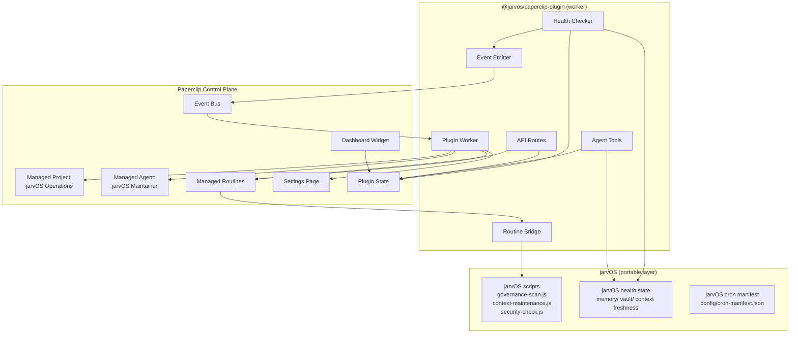

## jarvOS Paperclip Plugin — Control Plane Integration

## Summary

Build a Paperclip plugin (`@jarvos/paperclip-plugin`) that makes jarvOS operations visible and automatable through Paperclip's control plane. The plugin exposes health dashboards, migrates board-visible cron work to Paperclip managed routines, and registers jarvOS capabilities as agent-callable tools — without making Paperclip required for jarvOS to function.

## Problem Frame

jarvOS gives any AI agent structured memory, identity, governance, and execution patterns — but it runs invisible. There's no dashboard for operational health, no status board for scheduled maintenance, and no audit trail for governance scans. The user must ask their agent directly for any of this.

Paperclip is the opposite: a control plane with visual boards, issue lifecycles, agent management, and scheduling — but it doesn't know jarvOS exists.

Meanwhile, jarvOS scheduled work lives in a static JSON manifest. Manifests are pull-based, stateless, drift-prone, and invisible. Paperclip managed routines are the evolved replacement: push-based, stateful, tracked, and auditable.

The plugin connects these systems in one direction: jarvOS gains an optional visible control surface without becoming dependent on it.

---

## Requirements

### Plugin Foundation

- R1. The plugin registers as a Paperclip plugin with the `@jarvos/paperclip-plugin` ID, declaring capabilities for events, jobs, state, agent tools, managed resources, scoped API routes, and UI contributions.
- R2. The plugin creates a managed Paperclip project ("jarvOS Operations") on first reconcile, giving all plugin-created issues, routines, and agents a stable organizational home.
- R3. The plugin creates a managed Paperclip agent ("jarvOS Maintainer") visible on the board, assignable to routines, and budget-trackable.
- R4. The plugin installs and activates without requiring a Paperclip server restart (hot install).
- R5. The plugin functions without Paperclip — jarvOS core behavior is unchanged when the plugin is not installed or Paperclip is unavailable. This is a structural guarantee: the plugin is an additive layer that jarvOS scripts never import or call directly.

### Health Dashboard

- R6. The plugin contributes a dashboard widget showing jarvOS runtime health: adapter status, memory freshness, vault integrity, and governance drift state.
- R7. The dashboard widget communicates with the plugin worker via the Paperclip bridge (`usePluginData` / `usePluginAction`).
- R8. Health data is fetched from jarvOS filesystem state (not from Paperclip's own database).

### Settings & Configuration

- R9. The plugin contributes a company-scoped settings page for configuring jarvOS workspace path, vault path, health check interval, and routine schedule overrides.

### Routine Migration

- R10. The plugin declares managed Paperclip routines for board-visible scheduled work: governance scan, security check, daily brief preparation, and context maintenance.
- R11. Each managed routine creates a Paperclip issue trail per run, with status tracking, success/failure history, and assigned agent.
- R12. Routine execution invokes the existing jarvOS scripts without duplicating their logic.
- R13. Runtime-internal jobs (context watchdog, PR autopilot internals, calendar reminders, trash schedule) remain as OpenClaw cron — they are not migrated to Paperclip routines.

### Agent Tools

- R14. The plugin registers jarvOS capabilities as Paperclip agent tools (namespaced as `jarvos:*`) that any Paperclip-managed agent can call during runs.
- R15. Agent tool execution returns structured results that appear in Paperclip run logs.

### Agent-First Operation

- R16. Every plugin surface (health checks, routine status, configuration changes, run history) is accessible through agent chat without opening Paperclip's UI, via scoped API routes under `/api/plugins/@jarvos/paperclip-plugin/api/*`.
- R17. The plugin does not create workflows where the user must interact with Paperclip directly to complete an action.

### Events

- R18. The plugin emits domain events (e.g., `plugin.@jarvos/paperclip-plugin.governance-drift-detected`, `plugin.@jarvos/paperclip-plugin.health-degraded`) so other plugins and Paperclip automations can react to jarvOS state changes.
- R19. The plugin subscribes to relevant Paperclip events (e.g., `issue.status_changed`, `agent.run.finished`) to update plugin state when external changes occur.

---

## Key Technical Decisions

**KTD1. Paperclip is the command center, not the host.** The plugin surfaces jarvOS state and schedules work through Paperclip, but does not move jarvOS runtime logic (memory, hydration, recall, session management) into Paperclip. This preserves jarvOS portability and prevents the plugin from becoming a second runtime.

**KTD2. Managed resources use Paperclip's reconcile API.** Managed project, agent, and routines are created via `ctx.agents.managed.reconcile()`, `ctx.projects.managed.reconcile()`, and `ctx.routines.managed.reconcile()` — not raw API calls. This gives the board visibility, budget tracking, and lifecycle management for free.

**KTD3. Routine execution delegates to existing scripts.** Managed routines trigger jarvOS scripts rather than reimplementing their logic in the plugin worker. The routine is the scheduling and tracking layer; the script is the execution layer. The bridge spawns the script via child process (see KTD4).

**KTD4. Plugin worker has local filesystem and process access.** Paperclip plugin workers run alongside the Paperclip server, not in a sandboxed container. The worker can read jarvOS workspace paths and spawn child processes. This is a structural assumption: the plugin targets self-hosted Paperclip instances running on the same machine as jarvOS. If the worker cannot spawn child processes, routines fall back to invoking scripts via an HTTP adapter (documented as fallback in U5).

**KTD5. Health checks read local filesystem state.** The plugin worker checks jarvOS runtime state (memory files, vault integrity, context freshness) by reading the local filesystem where Paperclip is running. This avoids adding a separate health API to jarvOS.

**KTD6. Plugin ships with UI but UI is optional.** The dashboard widget and settings page use Paperclip's shared component library (`@paperclipai/plugin-sdk/ui`). If the UI fails to render, health data is still available through agent tools, API routes, and plugin state.

**KTD7. Only board-visible cron jobs migrate to routines.** Jobs that produce work needing assignment, tracking, or audit trails become Paperclip routines. Jobs that are runtime-internal (direct message delivery, internal observation, machinery) stay as OpenClaw cron.

**KTD8. Plugin state stores health snapshots.** The plugin writes periodic health snapshots to Paperclip plugin state (`ctx.state.write`) so the dashboard and agent tools can read cached data without re-running health checks on every request.

**KTD9. Scoped API routes serve the agent-first surface.** The plugin registers routes under `/api/plugins/@jarvos/paperclip-plugin/api/*` that return JSON. These routes are the mechanism by which agents (or any HTTP client) query health, routine status, and configuration without opening the Paperclip UI. This is how R16 is satisfied: the agent calls these routes through its tool layer, not by requiring the user to visit a web page.

---

## High-Level Technical Design

The plugin worker is the sole bridge between jarvOS and Paperclip. It reads jarvOS state (filesystem, script outputs) and writes Paperclip resources (managed entities, plugin state, events, API responses). The data flow is jarvOS → Paperclip for state and events. API routes allow agents to query accumulated state from the Paperclip side, but they do not write back into jarvOS runtime behavior.

---

## Acceptance Examples

- AE1. **Covers R5.** Given a jarvOS installation with no Paperclip instance running, when the user runs any jarvOS script or agent command, the behavior is identical to a jarvOS installation that has never heard of Paperclip.
- AE2. **Covers R16.** Given a running Paperclip instance with the plugin installed, when the user asks their agent "what's my jarvOS health status?" in chat (not Paperclip UI), the agent returns a structured health report by calling the plugin's scoped API route.
- AE3. **Covers R10, R11.** Given a managed governance-scan routine, when the routine fires on schedule, a Paperclip issue is created in the jarvOS Operations project with status, assigned agent, and run output. The user can see this issue by asking their agent "what did the last governance scan find?"
- AE4. **Covers R18.** Given the plugin detects governance drift during a health check, when the snapshot is written, the event `plugin.@jarvos/paperclip-plugin.governance-drift-detected` is emitted and visible in the Paperclip event log.

---

## Scope Boundaries

**In scope:**
- Plugin manifest, worker, and UI bundle
- Managed project, agent, and routine declarations
- Health dashboard widget and company settings page
- Scoped API routes for agent-first operation
- Agent tool registration (jarvOS capabilities as Paperclip tools)
- Event emission for jarvOS state changes and subscription to Paperclip events
- Migration of board-visible cron jobs to managed routines
- Cron manifest deprecation path for migrated jobs

**Deferred to follow-up work:**
- Cross-plugin coordination (git plugin, GitHub Issues plugin integration)
- Plugin database namespace for structured health history
- Multi-user Paperclip instance support
- Published npm package (initial install from local path)
- HTML output mode for health reports
- Managed skills (exposing jarvOS capabilities as reusable Paperclip skills)

**Outside this product's identity:**
- Moving jarvOS runtime internals (memory, hydration, recall) into Paperclip
- Making Paperclip required for jarvOS operation
- Building a separate monitoring/alerting system outside Paperclip
- Modifying Paperclip's core platform code

---

## Success Metrics

- Governance scan, security check, daily brief, and context maintenance each run successfully as Paperclip routines with issue trails visible on the board.
- Health dashboard shows live data from jarvOS runtime state.
- An agent can retrieve health status, routine run history, and configuration entirely through chat without the user opening Paperclip UI.
- Zero dual-execution: no migrated job runs from both OpenClaw cron and Paperclip routine simultaneously.
- jarvOS operates identically with the plugin uninstalled.

---

## Implementation Units

### U1. Plugin manifest and project scaffold

- **Goal:** Create the plugin package with a valid Paperclip plugin manifest, build system, and development workflow.
- **Dependencies:** None
- **Files:** `plugins/paperclip-plugin/package.json`, `plugins/paperclip-plugin/src/manifest.ts`, `plugins/paperclip-plugin/tsconfig.json`
- **Approach:** Use `paperclipai plugin init` as the starting point. Declare capabilities: `config`, `events`, `jobs`, `state`, `agents.managed`, `projects.managed`, `routines.managed`, `tools`, `ui.dashboardWidget`, `ui.companySettingsPage`, `http`. Define `instanceConfigSchema` for jarvOS paths (vault path, workspace path, health check interval) with Zod validation.
- **Test scenarios:**
  - Happy path: `paperclipai plugin install` succeeds and plugin appears in `paperclipai plugin list`
  - Error: missing required config (vault path) surfaces a clear validation error
  - Hot install: plugin activates without Paperclip server restart
  - Test harness: initial smoke test passes using `@paperclipai/plugin-test-harness`
- **Verification:** Plugin installs, appears in list, and worker starts without errors.

### U2. Managed resources — project and agent

- **Goal:** Reconcile the managed "jarvOS Operations" project and "jarvOS Maintainer" agent on plugin startup.
- **Dependencies:** U1
- **Files:** `plugins/paperclip-plugin/src/resources/project.ts`, `plugins/paperclip-plugin/src/resources/agent.ts`, `plugins/paperclip-plugin/src/register.ts`
- **Approach:** In the `register()` function, call `ctx.projects.managed.reconcile()` with a stable project definition, then `ctx.agents.managed.reconcile()` with an agent definition pointing to the project. Both are idempotent — subsequent starts find the existing resources.
- **Test scenarios:**
  - Happy path: first reconcile creates project and agent visible on Paperclip board
  - Idempotent: second startup finds existing resources without error
  - Agent visible: board shows the agent with correct name, project, and status
- **Verification:** Managed project and agent appear in Paperclip UI after plugin startup.

### U3. Health checker and plugin state

- **Goal:** Periodic health checks that read jarvOS runtime state and write snapshots to Paperclip plugin state.
- **Dependencies:** U1
- **Files:** `plugins/paperclip-plugin/src/health/checker.ts`, `plugins/paperclip-plugin/src/health/adapters.ts`, `plugins/paperclip-plugin/src/health/types.ts`, `plugins/paperclip-plugin/src/jobs/health-snapshot.ts`
- **Approach:** Register a plugin job (`health-snapshot`) that runs on a configurable interval (default 5 minutes). The health checker reads: (a) memory file timestamps for freshness, (b) vault notes count and frontmatter validity via filesystem scan (sampled, not full scan), (c) governance drift state from last scan output. Write a typed health snapshot to `ctx.state.write('health', snapshot)`. Emit `plugin.@jarvos/paperclip-plugin.health-degraded` when any dimension crosses a degradation threshold.
- **Test scenarios:**
  - Happy path: health snapshot written with fresh memory, valid vault, no drift
  - Stale memory: snapshot correctly flags memory files older than threshold
  - Vault scan: detects and reports frontmatter validation errors in sampled files
  - Missing paths: graceful degradation when configured paths don't exist
  - Event emission: `health-degraded` event emitted when freshness drops below threshold
- **Verification:** Plugin state contains a current health snapshot readable via `ctx.state.read('health')`.

### U4. Dashboard widget and settings page

- **Goal:** A Paperclip dashboard widget that renders jarvOS health from plugin state, and a company settings page for configuration.
- **Dependencies:** U3
- **Files:** `plugins/paperclip-plugin/src/ui/dashboard.tsx`, `plugins/paperclip-plugin/src/ui/components/health-card.tsx`, `plugins/paperclip-plugin/src/ui/settings.tsx`
- **Approach:** Dashboard widget uses Paperclip's shared UI components (`MetricCard`, `StatusBadge`) to render health snapshot data. The widget calls `usePluginData('health')` to fetch the latest snapshot from plugin state. Include a "Run Health Check Now" action button calling `usePluginAction('run-health-check')`. Settings page uses `companySettingsPage` slot to surface `instanceConfigSchema` fields: workspace path, vault path, health check interval, routine schedule overrides.
- **Test scenarios:**
  - Happy path: widget renders with current health data
  - Loading state: spinner shown while data fetches
  - Error state: graceful error message if health data is unavailable
  - Action button: triggers immediate health check and refreshes data
  - Settings: configuration changes persist and take effect on next health check cycle
- **Verification:** Dashboard widget appears on Paperclip home page with live health data. Settings page accessible and functional.

### U5. Managed routines — board-visible scheduled work

- **Goal:** Declare managed Paperclip routines for governance scan, security check, daily brief preparation, context maintenance, and scoped Compound Engineering refresh. Each routine triggers the existing jarvOS script/provider and creates an issue trail.
- **Dependencies:** U2
- **Files:** `plugins/paperclip-plugin/src/routines/governance-scan.ts`, `plugins/paperclip-plugin/src/routines/security-check.ts`, `plugins/paperclip-plugin/src/routines/daily-brief.ts`, `plugins/paperclip-plugin/src/routines/context-maintenance.ts`, `plugins/paperclip-plugin/src/routines/ce-compound-refresh.ts`, `plugins/paperclip-plugin/src/routines/bridge.ts`
- **Approach:** Each routine is declared via `ctx.routines.managed.reconcile()` with a cron schedule matching the current cron-manifest.json entry. The routine bridge spawns the existing jarvOS script as a child process (KTD4), captures stdout/stderr, and reports success/failure back to Paperclip. The managed agent (from U2) is assigned as the routine's executor. `ce-compound-refresh` is a managed Paperclip routine pattern for Compound Engineering installations only: it invokes the configured `ce-compound` provider against a scoped repository or solution set, flags stale or duplicate `docs/solutions/` learnings, and records the refresh as a routine issue without silently rewriting repo knowledge. It is not a second scheduler for all CE work. **Fallback:** if the plugin worker cannot spawn child processes (sandboxed environment), the bridge invokes scripts/providers via HTTP POST to a local jarvOS script server instead.
- **Test scenarios:**
  - Happy path: routine fires on schedule, script executes, issue trail created
  - Script failure: routine run marked as failed with error output in issue
  - Manual trigger: routine can be triggered manually from Paperclip UI or agent
  - Schedule match: routine cron matches existing cron-manifest.json schedule
  - Compound refresh: `ce-compound-refresh` only runs when Compound Engineering is installed and scoped to an explicit repository or solution set
  - Fallback path: bridge degrades gracefully when child process is unavailable
- **Verification:** Each routine appears in Paperclip with run history showing at least one successful execution.

### U6. Agent tools — jarvOS capabilities

- **Goal:** Register Paperclip agent tools that expose jarvOS health, governance, memory, note audit, and optional Compound Engineering capabilities to any Paperclip-managed agent.
- **Dependencies:** U3
- **Files:** `plugins/paperclip-plugin/src/tools/run-health-check.ts`, `plugins/paperclip-plugin/src/tools/get-context-freshness.ts`, `plugins/paperclip-plugin/src/tools/audit-governance-drift.ts`, `plugins/paperclip-plugin/src/tools/promote-memory.ts`, `plugins/paperclip-plugin/src/tools/audit-notes.ts`, `plugins/paperclip-plugin/src/tools/ce-plan.ts`, `plugins/paperclip-plugin/src/tools/ce-review.ts`, `plugins/paperclip-plugin/src/tools/ce-compound.ts`
- **Approach:** Register tools via `ctx.tools.register()` with namespaced names (`jarvos:run-health-check`, `jarvos:get-context-freshness`, `jarvos:audit-governance-drift`, `jarvos:promote-memory`, `jarvos:audit-notes`, `jarvos:ce-plan`, `jarvos:ce-review`, `jarvos:ce-compound`). Each tool has a Zod-parameterized schema and returns structured JSON. Health/governance tools delegate to the health checker (U3). Memory and note audit tools read filesystem state directly. The Compound Engineering tools are integration adapters, not tracker owners: `jarvos:ce-plan` can attach raw CE output as a supporting `compound-plan` artifact while Paperclip keeps the canonical `plan`; `jarvos:ce-review` returns review evidence shaped for the existing jarvOS coding gate; `jarvos:ce-compound` records repo-local solution-learning output and memory-promotion candidates without promoting everything into jarvOS memory automatically.
- **Test scenarios:**
  - Happy path: agent calls `jarvos:run-health-check` and receives structured health report
  - Tool namespacing: tools appear as `jarvos:*` in Paperclip, never shadow core tools
  - Error handling: tool returns structured error when jarvOS paths are misconfigured
  - Memory tool: `jarvos:promote-memory` returns promotion candidates from memory directory
  - Notes audit: `jarvos:audit-notes` returns frontmatter validation results from sampled vault notes
  - CE planning: `jarvos:ce-plan` requires an existing Paperclip issue and returns both raw artifact metadata and normalized-plan handoff fields
  - CE review: `jarvos:ce-review` reports target branch, changed files, findings, fixes, residual risks, and verdict before it can count as review evidence
  - CE compounding: `jarvos:ce-compound` writes or links repo-local `docs/solutions/` output and separately marks cross-system memory-promotion candidates
- **Verification:** Tools appear in Paperclip's tool registry and can be called during an agent run.

### U7. Scoped API routes — agent-first surface

- **Goal:** Register scoped API routes that allow agents (or any HTTP client) to query health, routine status, run history, and configuration without opening Paperclip's UI.
- **Dependencies:** U3, U5
- **Files:** `plugins/paperclip-plugin/src/routes/health.ts`, `plugins/paperclip-plugin/src/routes/routines.ts`, `plugins/paperclip-plugin/src/routes/config.ts`
- **Approach:** Register routes under `/api/plugins/@jarvos/paperclip-plugin/api/*` using Paperclip's scoped route capability. Routes: `GET /health` (current health snapshot), `GET /routines` (routine list with last run status), `GET /routines/:id/runs` (run history for a routine), `GET /config` (current configuration). `GET /routines` also reports delegation metadata from U9, including which OpenClaw cron jobs have been delegated to managed Paperclip routines and whether a scoped `ce-compound-refresh` routine is active for the configured repository. All routes read from plugin state — no direct jarvOS filesystem access from routes.
- **Test scenarios:**
  - Happy path: `GET /health` returns current health snapshot as JSON
  - Routine status: `GET /routines` returns list with last run status and timestamp
  - Run history: `GET /routines/:id/runs` returns paginated run history
  - Delegation status: `GET /routines` distinguishes OpenClaw-owned cron jobs, Paperclip-delegated jobs, and CE-scoped refresh routines
  - Auth: routes respect Paperclip's auth/checkout policies
  - Agent query: an agent can retrieve full operational status by calling these routes
- **Verification:** All API routes return correct JSON. An agent can assemble a complete operational picture without Paperclip UI.

### U8. Event subscriptions and emission

- **Goal:** Subscribe to Paperclip events that affect plugin state, and emit jarvOS-specific events for cross-plugin coordination.
- **Dependencies:** U1, U3, U5
- **Files:** `plugins/paperclip-plugin/src/events/subscriptions.ts`, `plugins/paperclip-plugin/src/events/emissions.ts`
- **Approach:** Subscribe to `issue.status_changed` (update plugin state when routine issues change status) and `agent.run.finished` (trigger health snapshot refresh after a routine run). Emit `plugin.@jarvos/paperclip-plugin.governance-drift-detected` when health checker detects drift, `plugin.@jarvos/paperclip-plugin.health-degraded` when any health dimension crosses threshold, `plugin.@jarvos/paperclip-plugin.routine-completed` after routine runs finish, and `plugin.@jarvos/paperclip-plugin.compound-completed` when a configured CE plan, review, or compounding action completes with durable artifact metadata. The CE lifecycle event payload should include the Paperclip issue identifier, repository path, artifact type (`compound-plan`, `compound-review`, or `solution-learning`), and whether memory-promotion candidates were produced.
- **Test scenarios:**
  - Subscription: routine issue status change triggers plugin state update
  - Emission: governance drift detection emits event visible in Paperclip event log
  - Health degradation: threshold breach emits `health-degraded` event
  - Routine completion: successful routine run emits `routine-completed` event
  - Compound lifecycle: successful CE provider execution emits `compound-completed` with artifact metadata and no duplicate issue creation
- **Verification:** Events appear in Paperclip event log. Subscription triggers produce observable state changes.

### U9. Cron manifest deprecation path

- **Goal:** Update the cron-manifest.json and related scripts to mark migrated jobs as delegated-to-plugin, so they don't run twice.
- **Dependencies:** U5
- **Files:** (target repo: clawd workspace) `config/cron-manifest.json`, `scripts/cron-manifest-validate.js`, `scripts/lint-cron-policy.js`
- **Approach:** Add a `"delegatedTo": "paperclip-plugin"` field to migrated job entries. Update `cron-manifest-validate.js` to recognize and skip delegated jobs. Update `lint-cron-policy.js` to treat delegated jobs as compliant (not missing). The OpenClaw cron system simply doesn't create these jobs. For Compound Engineering refresh, use the same delegation model with an explicit routine id such as `"delegatedTo": "paperclip-plugin:ce-compound-refresh"` only after the CE provider is installed and scoped; otherwise CE remains an on-demand provider surfaced through U6 tools. Document the revert path: removing `"delegatedTo"` re-enables the job in OpenClaw cron.
- **Test scenarios:**
  - Happy path: delegated jobs are skipped by OpenClaw cron, executed by Paperclip routine
  - Validation: `lint-cron-policy.js --json` reports 0 violations with delegated jobs
  - CE delegation: `ce-compound-refresh` cannot be delegated unless the configured repository scope and provider availability are both present
  - Revert: removing `"delegatedTo"` re-enables the job in OpenClaw cron
- **Verification:** `npm run lint:cron` passes. Migrated routines run successfully from Paperclip. Non-migrated jobs continue via OpenClaw cron.

---

## Operational / Rollout Notes

**Installation flow:**
1. User has a self-hosted Paperclip instance running on the same machine as jarvOS.
2. `paperclipai plugin install /path/to/jarvos-paperclip-plugin` — hot-installs the plugin.
3. On first startup, the plugin prompts for required config (workspace path, vault path) via the settings page.
4. Managed project, agent, and routines are reconciled automatically.
5. Health checks begin on the configured interval.

**Configuration:** All settings are editable via the company settings page or through the scoped API routes (so agents can modify configuration through chat).

**Routine migration sequence:** Routines are created in Paperclip before the corresponding OpenClaw cron jobs are deactivated. U9's `delegatedTo` field is the switch — flipping it moves execution from OpenClaw to Paperclip. Migrate one routine at a time, verify its issue trail, then flip the next.

**Compound Engineering comparison-mode pilot:** The Paperclip plugin build is the pilot surface for comparing native jarvOS planning/review/learning with Compound Engineering-assisted planning/review/learning without creating a second orchestration track. Run CE through U6 tools and the scoped U5 `ce-compound-refresh` routine, preserve Paperclip as the issue/plan source of truth, and compare outcomes through U8 `compound-completed` events plus routine/run evidence.

**Revert:** Uninstalling the plugin leaves jarvOS unchanged. Re-enabling deactivated OpenClaw cron jobs (remove `delegatedTo` field) restores the pre-plugin state.

---

## Risks & Dependencies

- **Plugin worker filesystem and process access.** The plan assumes the Paperclip plugin worker can read local filesystem paths and spawn child processes (KTD4). If the worker is sandboxed, the routine bridge needs an HTTP fallback and health checks need an alternative data source. Mitigation: verify in U1, document fallback in U5.
- **Paperclip routine API stability.** The managed routine API is from the alpha plugin surface. Breaking changes are possible. Mitigation: pin Paperclip version in plugin peer dependencies, test against specific versions using `@paperclipai/plugin-test-harness`.
- **Health check performance on large vaults.** Scanning vault files for frontmatter validity could be expensive. Mitigation: health checker samples a configurable number of files (not full scan).
- **Dual execution during migration.** During transition, a job could run from both OpenClaw cron and Paperclip routine. Mitigation: U9's delegation field prevents this; migrate one routine at a time with explicit flip.
- **Same-machine assumption.** The plugin targets self-hosted Paperclip running alongside jarvOS. Remote/cloud Paperclip instances would lose filesystem access and child process spawning. This is documented as a scope boundary, not a risk to mitigate — it's the intended deployment model.

---

## Open Questions

1. **Managed agent execution adapter.** The managed "jarvOS Maintainer" agent needs an execution adapter. Can it use a local process adapter directly, or does Paperclip require a specific adapter type? This affects how routine scripts are actually invoked. The plan assumes child process spawning via the plugin worker (KTD4) with HTTP fallback — if neither is available, this blocks U5.

---

## Sources & Research

- Paperclip Plugin Authoring Guide — alpha surface, managed resources, UI components, API routes
- Paperclip Plugin Spec — full capabilities, events, jobs, webhooks, UI extension model, database, SDK
- Paperclip Plugin Design Rationale — comparison with OpenCode plugin system, recommended patterns
- jarvOS Cron Manifest (`config/cron-manifest.json` in clawd workspace)
- jarvOS Product Boundaries (`docs/architecture/product-category-and-boundaries.md`)
- Research base: `Notes/jarvOS x Paperclip Integration — Research Base.md` (vault)
- Research session: Discord `<#1470468335505506491>`
- Compound Engineering `/ce-plan` skill (GitHub: `EveryInc/compound-engineering-plugin`)
- Compound Engineering integration plan: `docs/plans/2026-06-11-002-feat-compound-engineering-integration-plan.md`
- CE comparison-mode thread: Discord `1514644439862218862`
