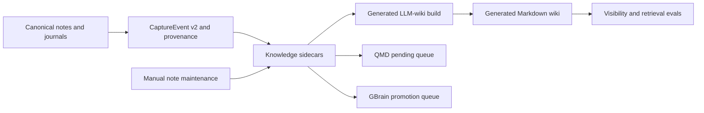

## Generated LLM Wiki Build Plan

## Goal Capsule

Make generated LLM-wiki a real, repeatable jarvOS secondbrain surface: source-backed sidecars compile into Obsidian-browsable Markdown wiki pages, the output is safe to rebuild, and status checks can tell whether the generated wiki is missing, empty, or built.

The generated wiki is a derived visibility and retrieval surface, not the source of truth. Canonical notes, journals, CaptureEvent v2 records, provenance, sidecars, QMD queues, and GBrain promotion gates remain authoritative.

Stop if the implementation would mutate canonical notes or journals, hardcode Andrew-private paths or content into public jarvOS, expose private/sensitive sidecars, require all-conversation ingestion, or require a bulk historical-note sweep before a useful generated wiki can exist.

## Product Contract

### Problem Frame

jarvOS already has most of the secondbrain stack pieces needed for generated LLM-wiki:

- Knowledge sidecars exist under the configured knowledge artifacts directory.
- The generated wiki compiler exists in `modules/jarvos-secondbrain/packages/jarvos-secondbrain-wiki/src/index.js`.
- Tests already cover deterministic pages, stale generated page cleanup, source note immutability, and private artifact exclusion.
- Status code can report generated wiki state when given a wiki directory.

The gap is operational: `npm run wiki:build` points at a module that only exports functions, so it does not build a visible wiki. There is also no clearly documented, public-safe default for where the generated Markdown wiki should appear in a configured vault.

### User Value

The user should be able to open the configured vault and see a generated, browsable wiki view of the secondbrain stack: concepts, source notes, and daily slices derived from sidecars. This makes the secondbrain visible and inspectable without turning generated pages into editable truth.

### Requirements

1. Add a real generated wiki build command for `@jarvos/secondbrain`.
2. Build from existing knowledge sidecars first; do not require a bulk pass over every old note as the first milestone.
3. Emit Obsidian-compatible Markdown into a visible generated wiki folder under a configured vault root or explicit output directory.
4. Mark every generated page with the existing generated header and "do not edit" semantics.
5. Preserve source-note immutability: builds must not rewrite notes, journals, sidecars, or queues.
6. Preserve privacy boundaries: private, sensitive, or explicitly excluded artifacts and knowledge units must not appear in generated pages.
7. Rebuild safely: stale generated pages should disappear, but only inside the managed generated wiki output.
8. Wire status checks so the generated wiki is observable as missing, empty, or built, with useful counts.
9. Document the generated wiki's role in the secondbrain stack: derived from sidecars, useful for visibility and retrieval, not authoritative memory.
10. Keep all public implementation generic. Local dogfood config may point to Andrew's vault, but public code and docs must not hardcode private paths.

### Scope Boundaries

In scope:

- CLI or package-script entrypoint for generated wiki builds.
- Config or option resolution for artifacts directory and generated wiki output directory.
- Safe rebuild behavior.
- Tests for CLI behavior, rebuild behavior, privacy filtering, source immutability, and status integration.
- Documentation for running and interpreting the generated wiki.
- Local dogfood smoke evidence against the configured vault.

Deferred:

- Full historical sidecar backfill for every old note.
- Automatic ingestion of every AI conversation.
- Obsidian plugin UI.
- Engraph production integration.
- Treating generated wiki pages as editable knowledge records.

Out of scope:

- Changing canonical note or journal routing.
- Replacing QMD, GBrain queues, CaptureEvent v2, provenance, or source sidecars.
- Building one-off Andrew-only folders into public defaults.

## Planning Contract

### Key Technical Decisions

1. Extend the existing compiler instead of creating a parallel LLM-wiki implementation.
2. Add a CLI path around `compileSecondbrainWiki({ artifactsDir, outputDir })` so `npm run wiki:build` actually performs a build.
3. Default to a visible generated Markdown folder when a vault root is configured, while still allowing explicit `--output-dir` for tests and advanced use.
4. Keep the generated wiki as a managed output tree. Cleanup should only remove files and subdirectories the generated wiki owns.
5. Use existing manual note maintenance for bounded sidecar backfill. The wiki build should consume sidecars; it should not become a note-ingestion pipeline.
6. Keep generated wiki status in the secondbrain status surface so missing or stale wiki output becomes visible during dogfood and release checks.

### Flow



### Implementation Units

#### Unit 1: Make the wiki build command real

Files:

- `modules/jarvos-secondbrain/packages/jarvos-secondbrain-wiki/src/index.js`
- `modules/jarvos-secondbrain/package.json`
- `modules/jarvos-secondbrain/tests/generated-wiki.test.js`

Work:

- Add a CLI entrypoint to the existing wiki module or introduce a small adjacent CLI file.
- Support explicit `--artifacts-dir` and `--output-dir`.
- Support configuration-driven defaults for normal jarvOS usage.
- Print a concise build summary with artifact, concept page, source page, and daily page counts.
- Make `npm run wiki:build` call the real CLI.

Tests:

- Running the package script or CLI against fixture artifacts creates the expected generated pages.
- Missing required paths fail with an actionable error.
- Existing library exports remain available for tests and programmatic callers.

#### Unit 2: Safe visible output

Files:

- `modules/jarvos-secondbrain/packages/jarvos-secondbrain-wiki/src/index.js`
- `modules/jarvos-secondbrain/tests/generated-wiki.test.js`
- Any existing config resolver used by `modules/jarvos-secondbrain`

Work:

- Define the generated wiki output as a managed tree with a clear generated header.
- Ensure stale generated pages are removed on rebuild.
- Ensure cleanup is scoped to the generated wiki output and cannot erase arbitrary vault content.
- Use a public-safe default folder name when a vault root is configured, with override support for local dogfood.

Tests:

- Rebuild removes stale generated files owned by the generated wiki.
- Rebuild does not remove unrelated files outside the generated wiki tree.
- Source notes and journals are byte-for-byte unchanged after build.

#### Unit 3: Preserve source backing and privacy

Files:

- `modules/jarvos-secondbrain/packages/jarvos-secondbrain-wiki/src/index.js`
- `modules/jarvos-secondbrain/tests/generated-wiki.test.js`
- `modules/jarvos-secondbrain/tests/retrieval-evals.test.js`

Work:

- Keep each generated page linked back to source note metadata from sidecars.
- Preserve existing privacy filters for private artifacts and excluded knowledge units.
- Keep the generated wiki compatible with qmd-plus-llm-wiki retrieval eval expectations.

Tests:

- Private or excluded artifacts do not emit concept, source, or daily pages.
- Public artifacts keep source references and concept/entity/relationship summaries.
- Retrieval eval fixtures still recognize the generated wiki as derived from sidecars.

#### Unit 4: Wire status and dogfood visibility

Files:

- `modules/jarvos-secondbrain/bridge/synthesis/src/secondbrain-status.js`
- `modules/jarvos-secondbrain/tests/secondbrain-status.test.js`
- Existing release or secondbrain smoke scripts if they already call secondbrain status

Work:

- Resolve the generated wiki directory through the same config surface used by the build command.
- Report generated wiki state as missing, empty, or built.
- Include counts that make local dogfood understandable without opening every page.
- Add or update a focused smoke path so a release candidate can prove the generated wiki exists after build.

Tests:

- Missing output reports `generated-wiki-missing`.
- Empty output reports `generated-wiki-empty`.
- Built output reports generated page counts.

#### Unit 5: Documentation and release posture

Files:

- `modules/jarvos-secondbrain/README.md`
- `modules/jarvos-secondbrain/docs/operations/manual-note-maintenance.md`
- `docs/architecture/secondbrain-external-integrations.md`
- `CHANGELOG.md`

Work:

- Document what generated LLM-wiki is and is not.
- Document the command to build it and the expected output folder behavior.
- Document how existing/manual notes enter the generated wiki: first through sidecars, then through bounded manual note maintenance when needed.
- Make clear that generated wiki pages are rebuildable artifacts and should not be edited as source notes.
- Stage release notes under `CHANGELOG.md` `[Unreleased]` until the implementation ships.
- Target the next post-v0.6.2 jarvOS release by default, expected to be a patch release if the work is limited to making the existing generated wiki build path real and documented.
- Escalate to a minor release only if implementation expands the public secondbrain contract beyond generated wiki build/status/docs.

Tests:

- Documentation examples match real commands.
- Public docs do not include Andrew-private paths or content.

### Verification Contract

Focused commands:

```bash
cd repos/jarvOS
npm --prefix modules/jarvos-secondbrain test
npm --prefix modules/jarvos-secondbrain run wiki:build -- --artifacts-dir <fixture-artifacts> --output-dir <tmp-generated-wiki>
node --test modules/jarvos-secondbrain/tests/generated-wiki.test.js
node --test modules/jarvos-secondbrain/tests/secondbrain-status.test.js
node --test modules/jarvos-secondbrain/tests/retrieval-evals.test.js
```

Release and privacy checks:

```bash
cd repos/jarvOS
npm run release:drift
PRIVATE_PATH_PATTERN='<local-private-path-pattern>'
test -n "$PRIVATE_PATH_PATTERN" && rg -n "$PRIVATE_PATH_PATTERN" modules/jarvos-secondbrain docs CHANGELOG.md
```

Local dogfood evidence:

- Run the generated wiki build against the configured vault sidecars.
- Record output counts.
- Inspect at least one generated concept page, source page, daily page, and root index.
- Verify canonical notes and journals did not change.
- Verify generated pages are visible in the configured vault as Markdown.

## Continuity Contract

Before execution, create or update a Paperclip issue titled `Make generated LLM-wiki visible and rebuildable` and attach this plan document. The issue carries the next action, branch, PR, review-of-record evidence, verification output, local dogfood counts, and release-placement note. Do not track this work in a shadow vault task list.

Draft `/goal`:

```text
/goal Implement docs/plans/2026-06-28-001-feat-generated-llm-wiki-build-plan.md to its Definition of Done: make generated LLM-wiki a real, safe, visible, source-backed secondbrain build surface with tests, docs, dogfood evidence, and Paperclip/PR/release evidence rather than a local-only implementation.
```

### Noisy-First Feedback

Until the first successful local dogfood build and release check pass, post a daily plain-English status report on the Paperclip issue when work is active or stalled. Each report should say what changed, why it matters, what failed or is stale, and the next action. If the work originated from a chat or session thread, the final completion notice should also go back to that originating channel/thread unless privacy, security, missing origin, or explicit `NO_REPLY` makes no reply correct.

### Failure Visibility

Failures that must be surfaced:

- The wiki build command does nothing or exits without output.
- The generated wiki is missing, empty, stale, or points at the wrong output directory.
- The build mutates canonical notes or journals.
- Private or excluded sidecars appear in generated pages.
- Public docs or code include Andrew-private paths or content.
- Release or drift checks fail.

Surface each failure on the Paperclip issue with the failing command, impact, and next action. If Andrew input is the blocker, prompt in the originating channel/thread with the smallest concrete question needed to unblock the work. If the origin is missing, private, or intentionally quiet, record the blocker on the Paperclip issue instead of sending a chat prompt.

## Communication Contract

Success signal: Paperclip issue has the merged PR, review-of-record, passing verification output, generated wiki counts, dogfood evidence, and release-placement note; failure or stale signal: Paperclip issue is marked blocked or updated with the failed command; channel: Paperclip by default, immediate chat only for Andrew-input blockers; urgency: digest unless immediate input is needed; dedupe owner action: one owner maintains the current next action per failure class; closeout evidence: mark done only after the Definition of Done is satisfied.

Failure or stale signal: Paperclip issue is marked blocked or updated with the failed command, stale condition, owner, and next action. Use immediate chat only for goal ambiguity, public/irreversible action, or Andrew-input blockers; otherwise use the Paperclip issue as the digest surface.

Urgency and dedupe: One current blocker comment should own each failure class. Update that comment or add a clear superseding comment instead of repeating equivalent status.

Closeout evidence: Mark the issue done only after the Definition of Done is satisfied, the originating chat/session receives a completion notice or a recorded no-reply reason, and the release path has either landed or has an explicit follow-up issue.

Improvement loop: If execution reveals better secondbrain status, generated wiki, or manual-note routine improvements, propose them as scoped Paperclip follow-ups. Do not auto-expand this plan into unrelated ingestion, ontology, Engraph, or Obsidian UI work without approval.

Quieting criteria: After the generated wiki build has passed seven consecutive healthy active-use checks or Andrew explicitly asks for quieter operation, reduce daily feedback to issue-only updates for material changes, failures, or release gates.

## Definition of Done

- `npm run wiki:build` performs a real generated LLM-wiki build.
- Generated wiki output is visible as Markdown in the configured vault or explicit output directory.
- Generated output is rebuildable and stale generated pages are cleaned safely.
- Canonical notes, journals, sidecars, and queues are not mutated by the wiki build.
- Private and excluded artifacts are not emitted.
- Status checks report generated wiki state accurately.
- Docs explain generated LLM-wiki as a derived secondbrain visibility and retrieval surface.
- Local dogfood evidence shows the generated wiki in action against existing sidecars.
- Work lands through the normal Paperclip, review-of-record, PR, merge, and release evidence path rather than ending as a local-only implementation.
- Release placement is explicit: `[Unreleased]` first, then the next post-v0.6.2 patch by default unless the merged scope warrants a minor release.
