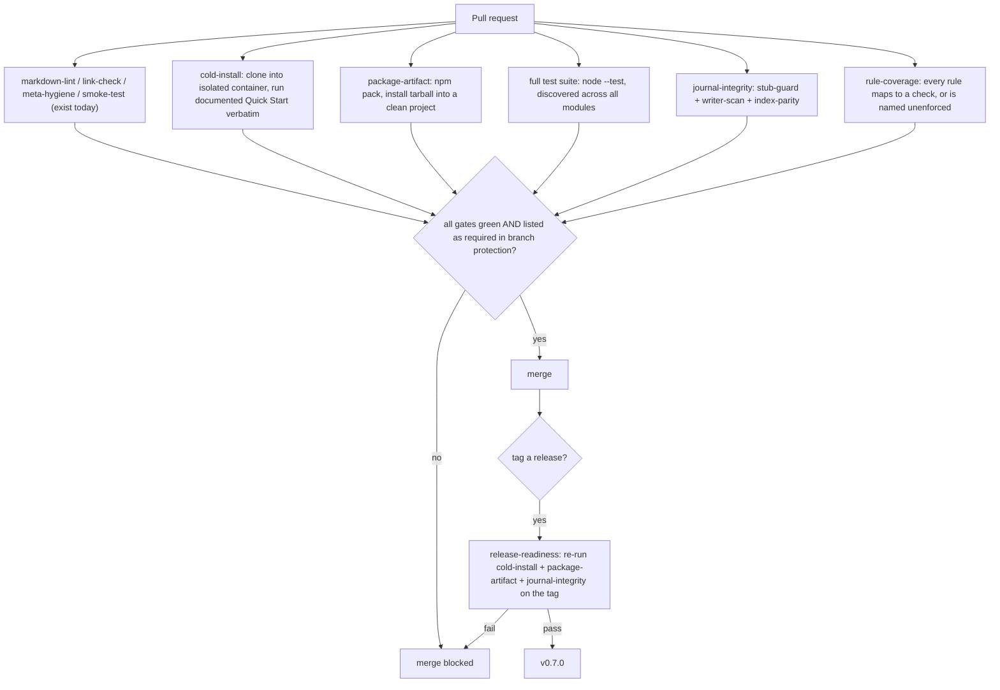
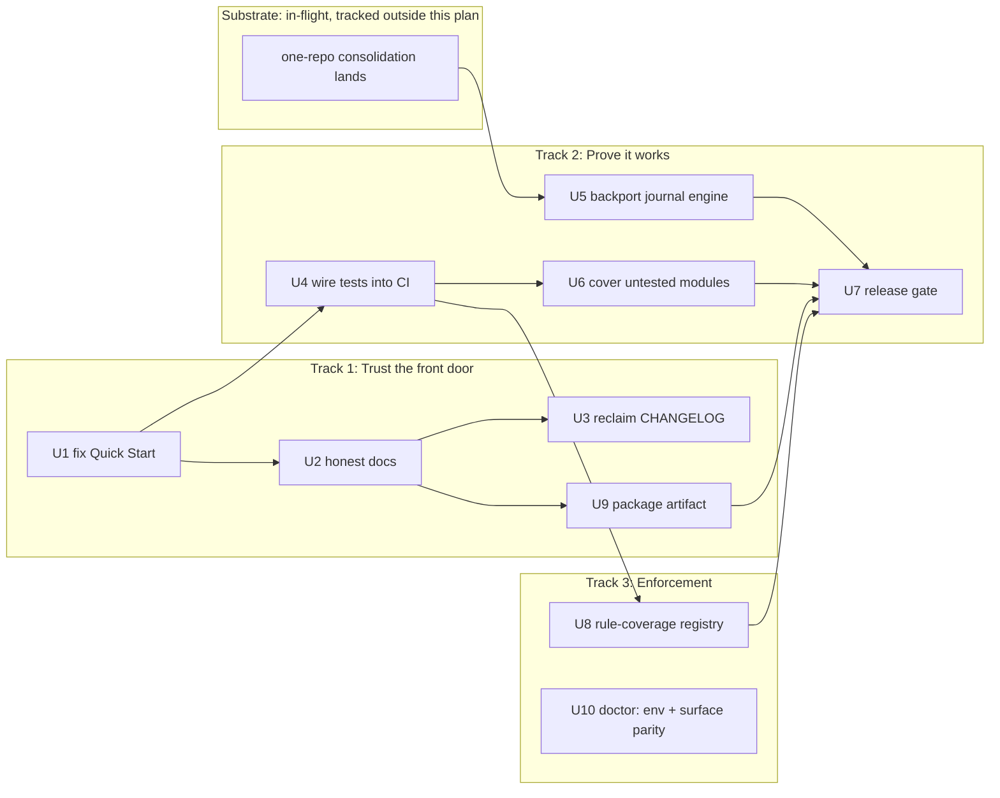

> **Status banner (2026-07-22) — read before executing any unit.**
>
> This plan was authored 2026-07-09, never landed, and sat uncommitted for thirteen days.
> v0.7.0 shipped on 2026-07-19 *without* going through it. Its premises were re-verified
> against the shipped release on 2026-07-22 before landing:
>
> - **"The documented Quick Start fails on a clean clone" — NO LONGER TRUE.** Verified by
>   `npm pack` → cold install into a project with a virgin `HOME` → `jarvos --help` →
>   `jarvos init` (populated workspace, 20/20 checks), and by running the documented
>   `npm test` quick start (65/65, advertised success line reached).
> - **"CI has never once run the project's own test suite" — WAS STILL TRUE.** Confirmed:
>   `ci.yml` ran lint/link/meta/secret-scan/`scripts/smoke-test.sh` but never `npm test`,
>   so every module unit suite — including the control-plane tests gating v0.7.0's headline
>   capability — had never executed on a PR or on main. Addressed separately.
> - **The journal-truncation premise is stale** and should be re-checked against
>   post-#96/#98 main before any unit that depends on it is executed.
>
> Landed for durability and review, **not** as an approved work queue. Re-scope each unit
> against current main before executing it.

# feat: Earn the right to be recommended — jarvOS v0.7.0

## Summary

jarvOS has shipped six tagged releases. None of them can be honestly recommended to a
stranger: the documented Quick Start fails on a clean clone, CI has never once run the
project's own test suite, and the flagship feature — the journal — has been silently
truncating the maintainer's real notes to a 50-byte stub for a week while nine
purpose-built regression tests sat unexecuted in the repo.

This plan stops feature work and spends the next release earning trust instead. It is
organized by the three tracks in `STRATEGY.md` — **Trust the front door**, **Prove it
works**, **Enforcement and receipts** — and it treats the in-flight one-repo
consolidation as *substrate*, not as the goal.

The previous plan ("One Repo, Mechanical Releases", 2026-07-02, goals G0–G5) asked
"how do we ship releases mechanically?" That was the wrong question. A mechanical
pipeline that reliably ships a broken front door is worse than no pipeline. The right
question is "what has to be true before a release is worth shipping at all?" — and the
answer becomes the release gate in U7.

---

## Problem frame

Three failures, each independently disqualifying, all invisible from inside the repo:

**The front door is locked.** `README.md`'s Quick Start says `git clone && cd jarvOS &&
npm test`. On an isolated clone this fails: `modules/jarvos-ontology/test/review-record-schema.test.js`
needs `ajv`, a devDependency, and the README never says `npm install`. Reproduced twice
independently. Notably, it *passes* when cloned beneath a directory that has its own
`node_modules` — Node resolves upward — which is exactly why the maintainer never saw it.
The first command jarvOS asks a stranger to run, under a banner reading "just works,"
does not work.

**Nothing is proven.** `.github/workflows/ci.yml` runs `markdown-lint`, `link-check`,
`meta-hygiene`, and a structural `smoke-test` that asserts files exist. It never runs
`npm test` or `node --test`. Separately, the root `package.json` test script omits
`modules/jarvos-secondbrain/tests/` entirely. The result: 33 secondbrain test files,
including 9 journal tests and `journal-stub-guard.test.js` — a test written for
precisely the corruption now occurring — have never executed in CI. `jarvos-memory`
ships real validation logic with zero tests. `jarvos-agentify` ships as a module with
zero tests and a source comment admitting it is a roadmap stub.

**The fixes exist, privately.** The hardened journal engine in the maintainer's private
checkout carries 19 functions and 303 lines the public one does not
(`detectDailyJournalWriters`, `repairMobileJournalingIndex`, `renderJournalingLinkIndex`,
the sync-replay regex, the active-edit quiet window). Public users run the June-vintage
guard that the live incident already proved insufficient. The two-copies problem is not
an internal tidiness issue — it is the mechanism by which the public product stays broken.

Underneath all three: jarvOS asserts rather than proves. That is what `STRATEGY.md`
commits to inverting, and the product cannot make that claim credibly until it makes it
about itself first.

---

## Requirements

| ID | Requirement |
| --- | --- |
| R1 | The documented Quick Start succeeds on a clean machine with no ancestor `node_modules`. |
| R2 | Public docs describe only what actually ships; every shipped module is documented or explicitly marked experimental. |
| R3 | CI runs the full behavioral test suite on every PR; a failing journal test blocks merge. |
| R4 | The public journal engine reaches functional parity with the hardened private engine. |
| R5 | Every shipped module with behavior has at least one test asserting that behavior. |
| R6 | A release cannot be tagged unless the cold-install and journal-integrity gates pass. |
| R7 | Every rule in the shipped rulebook either has an automated check or is reported as unenforced; release blocks below a named coverage minimum. |
| R8 | *(Deferred to v0.8.0 — see Q2.)* Completed work emits a machine-checkable receipt that a separate process can verify. |
| R9 | Environment variables gating memory/recall are validated by `jarvos doctor` on every supported surface. |
| R10 | The published package artifact contains exactly the modules the docs claim, verified by installing the tarball into a clean project. |

Traceability: R1–R2 and R10 serve *Trust the front door*. R3–R6 serve *Prove it works*.
R7 and R9 serve *Enforcement and receipts* — the wedge. R8 is the second half of that
wedge and is deliberately held back to v0.8.0 rather than shipped without a consumer.

---

## Key technical decisions

**KTD1 — Freeze feature releases until the trust bar is met.** No new capability ships
until R1, R3, R4, and R6 hold. This is `STRATEGY.md`'s "not working on: cutting further
releases before the trust bar is met," made binding. v0.7.0 contains no new features by
design; its entire content is trustworthiness.

**KTD2 — Backport the private engine wholesale; do not re-derive it.** The 303 lines
were written against a live incident with real evidence. Re-implementing them from the
plan text would lose exactly the edge cases that made them necessary. This makes U5
depend on the mirror consolidation landing first — otherwise the backport creates a
*third* copy and deepens the problem it is meant to close.

**KTD3 — The cold-install check must run in a container with no ancestor `node_modules`.**
A naive CI job that clones into a workspace beneath a populated tree reproduces the
maintainer's false pass and certifies a broken front door as working. The check is only
meaningful under filesystem isolation.

**KTD4 — Receipts ship in v0.8.0, not here, and only alongside a real consumer.** A
receipt format with no verifier and no caller is a file that costs something to write and
proves nothing. v0.7.0 builds the two things receipts would attest to — the release gate
(U7) and the journal runner (U5) — so that v0.8.0's receipts have something true to say.
When they land they will be files with a schema, verified by a separate process, with no
server to trust, per `STRATEGY.md`.

**KTD4a — Receipts will be documented as accidental-failure audit artifacts, not
tamper-proof ones.** A receipt written by an agent that also has write access to the
receipt store cannot resist that agent forging it; there is no trust root on a local
filesystem. Language implying otherwise ("signature", "tamper-evident") is exactly the
assert-don't-prove failure this plan exists to correct, applied to our own marketing.
Receipts defend against a *mistaken or forgetful* agent. That is a real and common
failure, and it is the only claim we will make.

**KTD5 — `jarvos-gbrain` stays an adapter; we do not compete on retrieval.** Dedicated
memory layers win on benchmarks and we concede that ground deliberately. Our claim is
about verification, not recall quality.

**KTD6 — `jarvos-agentify` is quarantined from the published surface until it has tests.**
It exports real behavior, has no tests, and is one of only six modules actually included in
the npm package — while `jarvos-gbrain`, `jarvos-memory`, and `jarvos-runtime-kit`, which
do have tests, are excluded. Shipping the unverified module and withholding the verified
ones is the assert-don't-prove failure in its purest form.

**KTD7 — Ship only the profiles that exist.** `profiles/` contains `minimal.json`. The
architecture docs describe six profiles in present tense. Rewrite the docs to future
tense rather than inventing five profile files to make the docs true.

---

## High-level technical design

The release gate — what "recommendable" means, mechanically. The lint-shaped checks on the
left already exist; every check that proves *behavior* is absent. v0.7.0 is done when all
of them run **and are listed as required on the default branch** — a distinction that lives
in branch protection, not in the workflow file, and that U7 must assert explicitly.

Unit dependency order. The consolidation work already in flight (external, tracked
separately) gates only the backport. Receipts are deliberately absent — see KTD4.

---

## Implementation units

### U1. Make the documented Quick Start actually work

**Goal:** A stranger who runs exactly what `README.md` says gets the advertised
`PASS — All checks passed` line, on a clean machine.

**Requirements:** R1
**Dependencies:** none — this is the first thing that should land.

**Files:**
- `README.md`
- `.github/workflows/ci.yml`
- `tests/cold-install.test.js` (new)

**Approach:** Two halves. Fix the instructions (add the missing `npm install` step, or
make `npm test` self-sufficient via a `pretest` hook — prefer the explicit `npm install`
line, since hiding install inside `test` surprises people). Then add a CI job that
executes the README's Quick Start block *verbatim* in a container, so the instructions
can never silently drift from reality again. Per KTD3 the job must clone into an
isolated path with no ancestor `node_modules`.

**Execution note:** Start from the failing case. Reproduce the cold-clone failure in the
new CI job first and watch it go red, before touching `README.md`. A green-from-birth
job proves nothing.

**Patterns to follow:** existing job structure in `.github/workflows/ci.yml`;
`scripts/smoke-test.sh` for the PASS-line output convention.

**Test scenarios:**
- Clone into an isolated temp dir with no ancestor `node_modules`, run the README's exact
  commands → exits 0 and prints the advertised PASS line.
- Same, but with a populated `node_modules` in a parent directory → still passes, and
  the job asserts it did not rely on upward resolution (guard against the false pass).
- Mutate `README.md`'s Quick Start to a command that fails → the CI job goes red
  (proves the job actually reads the README rather than a hardcoded copy).
- Node 18 (the documented floor) and current LTS → both pass.

**Verification:** A fresh contributor, given only the repo URL, reaches the PASS line
without asking a question.

---

### U2. Make the docs describe only what ships

**Goal:** Remove every claim in the public docs that the repo does not honor.

**Requirements:** R2
**Dependencies:** U1 (the Quick Start text is being edited there; sequence to avoid conflict)

**Files:**
- `README.md`
- `modules/README.md`
- `docs/architecture/packaging-and-install-profiles.md`

**Approach:** Four concrete defects. (1) The opening paragraphs carry typos and a
sentence that truncates mid-thought — "you can seamlessly switch between agents without
losing any" — sitting at the top of the flagship doc. (2) `modules/jarvos-agentify` and
`modules/jarvos-runtime-kit` exist on disk but appear in neither module table. (3) The
packaging doc describes six install profiles in present tense; only `profiles/minimal.json`
exists — rewrite to future tense per KTD7 rather than fabricating profile files.
(4) Rewrite the opening value proposition to lead with what the user gets and what
command produces it, per `STRATEGY.md`'s one-liner, rather than opening with philosophy.

Mark `jarvos-agentify` experimental here; U6 decides whether it stays on the public
surface at all.

**Patterns to follow:** the module table format already in `modules/README.md`.

**Test scenarios:**
- `meta-hygiene` CI job extended: every directory under `modules/` appears in
  `modules/README.md`, or carries an explicit `experimental: true` marker → fails when a
  new undocumented module is added.
- Every profile named in present tense in `docs/architecture/packaging-and-install-profiles.md`
  has a corresponding file in `profiles/` → fails on the current text, passes after rewrite.

**Verification:** A reader can enumerate what jarvOS ships from the README alone, and
every item they name exists.

---

### U3. Reclaim the CHANGELOG as a product surface

**Goal:** The CHANGELOG reads like a product's release notes, not a bot's exhaust.

**Requirements:** R2
**Dependencies:** U2

**Files:**
- `CHANGELOG.md`
- `docs/history/docs-sync-archive.md` (new)

**Approach:** Roughly 85% of `CHANGELOG.md` (lines ~303–2011) is 527 auto-generated
hourly "docs sync" entries. The curated top section is genuinely good. Move the sync
entries to a clearly-labelled archive under `docs/history/`, leave a single pointer line,
and stop the generator from appending to the canonical changelog.

Separately: public release notes must stop citing bare `SUP-XXXX` identifiers from a
private tracker, which are meaningless to outside readers. Commit messages may keep
them; the changelog must translate them into user-visible statements.

**Test expectation:** none for the archive move (pure content relocation). The generator
change is behavior-bearing:
- Running the docs-sync generator appends to `docs/history/docs-sync-archive.md` and
  leaves `CHANGELOG.md` byte-identical.

**Verification:** The CHANGELOG can be read top-to-bottom in under two minutes and every
entry means something to someone who does not work here.

---

### U4. Wire the test suite into CI

**Goal:** Every behavioral test in the repo runs on every pull request, and a failure
blocks merge.

**Requirements:** R3, R5
**Dependencies:** U1 (CI must be able to install dependencies before it can run tests)

**Files:**
- `.github/workflows/ci.yml`
- `package.json`
- `modules/jarvos-secondbrain/package.json`

**Approach:** The root `test` script enumerates module tests by hand and omits
`modules/jarvos-secondbrain/tests/` — 33 files, including the 9 journal tests. Replace
hand-enumeration with a discovery pass across all modules so a new module cannot be
silently excluded, then add a CI job that runs it.

Expect this to go red on first run. That is the point, and it is the reason this unit
precedes U5 rather than following it: the suite must be running *before* the journal
backport lands, so the backport's tests have somewhere to fail.

**Execution note:** Land the CI job as non-required first, read what breaks, fix or
quarantine each failure with an explicit reason, then flip it to required. Do not make it
required while red — that blocks every PR and the pressure will be to disable it.

**Patterns to follow:** the existing `smoke-test` job in `.github/workflows/ci.yml`.

**Test scenarios:**
- A deliberately failing assertion in `modules/jarvos-secondbrain/tests/journal-stub-guard.test.js`
  → the CI job fails. (Today it passes, because the test never runs. This scenario is the
  whole unit in one line.)
- A new module added with a failing test → discovery picks it up and CI fails.
- A new module added with no tests → CI reports it as uncovered rather than silently passing.
- A module marked experimental *and* excluded from the package `files` array → omitted from
  the uncovered-module report. The report's scope is **shipped modules**. This is what makes
  U6's quarantine of `jarvos-agentify` a coherent resolution rather than a way to dodge the
  check — a module that is experimental but *still in the package* is reported as uncovered.

**Verification:** Reverting the U5 journal fix causes CI to fail.

---

### U5. Backport the hardened journal engine to the public repo

**Goal:** Public users get the journal protection the maintainer already runs, not the
June-vintage guard the live incident defeated.

**Requirements:** R4
**Dependencies:** U4 (tests must be running), and the one-repo consolidation landing
(external — see Substrate below). Per KTD2, do not start this before consolidation, or
this creates a third copy.

**Files:**
- `modules/jarvos-secondbrain/packages/jarvos-secondbrain-journal/src/journal-maintenance.js`
- `modules/jarvos-secondbrain/tests/journal-maintenance.test.js`
- `modules/jarvos-secondbrain/tests/journal-stub-guard.test.js`
- `modules/jarvos-secondbrain/tests/journal-writer-scan.test.js` (new)

**Approach:** Port the 19 functions and ~303 lines present only in the private checkout.
The load-bearing ones: `detectDailyJournalWriters` (scans any Obsidian plugin config for
a second writer into `Journal/`, not just the three hardcoded names),
`detectMobileJournalingIndex` + `repairMobileJournalingIndex` +
`renderJournalingLinkIndex` (the sync-replay corruption path), and the active-edit quiet
window that defers backlink writes rather than overwriting a file the user is typing in.

The existing public `classifyJournalHealth` / `syncOneDate` snapshot-restore machinery is
sound and stays; this adds prevention in front of the existing damage control.

Carry the incident's own hard-won detail: the original corruption regex only matched a
full-line embed, so a heading-glued embed (`# Journalin![[Journal/2026-07-03.md]]`)
slipped through undetected. The ported regex must match that case.

**Execution note:** Characterization-first. Before porting, write tests against the
*current public* engine capturing what it does today, so the port's behavior change is
visible in the diff rather than assumed.

**Patterns to follow:** the private `journal-maintenance.js` is the reference
implementation; mirror its structure rather than reorganizing during the port.

**Test scenarios:**
- A daily journal file truncated to frontmatter-only (50 bytes) → detected as a stub and
  restored from the known-good snapshot.
- `Journaling.md` containing a heading-glued transclusion (`# Journalin![[...]]`) →
  detected and repaired. (The original regex missed this; it is the regression that
  matters most.)
- An Obsidian plugin config naming a `Journal/` path under a plugin *not* in the
  hardcoded list → `detectDailyJournalWriters` reports a conflicting writer.
- A backlink write arriving while the daily file's mtime is inside the active-edit quiet
  window → deferred to the queue, file untouched.
- Same, outside the window → written immediately.
- Content shrinkage below the shrink threshold vs. a legitimate large deletion → the
  first restores, the second does not (guard against the repair fighting the user).

**Verification:** Replaying the captured 50-byte stub artifact from the live incident
against the public engine results in a repaired file and a logged detection.

---

### U6. Cover the untested modules; quarantine the stub

**Goal:** No module ships behavior that nothing asserts.

**Requirements:** R5, and KTD6
**Dependencies:** U4

**Files:**
- `modules/jarvos-memory/test/memory-record.test.js` (new)
- `modules/jarvos-agentify/package.json`
- `modules/README.md`

**Approach:** `jarvos-memory` has real validation logic (`createMemoryRecord`,
`validateMemoryRecord`, with genuine branching) and zero tests — write them.

`jarvos-agentify` is not a pure stub, and describing it as one understates the problem:
it exports working activity-log and Discord channel-context code, has zero tests, and
carries a source comment scoping most of its intended behavior to future releases. It is
**behavior-bearing but unverified** — and per U9 it is currently *shipped in the npm
package* while three tested modules are not. Per KTD6, mark it experimental and remove it
from the published surface until it earns a place, rather than writing token tests to make
a coverage number go green.

**Test scenarios (jarvos-memory):**
- A valid record of each supported class (fact, preference, decision, lesson,
  project-state) → validates.
- A record missing a required field → rejected, naming the field.
- A record with an unknown class → rejected.
- A record with a schema version other than `jarvos-memory/v1` → rejected.
- Round-trip: `createMemoryRecord` output always satisfies `validateMemoryRecord`.

**Test expectation (jarvos-agentify):** none — the unit removes it from the public
surface rather than testing it.

**Verification:** The uncovered-module report from U4 comes back empty *for shipped modules*.
`jarvos-agentify` leaves the report by leaving the package (U9), not by being exempted from
it — if it is ever restored to the package `files` array without tests, the report goes red
again.

---

### U7. The release gate

**Goal:** It becomes impossible to tag a release that a stranger cannot install.

**Requirements:** R6
**Dependencies:** U5, U6, U8, U9 — the gate can only enforce checks that exist. U9 supplies
the package-artifact gate and U8 the rule-coverage threshold that this unit reads.

**Files:**
- `tests/release-readiness-check-test.js`
- `scripts/release-readiness-check.js`
- `.github/workflows/ci.yml`

**Approach:** Extend the existing release-readiness check with three gates that re-run on
the tag, not just on the branch: the cold-install check from U1, the package-artifact gate
from U9, and a journal-integrity check that exercises the U5 engine against the incident
fixtures. All must pass for the release script to proceed.

One correction to a common assumption, called out because this plan almost made it: a job
in `.github/workflows/ci.yml` is not a *required* check. Required checks live in branch
protection / repository rulesets, which are configured outside the workflow file. A unit
that adds a green job and calls it a gate has changed nothing. This unit must therefore
also assert, via the GitHub API, that each intended gate is actually listed as required on
the default branch — and fail if it is not.

This is where the previous plan's "mechanical releases" goal is finally earned: the
pipeline becomes mechanical *because* the gate makes it safe to be, not before.

**Test scenarios:**
- Release-readiness run against a tree with a broken Quick Start → refuses to proceed,
  naming the failure.
- Run against a tree whose journal engine fails the stub-guard fixture → refuses.
- Run against a tree whose packed tarball omits a documented module → refuses.
- Run against a green tree → proceeds.
- The gate runs against the tagged commit, not the branch tip (regression guard: a green
  branch and a broken tag must be distinguishable).
- Branch-protection assertion: with a gate job present in CI but *not* listed as a required
  check on the default branch → the readiness check fails, naming the unprotected gate.

**Verification:** Reverting U1 makes `npm run release:check` fail. Removing a gate from the
default branch's required-checks list also makes it fail.

---

### U8. Rule-coverage registry — make enforcement countable

**Goal:** Every rule jarvOS ships either has an automated check, or is publicly listed as
unenforced. The ratio becomes the `Enforced-rule coverage` metric.

**Requirements:** R7
**Dependencies:** U4

**Files:**
- `modules/jarvos-skills/src/rule-registry.js` (new)
- `modules/jarvos-skills/test/rule-registry.test.js` (new)
- `scripts/jarvos.js`

**Approach:** This is the first unit that builds the wedge rather than repairing the
foundation. Today a jarvOS "rule" is prose loaded into an agent's context and hoped for.
Give each rule an id and an optional check reference; `jarvos doctor --rules` walks the
registry, runs each check, and prints coverage as `N/M rules enforced` plus the names of
the unenforced ones.

The honesty requirement is load-bearing: a rule with no check must be *reported as
unenforced*, never silently counted. An enforcement layer that overstates its own
coverage is the exact failure this whole plan exists to correct.

A number nobody acts on is a dashboard, not enforcement. So R7 carries a threshold: the
release gate (U7) reads the coverage report and **blocks below a named minimum**, set at
the start of implementation from the honest baseline count. Every rule below the line is
either given a check or struck from the shipped rulebook — an unenforceable rule is prose,
and prose belongs in the docs, not in something called a rulebook.

**Technical design (directional):** a rule entry carries `id`, `description`,
`check` (a reference to a runnable check, or null), and `surfaces` (which agent surfaces
it applies to). Coverage is `count(check != null) / count(all)`.

**Test scenarios:**
- A registry where every rule has a check → reports 100% and exits 0.
- A registry with an unenforced rule → reports the coverage fraction, names the rule, and
  exits non-zero under `--strict`.
- A rule whose check throws → reported as failing, not as passing or as absent (three
  distinct states must stay distinguishable).
- A rule scoped to a surface not present on this machine → reported as `deferred`, not
  as enforced.

**Verification:** `jarvos doctor --rules` on this repo prints a coverage number that a
reader can check by hand against the rulebook.

---

### U9. Reconcile the published package artifact with the docs

**Goal:** What `npm install` delivers is what the docs describe. Today it is not.

**Requirements:** R10
**Dependencies:** U2 (the docs must be true before the package can be reconciled against them)

**Files:**
- `package.json`
- `tests/package-artifact.test.js` (new)
- `.github/workflows/ci.yml`

**Approach:** This is the second front door, and it is in worse shape than the first. The
`files` array in `package.json` ships `modules/jarvos-agentify` — the untested module — and
omits `modules/jarvos-gbrain`, `modules/jarvos-memory`, and `modules/jarvos-runtime-kit`
entirely. A user who installs the package gets a roadmap module and does not get three
real ones. Nothing tests this, because no test has ever looked at the tarball.

Add a gate that runs `npm pack`, installs the resulting tarball into a clean temporary
project, and asserts that every module documented in `modules/README.md` is present and
importable, and that no undocumented module is. Then fix the `files` array so it passes.
Removing `jarvos-agentify` from `files` is the same decision as U6's quarantine — this
unit is where it takes effect.

**Execution note:** Write the gate first and watch it fail on the current `files` array.
The failure list is the specification for the fix.

**Test scenarios:**
- `npm pack` → install tarball into a clean temp project → every module named in
  `modules/README.md` resolves and imports.
- The tarball contains no module absent from `modules/README.md` (catches `jarvos-agentify`
  today; catches future accidental inclusions).
- Removing a module from `files` while leaving it documented → the gate fails.
- Adding an undocumented module to `files` → the gate fails.
- The installed tarball's `jarvos` CLI entry point runs `jarvos doctor` successfully from
  the clean project (guards against shipping a CLI whose dependencies were pruned).

**Verification:** `npm pack` output, installed cold, satisfies every claim in
`modules/README.md` — and nothing more.

---

### U10. Doctor: validate the config that has broken twice

**Goal:** `jarvos doctor` catches the misconfiguration class that silently degraded
memory and recall across every agent surface.

**Requirements:** R9
**Dependencies:** none (independent of the other tracks; can start immediately)

**Files:**
- `lib/jarvos-cli.js` (the doctor implementation actually lives here, reached via `scripts/jarvos.js` — there is no `modules/jarvos/`)
- `tests/doctor-checks-test.js`

**Approach:** Fold in the existing unpushed `gbrain-runtime-reflex` work, which already
implements per-surface MCP-registration and parity detection (reading Codex
`config.toml [mcp_servers.*]` and Claude Code `.claude.json mcpServers`, classifying each
surface as present/missing/deferred). That work is on a mirror path and must be ported to
this repo rather than merged privately — merging it privately repeats the two-copies
problem.

It is missing the check that matters most. `JARVOS_SECONDBRAIN_DIR`, when *set to a path
that does not exist*, defeats the code's unset-only fallback and silently degrades recall.
This has now happened twice on two different surfaces, days apart, undetected both times.
Add: the variable is validated when set (not merely when absent), the index's freshness
is reported, and the check runs at session start rather than only on demand.

**Test scenarios:**
- `JARVOS_SECONDBRAIN_DIR` unset → falls back to the bundled default, reported as `ok`.
- Set to an existing directory → `ok`.
- Set to a non-existent path → **fails**, naming the variable and the bad path. (This is
  the regression that shipped twice.)
- Set to a path that exists but contains no journal/notes structure → warns.
- A surface with the MCP server registered → `present`; absent → `missing`; surface not
  installed → `deferred`. All three distinguishable.
- Index older than a configurable staleness threshold → warns with the index age.

**Verification:** Re-introducing the dead `clawd-worktrees/jarvos-canonical-live` path
into either surface's config causes `jarvos doctor` to fail rather than pass silently.

---

## Substrate: in-flight work this plan depends on but does not own

The one-repo consolidation (previous plan's G1–G3; tracked separately) is a **prerequisite
for U5 only**. It is not the organizing principle of this release and should not be
allowed to expand into one. Its open PR is currently in a conflicting state and needs a
rebase before it can land; U5 is blocked until it does.

Everything else in this plan — U1, U2, U3, U4, U6, U8, U9, U10 — can proceed in parallel
with it. Do not sequence the whole release behind the consolidation.

---

## Scope boundaries

**In scope:** the ten units above, and nothing else.

**Deferred to follow-up work:**
- **Receipts (R8) in their entirety — moved to v0.8.0.** This was cut during review, not
  overlooked. It was the only unit introducing a new abstraction *and* a new threat model,
  it had no wired consumer, and its own risk entry warned against exactly that. v0.7.0
  builds its future consumers instead.
- The generic release module and stack-updater lane from the previous plan's G4 — these
  are packaging conveniences and do not affect whether the product is recommendable.
- Converging the second, disconnected agent runtime's memory onto the shared vault.
- Publishing the digital-twin context contract as a public document. Good idea; not a
  trust-bar item.

**Outside this product's identity:**
- Competing on retrieval quality or benchmark scores against dedicated memory layers.
- Any hosted service, cloud tier, or component requiring trust in a server.
- Becoming a rules *format*. jarvOS reads the existing standard rather than replacing it.

---

## Assumptions

Recorded rather than asked, per the maintainer's standing delegation of these decisions.

- **A1.** v0.7.0 is the right vehicle. A patch release would understate the change; a
  1.0 would overstate readiness while two of nine modules remain untested.
- **A2.** The private journal engine is correct enough to port as-is. It has survived a
  week of live incident use, which is stronger evidence than a fresh implementation would
  have.
- **A3.** Making the full test suite a required check will surface failures beyond the
  journal module. U4's staged rollout (non-required → fix → required) absorbs this.
- **A4.** `jarvos-agentify`'s removal from the public surface is reversible and
  uncontroversial, since nothing documents it as available today.
- **A5.** Nobody is currently depending on the CHANGELOG's docs-sync entries, so
  relocating them breaks no one.

---

## Open questions

- **Q1.** Does `jarvos-agentify` get removed from the published surface, or merely marked
  experimental? *Recommendation: mark experimental and exclude from the published package
  surface.* Removal is louder than the situation warrants; leaving it published as a peer
  module is the dishonesty. Resolved at U6 unless the maintainer objects.
- **Q2.** ~~How wide is the v0.7.0 receipt scope?~~ **Resolved during review: zero.**
  Receipts ship in v0.8.0. The independent review pointed out that the unit's own file list
  never touched the release gate or the journal runner it claimed to attest — it was a
  schema with no caller. Building the consumers first is the honest order.
- **Q3.** Should the `enforced-rule coverage` number be published in the README?
  *Recommendation: yes, once it is above a number we are not embarrassed by.* Publishing a
  low number honestly is on-strategy; publishing no number is the status quo we are
  leaving. Defer the threshold decision to the release.

---

## Risks

**The test suite goes red and stays red.** Turning on CI for 33 previously-unrun test
files will surface real failures. If the required-check flip happens while red, every PR
blocks and the pressure will be to disable the check — reproducing the original disease.
*Mitigation:* U4's explicit staged rollout, with each quarantined failure carrying a
written reason and an issue.

**The backport lands as a third copy.** If U5 proceeds before consolidation, the hardened
engine exists in three places and the next incident's fix has three homes.
*Mitigation:* KTD2 makes the dependency explicit and blocking.

**The wedge slips to v0.8.0 and never lands.** Cutting receipts protects this release, but
"enforcement and receipts" is the differentiating claim, and v0.7.0 now ships only half of
it. If v0.8.0 does not follow, jarvOS is a well-tested project with no reason to exist that
the alternatives don't already satisfy. *Mitigation:* U8's rule-coverage number ships in
v0.7.0 and is published, so the enforcement claim is real and measurable on day one; the
receipt half has two named consumers (U5, U7) waiting for it rather than a blank page.

**The plan is itself an assertion.** This document claims a set of defects. Two were
verified by direct reproduction this session; the rest rest on file reads and a subagent
audit. *Mitigation:* U1 and U4 convert the two most load-bearing claims into executing
CI checks, at which point the plan stops needing to be believed.

---

## Verification contract

The release is verifiable, not merely reviewable. Each gate is a command whose failure
is unambiguous:

- Cold-install: an isolated container runs the README's Quick Start verbatim and reaches
  the advertised PASS line.
- Package artifact: `npm pack`, installed into a clean project, contains every documented
  module and no undocumented one.
- Full suite: `node --test` across every module, discovered rather than enumerated.
- Journal integrity: the U5 engine repairs the captured 50-byte stub fixture and the
  heading-glued index fixture.
- Rule coverage: `jarvos doctor --rules` prints a coverage fraction; unenforced rules are
  named, never silently counted as enforced; the release blocks below the named minimum.
- Branch protection: each gate above is listed as a required check on the default branch,
  asserted via the GitHub API rather than assumed from the workflow file.
- Doctor: a `JARVOS_SECONDBRAIN_DIR` pointing at a non-existent path fails the check.

---

## Definition of done

1. A stranger, given only the repo URL, reaches the advertised PASS line without asking a
   question. *(R1)*
2. Every directory under `modules/` is documented or explicitly marked experimental. *(R2)*
3. CI runs the full behavioral test suite on every PR as a required check, and reverting
   the U5 journal fix turns it red. *(R3, R4)*
4. The uncovered-module report is empty. *(R5)*
5. `npm run release:check` refuses to proceed on a tree with a broken Quick Start, a
   failing journal fixture, or a tarball that contradicts the docs — and refuses when a
   gate is not actually listed as required in branch protection. *(R6)*
6. `jarvos doctor --rules` prints an enforced-rule coverage number that matches a
   hand-count of the rulebook, and the release blocks below the named minimum. *(R7)*
7. `npm pack`, installed cold into a clean project, delivers exactly the modules
   `modules/README.md` documents. *(R10)*
8. `jarvos doctor` fails when `JARVOS_SECONDBRAIN_DIR` points at a non-existent path, on
   every supported surface. *(R9)*
9. The maintainer would send the repo link to a stranger without a caveat. This is the
   only criterion that matters; the other eight exist to make it true.

*(R8 — receipts — is deliberately not in this list. It ships in v0.8.0.)*

---

## Sources and research

- `STRATEGY.md` (this repo, 2026-07-09) — target problem, approach, tracks, and the
  "not working on" boundaries this plan honors.
- Cold-clone reproduction, 2026-07-09 — isolated clone under `/tmp`, documented Quick
  Start fails on `ajv`; a clone beneath a populated tree falsely passes via upward
  `node_modules` resolution. Reproduced twice, independently.
- `.github/workflows/ci.yml` and root `package.json` — direct inspection confirming no CI
  job invokes `npm test` or `node --test`, and that the root test script omits
  `modules/jarvos-secondbrain/tests/`.
- Public vs. private `journal-maintenance.js` diff, 2026-07-09 — 811 vs 1114 lines;
  19 functions present only privately.
- Live journal-corruption incident notes (private vault) — the 50-byte stub artifact, the
  heading-glued index regression, and the four racing writers.
- Independent adversarial review of this plan, 2026-07-09 (gpt-5.5, high effort, read-only).
  Found two P1 defects in the plan as first drafted: the `package.json` `files` array ships
  the untested `jarvos-agentify` while omitting `jarvos-gbrain`, `jarvos-memory`, and
  `jarvos-runtime-kit` (became U9, R10); and U10 targeted `modules/jarvos/src/doctor.js`,
  which does not exist — the doctor lives in `lib/jarvos-cli.js`. It also cut receipts from
  this release, corrected the release-script path, and caught the branch-protection
  assumption. Both P1s were independently reproduced before being accepted.
- Competitive scan, 2026-07-09 — AGENTS.md (Linux Foundation) commoditizes cross-agent
  rules; the official MCP memory server commoditizes shared agent memory; Open Second
  Brain occupies the local-first-Obsidian-multi-agent position with materially more
  traction. Verification/enforcement was the one claim no surveyed project makes. This
  finding shaped KTD5, the Track 3 units, and the "Outside this product's identity"
  boundaries.
