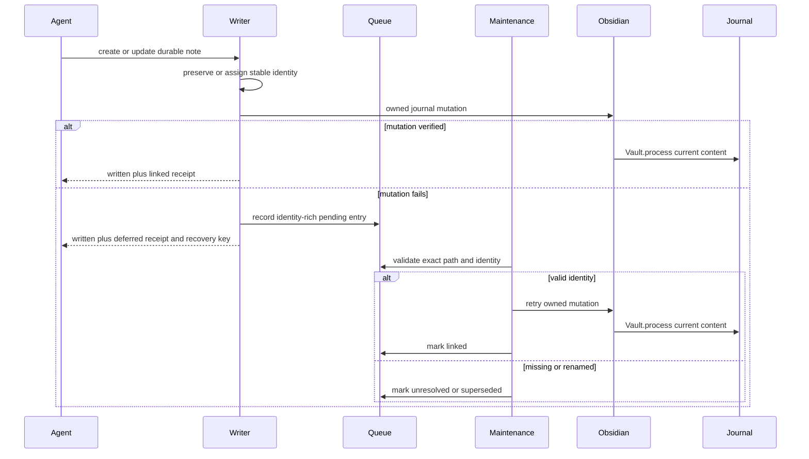

# Journal Backlink Recovery Hardening

## Goal Capsule

- **Objective:** Make canonical note creation either add its daily-journal backlink immediately or leave a safe, observable recovery record that heals predictably without creating links to missing or renamed notes.
- **Authority:** The Product Contract owns behavior. The Planning Contract owns implementation choices. Existing vault single-writer and Obsidian-owned live-journal rules remain binding.
- **Execution profile:** Implement in the jarvOS source tree, verify deterministic tests and an opt-in real Obsidian CLI smoke, deploy through the existing mirror path, then reconcile the configured vault queue from a dry-run report.
- **Stop conditions:** Stop rather than guess if a queue entry has duplicate note identities, a legacy entry cannot be matched exactly, the deployed mirror is not derived from the tested source revision, or the live smoke would need to create a note or journal link.
- **Tail ownership:** The executor owns code, tests, documentation, deployment verification, and the one-time queue reconciliation. Repository and user conventions decide the final branch, review, and landing path.

---

## Product Contract

### Summary

Canonical note creation will carry a stable note identity from the note file into the deferred-backlink queue.
Recovery will use that identity and the canonical note path instead of trusting a title alone.
The queue will distinguish recoverable transient failures from terminal unresolved or superseded records.
Maintenance will expose when recovery last ran and what remains.

### Problem Frame

The canonical writer currently commits the note before attempting the journal backlink.
If Obsidian's owned mutation fails, `recordDeferredBacklink` preserves only `noteTitle`, `section`, and `journalPath`.
The upstream maintenance command does not flush that queue, while the live mirror has a title-only flush that can retry without confirming that the source note still exists.
The writer also collapses this partial success into a skipped journal result, and the higher-level contract can report total failure after the note already exists.
That combination allowed a durable note to exist without a visible journal link, left zero-attempt queue records, and encouraged a renamed retry that made recovery ambiguous.

This incident is a direct fit for jarvOS's “evidence over assertion” strategy.
A note write is not fully verified merely because the note file exists, and a queued repair is not healthy merely because it was recorded.

### Actors

- A1. **Agent caller:** Creates or updates a durable note through the canonical contract and needs a truthful receipt.
- A2. **Journal maintenance:** Retries transient backlink failures and records durable outcomes.
- A3. **Operator:** Reviews unresolved or superseded records and explicitly reconciles ambiguous identity changes.
- A4. **Obsidian desktop and CLI:** Own the live mutation of today's open journal.

### Requirements

**Canonical note identity and receipts**

- R1. Every canonical note written or updated through the vault writer has a stable `jarvos_note_id` that is preserved in frontmatter and returned with its canonical vault-relative note path and title.
- R2. If the note write succeeds but the journal mutation does not, the caller receives a structured partial-success receipt with `written: true`, `journal.status: deferred`, the recovery key, and the original note identity; the result must not imply that the note write failed.
- R3. The canonical recovery path accepts the recovery key from R2 and retries that record without rewriting the note or inventing a replacement title.

**Recovery safety**

- R4. A deferred record stores the stable note identity, canonical note path, link title, journal path, section, reason, timestamps, and attempt history.
- R5. Automatic recovery may mutate a journal only when the queued note path exists, its stable identity matches the queued identity, and the backlink target is derived from that validated path rather than trusted from queued title text.
- R6. A missing exact note becomes `unresolved`; a matching stable identity found at another path or title becomes `superseded`; neither outcome automatically creates a journal link.
- R7. Legacy title-only records are reconciled conservatively: an already-present exact link becomes `linked`, an exact canonical note file may be retried, and any ambiguous or absent match becomes `unresolved` without fuzzy title matching.
- R8. Recovery is idempotent and concurrency-safe: an already-present link resolves without requiring Obsidian, a transient mutation error remains `pending` with an incremented attempt record, and queue entries added during a flush are preserved.

**Operations and verification**

- R9. Scheduled and manual maintenance report `lastFlushAt`, checked, linked, pending, unresolved, superseded, and failed counts; a run with non-healthy records must not collapse to `NO_REPLY`.
- R10. The production mutation path continues to use the active vault's Obsidian-owned `Vault.process` flow and verifies the committed journal content before reporting success.
- R11. Deterministic tests cover the full queue state machine, writer receipts, contract behavior, and maintenance reporting; an opt-in live smoke exercises the installed Obsidian CLI against an already-linked real note and journal without creating test content.
- R12. The initial rollout repairs the existing deferred queue from a backed-up dry-run report, deploys the tested source to the live mirror, and records evidence that a scheduled or manual maintenance run advanced queue attempt or terminal-state metadata.

### Key Flows

- F1. **Immediate backlink success**
  - **Trigger:** A1 writes a durable note while Obsidian mutation is available.
  - **Steps:** The writer assigns or preserves `jarvos_note_id`; Obsidian mutates the current journal; the writer verifies one exact backlink; the contract returns a complete success receipt.
  - **Outcome:** The note exists, the journal contains one link, and no pending recovery record remains.
  - **Covers:** R1, R3, R10.

- F2. **Deferred partial success**
  - **Trigger:** The note file is committed but Obsidian mutation fails or times out.
  - **Steps:** The linker records the identity-rich queue entry; the writer returns a deferred journal result; the higher-level contract preserves the note-written receipt.
  - **Outcome:** The caller knows the note exists and can cite the recovery key without inventing another title.
  - **Covers:** R2, R4.

- F3. **Safe automatic recovery**
  - **Trigger:** A2 processes a pending record, or A1 explicitly retries the recovery key returned by F2.
  - **Steps:** Recovery validates path and identity; it resolves an existing exact link locally or calls the owned mutation; it re-reads the journal and updates the queue under lock.
  - **Outcome:** The record becomes `linked`, or stays `pending` with a visible transient error and incremented attempts.
  - **Covers:** R5, R8, R10.

- F4. **Identity drift**
  - **Trigger:** A2 finds that the queued note path is absent or does not contain the expected identity.
  - **Steps:** Recovery searches only by the stable identity; no match produces `unresolved`; one unique match at a different path produces `superseded`; multiple matches produce `unresolved` with an identity-conflict reason.
  - **Outcome:** The journal is untouched until A3 explicitly reconciles the record.
  - **Covers:** R6, R7.

- F5. **Operational reconciliation**
  - **Trigger:** A3 runs queue maintenance after deploying the fix.
  - **Steps:** A dry run classifies every record and writes no journal or queue state; the operator reviews the report and backup; apply performs only safe retries and state transitions; status output records the run.
  - **Outcome:** Existing exact links are marked linked, safe pending records are retried, and stale records become explicit unresolved or superseded records.
  - **Covers:** R9, R12.

### Acceptance Examples

- AE1. **Immediate success**
  - **Covers:** R1, R10.
  - **Given:** A canonical note has a stable identity and today's journal has no link for it.
  - **When:** Obsidian acknowledges and commits the owned mutation.
  - **Then:** The result reports `journal.status: linked`, the journal contains exactly one link, and the queue has no pending record for that note and journal.

- AE2. **Mutation timeout after note write**
  - **Covers:** R2, R4.
  - **Given:** The note file was written successfully.
  - **When:** Obsidian mutation times out.
  - **Then:** The caller receives `written: true`, the canonical note identity and path, `journal.status: deferred`, and a recovery key.

- AE3. **Missing queued note**
  - **Covers:** R5, R6.
  - **Given:** A pending record's exact path no longer exists and no file carries its stable identity.
  - **When:** Maintenance applies recovery.
  - **Then:** The record becomes `unresolved`, the attempt is timestamped, and the journal remains byte-for-byte unchanged.

- AE4. **Renamed queued note**
  - **Covers:** R5, R6.
  - **Given:** A pending record's exact path is absent and one different note path carries the same stable identity.
  - **When:** Maintenance applies recovery.
  - **Then:** The record becomes `superseded` with the discovered replacement path and title, and the journal remains unchanged.

- AE5. **Legacy title-only queue entry**
  - **Covers:** R7.
  - **Given:** A version-1 record has no stable identity.
  - **When:** Its exact link is already in the recorded journal.
  - **Then:** Maintenance marks it linked without calling Obsidian.

- AE6. **Concurrent queue addition**
  - **Covers:** R8.
  - **Given:** Maintenance is flushing a snapshot of pending records.
  - **When:** Another note write queues a new record during the flush.
  - **Then:** The new record remains pending after maintenance commits its outcomes.

- AE7. **Silent scheduler regression**
  - **Covers:** R9.
  - **Given:** The queue contains pending records but no flush metadata advances within the documented maintenance window.
  - **When:** Status is inspected.
  - **Then:** It reports stale recovery maintenance and the non-healthy counts instead of `NO_REPLY`.

- AE8. **Live Obsidian smoke**
  - **Covers:** R10, R11.
  - **Given:** Obsidian 1.12.7 or newer is running, the registered CLI targets the configured vault, and an existing note is already linked from its journal.
  - **When:** The opt-in smoke runs.
  - **Then:** It executes real CLI `eval` and a no-op `Vault.process`, verifies the same single link and unchanged journal content, and exits nonzero on installer, registration, vault, mutation, or verification failure.

### Success Criteria

- A newly deferred note can be traced from the caller receipt to one queue record by stable identity and recovery key.
- Maintenance never creates a link for a missing, ambiguously identified, or renamed note.
- Every non-terminal retry increments attempts and records a current error or result.
- Queue status reveals whether maintenance has run recently and why each non-linked record remains.
- The root test path includes the secondbrain recovery regression suite.
- A documented opt-in live smoke catches a broken Obsidian installer or CLI registration that mocked tests cannot detect.
- The existing configured queue is reconciled without adding stale journal links.

### Scope Boundaries

**In scope**

- Queue schema evolution, legacy compatibility, state transitions, locking, and reporting.
- Canonical writer identity and partial-success receipts.
- Maintenance integration and schedule visibility.
- Deterministic and live Obsidian CLI verification.
- One-time repair of the configured deferred queue after deployment.
- Documentation for recovery, smoke verification, and operator reconciliation.

**Out of scope**

- Fuzzy title matching or automatic selection among similarly named notes.
- Automatic journal linking after a note rename.
- Replacing the Obsidian-owned live-journal mutation rule with raw file writes.
- General Obsidian vault, Sync, plugin, or journal-template refactors.
- A hosted queue service, database migration framework, or new scheduler.

### Product Key Decisions

- **Missing and renamed notes require explicit queue outcomes.** (session-settled: user-approved — chosen over automatically linking the closest title match: title drift can point a journal at the wrong durable artifact.) Governs R5-R7.
- **This fix includes queue repair and durable hardening.** (session-settled: user-approved — chosen over cleanup-only or installer-only repair: existing zero-attempt records prove the recovery path itself needs enforcement.) Governs R1-R12.
- **Real Obsidian verification supplements mocked tests.** (session-settled: user-approved — chosen over mocks-only coverage: the incident depended on the installed CLI and running desktop path that mocks cannot validate.) Governs R10-R12.

---

## Planning Contract

### Context and Research

- `modules/jarvos-secondbrain/bridge/provenance/src/link-to-journal.js` already provides atomic queue writes, a queue lock, Obsidian `eval`, `Vault.process`, post-commit verification, and existing-link idempotency. Extend these seams instead of introducing a separate linker.
- `modules/jarvos-secondbrain/packages/jarvos-secondbrain-notes/src/write-to-vault.js` writes the note before linking and currently reduces link errors to `{ linked: false, skipped: true, reason }`. This is the ownership point for a truthful partial-success receipt.
- `modules/jarvos-secondbrain/bridge/provenance/src/note-journal-contract.js` currently verifies that one journal link exists and throws if it does not, even after the note was committed. It needs a deferred branch that reports partial success without claiming the note operation rolled back.
- `modules/jarvos-secondbrain/packages/jarvos-secondbrain-journal/src/journal-maintenance.js` has no upstream deferred-backlink flush. The live mirror contains a newer title-only `flushDeferredBacklinks`; port its queue-lock and concurrent-addition behavior, then add identity validation before it can mutate a journal.
- Commits `f665902` and `21abbc4` establish the safety rationale: today's journal remains Obsidian-owned, and corrupt or concurrently updated recovery state must be preserved.
- The [official Obsidian CLI contract](https://obsidian.md/help/cli) requires the 1.12.7-or-newer installer, a running Obsidian app, registered CLI path, explicit vault targeting, and `eval` for in-app JavaScript. The smoke must test those real preconditions.
- `STRATEGY.md` prioritizes enforced-rule coverage, verified-done receipts, and silent-failure escape reduction. The queue state and maintenance receipt are part of the product evidence, not incidental logs.

No repository solution note covers this incident class.
Local code, live-mirror behavior, git history, the observed queue, and official Obsidian documentation provide sufficient implementation grounding.

### Key Technical Decisions

- KTD1. **Use writer-owned `jarvos_note_id` as stable identity and the vault-relative path as the automatic-mutation boundary.** The writer generates a UUID for a new canonical note and preserves the value already stored in an existing note. Callers cannot choose or replace this reserved field. Recovery may link only when both queued identity and exact path match, and it derives the wikilink target from that validated path. A stable identity found at another path proves rename or move, but it does not authorize a link. This instantiates the Product Key Decision governing R1 and R4-R7. (session-settled: user-approved — chosen over title-only recovery: title drift caused the incident's ambiguous trail.)
- KTD2. **Evolve the queue to version 2 in place.** Readers accept version 1 and version 2. Writers emit version 2 records. Apply mode upgrades only records it can classify; it preserves unknown fields and corrupt-file fail-closed behavior. This avoids a separate migration tool while keeping legacy records auditable. Governs R4, R7, and R8.
- KTD3. **Represent recovery as an explicit state machine.** `pending` is the only automatic-retry state. `linked`, `unresolved`, and `superseded` are terminal for automatic maintenance. Transient mutation failures remain pending with attempts, `lastAttemptAt`, and `lastError`. Manual reconciliation reopens the selected record under the same queue lock and appends an event that preserves the prior terminal outcome. This instantiates the Product Key Decision governing R5-R9. (session-settled: user-approved — chosen over blindly flushing every title-only record: terminal ambiguity must be visible and non-mutating.)
- KTD4. **Treat note-write plus deferred-link as verified partial success.** `write-to-vault` and the note-journal contract return one structured receipt that separates note durability from backlink completeness. The canonical contract exits successfully only when it verifies both the durable note and its recovery record. Its receipt reports `verification.ok: true`, `verification.journalComplete: false`, and `verification.deferred: true`. A caller retries the returned recovery key through the recovery entry point, not by invoking note creation again. This prevents retry-by-renaming while preserving a machine-readable incomplete state. Governs R2 and R3.
- KTD5. **Run recovery from the existing journal-maintenance entry point and expose status from the queue itself.** A flush updates top-level `lastFlushAt` and `lastFlushSummary` even when no record changes. Human output reports any non-healthy count. JSON output exposes the same fields for agents and monitoring. This avoids a second scheduler while making a missing run observable. Governs R8 and R9.
- KTD6. **Make the live smoke opt-in, real, and no-op.** The smoke requires an existing canonical note whose exact link is already present in the target journal. It records the journal bytes, directly invokes the production Obsidian mutator so `Vault.process` still executes, and verifies unchanged bytes and exactly one link afterward. It never creates its own note, journal, or link. This instantiates the Product Key Decision governing R10 and R11. (session-settled: user-approved — chosen over mocked integration alone: installer and registration failures exist outside the JavaScript mock boundary.)
- KTD7. **Land and verify upstream before reconciling live state.** The jarvOS source tree is authoritative. The deployment mirror must identify the tested source revision before the configured vault queue is changed. Dry-run and backup evidence precede apply. Governs R12.

### High-Level Technical Design

```mermaid
stateDiagram-v2
  [*] --> Pending: note written and link deferred
  Pending --> Linked: exact path and identity; link verified
  Pending --> Pending: transient Obsidian failure; attempts increment
  Pending --> Unresolved: exact note absent and no unique identity match
  Pending --> Superseded: same identity found at a new path or title
  Unresolved --> Pending: explicit operator reconciliation
  Superseded --> Pending: explicit operator reconciliation
  Linked --> [*]
```

### Queue Record Contract

Version 2 records retain existing audit fields and add:

- Stable `noteId`, canonical vault-relative `notePath`, and queued `noteTitle`.
- `status` in `pending | linked | unresolved | superseded`.
- `recordedAt`, `updatedAt`, optional `lastAttemptAt`, and numeric `attempts`.
- `reason`, optional `lastError`, and optional `lastResult`.
- An append-only `events` list for state transitions and explicit operator reconciliation.
- For terminal identity drift, `resolutionReason`, optional `replacementPath`, optional `replacementTitle`, and optional `identityMatches`.
- For linked records, `linkedAt`, `alreadyPresent`, and mutation owner.

The queue top level retains `version`, `updatedAt`, and `entries`, and adds `lastFlushAt` plus `lastFlushSummary`.
The existing lock-and-atomic-replace path remains the only queue mutation mechanism.

### Sequencing

1. Establish stable note identity and structured receipts before changing recovery behavior.
2. Add version-2 queue helpers and pure classification before wiring journal mutation.
3. Port and harden flush behavior, then connect it to maintenance reporting.
4. Add the real CLI smoke and deterministic coverage.
5. Update package and operational documentation.
6. Deploy the tested source, run dry-run reconciliation, apply safe outcomes, and verify maintenance freshness.

### System-Wide Impact

- **Agent and tool parity:** All personalities using `obsidian-note-journal-contract.js` receive the same identity, recovery key, and deferred state. Manual and scheduled maintenance call the same recovery function.
- **Data lifecycle:** The note file, queue record, journal link, and maintenance receipt become a traceable chain. Queue records are retained as audit history instead of deleted after resolution.
- **Failure propagation:** Note durability and backlink completeness are separate fields. Transient infrastructure failure does not erase the durable note or become a terminal identity decision.
- **Shared workspace:** Obsidian remains the owner of today's live journal. Recovery reads the canonical Notes directory and queue under the configured vault root.
- **Compatibility:** Existing version-1 queues remain readable. Existing notes gain identity only when the canonical writer updates them; the rollout does not bulk-edit the vault.
- **Packaging:** The new maintenance and smoke entry points must be included through the existing `modules/jarvos-secondbrain/` package boundary and exercised from the root test path.

### Risks and Mitigations

- **Duplicate copied identities:** A user may duplicate a note file with its frontmatter intact. Recovery treats multiple identity matches as unresolved and never selects one automatically.
- **Partial queue upgrade:** A crash during apply could leave mixed version-1 and version-2 records. The reader supports records independently and the existing atomic queue writer protects each commit.
- **Contract compatibility:** Callers may assume any non-linked result is a thrown total failure. Keep legacy top-level fields where possible, add explicit status fields, and test each personality path.
- **Scheduler ambiguity:** A configured cron expression does not prove execution. Persist `lastFlushAt` on every flush and verify it advances in rollout evidence.
- **Live smoke side effects:** Direct `Vault.process` still touches the active file even when content is unchanged. Require an already-linked pair, compare bytes before and after, and abort before mutation if any precondition fails.
- **Mirror drift:** The live tree contains recovery code absent upstream. Compare and port only the relevant recovery behavior, then require a deployed-source receipt before changing the configured queue.

### Open Questions

No launch-blocking questions remain.

- **Deferred:** Whether terminal records should eventually move to a separate archive file. Keep them in the version-2 queue for this fix so audit history and operator tooling have one source.
- **Deferred:** Whether `jarvos_note_id` should become a required field for notes created outside the canonical writer. This plan governs canonical writes only.

---

## Implementation Units

### U1. Add stable note identity and truthful partial-success receipts

- **Goal:** Make every canonical note result identify the durable note and distinguish linked, deferred, disabled, and failed journal states.
- **Requirements:** R1-R3.
- **Dependencies:** None.
- **Files:**
  - `modules/jarvos-secondbrain/packages/jarvos-secondbrain-notes/src/write-to-vault.js`
  - `modules/jarvos-secondbrain/packages/jarvos-secondbrain-notes/src/lib/note-schema.js`
  - `modules/jarvos-secondbrain/bridge/provenance/src/note-journal-contract.js`
  - `modules/jarvos-secondbrain/tests/personality-note-journal-contract.test.js`
  - `modules/jarvos-secondbrain/tests/vault-root-duplicate-guard.test.js`
- **Approach:** Assign `jarvos_note_id` on first canonical write and preserve an existing value on updates. Pass the canonical identity and note path into the linker. Normalize the writer's journal result into explicit statuses. Update contract verification so a verified queue record is partial success, not a false rollback, while a missing note or missing queue record remains an error. Return the recovery command's stable key as the only supported retry handle.
- **Test scenarios:**
  - A new note receives one stable identity; a second write preserves it.
  - Caller-supplied identity on a new note and attempted replacement on an existing note are rejected without changing the file.
  - Successful linking returns note and journal completeness.
  - Mutation failure returns a durable note, deferred status, and recovery key without creating a renamed note.
  - Unsupported personality and pre-write validation failures still fail before any note is created.
- **Verification:** Personality contract tests prove identical behavior for Michael, Claude Code, Hermes, and Codex.

### U2. Introduce queue version 2 and pure identity classification

- **Goal:** Make queue records self-sufficient for safe retry and terminal identity-drift decisions.
- **Requirements:** R4-R8.
- **Dependencies:** U1.
- **Files:**
  - `modules/jarvos-secondbrain/bridge/provenance/src/link-to-journal.js`
  - `modules/jarvos-secondbrain/tests/link-to-journal.test.js`
- **Approach:** Extend `recordDeferredBacklink` with note identity and vault-relative path. Add pure helpers that validate record shape, resolve an exact note, scan for a unique stable identity only when the exact path fails, and classify version-1 records conservatively. Preserve unknown fields, corrupt-file failure behavior, queue locking, and atomic replacement.
- **Test scenarios:**
  - Version-2 record round trips all identity and audit fields.
  - Exact path plus matching identity is retryable.
  - Exact path plus wrong identity is unresolved and non-mutating.
  - No identity match is unresolved; one moved identity is superseded; duplicate identity matches are unresolved.
  - Version-1 exact link is linked without Obsidian; exact note path is retryable; missing title is unresolved.
  - Queue corruption remains byte-for-byte preserved after a failed write attempt.
- **Verification:** Tests assert both the classification result and unchanged journal bytes for every non-retryable state.

### U3. Harden flush transitions and manual reconciliation

- **Goal:** Consume pending records safely, preserve concurrent queue additions, and give the operator an explicit way to reconcile terminal records.
- **Requirements:** R5-R8.
- **Dependencies:** U2.
- **Files:**
  - `modules/jarvos-secondbrain/bridge/provenance/src/link-to-journal.js`
  - `modules/jarvos-secondbrain/scripts/journal-backlink-recovery.js`
  - `modules/jarvos-secondbrain/package.json`
  - `modules/jarvos-secondbrain/tests/link-to-journal.test.js`
  - `modules/jarvos-secondbrain/tests/journal-backlink-recovery.test.js`
- **Approach:** Port the live mirror's snapshot-plus-locked-merge flush pattern. Classify before mutation. Derive the link target from the validated note path. Update attempts and outcomes under the latest queue state so entries added mid-flush survive. Provide dry-run, apply, and single-key retry modes. Manual reconciliation must name one recovery key and one exact note path; it validates or adopts the selected note's identity for a legacy record, reopens the record, and appends an event that preserves the old terminal state.
- **Test scenarios:**
  - Valid pending entry links and becomes linked.
  - Existing journal link becomes linked without invoking Obsidian.
  - Obsidian failure increments attempts and remains pending.
  - Missing, renamed, and duplicate-identity records become terminal without journal changes.
  - A version-2 record with stale queued title text links only the target derived from its validated path.
  - A queue entry added during a flush remains pending afterward.
  - Dry run returns the same classifications with no queue or journal writes.
  - Manual reconciliation rejects mismatched identity and accepts one exact operator-selected note.
- **Verification:** The recovery CLI emits stable JSON suitable for rollout evidence and human output that identifies every non-healthy record.

### U4. Wire recovery into maintenance and expose schedule freshness

- **Goal:** Make the existing maintenance job actually advance recovery and make a silent or stale run visible.
- **Requirements:** R8, R9, R12.
- **Dependencies:** U3.
- **Files:**
  - `modules/jarvos-secondbrain/packages/jarvos-secondbrain-journal/src/journal-maintenance.js`
  - `modules/jarvos-secondbrain/adapters/openclaw/src/journal-maintenance-job.js`
  - `modules/jarvos-secondbrain/tests/journal-maintenance.test.js`
  - `modules/jarvos-secondbrain/tests/journal-maintenance-schedule.test.js`
  - `modules/jarvos-secondbrain/tests/journal-backlink-recovery.test.js`
- **Approach:** Flush after normal journal maintenance when not in dry-run mode. Persist top-level flush metadata even for an empty or unchanged queue. Include non-healthy counts and stale freshness in text and JSON output. Keep the existing 12:01 AM local schedule and single job entry point.
- **Test scenarios:**
  - A maintenance run advances `lastFlushAt` when the queue is empty.
  - Linked, pending, unresolved, superseded, and failed counts render in JSON.
  - Any pending, unresolved, superseded, failed, or stale condition prevents `NO_REPLY`.
  - Dry-run journal maintenance classifies the queue without changing it.
  - The configured local schedule still targets the canonical maintenance script.
- **Verification:** A test with a zero-attempt pending entry proves one maintenance run changes either its attempt metadata or terminal status.

### U5. Add deterministic and live Obsidian CLI verification

- **Goal:** Catch both JavaScript regressions and real installer, registration, vault-targeting, and `Vault.process` failures.
- **Requirements:** R10, R11.
- **Dependencies:** U2.
- **Files:**
  - `modules/jarvos-secondbrain/bridge/provenance/src/link-to-journal.js`
  - `modules/jarvos-secondbrain/scripts/obsidian-journal-link-smoke.js`
  - `modules/jarvos-secondbrain/package.json`
  - `modules/jarvos-secondbrain/tests/link-to-journal.test.js`
  - `modules/jarvos-secondbrain/tests/obsidian-journal-link-live.test.js`
- **Approach:** Keep mocked invocation and VM-backed `Vault.process` tests deterministic. Add an environment-gated live test and script that validate installer version, registered CLI resolution, active vault identity, existing note identity, and existing exact backlink before calling the real production mutator. Compare journal bytes and backlink count afterward. Skip only when the live gate is absent; fail for every unmet precondition after the gate is enabled.
- **Test scenarios:**
  - Mocked CLI arguments put `vault=` first and parse the final JSON result.
  - CLI timeout, invalid JSON, wrong vault, and completed-without-commit fail closed.
  - Live gate absent produces an explicit skip in the integration test.
  - Live gate present with an old installer, stale registration, closed or wrong vault, missing note, missing link, changed bytes, or duplicate link exits nonzero.
  - Live gate present with the configured existing pair executes no-op `Vault.process` and succeeds.
- **Verification:** `JARVOS_LIVE_OBSIDIAN_SMOKE=1 npm --prefix modules/jarvos-secondbrain run test:obsidian-live` passes on the supported workstation and is not part of unattended CI.

### U6. Put recovery regressions on the root quality path and document operations

- **Goal:** Ensure the hardening remains enforced and an operator can diagnose or reconcile it without editing queue JSON.
- **Requirements:** R9-R12.
- **Dependencies:** U3-U5.
- **Files:**
  - `package.json`
  - `modules/jarvos-secondbrain/package.json`
  - `docs/journal-install-contract.md`
  - `modules/jarvos-secondbrain/README.md`
- **Approach:** Make the root test command execute the relevant secondbrain recovery tests instead of the current journal-only subset. Document queue states, dry-run and apply behavior, partial-success receipts, maintenance freshness, Obsidian 1.12.7+ CLI registration, and the opt-in live smoke. Keep Obsidian optional for normal deterministic tests.
- **Test scenarios:**
  - Root tests fail when a recovery regression test fails.
  - Packaged files include both operational scripts.
  - Documentation examples match actual command help and JSON field names.
- **Verification:** Package smoke and release-readiness checks pass with the new scripts included.

### U7. Deploy and reconcile the configured queue

- **Goal:** Safely clean the incident queue and prove the deployed recovery loop advances.
- **Requirements:** R12.
- **Dependencies:** U1-U6.
- **Files:**
  - `docs/journal-install-contract.md`
- **Approach:** Deploy from the tested jarvOS source revision through the established mirror process. Capture the deployed revision. Back up the configured queue, run recovery in dry-run mode, and review every proposed transition. Apply only exact-link, exact-path-and-identity, unresolved, or superseded outcomes defined by KTD3. Do not fuzzy-match the legacy Swarm Theory title. Run the live smoke against an existing linked pair. Then run maintenance once and verify `lastFlushAt`, summary counts, and record attempts or terminal states.
- **Test scenarios:**
  - Existing exact links in the incident queue become linked without journal mutation.
  - Missing legacy entries become unresolved and add no link.
  - Similar Swarm Theory titles do not count as an identity match.
  - A present exact note that is not linked retries through Obsidian and verifies one link.
  - A post-deploy maintenance run advances freshness metadata.
- **Verification:** Preserve a before/after queue report, deployed-source receipt, live-smoke result, and one maintenance summary. The configured journals contain no new link whose source note is absent.

---

## Verification Contract

| Gate | Command | Proves |
| --- | --- | --- |
| Focused linker and identity tests | `node --test modules/jarvos-secondbrain/tests/link-to-journal.test.js modules/jarvos-secondbrain/tests/personality-note-journal-contract.test.js modules/jarvos-secondbrain/tests/journal-backlink-recovery.test.js` | Queue states, identity safety, receipts, concurrency, and agent parity. |
| Maintenance tests | `node --test modules/jarvos-secondbrain/tests/journal-maintenance.test.js modules/jarvos-secondbrain/tests/journal-maintenance-schedule.test.js` | Flush integration, freshness reporting, dry-run behavior, and schedule preservation. |
| Full secondbrain suite | `npm --prefix modules/jarvos-secondbrain test` | No regressions across notes, journals, projects, capture, and packaging surfaces. |
| Root quality path | `npm test` | The repository's normal gate includes the recovery regression suite. |
| Package and release readiness | `npm run release:check:candidate` | New scripts and docs are packaged and release metadata remains coherent. |
| Opt-in real Obsidian smoke | `JARVOS_LIVE_OBSIDIAN_SMOKE=1 npm --prefix modules/jarvos-secondbrain run test:obsidian-live` | Real installer, CLI registration, vault targeting, `eval`, no-op `Vault.process`, and post-commit verification. |
| Queue dry run | `npm --prefix modules/jarvos-secondbrain run maintain:journal-backlinks -- --dry-run --json` | Every current record has a non-mutating proposed outcome before apply. |
| Queue apply and maintenance receipt | `npm --prefix modules/jarvos-secondbrain run maintain:journal-backlinks -- --apply --json` followed by the canonical maintenance entry point | Safe transitions apply, no stale links appear, and freshness metadata advances. |

The live smoke is a workstation release gate for this integration, not a portable CI gate.
CI and ordinary local tests must remain deterministic and must not launch Obsidian.
Queue apply runs only after source tests, deployment verification, backup, and dry-run review succeed.

---

## Definition of Done

- R1-R12 are implemented and traceable to passing tests or rollout evidence.
- New and updated canonical notes preserve one stable `jarvos_note_id`.
- A note-written, link-deferred operation returns one truthful partial-success receipt with a recovery key.
- Version-1 and version-2 queue records remain readable; corrupt queue content still fails closed without replacement.
- Automatic recovery mutates a journal only for an exact path and matching stable identity.
- Missing, moved, renamed, and duplicate-identity cases produce explicit non-mutating terminal records.
- Recovery preserves entries added concurrently and records every retry attempt.
- Scheduled and manual maintenance expose freshness plus linked, pending, unresolved, superseded, and failed counts.
- Deterministic tests pass through both the secondbrain and root test commands.
- The opt-in real Obsidian smoke passes with installer 1.12.7 or newer and leaves the journal byte-for-byte unchanged.
- Operational documentation matches the implemented CLI and queue fields.
- The tested upstream revision is deployed before live queue repair.
- The configured queue is backed up, dry-run classified, safely reconciled, and verified without adding a link to an absent source note.
- One post-deploy maintenance run advances `lastFlushAt` and produces a durable summary.
- Abandoned experimental code, temporary fixtures, and rollout-only scratch artifacts are removed from the implementation diff.
