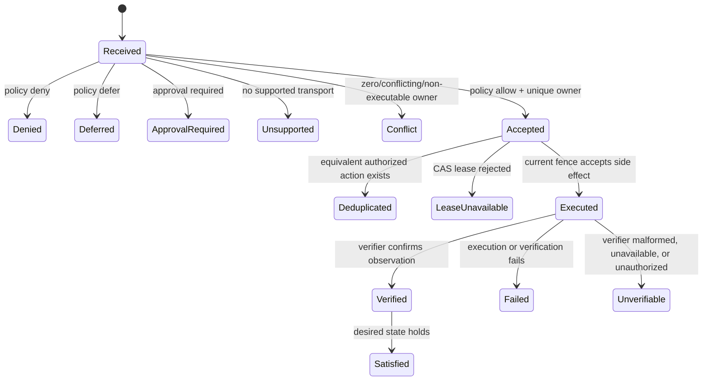

# Hermes Runtime, Skill, and Dispatch Parity

## Goal Capsule

- **Objective:** Bring the public Hermes adapter to parity with the portable jarvOS runtime, skill, and governed-dispatch contract without taking ownership of Hermes-native model, tool, session, scheduler, memory, or learning behavior.
- **Authority:** This Product Contract owns externally observable behavior. `docs/architecture/product-category-and-boundaries.md`, `docs/architecture/control-plane.md`, `modules/jarvos-runtime-kit`, and `@jarvos/skills` remain binding public governance boundaries.
- **Execution profile:** Extend the Hermes adapter and shared, runtime-neutral contracts only where a reusable capability is required; use a thin Hermes translation layer and manifest-driven conformance checks.
- **Stop conditions:** Stop rather than guess if Hermes does not expose a supported, documented integration surface for a proposed capability; leave it explicitly unsupported or manual with a reason. Stop if an implementation would require secrets, personal paths, private tracker configuration, or replacing a Hermes-native subsystem.
- **Tail ownership:** The implementer owns public code, docs, deterministic tests, and conformance evidence. A host operator owns runtime installation, credentials, and any local configuration approval.

---

## Product Contract

### Summary

Hermes will become a conforming jarvOS runtime adapter: it can discover the
portable jarvOS capability surface, install declared public skills safely, and
submit governed work through a generic dispatch boundary when the host supports
it. The adapter will report a durable, machine-readable receipt for every
accepted, declined, deferred, or unsupported request.

This is not a plan to rebuild Hermes in jarvOS. Hermes continues to own model
selection and calls, tool execution and sandboxing, sessions, messaging,
scheduling, and its native memory, learning, and skill-improvement systems.
jarvOS continues to own portable Markdown governance, shared context contracts,
portable skills, and bounded control-plane policy and evidence semantics.

### Problem Frame

The current Hermes adapter intentionally installs workspace guidance and a
jarvOS skill, but its manifest declares MCP unavailable and startup hydration
manual. That is honest, but it does not yet give a compatible Hermes host a
single, testable way to:

- determine which shared context and skill capabilities are available;
- distinguish a host-native capability from a jarvOS portable capability;
- dispatch a bounded, authorized jarvOS action without inventing an
  adapter-specific lifecycle; or
- return a receipt that another process can inspect without trusting prose.

Without those contracts, each runtime integration can silently diverge in
skill loading, authorization, idempotency, completion language, and public
configuration safety. Parity means the same portable behavior is available or
truthfully reported as unavailable; it does not mean every runtime has the
same native APIs.

### Actors

- A1. **Human operator:** Installs or updates a Hermes adapter and needs visible, non-destructive configuration behavior.
- A2. **Hermes runtime:** Loads native skills and tools, calls a host-supported jarvOS bridge, and executes only the work that its runtime is responsible for.
- A3. **jarvOS application service:** Resolves trusted identity, evaluates capability and sensitivity policy, registers commands, and projects authorized results.
- A4. **Domain manager:** Owns a declared mutation class and independently verifies its postcondition.
- A5. **Caller or auditor:** Consumes a dispatch receipt and can distinguish acceptance, execution, verification, and projection states.

### Requirements

**Runtime and skill parity**

- R1. The Hermes adapter manifest declares every shared jarvOS capability it exposes, its transport, supported target, hydration mode, and intentionally unsupported capability with a human-readable reason.
- R2. Hermes consumes the public `@jarvos/skills` manifest as the source of truth for portable default skills; it must not hardcode a divergent default list.
- R3. Skill installation is deterministic and non-destructive: it validates declared skill metadata and dependencies, reports missing optional requirements, and refuses to replace an existing user-owned skill unless an explicit force option is used.
- R4. Hermes-specific guidance may route to host-native facilities, but must not duplicate or disable Hermes-native memory, learning, session, model, tool, scheduler, or skill-improvement systems.
- R5. Startup hydration is automatic only when Hermes exposes a supported host hook. Otherwise the adapter provides a documented manual invocation and returns an explicit `unsupported` or `manual` capability status; it must not simulate a hook through hidden polling or private configuration assumptions.

**Generic dispatch and receipts**

- R6. A runtime-neutral dispatch request includes a contract version, opaque request identity, actor kind, trusted-principal credential input, resource scope, mutation class, desired generation, command specification, constraints, lifecycle preference, and optional correlation identity. Callers cannot set trusted principal, granted capabilities, sensitivity ceiling, approval state, lease, fence, execution outcome, or evidence fields.
- R7. Before command deduplication or dispatch, the application service resolves the credential to a trusted principal, replaces caller-supplied authority fields, and evaluates policy for the exact request. `deny`, `defer`, and `require_approval` outcomes never invoke a manager.
- R8. An allowed request resolves to exactly one executable manager for its `(machine, resource, mutation class)` ownership key. Zero, conflicting, malformed, or data-only manager matches are non-executable outcomes that preserve a diagnostic code without exposing adapter-private fields.
- R9. Equivalent authorized work is idempotent by a deterministic action key derived from the authorized command identity and desired generation. An authorization decision, approval, lease, fence, evidence record, or terminal outcome from one action key cannot be reused for another.
- R10. The dispatcher obtains a compare-and-set lease and monotonic fence before a mutation. The manager validates the current fence immediately before its side effect, and reconciliation validates it again before an `executed`, `verified`, `satisfied`, `failed`, or `unverifiable` transition is committed.
- R11. A dispatch receipt is versioned, JSON-serializable, and durable when a command record exists. It includes only public-safe fields: request ID, action key or safe command reference, lifecycle status, policy disposition, manager selection disposition, receipt time, verification summary, evidence reference when authorized, retryability, and stable machine-readable codes. It never includes credentials, raw configuration, absolute host paths, adapter extensions, unfiltered tool arguments, or private evidence.
- R12. Receipt states distinguish at least `accepted`, `deduplicated`, `denied`, `deferred`, `approval_required`, `unsupported`, `conflict`, `lease_unavailable`, `executed`, `verified`, `satisfied`, `failed`, and `unverifiable`. A receipt must not claim success merely because a request was accepted or a manager was invoked.
- R13. Independent verification reads authoritative current state through the manager's verifier port. Missing, malformed, unauthorized, stale-fence, or failed verification yields a truthful non-success receipt; malformed verifier output is terminal `unverifiable` and releases the lease.

**Security and public privacy**

- R14. Hermes setup backs up any user-owned configuration before a write, minimizes writes, and registers only declared non-secret references. It must not put raw credentials in command arguments, manifests, generated public artifacts, or runtime configuration.
- R15. Control-plane access, when enabled, uses the declared host-service module reference and a credential-file reference. The adapter must not register a raw control-plane credential environment variable or make the runtime transport the authorization authority.
- R16. Read, list, inspect, and receipt projections apply capability and sensitivity policy before serialization. If authorization or filtering cannot be evaluated, callers receive only non-sensitive health or an explicit non-success status.
- R17. Approval is one-time and bound to the exact action key, approver capability, expiry, and fence. Creator approval is forbidden unless policy explicitly delegates it; replay, expiry, replacement command, and stale-fence attempts fail closed.
- R18. Public adapter documentation, examples, fixtures, receipts, and conformance output contain no personal paths, credentials, local machine identifiers, private tracker references, user-specific assistants, or private configuration.

**Conformance and operability**

- R19. `@jarvos/runtime-kit` validates Hermes manifest shape, shared-tool declarations, setup backup behavior, hydration truthfulness, and documentation for every manual or unsupported capability.
- R20. A capability matrix makes parity inspectable per runtime target: each capability is `supported`, `manual`, or `unsupported`, includes its transport and reason, and never presents an unimplemented feature as supported.
- R21. Deterministic tests cover manifest validation, skill-manifest parity, non-destructive installation, request authority stripping, policy-before-dedupe ordering, ownership conflicts, idempotent action keys, approval binding, lease/fence rejection, receipt redaction, and verifier failure modes.
- R22. The normal repository test path runs the focused runtime-kit, skills, and control-plane conformance tests. Any live Hermes smoke is opt-in, uses an operator-provided non-secret test configuration, performs no mutation, and reports unsupported host capabilities rather than treating their absence as a pass.

### Key Flows

- F1. **Discover and install portable skills**
  - **Trigger:** A1 runs Hermes setup or skill reconciliation.
  - **Steps:** The adapter reads the public skill manifest, determines the declared target directory, validates each requested skill and requirement, backs up an existing configuration before any config write, and refuses unforced overwrite of user-owned skills.
  - **Outcome:** A receipt or doctor result lists installed, preserved, unavailable, and unsupported capabilities without claiming host-native ownership.
  - **Covers:** R1-R4, R14, R18-R20.

- F2. **Manual or hooked hydration**
  - **Trigger:** A2 starts a session or requests a startup brief.
  - **Steps:** If a supported Hermes hook exists, the adapter invokes the shared hydration tool and fails open to an empty public-safe context packet. If no hook exists, the adapter exposes the manual command and status rather than attempting an undocumented workaround.
  - **Outcome:** The runtime receives a bounded context packet or an explicit capability status.
  - **Covers:** R1, R5, R16, R20.

- F3. **Authorized dispatch**
  - **Trigger:** A2 submits a bounded operation through the generic dispatch bridge.
  - **Steps:** A3 validates the request version and schema, resolves the credential, overwrites authority fields, evaluates policy, selects exactly one executable manager, deduplicates by action key, obtains lease/fence, and invokes A4 only when all gates pass.
  - **Outcome:** The caller receives `accepted`, `deduplicated`, or a truthful non-executable receipt; no denied or pending request reaches a manager.
  - **Covers:** R6-R10, R12, R15-R17.

- F4. **Verified completion**
  - **Trigger:** A4 reports an execution attempt.
  - **Steps:** Reconciliation revalidates the fence, invokes the independent verifier, serializes an authorized evidence projection, releases the lease when required, and writes a receipt whose status reflects verification rather than manager assertion.
  - **Outcome:** `satisfied` is possible only after independent verification; failures and malformed verification remain observable and non-successful.
  - **Covers:** R10-R13, R16.

- F5. **Unsupported or unsafe surface**
  - **Trigger:** An implementation or host check finds no supported Hermes MCP, startup hook, dispatch tool, or safe configuration route.
  - **Steps:** The adapter records the capability as `manual` or `unsupported` with a reason, documents the available operator path, and does not add hidden state or host-specific emulation.
  - **Outcome:** Conformance remains truthful and users can distinguish a planned capability from a working one.
  - **Covers:** R1, R5, R18-R20, R22.

### Acceptance Examples

- AE1. **Manifest parity:** Given the public skills manifest changes its default list, when Hermes conformance runs, then it fails until Hermes derives the same list or explicitly marks an incompatible skill unsupported with a public reason. Covers R1-R3, R19-R21.
- AE2. **Existing skill safety:** Given the Hermes target contains a user-owned skill directory, when setup runs without force, then the directory is unchanged and the result names it as preserved. Covers R3, R14.
- AE3. **No invented hook:** Given Hermes exposes no supported startup hook, when a startup brief is requested, then the adapter returns `manual` or `unsupported` with documented invocation rather than scheduling a hidden poller. Covers R5, R20, R22.
- AE4. **Authority stripping:** Given a request includes a forged principal and `control-plane.approve` capability, when it is submitted with a valid credential for a lesser principal, then policy receives only the resolved principal and the forged fields never appear in receipt or manager input. Covers R6-R7, R11, R16.
- AE5. **Policy before dedupe:** Given a previously allowed action key exists, when a newly denied request would otherwise calculate the same key, then the second request is denied and does not receive the previous command or evidence. Covers R7, R9, R12.
- AE6. **Ownership conflict:** Given two executable managers claim the same mutation key, when dispatch selects a manager, then no manager executes and the receipt is `conflict` with a safe diagnostic code. Covers R8, R11-R12.
- AE7. **Fence loss:** Given a manager obtains a lease and loses its fence before the final side effect, when it attempts execution, then the effect is rejected and the receipt is non-successful. Covers R10, R12.
- AE8. **Verifier failure:** Given a manager reports success but the verifier returns malformed data, when reconciliation completes, then the terminal receipt is `unverifiable`, evidence is not claimed as verified, and the lease is released. Covers R11-R13.
- AE9. **Receipt privacy:** Given a manager extension includes a secret-like field, an absolute path, and nested command arguments, when an unauthorized caller reads the receipt, then none of those fields are serialized. Covers R11, R16, R18.

### Success Criteria

- Hermes has one public, manifest-driven statement of actual runtime, skill, hydration, and dispatch capabilities.
- The default portable skill set has one source of truth and Hermes setup cannot silently overwrite user-owned skills or configuration.
- Every dispatch result can be classified without prose, and no receipt conflates acceptance, execution, and independent verification.
- Authorization precedes deduplication, manager selection is unique and executable, and every mutation is fenced and independently verified.
- Unsupported host features are visible as such in docs and conformance output.
- The public repository contains no runtime-secret, personal-path, or private-configuration leakage introduced by this work.

### Scope Boundaries

**In scope**

- Hermes adapter manifest, setup, documentation, public skill installation/reconciliation, and conformance tests.
- A runtime-neutral dispatch request/receipt contract and integration with existing public control-plane ownership, policy, lease, fence, and evidence semantics.
- Capability status, fail-open hydration behavior, security/redaction checks, and opt-in non-mutating Hermes smoke documentation.

**Out of scope**

- Reimplementing or configuring Hermes models, tools, sandbox, sessions, messaging, scheduler, memory, learning, or native skill-improvement loops.
- Any private host setup, credential provisioning, personal vault content, live tracker integration, or user-specific assistant policy.
- A new remote service, secret store, hosted dispatcher, or cross-machine identity system.
- Treating a runtime-local callback as independent verification, or adding automatic support where the host has no supported integration surface.

### Product Key Decisions

- **Hermes parity is capability parity, not subsystem duplication.** (session-settled: plan baseline — Hermes-native mechanisms remain Hermes-owned; jarvOS provides portable contracts and guidance.) Governs R1-R5 and R18-R20.
- **Dispatch receipts are evidence of state, not assertions of success.** (session-settled: plan baseline — acceptance and manager execution are insufficient without independent verification.) Governs R10-R13.
- **Authorization occurs before deduplication.** (session-settled: public control-plane boundary — equivalent work must not carry authority across requests.) Governs R7 and R9.
- **Unsupported is a conforming result.** (session-settled: plan baseline — a truthful boundary is safer than undocumented emulation.) Governs R5, R12, R20, and R22.
- **Public portability excludes ambient host identity.** (session-settled: public repository boundary — adapters expose references and contracts, never local secrets or personal configuration.) Governs R11 and R14-R18.

---

## Planning Contract

### Context and Research

- `docs/architecture/product-category-and-boundaries.md` assigns model calls, shell execution, sandboxing, scheduling, messaging, and tool orchestration to the runtime; jarvOS owns user-controlled context and the operating contract.
- `runtimes/hermes/README.md` identifies Hermes-native learning loops, memory nudges, session search, user modeling, and self-improving skills as systems jarvOS must not duplicate. Its current adapter status is deliberately manual and unsupported for shared MCP registration and automatic hydration.
- `runtimes/hermes/adapter.json` already uses the runtime-kit manifest shape, declares shared agent-context tools, documents configuration writes, and carries explicit unsupported capability reasons. It is the starting point for capability truthfulness, not a license to mark unimplemented transports supported.
- `modules/jarvos-runtime-kit/src/index.js` validates manifest shape, `jarvos_hydrate`, setup backup evidence, MCP availability, and manual/unsupported documentation. Its control-plane rules already require a host-service module reference and a credential-file reference, prohibit raw credential registration, and verify the live MCP tool surface when declared.
- `docs/architecture/control-plane.md` provides the portable dispatch baseline: trusted-principal resolution, policy before command handling, exclusive manager ownership, action-key dedupe, leases/fences, independent verification, and capability-filtered projections.
- `modules/jarvos-skills/manifest.json` is the current source of truth for default portable skills. `modules/jarvos-skills/README.md` establishes non-destructive installation and the public boundary for generic skills and packs.
- No existing public contract defines a common dispatch receipt envelope or a cross-runtime capability matrix. Create those at a shared public layer; do not put portable lifecycle rules inside Hermes-only guidance.

### Key Technical Decisions

- KTD1. **Add a shared capability descriptor rather than expanding adapter-specific booleans.** Define a versioned public descriptor for `context`, `skills`, `hydration`, and `dispatch` capabilities with `status` (`supported`, `manual`, `unsupported`), `transport`, public requirements, and reason. `runtimes/hermes/adapter.json` declares Hermes values; runtime-kit owns structural validation. This implements R1, R5, and R20.
- KTD2. **Make the skills manifest authoritative at installation and conformance time.** Add a reusable resolver that reads `modules/jarvos-skills/manifest.json`, maps requested public skills to a runtime target, and returns an installation plan before writing. Hermes setup consumes that plan instead of maintaining a second default list. This implements R2-R4 and R21.
- KTD3. **Introduce a versioned dispatch envelope at the shared control-plane boundary.** Define schema/validation for `DispatchRequest` and `DispatchReceipt`; keep trusted, policy, manager, lease/fence, raw execution, and evidence internals server-owned. Hermes translates host input to the envelope and projection to its native tool response. This implements R6-R13 without making Hermes the policy authority.
- KTD4. **Use stateful receipts with public projections.** Persist receipt-relevant command transitions in the existing store and derive the outward envelope from them. Receipt status is monotonic except documented retry transitions, includes stable codes and safe references, and never serializes raw extensions or command arguments. This implements R11-R13 and R16-R18.
- KTD5. **Extend runtime-kit with hermetic conformance fixtures.** Tests use synthetic manifests, temp directories, fake managers/verifiers, and fixed clocks/identities. They must prove behavior without invoking a real Hermes binary or reading host configuration. An opt-in smoke only checks a supplied non-secret integration and makes no dispatch mutation. This implements R19-R22.
- KTD6. **Keep control-plane enablement opt-in and fail closed.** Hermes may declare control-plane support only after its shared MCP/bridge registration is real, conformance-tested, and configured through the existing host-service and credential-file rules. Until then dispatch is `unsupported` or `manual`; its manifest must not advertise the control-plane tool as live. This implements R5, R15, R17, and R20.

### High-Level Technical Design

```mermaid
sequenceDiagram
  participant Hermes as Hermes runtime
  participant Adapter as Hermes adapter
  participant Service as jarvOS application service
  participant Policy as policy and registry
  participant Manager as domain manager
  participant Verifier as independent verifier

  Hermes->>Adapter: host request
  Adapter->>Service: versioned DispatchRequest
  Service->>Service: resolve credential; strip authority fields
  Service->>Policy: exact request policy and ownership
  alt denied, deferred, approval required, or unsupported
    Policy-->>Service: non-executable disposition
    Service-->>Adapter: public DispatchReceipt
  else allowed and one executable owner
    Service->>Service: dedupe action key; acquire lease and fence
    Service->>Manager: fenced command
    Manager-->>Service: execution attempt
    Service->>Verifier: authoritative observation
    Verifier-->>Service: verified / failed / malformed
    Service-->>Adapter: public DispatchReceipt
  end
  Adapter-->>Hermes: host-safe response
```



### Implementation Units

### U1. Define public runtime capability and skill-parity contracts

**Goal:** Make public runtime support, manual paths, and unsupported gaps machine-readable and consistent with the canonical skills manifest.

**Requirements:** R1-R5, R18-R22
**Dependencies:** none

**Files:**

- `modules/jarvos-runtime-kit/src/` (new capability-contract module)
- `modules/jarvos-runtime-kit/src/index.js`
- `modules/jarvos-runtime-kit/test/` (new or extended conformance tests)
- `modules/jarvos-skills/src/`
- `modules/jarvos-skills/test/`
- `runtimes/hermes/adapter.json`
- `runtimes/hermes/README.md`

**Approach:** Define the status vocabulary and required descriptor fields in runtime-kit. Validate that every declared capability has a public status, transport when supported/manual, and reason when manual/unsupported. Add a resolver that obtains default skill names from the skills manifest and test that Hermes installation/conformance consumes it. Keep current Hermes gaps truthful until a supported integration exists.

**Test scenarios:**

- A malformed capability descriptor, unsupported capability without reason, or supported capability without transport fails validation.
- A change to the canonical default skills manifest causes parity validation to fail until the adapter uses the derived set.
- A manifest that advertises a live dispatch or hydration transport without registered support fails conformance.
- Public descriptor serialization rejects or redacts absolute paths and secret-like keys.

**Verification:** `node --test modules/jarvos-runtime-kit/test/*.test.js modules/jarvos-skills/test/*.test.js` and `node modules/jarvos-runtime-kit/scripts/jarvos-runtime-kit.js check hermes` pass with no host-specific fixture.

### U2. Implement safe Hermes skill installation and adapter documentation

**Goal:** Give Hermes a deterministic public setup path that respects user-owned files and does not compete with native subsystems.

**Requirements:** R2-R5, R14, R18, R20, R22
**Dependencies:** U1

**Files:**

- `runtimes/hermes/setup.sh`
- `runtimes/hermes/README.md`
- `runtimes/hermes/skills/jarvos/SKILL.md`
- `runtimes/hermes/test/` (new adapter tests where shell behavior is covered)

**Approach:** Route skill selection through the shared plan from U1. Preserve the existing explicit backup-before-write contract, provide dry-run and check output, and make overwrite opt-in. Revise Hermes guidance to point to the shared hydration/dispatch contract while retaining the explicit no-duplication boundary for Hermes-native mechanisms. Document manual commands only when they are actually supported by the installed public bridge.

**Test scenarios:**

- Existing user-owned skill/config is preserved without force and backed up before an authorized config write.
- A selected optional skill with an unavailable command is reported as unavailable rather than installed as working.
- Hermes documentation and manifest agree on every manual/unsupported capability.
- A public-boundary scan rejects private paths, credential assignments, and private tracker references in Hermes artifacts.

**Verification:** Run the focused adapter test plus `node modules/jarvos-runtime-kit/scripts/jarvos-runtime-kit.js check hermes`; run the existing public-boundary/release test if it covers runtime docs.

### U3. Add generic dispatch request, receipt, and projection contracts

**Goal:** Make governed dispatch reusable across runtime adapters without giving any adapter authorization or verification authority.

**Requirements:** R6-R13, R16-R17, R21
**Dependencies:** Existing control-plane application-service and store seams

**Files:**

- `modules/jarvos-control-plane/src/` (new dispatch-contract and receipt-projection modules)
- `modules/jarvos-control-plane/test/` (new focused tests)
- `modules/jarvos-control-plane/README.md`
- `docs/architecture/control-plane.md`

**Approach:** Add versioned schema validation at intake, trusted-field stripping before policy, stable action-key derivation only after authorization, and receipt projection from durable command/evidence state. Reuse existing policy, registry, lease, fence, and verifier ports; do not introduce a parallel dispatcher. Model safe receipt codes as a closed public vocabulary and retain raw diagnostics only in internal extensions.

**Test scenarios:**

- Forged principal/capability/approval/fence fields are ignored or rejected before policy and never reach a manager.
- A denied request that matches an existing action shape cannot deduplicate to an allowed result.
- Exactly one executable manager is required; none, data-only, and conflict cases return non-executable receipts.
- Stale fence, lease loss, execution error, failed verification, and malformed verifier output return distinct non-success receipts.
- Receipt serialization contains no nested raw command args, credential values, private extensions, or unauthorized evidence.

**Verification:** `node --test modules/jarvos-control-plane/test/*.test.js` passes; the existing control-plane test path still passes unchanged.

### U4. Wire Hermes to the shared bridge only after capability proof

**Goal:** Expose generic dispatch and hydration to Hermes when the host has a supported integration surface, while leaving unsupported states explicit otherwise.

**Requirements:** R1, R5-R8, R11-R12, R14-R15, R19-R22
**Dependencies:** U1-U3 and a documented Hermes integration surface

**Files:**

- `runtimes/hermes/adapter.json`
- `runtimes/hermes/setup.sh`
- `runtimes/hermes/README.md`
- `runtimes/hermes/` bridge or registration files (new only if supported by Hermes)
- `modules/jarvos-runtime-kit/test/`

**Approach:** First prove the host's MCP/tool or startup-hook behavior from public Hermes documentation and a non-secret local smoke. If the proof supports registration, add only the declared shared MCP server and non-secret reference configuration required by runtime-kit. If not, retain `manual`/`unsupported` status and document the precise operator path. Do not predeclare control-plane support, raw credential forwarding, or automatic startup hydration.

**Test scenarios:**

- Registration output contains the declared host-service and credential-file references only when control-plane support is enabled.
- Registration never contains a raw credential environment assignment.
- With no host integration fixture, the adapter reports manual/unsupported and conformance passes truthfully.
- With a supported fake host fixture, shared tools and safe receipt mapping are discoverable.

**Verification:** `node modules/jarvos-runtime-kit/scripts/jarvos-runtime-kit.js check hermes`; opt-in Hermes smoke is non-mutating and reports either the supported tool list or the documented unsupported status.

### U5. Establish release conformance and public documentation

**Goal:** Prevent future adapter drift in capability claims, security handling, and receipt semantics.

**Requirements:** R18-R22
**Dependencies:** U1-U4

**Files:**

- `README.md`
- `modules/jarvos-runtime-kit/README.md`
- `modules/jarvos-control-plane/README.md`
- `docs/architecture/control-plane.md`
- `docs/architecture/product-category-and-boundaries.md`
- `tests/` or module test wiring where required

**Approach:** Document the capability matrix, public receipt vocabulary, opt-in smoke boundary, and explicit ownership split. Add the focused conformance suites to the normal repository test path only after they are deterministic. Keep examples generic and fixture-based.

**Test scenarios:**

- Root test invokes the runtime-kit, skills, and dispatch conformance suites.
- Documentation examples contain only relative paths and placeholders; a boundary test catches secret-like env assignments and absolute user paths.
- A known unsupported Hermes capability remains visible in the compatibility matrix and does not make release checks fail merely for being unsupported.

**Verification:** `npm test` passes; public-boundary and release-readiness checks pass; documentation links and JSON manifests parse cleanly.

### Verification Matrix

| Focus | Command or artifact | Proves |
| --- | --- | --- |
| Hermes adapter conformance | `node modules/jarvos-runtime-kit/scripts/jarvos-runtime-kit.js check hermes` | Manifest, setup, hydration status, and public docs agree. |
| Runtime/skill contracts | `node --test modules/jarvos-runtime-kit/test/*.test.js modules/jarvos-skills/test/*.test.js` | Capability status and canonical skill-manifest parity are deterministic. |
| Dispatch contract | `node --test modules/jarvos-control-plane/test/*.test.js` | Authority stripping, policy ordering, receipt status, fencing, and redaction work. |
| Repository regression | `npm test` | Focused suites participate in the normal public test path. |
| JSON and Markdown sanity | `node -e "JSON.parse(require('fs').readFileSync('runtimes/hermes/adapter.json', 'utf8'))"` and Markdown lint if the repository later standardizes one | The manifest parses and the plan stays readable; no speculative lint dependency is introduced. |
| Opt-in host smoke | Documented non-mutating Hermes check using an operator-provided test configuration | The actual host either exposes the declared surface or truthfully reports its absence. |

### Risks and Mitigations

- **Hermes surface mismatch:** Public documentation or installed versions may not support the required MCP/hook integration. Mitigation: retain manual/unsupported status until a non-mutating proof exists; do not create a hidden compatibility shim.
- **Authority confusion:** A runtime adapter might accidentally pass caller capability fields through. Mitigation: schema-owned allowlists, service-side overwriting, and tests that inspect manager input.
- **False success:** A manager may report completion without a durable postcondition. Mitigation: independently verified receipt states and terminal `unverifiable` on malformed evidence.
- **Receipt data leakage:** Error strings, extensions, or command args may contain sensitive host data. Mitigation: structured public projections, code vocabulary, and explicit redaction tests.
- **Skill drift:** Hermes may fork the canonical default list. Mitigation: derive installation/conformance from the skills manifest rather than copying names.
- **Configuration damage:** Setup may overwrite or expose user-owned runtime configuration. Mitigation: backup-before-write, force-only overwrite, non-secret references, dry-run, and fixture tests.

### Delivery Order

1. Land the shared capability descriptor and skill-manifest parity tests (U1).
2. Make Hermes setup and public docs truthful and non-destructive against that contract (U2).
3. Add the reusable dispatch/receipt contract to the existing control-plane service (U3).
4. Integrate Hermes only after public host-surface proof; otherwise deliver its explicit manual/unsupported capability record (U4).
5. Wire deterministic conformance into normal regression and publish public examples (U5).

### Final Acceptance Checklist

- [ ] Hermes documentation, manifest, and conformance output name the same capability statuses.
- [ ] Hermes does not claim MCP, automatic hydration, or dispatch support without a tested host integration.
- [ ] The shared skills manifest is the canonical default-skill list used by Hermes setup/conformance.
- [ ] Setup preserves user-owned files by default and no public artifact contains a credential, personal path, or private configuration reference.
- [ ] Dispatch validates and strips authority fields before policy and deduplication.
- [ ] One executable manager, current lease/fence, and independent verification are required before a receipt can become `satisfied`.
- [ ] Receipt projections distinguish every non-success state and redact unauthorized/private data.
- [ ] Focused conformance tests and the normal repository test path pass; any live Hermes check is opt-in and non-mutating.
