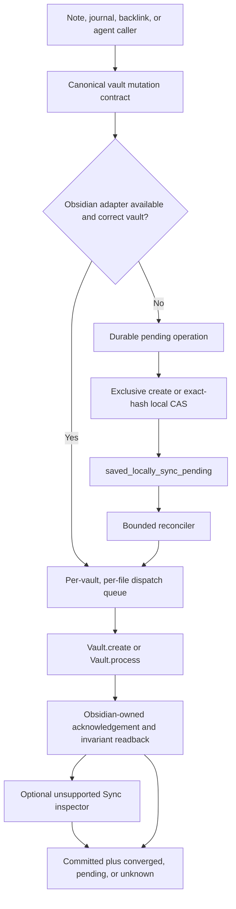
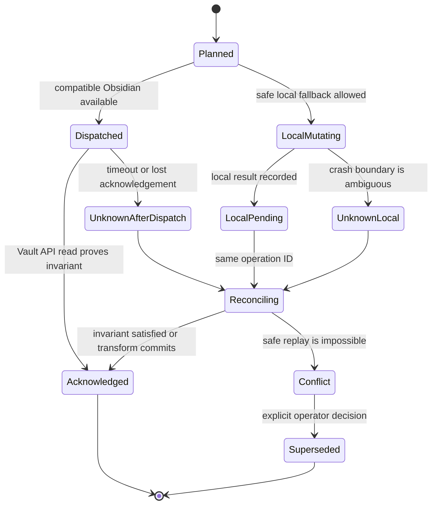

# Obsidian-Owned Vault Mutations - Plan

## Goal Capsule

- **Objective:** Make jarvOS route live Obsidian vault changes through one acknowledged mutation lifecycle so notes, journals, and backlinks cannot appear saved on disk while Obsidian Sync still tracks older content.
- **Authority:** Obsidian's `Vault` API owns live vault mutations. The filesystem is only a local durability layer when Obsidian is unavailable, and that state remains pending until reconciliation.
- **Execution profile:** Implement the portable lifecycle, tests, and documentation in public jarvOS. Keep personal vault configuration and live rollout evidence outside the public repository.
- **Stop conditions:** Stop before an existing authored file can be replaced without an exact guard; before a timeout can be retried as a new operation; before private Sync inspection becomes a correctness dependency; or before a caller can report synchronization from a disk-only write.
- **Tail ownership:** The implementer owns public code, migration coverage, deterministic tests, and safe diagnostics. The host operator owns deployment into the live OpenClaw environment and the final disposable-file Sync smoke.

---

## Product Contract

### Summary

jarvOS will treat Obsidian as the synchronization boundary for live vault content. A successful filesystem write alone will no longer produce an unqualified success result. When Obsidian is unavailable, jarvOS may save safely to disk, but it must persist a reconciliation operation and report that synchronization is pending.

This work also finishes the journal-backlink reliability story. Note creation and journal linking will use the same mutation lifecycle while keeping their outcomes separate, so a saved note can truthfully report a deferred backlink without hiding either result.

### Problem Frame

The current canonical note writer uses `writeFileSync`. Other maintenance and agent paths can also write authored Markdown directly. Those bytes reach disk, but the running Obsidian process may retain older content and Sync hashes. Obsidian can then report “Fully synced” while other devices continue to receive the older version.

The existing journal linker already demonstrates the safer mechanism with `app.vault.process`, but its transport is journal-specific, uses process-local acknowledgement tokens, and does not provide a generic offline reconciliation lifecycle. Deferred backlink recovery also remains a separate identity-safe queue that must be preserved.

### Actors

- A1. **Person using Obsidian:** Expects Mac, phone, and tablet to converge without losing edits made on another device.
- A2. **Agent creating or editing a note:** Needs a truthful terminal result and the same safety guarantees as the human-facing path.
- A3. **Backlink recovery worker:** Retries a missing journal link by note identity without duplicating links or overwriting newer journal text.
- A4. **Host operator:** Runs bounded reconciliation and can inspect local evidence without exposing it through public agent tools.
- A5. **Public jarvOS installer:** Receives portable behavior without Andrew-specific paths, vault names, or private Sync records.

### Requirements

**Mutation ownership and acknowledgement**

- R1. All in-scope authored Markdown mutations use one canonical vault mutation interface with normalized vault-relative paths, operation identities, and typed outcomes.
- R2. When a compatible Obsidian process is available, creates use `Vault.create` and latest-content edits use a synchronous pure transform through `Vault.process`; a full replacement is allowed only through an exact-byte hash guard and must never be the fallback for a failed transform.
- R3. A queued CLI request or changed disk hash is not acknowledgement. The lifecycle reports `committed` only after the Obsidian-owned operation completes and a readback proves the declared content invariant.
- R4. Same-file operations use a durable FIFO sequence keyed by vault instance and relative path. An `unknown_after_dispatch` or `conflict` entry blocks later operations until the same operation is reconciled or an operator records an explicit supersession.

**Offline durability and reconciliation**

- R5. Every live dispatch or offline fallback writes a durable `planned` operation before mutation. If Obsidian is unavailable, an authorized exclusive create or exact-hash local compare-and-swap may proceed and the caller receives `saved_locally_sync_pending`.
- R6. Durable records use stable operation IDs and include the target, operation kind, FIFO sequence, input guard, intended-result hash or operation-specific invariant, transform name/version, bounded replay payload, actor, timestamps, attempts, and opaque error class. A transform that cannot retain enough protected replay input is ineligible for offline fallback.
- R7. Reconciliation is bounded, idempotent, and ordered per file. It reapplies only a registered transform against current Obsidian content, accepts an already-satisfied invariant, and returns `conflict` instead of replacing divergent content.
- R8. Pending records leave the active queue only after Obsidian acknowledgement. Crash-consistent transitions cover `planned`, `local_mutating`, `local_applied`, `dispatched`, `unknown_after_dispatch`, `acknowledged`, and `conflict`; terminal audit and conflict evidence follow explicit retention and permission policies.

**Sync truth and public boundaries**

- R9. Local Obsidian acknowledgement and remote Sync convergence are separate states. If Sync is enabled, an optional read-only unsupported adapter may classify convergence as `converged`, `pending`, `diverged`, or `unknown` within at most 12 attempts and 180 seconds; two consecutive agreeing per-file samples are required for `converged`.
- R10. Private Sync-field access is isolated behind one capability-gated adapter with vault-identity checks, version/shape checks, a kill switch, and an `unknown` fallback. Its absence never changes local write correctness.
- R11. A versioned internal receipt carries trusted evidence, while a separate versioned public result exposes only stable statuses and bounded counts. Public output omits vault paths, content, hashes, operation IDs, private Sync fields, host identity, and timestamps.

**Writer migration and backlink continuity**

- R12. The canonical note writer, journal lifecycle and repair paths, journal normalizer/audit, session-thread writes, project authored pages, manual note maintenance, and agent-facing edit paths use the shared lifecycle or receive a documented non-authored classification.
- R13. User-visible Markdown inside a configured synced vault is mutation-owned even when generated. Hidden operational metadata and outputs outside the vault may continue to use direct filesystem writes.
- R14. Backlink creation and recovery call the shared lifecycle while preserving the existing note ID and relative-path identity checks, collision refusal, single-link semantics, and partial-success result.
- R15. Creating a note and linking it remain two independently truthful outcomes. A committed note plus a pending backlink is success-with-recovery, not an all-or-nothing rollback and not an unqualified complete result.

**Verification and operations**

- R16. Regression coverage reproduces the incident where disk bytes are newer than Obsidian's tracked content while Sync reports fully synced, and the system refuses to claim acknowledgement or convergence.
- R17. Tests prove create races, competing same-file transforms, concurrent mobile content, duplicate delivery, process restart, delayed post-timeout commit, adapter unavailability, wrong-vault detection, and offline-to-online reconciliation without lost updates.
- R18. Public documentation describes mutation ownership, result meanings, reconciliation, writer classification, unsupported Sync diagnostics, and the source-to-live rollout boundary without personal vault details.

### Key Flows

- F1. **Live note mutation**
  - **Trigger:** A2 creates or edits a managed note while Obsidian is available.
  - **Steps:** The caller submits a registered operation. The adapter verifies the vault, serializes same-file dispatch, invokes `Vault.create` or `Vault.process`, and reads back the invariant.
  - **Outcome:** The caller receives `committed` plus a separate Sync state, or a typed conflict/failure.
  - **Covers:** R1-R4, R9-R11.

- F2. **Offline save and later reconciliation**
  - **Trigger:** A2 writes while Obsidian is unavailable or incompatible.
  - **Steps:** The lifecycle records the operation, performs an exclusive create or exact-hash compare-and-swap, reports pending, then later submits the same operation ID through Obsidian against current content.
  - **Outcome:** The record becomes acknowledged, already satisfied, or conflicted without overwriting divergent content.
  - **Covers:** R5-R10.

- F3. **Note creation with journal backlink**
  - **Trigger:** A2 creates a durable note that should appear under the daily journal's Notes section.
  - **Steps:** The note mutation completes first. The journal linker runs an identity-safe transform through the same lifecycle. A failed link is retained in the existing backlink queue.
  - **Outcome:** Note and backlink states are both returned. Recovery later adds exactly one link to the correct note.
  - **Covers:** R12-R15.

- F4. **Bounded operator reconciliation and Sync diagnosis**
  - **Trigger:** A4 runs the reconciliation command after Obsidian reconnects.
  - **Steps:** The command processes a bounded batch, preserves per-file order, records acknowledgement, and optionally asks the unsupported adapter for read-only convergence evidence.
  - **Outcome:** Health reports acknowledged, Sync-pending, unknown, and conflict counts without silently retrying forever.
  - **Covers:** R7-R11, R17-R18.

### Acceptance Examples

- AE1. **Covers R2-R4.** Given an existing note and a mobile edit that arrives before the callback, when jarvOS appends content, then `Vault.process` receives the latest text and the final note contains both edits exactly once.
- AE2. **Covers R3, R16.** Given newer disk bytes, older Obsidian-tracked content, and a “Fully synced” UI state, when success is evaluated, then jarvOS returns unacknowledged or pending and never returns `committed` or `converged`.
- AE3. **Covers R5-R8.** Given Obsidian is unavailable, when an exact-hash note transform succeeds locally, then the durable operation exists before the response and remains pending until a later Obsidian-owned readback verifies the invariant.
- AE4. **Covers R4, R7-R8.** Given an Obsidian dispatch times out and commits after the timeout, when reconciliation runs, then it recognizes the same operation as already satisfied and does not append twice.
- AE5. **Covers R7-R8, R17.** Given a mobile edit changes an authored file after an offline local save, when reconciliation cannot prove an idempotent merge, then it reports `conflict`, blocks later same-file operations, performs no automated overwrite, and retains protected recovery evidence for operator review.
- AE6. **Covers R14-R15.** Given a note commits but its journal transform fails, when the caller receives the result, then the note is reported committed, the backlink is reported pending, and a later retry adds exactly one identity-correct link.
- AE7. **Covers R9-R11.** Given private Sync inspection is incompatible or disabled, when a local Obsidian mutation commits, then the caller receives `committed` with Sync `unknown`; no private evidence appears in the agent response.

### Success Criteria

- No in-scope authored Markdown writer can reach the configured vault through a raw unclassified write.
- Every mutating caller distinguishes filesystem durability, Obsidian acknowledgement, and optional Sync convergence.
- Pending operations survive restart and clear from the active queue only after acknowledgement.
- The incident regression and concurrency matrix pass deterministically.
- A live disposable-file smoke proves source-to-live deployment and Sync upload before the incident is declared resolved.

### Scope Boundaries

**In scope**

- Public jarvOS mutation lifecycle, Obsidian adapter, reconciliation ledger, caller migrations, tests, CLI/operator health, MCP-safe projections, and documentation.
- Authored Markdown in Notes, canonical dated Journals, Projects, and agent session-thread notes.
- Identity-safe journal backlink recovery using the shared lifecycle.
- An optional centralized adapter for unsupported private Sync evidence.

**Deferred follow-up**

- Automatic semantic three-way merging for arbitrary prose. This plan supports registered idempotent transforms and exact conflicts.
- Rich cross-device conflict-resolution UI.
- Replacing the running desktop Obsidian path with the official headless Sync client.

**Outside this product's identity**

- An arbitrary-path or arbitrary-code vault mutation MCP tool.
- Publishing personal vault paths, content, Sync records, operation ledgers, or rollout evidence.
- Treating timestamps, a UI “Fully synced” label, or one private hash as proof of remote consistency.
- Automatically overwriting a conflict or adopting legacy untracked raw-disk changes without operator review.

---

## Planning Contract

### Key Technical Decisions

- KTD1. **Generalize the existing Obsidian mutation seam into the storage adapter.** Keep a compatibility export for current journal callers while moving path validation, dispatch, acknowledgement, and readback into `adapters/obsidian`. This avoids a second transport and gives notes and journals one owner. Governs R1-R4.
- KTD2. **Use a durable registry of pure transforms as the default edit primitive.** Each versioned descriptor defines a bounded input schema, normalized replay payload, Node and Obsidian implementations, and an operation-specific invariant. Unknown or removed versions stop for manual resolution; whole-file replacement remains a separate exact-hash operation. Governs R2, R4, R6-R7.
- KTD3. **Persist intent before every mutation.** The active ledger is atomic, mode `0600`, outside authored vault paths, and authoritative across process restarts. It uses durable FIFO claims and fencing so an ambiguous or conflicted head cannot be overtaken. The existing process-global Obsidian result token remains only a fast path. Governs R4-R8.
- KTD4. **Model persistence, editor acknowledgement, and Sync as three states.** The canonical result envelope carries `persistence`, `obsidian`, and `sync` projections. Public callers receive stable status labels rather than evidence internals. Governs R3, R5, R9-R11.
- KTD5. **Keep unsupported Sync inspection optional and read-only.** Official Obsidian APIs expose no per-file remote hash or programmatic convergence contract. The adapter is default-off, capability-gated, and unable to convert an unacknowledged local write into success. Governs R9-R10.
- KTD6. **Preserve the backlink queue as a domain queue.** The general operation ledger records physical mutations; the backlink queue records the still-missing semantic relationship. A failed link before any journal change creates only a backlink item, and its retry calls the canonical lifecycle. Governs R14-R15.
- KTD7. **Classify every writer before migration.** Notes, journals, project pages, and session threads are authored. Generated wiki/index files are rebuildable, but any user-visible Markdown written inside the synced vault still uses the mutation interface. Only hidden metadata or output outside the vault may bypass it. Governs R12-R13.
- KTD8. **Land the portable work in jarvOS and verify the live deployment separately.** (session-settled: user-approved — chosen over treating this as a machine-only patch: the bug is a reusable jarvOS reliability defect while personal deployment evidence must remain private.) The public change owns code, tests, and generic docs. The private host owns its configured adapter and source-to-live attestation. Governs R18.
- KTD9. **Keep domain packages transport-independent.** Note and journal packages export pure operation factories and policies. The Obsidian adapter owns transport and storage, while a composition service used by bridge and agent entrypoints executes operations. Packages do not import adapters or bridge code; compatibility shims delegate in one direction and have removal criteria. Governs R1, R12.

### High-Level Technical Design





Sync observation is not part of the mutation state machine. It is an independent, time-varying attachment to an acknowledged receipt: `disabled`, `pending`, `converged`, `diverged`, or `unknown`.

### Operation and Result Contracts

The operation schema is versioned and local-only. It contains `schemaVersion`, `operationId`, `vaultId`, `vaultRelativePath`, `sequence`, `operationKind`, `expectedHash` or an absence assertion, `intendedHash` or an operation-specific invariant, `transformName`, `transformVersion`, protected replay input, `source`, `createdAt`, `attempts`, `status`, and `lastErrorClass`. Hashes are SHA-256 over exact UTF-8 bytes. A broad substring or existence check cannot prove `already_satisfied`.

The public result vocabulary is `committed`, `saved_locally_sync_pending`, `already_satisfied`, `conflict`, `unavailable`, and `failed`. An internal result may also use `unknown_after_dispatch`. Sync is projected separately as `disabled`, `converged`, `pending`, `diverged`, or `unknown`.

### Sequencing

1. Freeze the operation contract and writer classification with tests before migrating callers.
2. Extract and harden the Obsidian transport, then add the durable ledger and reconciler.
3. Migrate note, journal, backlink, maintenance, and agent paths in small slices while retaining compatibility exports.
4. Add optional Sync inspection only after local acknowledgement semantics are stable.
5. Complete deterministic regressions, public documentation, and a private source-to-live smoke.

### System-Wide Impact

- **Data lifecycle:** Mutation intent can outlive one process. Cleanup must distinguish active pending records from retained terminal audit evidence.
- **Dependency direction:** Packages define pure domain operations. Adapter and bridge layers execute them, and an import-boundary test prevents cycles.
- **Concurrency:** `Vault.process` protects one transform against concurrent file changes inside Obsidian. jarvOS also serializes separate CLI eval processes for the same file.
- **Agent parity:** Human CLI, MCP, note creation, session threads, and backlink recovery receive the same result contract.
- **Privacy:** Full content stays in the vault. Ledgers store hashes and transform metadata locally and public tools return only status projections.
- **Compatibility:** Existing journal creation-only rules, competing-writer checks, note identities, and backlink recovery remain specialized policies above the shared mutation mechanism.
- **Operations:** A local disk save can be useful while offline, but it is visible as pending until an operator or trusted host runs bounded reconciliation.

### Risks and Mitigations

| Risk | Mitigation |
| --- | --- |
| A CLI timeout hides a mutation that commits later. | Persist the operation ID, classify the result as ambiguous, and reconcile the same operation before any retry. |
| A late commit overtakes a newer same-file operation. | Use durable FIFO sequence and fencing; ambiguous and conflicted heads block later dispatch. |
| A crash lands between a file mutation and ledger update. | Use write-ahead states, durable file-and-directory commits, and restart recovery tests at every transition. |
| Two eval processes race on one file. | Serialize by vault and file, then test competing transforms in separate processes. |
| An offline replay overwrites mobile content. | Permit only idempotent latest-content transforms or an exact-hash guard; return `conflict` otherwise. |
| A replay payload or transform version is missing after an upgrade. | Quarantine the operation and require manual resolution; never substitute a newer transform version. |
| A create races with Sync or another caller. | Use `Vault.create` or exclusive local `wx`; accept a winner only when identity or intended bytes match. |
| Private Sync internals change after an Obsidian update. | Keep one read-only default-off adapter with capability checks, a kill switch, and `unknown` fallback. |
| The migration misses an ad hoc writer. | Publish a writer inventory and add a guard test that flags unclassified raw writes to in-scope vault Markdown. |
| The backlink and mutation ledgers duplicate work. | Keep semantic backlink intent separate from physical mutation state and test one-record ownership for each failure stage. |
| Public code leaks private vault evidence. | Use repo-relative examples, safe result DTOs, package scans, and private live-smoke records outside the public tree. |
| A fallback path is swapped through a symlink after validation. | Reject symlinked fallback targets and parents, revalidate at mutation time, and test parent and target swap attacks. |

### Sources and Research

- `modules/jarvos-secondbrain/bridge/provenance/src/obsidian-mutation.js` provides the current `Vault.process` transport and readback pattern.
- `modules/jarvos-secondbrain/packages/jarvos-secondbrain-notes/src/write-to-vault.js` contains the direct note write that reproduced the class of failure.
- `modules/jarvos-secondbrain/packages/jarvos-secondbrain-journal/src/journal-lifecycle.js` provides exclusive create and local compare-and-swap patterns for the offline backend.
- `docs/plans/2026-07-29-001-fix-journal-backlink-recovery-plan.md` defines identity-safe backlink recovery that this plan must preserve.
- `docs/plans/2026-08-02-002-fix-public-journal-reliability-landing-plan.md` defines the public-code versus private-rollout boundary.
- [Obsidian Vault guide](https://docs.obsidian.md/Plugins/Vault) recommends `Vault.process` for read-modify-write operations against current content.
- [Obsidian API declarations](https://github.com/obsidianmd/obsidian-api/blob/master/obsidian.d.ts) define `Vault.create`, `Vault.modify`, `Vault.process`, and vault events, but no public per-file Sync convergence API.
- [Obsidian CLI documentation](https://obsidian.md/help/cli) defines the running-app and installer requirements for desktop CLI evaluation.
- [Obsidian Sync status documentation](https://obsidian.md/help/Obsidian%2BSync/Status%2Bicon%2Band%2Bmessages) documents human-visible Sync status but not a programmatic convergence contract.

---

## Implementation Units

### U1. Define the lifecycle contract, transform registry, and writer ownership

- **Goal:** Establish one executable contract and prevent an incomplete migration.
- **Requirements:** R1, R6, R11-R13.
- **Dependencies:** None.
- **Files:** `modules/jarvos-secondbrain/src/vault-mutation-service.js`, `modules/jarvos-secondbrain/src/vault-transform-registry.js`, `modules/jarvos-secondbrain/adapters/obsidian/src/vault-mutation-contract.js`, `modules/jarvos-secondbrain/tests/vault-mutation-contract.test.js`, `modules/jarvos-secondbrain/tests/vault-transform-registry.test.js`, `docs/architecture/secondbrain-external-integrations.md`, `tests/public-journal-boundary.test.js`.
- **Approach:**
  1. Define operation, receipt, status, path-containment, identity, hashing, and public-projection types as pure functions.
  2. Define the versioned transform registry, replay-payload schema, operation-specific invariant, and unknown-version failure policy.
  3. Produce a checked writer inventory that maps every discovered writer to its classification, migration unit, and any narrow source-guard exception.
  4. Add import and source guards that reject package-to-adapter/bridge dependencies and unclassified raw filesystem mutation.
  5. Preserve the existing journal creation and note identity rules as policy hooks, not generic defaults.
- **Test scenarios:**
  - Traversal, symlink escape, absolute path, non-Markdown target, and wrong note identity fail before any mutation.
  - Public projections omit content, paths, hashes, timestamps, records, private adapter evidence, and host identity.
  - The writer inventory accounts for note, journal, backlink, project, session-thread, maintenance, normalizer, audit, wiki, and index producers.
  - A fixture containing a new unclassified `writeFileSync` under an in-scope writer fails the source guard.
  - An unknown transform version or invalid replay payload quarantines the operation without mutation.
  - A package import of `bridge/**` or `adapters/**` fails the import-boundary test unless it is a named temporary shim with removal criteria.
- **Verification:** `node --test modules/jarvos-secondbrain/tests/vault-mutation-contract.test.js modules/jarvos-secondbrain/tests/vault-transform-registry.test.js tests/public-journal-boundary.test.js`.

### U2. Build the acknowledged Obsidian mutation adapter

- **Goal:** Generalize the current journal-only transport into a safe create and transform adapter.
- **Requirements:** R1-R4, R10.
- **Dependencies:** U1.
- **Files:** `modules/jarvos-secondbrain/adapters/obsidian/src/vault-mutation-adapter.js`, `modules/jarvos-secondbrain/adapters/obsidian/src/vault-mutation-ledger.js`, `modules/jarvos-secondbrain/bridge/provenance/src/obsidian-mutation.js`, `modules/jarvos-secondbrain/tests/vault-mutation-adapter.test.js`, `modules/jarvos-secondbrain/tests/vault-mutation-ledger.test.js`, `modules/jarvos-secondbrain/tests/obsidian-live-smoke.test.js`, `modules/jarvos-secondbrain/scripts/obsidian-live-smoke.js`.
- **Approach:**
  1. Persist the operation and acquire its durable FIFO claim before dispatch, then move vault-root resolution, path validation, CLI preflight, vault identity, request serialization, and result correlation into the adapter.
  2. Use `Vault.create` for absence-asserted creates and `Vault.process` for registered transforms; expose guarded replacement only as a distinct exact-hash operation.
  3. Read the result through `app.vault.read` in the same Obsidian-owned evaluation and return only a bounded invariant verdict; a Node disk read cannot acknowledge the mutation.
  4. Serialize same-file operations through ledger-backed claims with lease ownership and fencing while retaining `Vault.process` as the in-app concurrency boundary.
  5. Persist acknowledgement evidence before deleting the Obsidian-side token. Keep the old journal export as a one-way compatibility wrapper.
- **Test scenarios:**
  - A create collision accepts identical managed identity/content and refuses divergent content.
  - A mobile/editor update that precedes the callback survives the transform.
  - Competing separate-process transforms both appear exactly once.
  - CLI missing, app stopped, setting disabled, installer unsupported, wrong vault, and incompatible API return distinct capability states.
  - A queued response without a terminal token never becomes `committed`.
  - Correct Node-visible disk bytes plus a stale or mismatched `app.vault.read` result remain unacknowledged.
  - A process killed after queueing but before token polling resumes the original operation ID and cannot create a second semantic mutation.
  - A long-running claim, lost owner, and ambiguous timeout cannot be overtaken by a later same-file operation.
- **Verification:** `node --test modules/jarvos-secondbrain/tests/vault-mutation-adapter.test.js modules/jarvos-secondbrain/tests/vault-mutation-ledger.test.js modules/jarvos-secondbrain/tests/obsidian-live-smoke.test.js`.

### U3. Add the durable offline ledger and bounded reconciler

- **Goal:** Make disk-only saves recoverable, idempotent, and truthful across restarts and timeouts.
- **Requirements:** R4-R8.
- **Dependencies:** U1-U2.
- **Files:** `modules/jarvos-secondbrain/adapters/obsidian/src/vault-mutation-ledger.js`, `modules/jarvos-secondbrain/adapters/obsidian/src/vault-mutation-reconciler.js`, `modules/jarvos-secondbrain/scripts/vault-mutation-reconcile.js`, `modules/jarvos-secondbrain/tests/vault-mutation-ledger.test.js`, `modules/jarvos-secondbrain/tests/vault-mutation-reconciler.test.js`, `package.json`.
- **Approach:**
  1. Make every state transition crash-consistent, validate records on read, quarantine malformed records, and retain terminal audit and conflict evidence under explicit permissions and retention.
  2. For authorized offline writes, move through write-ahead states, then use exclusive create or exact-hash compare-and-swap with mutation-time root and symlink revalidation.
  3. Reconcile a bounded batch and time budget with durable file order, stable operation IDs, attempt history, and head-of-line blocking for ambiguity or conflict.
  4. Treat only the registered operation-specific invariant as already satisfied. Replay the exact retained transform version and payload; otherwise stop without mutation.
  5. Expose read-only health and an explicit reconciliation command; operator abandonment or supersession is auditable and no unbounded startup writer is created.
- **Test scenarios:**
  - Process crashes before local mutation, after local mutation, after Obsidian dispatch, and after acknowledgement persistence recover without duplicate changes.
  - A delayed post-timeout commit becomes already satisfied when reconciled with the same operation ID.
  - Duplicate delivery, out-of-order delivery, and restart recovery preserve per-file order and exactly-once semantic outcomes.
  - A changed expected hash refuses local replacement and records a conflict.
  - Malformed or permission-unsafe records are quarantined and reported without mutation.
  - Later same-file operations remain blocked behind an ambiguous or conflicted predecessor.
  - Parent or target symlink swaps cannot change bytes outside the configured root.
  - Restart with a retained replay payload applies the intended semantic change once; missing payload stops without mutation.
- **Verification:** `node --test modules/jarvos-secondbrain/tests/vault-mutation-ledger.test.js modules/jarvos-secondbrain/tests/vault-mutation-reconciler.test.js`.

### U4. Migrate authored note, journal, backlink, and maintenance paths

- **Goal:** Remove raw-write bypasses from every in-scope caller while preserving specialized behavior.
- **Requirements:** R12-R15.
- **Dependencies:** U1-U3.
- **Files:** `modules/jarvos-secondbrain/packages/jarvos-secondbrain-notes/src/write-to-vault.js`, `modules/jarvos-secondbrain/packages/jarvos-secondbrain-notes/src/manual-notes-maintenance.js`, `modules/jarvos-secondbrain/packages/jarvos-secondbrain-notes/src/lint-frontmatter.js`, `modules/jarvos-secondbrain/packages/jarvos-secondbrain-journal/src/journal-lifecycle.js`, `modules/jarvos-secondbrain/packages/jarvos-secondbrain-journal/src/journal-maintenance.js`, `modules/jarvos-secondbrain/bridge/provenance/src/link-to-journal.js`, `modules/jarvos-secondbrain/bridge/provenance/src/notes-section-normalizer.js`, `modules/jarvos-secondbrain/bridge/provenance/src/journal-note-audit.js`, `modules/jarvos-secondbrain/packages/jarvos-secondbrain-projects/src/projects.js`, `modules/jarvos-secondbrain/adapters/obsidian/src/vault-storage-adapter.js`, `modules/jarvos-secondbrain/tests/vault-storage-adapter-journal.test.js`, `modules/jarvos-secondbrain/tests/link-to-journal.test.js`, `modules/jarvos-secondbrain/tests/journal-backlink-recovery.test.js`, `modules/jarvos-secondbrain/tests/journal-lifecycle.test.js`.
- **Approach:**
  1. Convert note creation and updates into registered create or identity-preserving transforms over current content.
  2. Keep current-day journal create-only and competing-writer policies above the shared adapter; convert repairs and Notes-section edits into guarded transforms.
  3. Route backlink creation and recovery through the shared adapter while retaining the existing semantic queue and identity collision checks.
  4. Convert maintenance and project-page mutations in the writer inventory. Mark rebuildable writers explicitly and route any user-visible in-vault output through the adapter.
  5. Remove obsolete direct-write branches only after the checked inventory assigns every writer and compatibility and recovery tests pass.
- **Test scenarios:**
  - A new note commits through `Vault.create`; an existing note update preserves current frontmatter and concurrent prose.
  - An unavailable Obsidian process creates a pending note operation and a separate pending backlink only when the journal relationship is still absent.
  - Backlink retries locate moved notes by `jarvos_note_id`, reject identity collisions, and add one canonical link.
  - Existing journal creation does not rewrite authored bytes, while an absent journal uses the shared create owner.
  - Normalizer, audit repair, frontmatter maintenance, project pages, and generated in-vault output cannot bypass the adapter.
- **Verification:** `node --test modules/jarvos-secondbrain/tests/journal-lifecycle.test.js modules/jarvos-secondbrain/tests/link-to-journal.test.js modules/jarvos-secondbrain/tests/journal-backlink-recovery.test.js modules/jarvos-secondbrain/tests/vault-storage-adapter-journal.test.js modules/jarvos-secondbrain/tests/projects.test.js`.

### U5. Give agent callers truthful, privacy-safe outcomes

- **Goal:** Make agent and CLI responses distinguish note persistence, backlink state, Obsidian acknowledgement, and Sync evidence.
- **Requirements:** R3, R9-R12, R15.
- **Dependencies:** U1-U4.
- **Files:** `modules/jarvos-agent-context/src/index.js`, `modules/jarvos-agent-context/scripts/jarvos-mcp.js`, `modules/jarvos-agent-context/test/agent-context.test.js`, `modules/jarvos-secondbrain/bridge/provenance/src/note-journal-contract.js`, `modules/jarvos-secondbrain/tests/personality-note-journal-contract.test.js`, `modules/jarvos-agent-context/README.md`.
- **Approach:**
  1. Return separate note, backlink, and Sync projections through the canonical note-journal contract.
  2. Enforce the boundary between the versioned trusted internal receipt and the versioned public DTO in one serializer used by every agent surface.
  3. Preserve bounded MCP verbs. Do not expose arbitrary paths, arbitrary transforms, reconciliation details, or operator conflict resolution.
  4. Map legacy CLI fields and exit codes to the new result vocabulary during a documented compatibility window and remove any `written: true` projection that can describe a pending disk-only save as complete.
  5. Add read-only pending/conflict counts to the existing health surface without exposing record contents.
- **Test scenarios:**
  - A committed note with a deferred backlink is returned as two distinct states.
  - A local disk save is returned as `saved_locally_sync_pending`, not `committed` or `fully synced`.
  - A committed Obsidian write with unavailable Sync inspection returns Sync `unknown` without downgrading local acknowledgement.
  - MCP outputs omit paths, hashes, content, private fields, operation IDs, and timestamps for every outcome.
  - Every terminal internal receipt, including deferred backlink and ambiguous dispatch, serializes through an allowlisted public DTO with defined legacy CLI exit behavior.
  - Session-thread appends use a registered transform and preserve concurrent note content.
- **Verification:** `node --test modules/jarvos-agent-context/test/agent-context.test.js modules/jarvos-secondbrain/tests/personality-note-journal-contract.test.js`.

### U6. Add optional Sync convergence diagnostics

- **Goal:** Detect the incident's tracked-hash mismatch without coupling correctness to unsupported internals.
- **Requirements:** R9-R10, R16-R17.
- **Dependencies:** U2-U3.
- **Files:** `modules/jarvos-secondbrain/adapters/obsidian/src/obsidian-sync-inspector.js`, `modules/jarvos-secondbrain/tests/obsidian-sync-inspector.test.js`, `modules/jarvos-secondbrain/scripts/vault-mutation-health.js`.
- **Approach:**
  1. Define a small read-only inspector interface over vault identity, expected local hash, local tracked hash, and remote tracked hash.
  2. Isolate all private-field discovery and shape parsing in one module with explicit capability checks and a kill switch.
  3. Bound inspection to at most 12 attempts and 180 seconds. Require two consecutive agreeing samples; return `unknown` when Sync is disabled, private shapes are incompatible, or evidence remains incomplete.
  4. Never infer convergence from timestamps or the global UI label. Require the expected bytes hash, local tracked hash, and remote tracked hash to agree before returning `converged`.
- **Test scenarios:**
  - The incident fixture has newer disk content, stale local/remote tracked hashes, and a fully-synced global state; it returns `diverged` and blocks a convergence claim.
  - Matching local content, tracked local hash, and tracked remote hash returns `converged`.
  - One missing or incompatible field returns `unknown` without throwing or changing the mutation acknowledgement.
  - A vault identity mismatch disables inspection and produces no mutation.
  - The time and attempt budgets stop polling deterministically.
- **Verification:** `node --test modules/jarvos-secondbrain/tests/obsidian-sync-inspector.test.js modules/jarvos-secondbrain/tests/vault-mutation-reconciler.test.js`.

### U7. Document, regression-test, and deploy the complete path

- **Goal:** Prove the public implementation and the live source-to-Sync path without exposing private data.
- **Requirements:** R16-R18.
- **Dependencies:** U1-U6.
- **Files:** `docs/journal-install-contract.md`, `docs/architecture/secondbrain-external-integrations.md`, `modules/jarvos-secondbrain/README.md`, `modules/jarvos-secondbrain/packages/jarvos-secondbrain-notes/README.md`, `modules/jarvos-secondbrain/packages/jarvos-secondbrain-journal/README.md`, `modules/jarvos-secondbrain/scripts/obsidian-live-smoke.js`, `modules/jarvos-secondbrain/tests/obsidian-live-smoke.test.js`, `tests/public-journal-boundary.test.js`, `CHANGELOG.md`.
- **Approach:**
  1. Document the state model, safe fallback, explicit reconciliation, writer ownership, unsupported Sync inspector, and operator conflict behavior.
  2. Add the full deterministic incident and concurrency matrix to the repository suite and record the fix under `[Unreleased]`.
  3. Create a private source-to-live attestation with the clean candidate commit, gate output digests, candidate artifact manifest hash, loaded runtime manifest hash, and equality verdict before any vault mutation.
  4. Capture baseline counts for pending, ambiguous, conflict, quarantined, malformed, and retained-terminal records. Stop if the baseline cannot be established.
  5. Run a live smoke in a dedicated smoke-only directory. Prove the nonce-marked fixture absent through Obsidian, create it once, optionally apply one registered transform, verify acknowledgement and bounded convergence, then delete it through an exact-identity-guarded Obsidian operation and verify the Sync tombstone.
  6. Compare post-smoke health with the baseline. No unsafe count may increase, active counts must return to baseline, and any expected terminal-audit delta must be declared before the smoke.
  7. Run read-only health against the two incident paths. If a legacy untracked mismatch remains, stop for operator-selected reconciliation instead of automatically adopting either version.
- **Test scenarios:**
  - The complete repository suite and public-boundary scan pass without private paths or evidence.
  - A disposable fixture produces exactly one create acknowledgement and event, a matching readback hash, optional one-time transform, and a guarded deletion acknowledgement.
  - An offline disposable transform creates a pending record, survives restart, reconciles through Obsidian, and leaves no active pending item.
  - A simulated mobile edit and agent edit both survive the registered latest-content transform.
  - The deployed runtime revision matches the tested source revision before the live incident is declared resolved.
  - A missing fingerprint, dirty candidate, gate failure, ambiguous dispatch, duplicate event, hash mismatch, unsafe health delta, or non-converged Sync state stops the resolved-incident claim.
- **Verification:** `npm test`; `npm run release:check:candidate`; `npm --prefix modules/jarvos-secondbrain run test:obsidian-live` on the trusted host with the explicit live-smoke gate enabled.

---

## Verification Contract

### Focused deterministic gates

```bash
node --test modules/jarvos-secondbrain/tests/vault-mutation-contract.test.js
node --test modules/jarvos-secondbrain/tests/vault-transform-registry.test.js
node --test modules/jarvos-secondbrain/tests/vault-mutation-adapter.test.js
node --test modules/jarvos-secondbrain/tests/vault-mutation-ledger.test.js
node --test modules/jarvos-secondbrain/tests/vault-mutation-reconciler.test.js
node --test modules/jarvos-secondbrain/tests/obsidian-sync-inspector.test.js
node --test modules/jarvos-secondbrain/tests/link-to-journal.test.js modules/jarvos-secondbrain/tests/journal-backlink-recovery.test.js
node --test modules/jarvos-agent-context/test/agent-context.test.js modules/jarvos-secondbrain/tests/personality-note-journal-contract.test.js
```

### Repository gates

```bash
npm test
npm run release:check:candidate
```

### Behavioral quality gates

- The incident fixture must fail if a disk-only change is projected as `committed` or `converged`.
- The concurrency suite must preserve both sides of a latest-content transform and reject an unsafe full replacement.
- The crash matrix must show no duplicate semantic mutation for the same operation ID.
- The source guard must account for every direct write that can target user-visible Markdown inside the configured vault.
- Public projections and packaged files must pass privacy scans for personal paths, content, hashes, operation records, and private Sync-field names outside the isolated inspector.

### Live gate

The live smoke is opt-in and runs only on the trusted host after deterministic gates pass and source-to-live manifests match. It uses a nonce-marked disposable file, not an authored note or journal. One create must produce one correlated Obsidian acknowledgement and matching `app.vault.read` hash. Sync upload is proven only when two consecutive samples within 12 attempts and 180 seconds show the expected bytes hash, local tracked hash, and remote tracked hash agree; `unknown`, `pending`, `diverged`, wrong-vault, or expired evidence proves only local acknowledgement. Cleanup uses an Obsidian-owned deletion guarded by the exact smoke path, nonce, and expected hash, followed by absence readback and bounded Sync deletion evidence. A failure leaves the fixture and private evidence intact for operator review.

The private rollout record is mode `0600` and outside the repository. It retains candidate/runtime fingerprints, gate exit statuses and output digests, opaque smoke identity, declared and readback hashes, event count, convergence samples, pre/post health counts, cleanup state, and the final go/no-go reason for the host's configured incident-retention period.

| Incident-path observation | Disposition |
| --- | --- |
| Correct vault plus matching expected, local tracked, and remote tracked hashes | Read-only healthy; the path may support the resolved claim. |
| `pending` or `unknown` | Keep for investigation; do not claim Sync resolution. |
| `diverged`, `conflict`, malformed/quarantined evidence, or wrong vault | Stop for operator-selected legacy reconciliation. |

Deployment rollback and content recovery are separate. Before the first live mutation, a failed deployment may roll back through the existing source-to-live process and must re-prove the runtime manifest. After any fixture mutation, record its state before rolling code back; code rollback never claims to undo synchronized content.

---

## Definition of Done

- R1-R18 have deterministic coverage, and each implementation unit's verification command passes.
- The canonical note writer, journal lifecycle, backlink recovery, maintenance writers, project pages, and agent/session paths use the shared lifecycle or have an explicit tested non-authored classification.
- No disk-only save is reported as Obsidian-acknowledged or remotely converged.
- Offline writes persist a valid pending operation before their response and clear from the active queue only after Obsidian acknowledgement.
- Concurrent mobile/editor content survives every registered transform; unsafe divergence returns conflict without overwrite.
- The Sync inspector is optional, read-only, isolated, capability-gated, kill-switchable, and unable to alter local correctness.
- The note hyperlink regression proves a committed note plus deferred backlink heals to exactly one identity-correct journal link.
- Public documentation and `[Unreleased]` changelog describe the behavior without personal configuration or rollout evidence.
- The complete repository gates pass on a clean implementation branch based on current public main.
- The tested revision is deployed through the private source-to-live path, and a disposable live smoke proves Obsidian acknowledgement and Sync upload.
- Candidate and runtime manifests match, private pre/post health counts reconcile, and the live fixture is deleted through Obsidian with bounded tombstone evidence.
- The two incident paths are read-only healthy or explicitly left for operator-selected legacy reconciliation.
- Abandoned experiments, compatibility shims past their stated window, disposable live fixtures, and stale pending test records are removed before completion.
