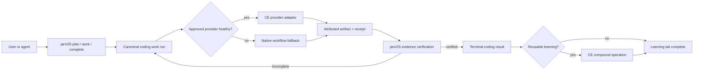
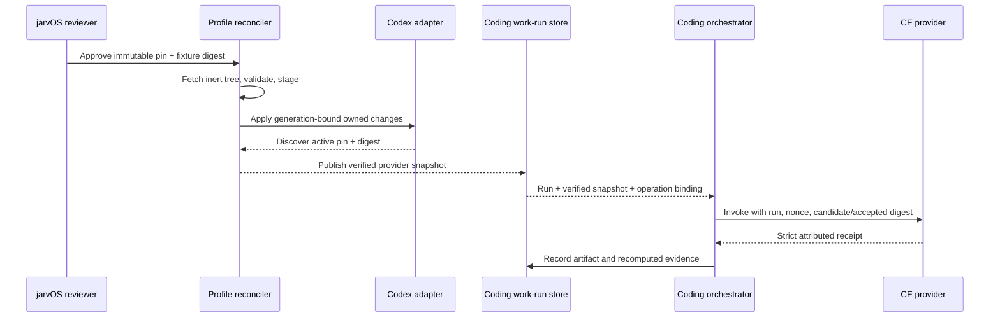

# Managed Compound Engineering Workflow Provider

## Goal Capsule

- **Objective:** Make Compound Engineering (CE) the default managed workflow provider for `jarvOS-coding`, so ordinary requests such as “plan” and “work” receive CE's planning and execution discipline while jarvOS retains the public workflow, work-run, evidence, and approval contract.
- **Authority:** jarvOS owns user-facing verbs, work identity, branch/worktree ownership, completion evidence, approvals, fallback, and rollout. CE owns the implementation of its `ce-plan`, `ce-work`, and `ce-compound` skills but never becomes the public controller or source of completion truth.
- **Execution profile:** Add a versioned provider contract and approved pin, extend managed skill installation and doctor surfaces, integrate CE artifacts into the coding lifecycle, and prove Codex conformance before enabling other harnesses.
- **Stop conditions:** Stop rather than activate an unpinned or digest-mismatched provider, overwrite unknown or locally modified harness state, grant CE branch/completion authority, or claim a harness is supported without a harmless discovery and workflow-conformance proof.
- **Tail ownership:** The implementer owns source, fixtures, docs, deterministic tests, and Codex conformance. A jarvOS release reviewer approves new upstream pins. The host operator owns local credentials, harness installation approval where required, and merge/release actions.

---

## Product Contract

### Summary

`jarvOS-coding` will expose one provider-neutral workflow experience. When the approved CE provider is healthy for the active harness, jarvOS routes planning to `ce-plan`, implementation to `ce-work`, and eligible post-verification learning capture to `ce-compound`. Users can continue to ask naturally for a plan or for work without learning CE terminology.

CE will be installed and maintained as managed host workflow software, not as an `@jarvos/coding` JavaScript dependency. jarvOS will pin the reviewed upstream artifact, verify provenance and harness compatibility, report health through doctor, and fall back to the existing jarvOS workflow when CE is unavailable or invalid. Update discovery may be automatic, but only a pin approved in jarvOS source may be activated automatically on user machines.

### Problem Frame

`@jarvos/skills` currently bundles `workflow-execution`, whose generic loop covers tracking, planning, execution, verification, and closeout. It does not invoke `ce-plan`, `ce-work`, or `ce-compound`. `@jarvos/coding` similarly has no declared CE dependency or provider route, even though many jarvOS plans are produced by CE and the strongest local engineering workflow already relies on it in practice.

This creates a product gap: experienced local setups receive a more capable workflow than a fresh jarvOS-coding installation, and the “compound” part only happens when someone remembers to invoke it separately. Directly exposing CE as the product boundary would solve installation but create a second controller, leak provider vocabulary into the UX, and weaken jarvOS's evidence-over-assertion model. Following upstream `main` would also allow workflow behavior to change without a jarvOS compatibility proof.

### Actors

- A1. **Coding user:** asks jarvOS to plan, execute, or finish work using ordinary language and expects consistent behavior across supported harnesses.
- A2. **jarvOS coding workflow authority:** owns the work run, selected recipe, branch/worktree, approvals, evidence evaluation, fallback, and terminal disposition.
- A3. **Compound Engineering provider:** performs bounded planning, implementation, and learning-capture operations and returns attributed artifacts and receipts.
- A4. **Harness adapter:** discovers, installs, invokes, and verifies the approved provider through the harness's supported plugin or skill surface.
- A5. **jarvOS release reviewer:** reviews an upstream CE candidate and approves the immutable pin and compatibility evidence that may ship to users.

### Requirements

- R1. jarvOS must expose provider-neutral `plan`, `work`, and completion behavior; users must not need CE names or commands to receive the default coding workflow.
- R2. A versioned managed-workflow-provider contract must define provider identity, operation, approved source revision, artifact digest, harness adapter identity/version, bounded input, attributed output, and explicit provider status.
- R3. jarvOS must remain the sole authority for work-run identity, issue/tracker linkage, branch/worktree selection, approvals, submission-gate evidence, and terminal completion. CE output or checkpoints may be attached as evidence but cannot satisfy those authorities by themselves.
- R4. The CE implementation must map provider operations to `ce-plan`, `ce-work`, and `ce-compound` without making CE a runtime package dependency of `@jarvos/coding` or vendoring its full skill corpus into jarvOS.
- R5. The default coding profile must install or reconcile the approved CE provider when the active harness supports managed CE installation. Installation must preserve unrelated configuration and unknown, locally modified, incompatible, or conflicting targets.
- R6. Provider activation must require an immutable jarvOS-approved upstream reference and matching digest, supported harness adapter, successful discovery proof, and compatible provider contract version. A moving branch reference is never activation evidence.
- R7. jarvOS may automatically discover and stage an upstream CE update, but activation requires a new pin and compatibility evidence approved through the jarvOS release/review path. Candidate discovery must create or update one durable review item and report approved-pin age plus candidate age so staleness is visible. Once that approved pin ships, normal jarvOS update may reconcile it automatically on user machines.
- R8. Doctor must distinguish `healthy`, `not-installed`, `degraded`, `incompatible`, `local-modified`, and `unsupported` provider states, report the active/approved versions without exposing private paths or configuration, and provide a bounded recovery action.
- R9. Missing, invalid, incompatible, or failed CE must preserve the existing work run and route through the declared native jarvOS workflow fallback. Fallback must not create a second plan, branch, worktree, or completion claim.
- R10. `ce-compound` may run only after jarvOS has independently verified the work outcome and a learning-eligibility gate identifies a reusable root cause, architecture constraint, failed approach, operational lesson, or project vocabulary term.
- R11. Ineligible, declined, unavailable, or failed compounding must remain a visible non-terminal learning outcome and must not downgrade or rewrite the already verified coding result.
- R12. The public provider contract must cover every jarvOS coding harness, but each harness remains `unsupported` until its native install/invocation surface, discovery proof, configuration preservation, and fallback behavior pass conformance tests. Codex is the first activation target.
- R13. Human CLI and agent-triggered entry points must resolve the same work run, provider pin, branch/worktree, approval state, and final evidence for an equivalent request.
- R14. Public documentation must explain the jarvOS workflow experience, managed-provider health, update posture, and recovery behavior while acknowledging CE attribution without requiring users to operate CE directly.
- R15. A provider-produced plan remains an untrusted draft until jarvOS validates its provider-independent implementation packet and records the immutable revision digest against the canonical work run under the configured approval policy. Attended planning presents the validated draft for acceptance; unattended acceptance is allowed only when the work policy explicitly permits it and cannot bypass review or submission gates. `work` must consume that accepted revision or stop on a mismatch.
- R16. Recovery behavior must distinguish failure before plan persistence, after an accepted plan but before edits, during potentially partial edits, and after a pull request exists. Every path must preserve validated pointers and re-evaluate current evidence.
- R17. `@jarvos/coding` must own a durable, concurrency-safe work-run store for accepted plan revisions, provider snapshots, artifact references, route events, and recovery state. Thin session checkpoints remain reattachment hints, never this authority.
- R18. Provider profile reconciliation and coding-work invocation must be separate mutation planes with distinct resource scopes, fences, receipts, and verification. Invocation and doctor cannot install, update, activate, disable, or repair CE.
- R19. Provider receipts must use strict internal and public-projection schemas. Unknown or authority-shaped fields are rejection conditions; public projections use opaque artifact references and cannot expose local paths or private adapter extensions. Provider artifacts are private by default, access-controlled through the canonical work run, governed by explicit retention/deletion rules, and screened for credentials, private paths, and other sensitive content before public projection or durable learning publication.
- R20. Provider acquisition and invocation must be non-shell, manifest-selected, and confined: upstream content is fetched without executing it, staged outside active harness discovery paths, validated against an allowlisted tree, and invoked only with canonical jarvOS work context and an allowlisted environment. Each harness adapter must enforce the smallest available capability set: worktree-scoped writes, no credential/profile/config access, and default-denied network or privileged tools unless an operation declares and the adapter approves that capability.

### Key Decisions

1. **CE is the default managed workflow provider, not a JavaScript dependency.** This keeps host-installed skills behind the correct packaging boundary. Governs R2, R4-R8.
2. **jarvOS owns the public workflow and completion contract.** (session-settled: user-directed — chosen over CE-branded or CE-led public control: the value is the workflow experience, not the provider vocabulary.) Governs R1-R3, R9, R13-R14.
3. **Compounding is selective and post-verification.** (session-settled: user-directed — chosen over running learning capture after every change: durable knowledge must remain high-signal.) Governs R10-R11.
4. **Support is contract-wide and activation is proof-gated per harness.** (session-settled: user-approved — chosen over a Codex-only product contract: Codex-first implementation must not hard-code a single-harness architecture.) Governs R5-R6, R8, R12-R13.
5. **Updates are automatically reconciled only after jarvOS approves the pin.** This separates upstream discovery from trusted activation while preserving a low-maintenance user experience. Governs R6-R8.
6. **Provider reconciliation and coding invocation are separate authorities.** Machine/profile mutation cannot borrow a coding work-run fence, and coding invocation receives only a verified provider snapshot. Governs R18, R20.

### Key Flows

- F1. **Natural planning:** A1 asks to plan. A2 resolves the existing work subject and provider health. A3 produces a CE plan artifact when healthy; otherwise A2 uses the native workflow. The canonical work run records the route and artifact digest.
- F2. **Execution and verification:** A1 asks to work. A2 supplies the authoritative work packet and branch/worktree. A3 executes through `ce-work`, but A2 independently evaluates tests, review, PR, and completion evidence before accepting a terminal result.
- F3. **Selective learning capture:** After verification, A2 evaluates learning eligibility. An eligible result invokes `ce-compound` once for one learning; skipped or failed capture is recorded separately from the verified work result.
- F4. **Managed installation/update:** A4 inspects the approved provider manifest and local harness state, produces a generation-bound plan, then applies only unchanged reviewed actions. New upstream versions remain candidates until A5 approves a new jarvOS pin.
- F5. **Degradation and recovery:** If CE is missing, incompatible, modified, or fails during a run, A2 preserves identity and evidence, records the provider failure, and continues through the declared fallback without duplicating side effects.

### Acceptance Examples

- AE1. Given a healthy approved Codex installation, when a user says “plan this,” jarvOS invokes CE planning behind the jarvOS workflow, returns the canonical plan path, and records provider/version/digest without requiring the user to name CE.
- AE2. Given CE is absent on a supported harness, when the user asks to work, jarvOS reports a degraded provider and continues the same work run through the native workflow without creating another branch or worktree.
- AE3. Given CE returns a successful `ce-work` result but required submission evidence is missing, jarvOS keeps the run incomplete and names the missing evidence.
- AE4. Given verified work exposed a reusable architectural constraint, when the learning gate passes, jarvOS invokes `ce-compound` once and records the resulting solution artifact separately from completion evidence.
- AE5. Given a routine cosmetic change, when work verifies successfully, jarvOS records `not-eligible` for compounding and closes the coding run normally.
- AE6. Given upstream publishes a new CE release, automatic discovery may report and stage it, but the active pin remains unchanged until a reviewed jarvOS manifest update supplies matching compatibility evidence.
- AE7. Given the target CE skill or harness configuration was locally modified after inspection, apply preserves it, reports `local-modified` or `conflict`, and leaves the current provider/fallback state intact.
- AE8. Given an unproved harness adapter, doctor reports `unsupported`; the user still receives the native jarvOS workflow and no CE installation mutation occurs.
- AE9. Given `work` is asked to execute a plan whose current bytes do not match the accepted revision digest, jarvOS stops before mutation and asks for revalidation rather than silently executing a different plan.
- AE10. Given CE becomes unavailable after partial edits, jarvOS revalidates the authoritative worktree and evidence; it continues natively only when the accepted plan and current state are safely reconcilable, otherwise it leaves one resumably blocked run.

### Success Criteria

- A fresh Codex-oriented jarvOS coding setup can install, discover, and invoke the approved CE provider through the documented default path.
- Equivalent CLI and agent requests produce one work-run identity and the same evidence/fallback decisions.
- Provider unavailability and update drift are diagnosable without blocking ordinary jarvOS coding.
- No CE receipt can forge submission readiness or completion in adversarial tests.
- Routine work does not create solution-document noise, while eligible work leaves an attributable, discoverable learning artifact.

### Scope Boundaries

#### In scope

- Provider-neutral coding workflow contract and CE adapter.
- Approved pin, provenance, staged update, installation/reconciliation, disable/rollback, and doctor behavior.
- Natural `plan`/`work` routing and selective post-verification compounding.
- Codex-first conformance with a portable harness support matrix and explicit fallback.
- Public installation, workflow, troubleshooting, and update documentation.

#### Deferred to Follow-Up Work

- Enabling Claude Code, OpenClaw, Hermes, or another harness after its adapter-specific conformance packet passes.
- Graduating existing managed coding profiles from opt-in to default-on after migration evidence shows installation preservation, disable/rollback reliability, and acceptable support impact.
- Automated periodic `ce-compound-refresh`; this plan establishes learning creation and provider stewardship, not a recurring knowledge-maintenance scheduler.
- Product analytics comparing CE and fallback workflow quality beyond the structured route and outcome receipts required here.

#### Outside this product's identity

- Forking or vendoring the entire CE project.
- Replacing jarvOS work-run, tracker, control-plane, review, approval, or submission-gate authority with CE.
- Automatically trusting upstream `main` or activating an unreviewed upstream release.
- Requiring users to learn CE vocabulary to perform ordinary coding work.

---

## Planning Contract

### Product Contract Preservation

Direct planning bootstrap; the confirmed scope and session-settled decisions above are the Product Contract source.

### Key Technical Decisions

1. KTD1. **Separate provider contract from provider distribution.** `@jarvos/coding` owns the operation and receipt schema; `@jarvos/skills` owns approved source and reconciliation state; runtime adapters translate those contracts into harness-specific installation and invocation. This prevents any one harness or package manager from becoming the public boundary. Governs R2, R4-R6, R12.
2. KTD2. **Use one immutable approved-provider manifest.** The manifest records upstream repository, tag and commit, content digest, CE contract/capabilities, license, reviewed date, and per-harness adapter requirements. Runtime-generated local paths and secrets never enter it. Governs R5-R8.
3. KTD3. **Reuse generation-bound inspect-then-apply safety primitives.** CE reconciliation is a separate managed-artifact lifecycle that reuses projection's digest, ownership, and generation discipline; it does not stretch the single-file skill projector into a plugin manager. Governs R5-R7.
4. KTD4. **Treat CE results as attributed artifacts, not authority.** The provider receipt contains operation, provider/version/pin, artifact path/digest, status, and bounded diagnostics. The orchestrator recomputes authoritative coding evidence from current state and ignores provider claims of branch ownership or completion. Governs R2-R3, R9, R13.
5. KTD5. **Fallback within the same work run.** Provider route selection occurs after canonical work-subject resolution and before the operation. A route failure appends a provider event and transfers control to `workflow-execution`/native coding behavior using the same work-run and authoritative pointers. Governs R1, R9, R13.
6. KTD6. **Use an explicit learning-eligibility decision.** The post-verification gate returns `eligible`, `not-eligible`, `declined`, `unavailable`, or `failed`, plus bounded rationale. Eligible capture invokes one CE learning per run and never changes the coding terminal status. Governs R10-R11.
7. KTD7. **Separate candidate discovery, approval, and activation.** A candidate may be fetched into staging and checked automatically. Only a reviewed source change to the approved manifest promotes it; normal jarvOS update then reconciles that already-approved generation. Governs R6-R8.
8. KTD8. **Codex proves the contract before expansion.** Codex support requires native plugin discovery, exact-profile handling, restart/activation guidance, bounded invocation, fallback, configuration preservation, and real provider receipt proof. Other harnesses stay explicitly unsupported until equivalent evidence exists. Governs R8, R12-R14.
9. KTD9. **Bind execution to an accepted provider-independent plan revision.** A CE plan is stored as an attributed draft, normalized and validated as a provider-independent implementation packet, accepted under the canonical work policy, then recorded with its digest and provider pin on the work run. `work` rejects any other revision. Governs R3, R13, R15.
10. KTD10. **Fallback is stage-aware and conservative.** Before edits, the provider-independent path executes the accepted normalized implementation packet rather than CE-specific control instructions. After possible mutation, it first reconciles the authoritative worktree and current evidence; ambiguity produces a resumably blocked state rather than a fresh run. Governs R9, R16.
11. KTD11. **Persist work-run authority behind a domain-owned store port.** The store is controlled by `@jarvos/coding`, can be backed by the control-plane evidence lifecycle, and provides stable subject lookup, compare-and-set plan acceptance, append-only provider events, operation nonces, and restart-safe recovery. Harness/session adapters cannot select another authority. Governs R3, R13, R15-R17.
12. KTD12. **Use strict operation-specific replay-bound receipts.** A `plan` receipt binds the work run, operation nonce/idempotency key, provider pin digest, and candidate artifact digest; jarvOS records the accepted plan digest only after validation and policy acceptance. `work` and `compound` receipts bind that accepted plan revision as well. Public projection is a separate redacted schema with opaque artifact references. Unknown or authority-shaped fields fail validation. Governs R2-R3, R8, R19.
13. KTD13. **Treat profile reconciliation as its own governed operation.** A machine/profile-scoped reconciler reuses projection safety primitives but owns external artifact, harness-config, registration, rollback, and activation transactions. Coding invocation consumes a verified snapshot and cannot call the reconciler. Governs R5-R9, R18.
14. KTD14. **Admit source trees without executing upstream code.** The approved commit, allowlisted paths, tree digest, compatibility-fixture digest, ownership, containment, and file types are validated in an isolated non-discoverable staging root before projection. Governs R6-R7, R20.

### High-Level Technical Design

Provider state is orthogonal rather than one mutually exclusive state machine:

- **Admission:** `unsupported | supported | disabled`
- **Installation:** `absent | staged | installed | conflict | local-modified`
- **Integrity:** `verified | mismatch | unknown`
- **Operation:** `ready | degraded | unavailable | unknown`
- **Candidate update:** separate metadata that never changes active health

### System-Wide Impact

- **Coding lifecycle:** Provider route and artifact provenance become part of the work-run record, but submission-gate and terminal-evidence semantics remain unchanged.
- **Skills distribution:** `@jarvos/skills` gains a distinct managed external-provider reconciler that reuses projection safety primitives without weakening local-edit preservation.
- **Runtime adapters:** Each harness declares CE support, invocation, and discovery capabilities independently instead of inheriting a global assumption.
- **Mutation authority:** Machine/profile reconciliation and repository/worktree execution use different control-plane resource scopes and fences; neither can escalate into the other.
- **Doctor/update:** Provider health becomes a structured profile check. Candidate discovery and approved activation remain separate states.
- **Agent parity:** Human CLI and agent entry points share the provider resolver and canonical work object; prompt injection or session context cannot grant provider authority.
- **Knowledge lifecycle:** Learning capture becomes an explicit, attributable tail outcome rather than an implicit side effect or memory promotion.

### Risks & Dependencies

- **Rapid upstream change:** CE releases can alter workflow behavior. Mitigate with immutable pins, digests, compatibility fixtures, jarvOS-reviewed promotion, one durable candidate-review item, and visible approved/candidate age. Pin age is a release signal, not permission to bypass review.
- **Harness-specific install semantics:** Codex marketplace refresh/reinstall differs from other plugin systems. Keep commands in adapters and verify the exact active profile rather than assuming a universal updater.
- **Duplicate workflow authority:** CE may produce plans, checkpoints, or completion-shaped prose. The provider schema rejects authority fields, and jarvOS recomputes completion from current evidence.
- **Configuration damage:** Plugin installation can collide with local or legacy CE installs. Inspection classifies ownership and preserves unknown/modified targets; apply uses exact-owned-state rollback.
- **Fallback duplication:** A provider may fail after partial work. Operation receipts and canonical work-run identity must allow the native route to reconcile existing artifacts rather than start over.
- **Documentation exhaust:** Automatic compounding can lower signal. The eligibility gate and one-learning-per-run rule keep capture selective.
- **Release coupling:** A new approved CE pin is a jarvOS behavioral change and must pass the same test and review gate as source changes.
- **Cold-install availability:** An approved artifact must remain installable if the upstream repository is unavailable. Publish a digest-identical, license-preserving approved-artifact mirror in jarvOS release storage; this is a distribution cache for one reviewed pin, not a fork or moving source of truth.
- **Third-party code activation:** A compromised tag, retag, hook, submodule, lifecycle script, symlink, or unexpected executable could cross the trust boundary. Mitigate with the canonical owner/repository plus immutable commit, inert fetch, allowlisted regular files, secure staging, and exact post-restart discovery.
- **Command/config injection:** Provider artifacts and local harness configuration are untrusted inputs. Invocation uses manifest-selected identities, argument arrays/native APIs, a canonical worktree, bounded artifacts, and an allowlisted environment; configuration changes are structural and exact-owned-state only.

### Dependencies / Prerequisites

- The current `@jarvos/skills` projection generation and local-change preservation contract.
- Runtime adapter manifests and `@jarvos/runtime-kit` validation.
- `@jarvos/coding` work-run, host-adapter, submission-gate, and checkpoint behavior.
- A tagged upstream CE release with an inspectable MIT license and reproducible content digest.

### Provider Health Mapping

- **Doctor `fail`:** A supported, enabled profile has integrity `mismatch`, an invalid contract, unsafe ownership/containment, or a failed required projection. This takes precedence over every other status.
- **Doctor `skipped`:** Admission is `unsupported` or `disabled`; no mutation or invocation occurs regardless of installation state.
- **Doctor `warn`:** The admitted provider is `absent`/`staged` (reported as `not-installed`), is installed but operation is `degraded`/`unavailable`, installation is `conflict`/`local-modified`, or optional compounding is unavailable. Candidate availability is separate metadata and does not degrade active health.
- **Doctor `ok`:** Admission is `supported`, installation is `installed`, integrity is `verified`, operation is `ready`, and harness discovery resolves the approved identity.

A jarvOS-owned staged provider artifact mismatch requires explicit repair. Drift in user-owned harness configuration is preserved and reported without mutation.

Doctor is read-only. It never downloads, repairs, activates, or replaces provider or harness state.

### Recovery Matrix

- **Before a plan is persisted:** Record the provider failure and create or reuse the native jarvOS plan within the same work run.
- **After an accepted plan and before edits:** Continue through the provider-independent workflow only when the accepted normalized implementation packet is complete and its digest still matches; otherwise stop for plan revalidation.
- **After possible edits and before a pull request:** Reattach the authoritative worktree, inspect current state, and continue only when the accepted plan and partial changes can be reconciled without guessing; otherwise mark the run resumably blocked.
- **After a pull request exists:** Preserve the validated PR pointer, rerun current review/submission evidence checks, and continue the existing lifecycle. Never create a replacement PR from provider checkpoint claims.

---

## Implementation Units

### U7. Prove the Codex CE capability boundary without activation

**Goal:** Replace assumptions about Codex marketplace, profile, artifact, discovery, invocation, restart, and rollback behavior with checked-in fixture evidence before any harness is marked supported.

**Requirements:** R5-R8, R12, R18-R20; KTD8, KTD13-KTD14.

**Dependencies:** None.

**Files:**

- `runtimes/codex/compound-engineering-capability.json` (new)
- `runtimes/codex/fixtures/compound-engineering/` (new)
- `runtimes/codex/README.md`
- `modules/jarvos-runtime-kit/src/index.js`
- `modules/jarvos-runtime-kit/test/runtime-kit.test.js`

**Approach:**

1. Characterize the supported Codex CLI/App installation boundary in a disposable profile: immutable artifact identity, marketplace/cache behavior, discovery output, a stable bounded `plan`/`work` invocation bridge, receipt/artifact transport, restart boundary, and exact-owned-state uninstall/rollback.
2. Record a non-activating candidate capability contract and fixture digest; leave Codex admission `unsupported` until U5 proves full conformance.
3. Verify that candidate content can be fetched and inspected in a non-discoverable location without hooks, submodules, credential helpers, lifecycle scripts, plugins, or upstream code execution.
4. Treat failure to prove an immutable activation mechanism or bounded invocation/receipt boundary as a falsifying result: stop U1-U6 and return for an explicit provider-integration decision rather than weakening the contract or silently keeping Codex unsupported.

**Execution note:** This is capability discovery, not user-profile setup. Use disposable fixtures with no copied credentials or ambient user configuration.

**Patterns to follow:** Adapter capability manifests in `runtimes/codex/adapter.json`; side-effect-free provenance probes in `modules/jarvos-runtime-kit`.

**Test scenarios:**

1. The capability fixture identifies the immutable active artifact boundary and a stable public-safe discovery result.
2. Retagged tags, wrong remotes, submodules, hooks, symlinks, special files, unexpected executables, nested package metadata outside the allowlist, or changed fixture digests fail before projection.
3. Candidate staging remains undiscoverable and non-invocable by Codex before activation, including after restart.
4. No test reads from or writes to the developer's live Codex profile.
5. The capability packet names one exact pinned-artifact activation mechanism and one exact skill/session invocation bridge; absence of either produces the documented stop result.

**Verification:** Runtime-kit accepts the checked-in capability record while Codex remains unsupported for CE activation.

### U1. Define the managed workflow provider contract and approved pin

**Goal:** Establish the provider-neutral schemas and immutable CE provenance record that every later unit consumes.

**Requirements:** R2-R4, R6-R7, R12, R15, R19; KTD1-KTD2, KTD4, KTD9, KTD12.

**Dependencies:** U7.

**Files:**

- `modules/jarvos-coding/src/providers/workflow-provider.js` (new)
- `modules/jarvos-coding/src/providers/compound-engineering.js` (new)
- `modules/jarvos-coding/src/index.js`
- `modules/jarvos-coding/providers/compound-engineering.json` (new)
- `modules/jarvos-coding/test/workflow-provider.test.js` (new)

**Approach:**

1. Define versioned request and receipt shapes for `plan`, `work`, and `compound`, including authoritative work-run pointers, operation-specific digest bindings, and attributed provider artifacts. `plan` binds its candidate artifact; `work` and `compound` bind the accepted revision.
2. Define strict internal and public-projection receipts bound to work run, operation nonce/idempotency key, provider pin digest, and the operation-appropriate artifact/plan digest; unknown or authority-shaped fields fail validation.
3. Validate provider status, capability, pin, digest, harness adapter version, bounded diagnostics, opaque artifact reference, and public-safe label without exposing local paths. Define private-by-default artifact access, retention/deletion, and pre-publication sensitive-content screening.
4. Add the candidate CE manifest with canonical upstream owner/repository, immutable commit, reviewed tree/fixture digests, license/provenance, and supported operation contract; every harness remains unsupported until its activation unit passes.

**Patterns to follow:** Manifest validation in `modules/jarvos-runtime-kit/src/index.js`; reattachment-hint distrust in `modules/jarvos-coding/src/features/orchestrator/index.js`; exported contracts in `modules/jarvos-coding/src/index.js`.

**Test scenarios:**

1. A valid CE plan receipt with the approved pin and artifact digest validates and preserves the canonical jarvOS work-run identity.
2. A missing, malformed, moving-reference, or digest-mismatched manifest is rejected before provider invocation.
3. A receipt claiming a different branch, worktree, approval, submission-ready state, or completion is rejected or stripped and cannot satisfy the workflow contract.
4. An unknown operation, incompatible schema version, oversized diagnostic, or unsupported harness produces an explicit bounded status.
5. A work request whose plan bytes or provider pin differ from the work run's accepted plan revision is rejected before mutation.
6. A receipt from another run or operation nonce, or one containing an unknown/authority-shaped field, is rejected rather than stripped or replayed.
7. A plan receipt validates before plan acceptance by binding its candidate digest; work and compound receipts fail unless they bind the subsequently accepted plan digest.
8. Secret-like content, private paths, expired artifacts, and unauthorized artifact retrieval fail the public/durable artifact contract without exposing artifact bytes.

**Verification:** Contract tests prove deterministic validation, public-safe serialization, and failure-closed authority boundaries.

### U8. Add the durable coding work-run authority

**Goal:** Persist one canonical coding run and accepted plan revision across retries, sessions, provider routes, and process restarts.

**Requirements:** R3, R9, R13, R15-R17, R19; KTD4-KTD5, KTD9-KTD12.

**Dependencies:** U1.

**Files:**

- `modules/jarvos-coding/src/features/work-run-store/index.js` (new)
- `modules/jarvos-coding/src/index.js`
- `modules/jarvos-coding/test/work-run-store.test.js` (new)
- `modules/jarvos-control-plane/src/application-service.js`
- `modules/jarvos-control-plane/test/application-service.test.js`

**Approach:**

1. Define a domain-owned store port for stable work-subject lookup, current owner/fence, accepted plan compare-and-set, verified provider snapshot, opaque artifact references, append-only route/provider events, recovery state, and terminal evidence pointers.
2. Back the port through the existing control-plane evidence lifecycle while keeping harness session state pointer-only and non-authoritative.
3. Make plan acceptance and route operations idempotent under a stable work-run key and operation nonce; competing/stale writers fail without replacing accepted state.

**Patterns to follow:** Control-plane request identity/fencing in `modules/jarvos-control-plane`; pointer-only session checkpoints in `modules/jarvos-coding/src/features/session-state`.

**Test scenarios:**

1. Equivalent human and agent starts resolve the same durable work run after process restart.
2. Competing plan acceptances use compare-and-set so only one revision becomes current and the loser receives the authoritative revision.
3. A stale provider route retry cannot append a second effect or replace the verified provider snapshot.
4. Public work-run projections contain opaque artifact references and redacted provider events while private store extensions retain necessary local pointers.
5. Corrupt or incomplete durable state fails closed and never promotes thin session checkpoints into evidence.

**Verification:** Store and control-plane tests prove concurrency, idempotency, restart recovery, redaction, and one authoritative work run.

### U2. Add managed external-provider reconciliation and approved updates

**Goal:** Install, reconcile, disable, and update the approved CE provider without following upstream drift or overwriting user-owned harness state.

**Requirements:** R4-R8, R18, R20; KTD2-KTD3, KTD7, KTD13-KTD14.

**Dependencies:** U7, U1.

**Files:**

- `modules/jarvos-skills/manifest.json`
- `modules/jarvos-skills/src/index.js`
- `modules/jarvos-skills/src/provider-reconciliation.js` (new)
- `modules/jarvos-skills/scripts/install-skills.js`
- `modules/jarvos-skills/test/projection.test.js`
- `modules/jarvos-skills/test/skills.test.js`
- `modules/jarvos-skills/README.md`
- `modules/jarvos-control-plane/src/reconciliation/index.js`
- `modules/jarvos-control-plane/test/reconciliation.test.js`

**Approach:**

1. Introduce a type-discriminated managed-artifact reconciler, reusing projection digest/ownership/generation primitives without pretending the single-file skill projector already manages external plugins.
2. Model managed artifact cache, harness configuration entry, and host-discovered registration as separate targets with per-target ownership, rollback, and atomicity evidence.
3. Fetch the canonical immutable commit into a fresh non-discoverable staging root without executing upstream code; validate allowlisted regular files, tree digest, ownership, permissions, realpath containment, and no-follow writes.
4. Separate update discovery and staging from approval and activation; apply may reconcile only the currently approved jarvOS manifest generation. Discovery creates or updates one durable candidate-review item and exposes approved/candidate age without changing active health.
5. Structurally patch only jarvOS-marked harness entries and preserve unknown, locally modified, conflicting, incompatible, and legacy installations.
6. Recover interruption boundaries where staging succeeds but registration or activation fails, restoring only exact jarvOS-owned prior state.
7. Register profile reconciliation as a machine/profile-scoped mutation class with its own fence and receipt, separate from coding worktree authority.
8. Fetch from the canonical source first and fall back only to a digest-identical, license-preserving jarvOS release mirror of the approved artifact; neither source may alter the approved identity or digest.

**Execution note:** Prefer fixture-backed install and update smoke evidence over mocks alone because cache/profile and target-ownership behavior are the risk surface.

**Patterns to follow:** `planSkillProjection`/`applySkillProjection` in `modules/jarvos-skills/src/projection.js`; pin and digest validation in `modules/jarvos-skills/src/index.js`.

**Test scenarios:**

1. The approved CE fixture stages and applies only after matching source and rendered digests are verified.
2. A target or approved manifest change between plan and apply aborts without mutation.
3. Locally modified, unknown, legacy, incompatible, and conflicting CE targets are preserved and classified distinctly.
4. Candidate discovery reports a newer upstream version but cannot alter the active provider until the approved manifest changes.
5. Disable and rollback remove only jarvOS-owned provider state and restore the exact previous owned configuration while preserving unrelated entries.
6. Symlinked or world-writable staging/state/parent paths, modified rollback records, and interrupted transactions fail without activating provider content.
7. Upstream unavailability still permits a cold install from the approved release mirror, while a mirror digest mismatch fails closed.
8. Candidate discovery produces one idempotent review item and public-safe age metadata rather than duplicate tasks or raw upstream strings.

**Verification:** Projection and bundle tests prove generation binding, preservation, rollback, reproducibility, and the discovery-versus-activation boundary.

### U3. Route jarvOS coding verbs through the provider without transferring authority

**Goal:** Make CE the default healthy route for planning and execution while keeping one jarvOS work run and the existing submission gate.

**Requirements:** R1-R4, R9, R13, R15-R16, R20; F1-F2, F5; AE1-AE3, AE9-AE10; KTD4-KTD5, KTD9-KTD10, KTD14.

**Dependencies:** U2, U8.

**Files:**

- `modules/jarvos-coding/src/features/orchestrator/index.js`
- `modules/jarvos-coding/src/features/workflow/index.js` (new)
- `modules/jarvos-coding/src/adapters/hosts.js`
- `modules/jarvos-coding/src/lifecycle/policy.js`
- `modules/jarvos-coding/src/index.js`
- `modules/jarvos-coding/test/orchestrator-host-adapters.test.js`
- `modules/jarvos-coding/test/workflow-provider.test.js`
- `modules/jarvos-skills/skills/workflow-execution/SKILL.md`
- `modules/jarvos-skills/manifest.json`

**Approach:**

1. Add a versioned provider-neutral lifecycle that composes with the existing `runTakeIssueToDone` compatibility API: resolve work run, create/adopt branch and worktree, validate and accept a normalized implementation packet, invoke provider/native implementation, then run existing review, PR, and verification stages.
2. Resolve the canonical work subject and authoritative branch/worktree before choosing the provider route; validate the plan as a provider-independent executable packet and apply the configured attended/unattended acceptance policy before `work` can mutate.
3. Implement the exact U7-proved Codex skill/session invocation bridge. Invoke the healthy approved provider with a manifest-selected native/API identity, argument array, canonical worktree, bounded input, and allowlisted environment; no prompt, artifact, receipt, or harness config may supply executable paths, shell fragments, CWD, plugin IDs, or activation commands.
4. Enforce the adapter's declared capability policy: worktree-scoped writes, no credential/profile/config access, and default-denied network or privileged tools unless the approved operation contract explicitly needs them. A harness unable to enforce the minimum policy remains unsupported.
5. Attach the strict attributed artifact/receipt to the work run and independently re-evaluate current coding evidence.
6. Apply the Recovery Matrix on provider failure, preserving the normalized implementation packet and validated branch/worktree/PR pointers, and blocking rather than guessing after ambiguous partial mutation.
7. Update `workflow-execution` so its managed-coding branch invokes jarvOS `plan`/`work`/`complete`, while the existing generic loop remains the portable fallback; prevent trigger overlap from creating parallel plans.
8. Preserve current `runTakeIssueToDone` consumers as an explicit compatibility route and add Codex projection metadata only with U5 conformance.

**Execution note:** Start with adversarial tests that demonstrate a CE result cannot forge branch ownership or completion.

**Patterns to follow:** Current-stage recomputation in `modules/jarvos-coding/src/adapters/hosts.js`; submission-gate policy in `modules/jarvos-coding/src/lifecycle/policy.js`; resume hints in `modules/jarvos-coding/src/features/orchestrator/index.js`.

**Test scenarios:**

1. Covers F1 / AE1. Natural planning on healthy Codex produces one canonical plan artifact and records the approved CE route without requiring a CE command.
2. Covers F2 / AE3. A successful CE work receipt with missing tests/review/PR evidence leaves the run incomplete.
3. Covers F5 / AE2. Missing or failed CE falls back within the same work run, branch, and worktree without duplicating planning or mutation.
4. A retry after partial CE output reattaches the existing artifact and revalidates current state instead of trusting checkpoint progress.
5. Equivalent human CLI and agent-triggered requests resolve the same provider pin, work-run identity, branch/worktree, and evidence result.
6. Covers AE9. A changed plan revision stops before provider or native execution.
7. Covers AE10. Failure after partial edits either reconciles the same worktree safely or produces one resumably blocked run with no duplicate branch or PR.
8. Malicious artifacts, receipts, config, environment, traversal, or shell metacharacters cannot redirect the executable, arguments, working directory, or provider authority and cause no process start.
9. CE loss after plan acceptance executes the same normalized implementation packet through native fallback without CE-specific commands or replanning.
10. Denied filesystem, credential, network, profile-mutation, and privileged-tool capabilities cannot be exercised by the provider.

**Verification:** Coding contract and host-adapter tests prove route selection, identity preservation, adversarial evidence rejection, idempotent fallback, and parity.

### U4. Add selective post-verification compounding

**Goal:** Make durable learning capture a normal high-signal tail of verified coding work without coupling it to completion.

**Requirements:** R10-R11, R19; F3; AE4-AE5; KTD6, KTD12.

**Dependencies:** U3.

**Files:**

- `modules/jarvos-coding/src/providers/learning-eligibility.js` (new)
- `modules/jarvos-coding/src/features/orchestrator/index.js`
- `modules/jarvos-coding/src/index.js`
- `modules/jarvos-coding/test/learning-eligibility.test.js` (new)
- `modules/jarvos-coding/test/orchestrator-host-adapters.test.js`

**Approach:**

1. Evaluate learning eligibility only after independent verification using explicit signal categories and bounded rationale.
2. Invoke one `compound` operation for one eligible learning; screen its bounded artifact for credentials, private paths, and non-public content before private persistence or publication, then attach its artifact/status separately from the terminal coding result.
3. Preserve `not-eligible`, `declined`, `unavailable`, and `failed` outcomes for observability without treating them as coding failures.

**Patterns to follow:** Terminal-status derivation and deferred outcome handling in `modules/jarvos-coding/src/features/orchestrator/index.js`; CE's one-learning-per-run contract.

**Test scenarios:**

1. Covers F3 / AE4. A verified reusable architecture constraint triggers exactly one compound operation and records its artifact digest.
2. Covers AE5. Cosmetic or routine work yields `not-eligible` and creates no solution artifact.
3. Failed, unavailable, or declined compounding leaves the verified coding result unchanged and reports a distinct learning outcome.
4. An unverified or incomplete coding result can never invoke compounding.
5. Multiple distinct learnings are not batched into one CE invocation; additional eligible learning is returned as deferred follow-up.
6. Credential-bearing, private-path-bearing, oversized, or otherwise unsafe learning content records `failed` without persisting or publishing the artifact and without changing coding completion.

**Verification:** Focused policy and orchestrator tests prove eligibility precision, one-learning isolation, and terminal-status independence.

### U5. Prove Codex installation, invocation, doctor, and fallback end to end

**Goal:** Activate the provider for Codex only after the real native plugin/profile semantics pass conformance.

**Requirements:** R5-R9, R12-R13, R18-R20; F4-F5; AE6-AE8; KTD3, KTD7-KTD8, KTD13-KTD14.

**Dependencies:** U7, U1-U4, U8.

**Files:**

- `runtimes/codex/adapter.json`
- `runtimes/codex/setup.sh`
- `runtimes/codex/README.md`
- `modules/jarvos-runtime-kit/src/index.js`
- `modules/jarvos-runtime-kit/test/runtime-kit.test.js`
- `modules/jarvos-runtime-kit/test/stewardship-live-adapters.test.js`
- `modules/jarvos/src/doctor.js`
- `lib/jarvos-cli.js`
- `tests/doctor-checks-test.js`
- `tests/cli-smoke-test.js`

**Approach:**

1. Declare the exact U7-proved Codex CE provider capabilities, pinned-artifact activation mechanism, skill/session invocation bridge, side-effect-free discovery, and exact-owned-state rollback in the runtime manifest. If U7 proves no conforming mechanism, do not implement a weaker substitute.
2. Reconcile the native Codex marketplace/plugin state through the approved adapter while handling profile-specific `CODEX_HOME`, cache refresh/reinstall semantics, legacy installations, restart-required activation, the approved release mirror, and migration from the current non-Codex `workflow-execution` projection metadata.
3. Add structured doctor results for pin integrity, installed/discovered provider version, contract compatibility, local ownership state, and fallback readiness.
4. Exercise harmless provider discovery plus bounded `plan` and `work` fixtures through the real Codex adapter before changing its support state to healthy. The work fixture uses a jarvOS-owned disposable branch/worktree and proves CE respects jarvOS authority and denied capabilities; after restart, verify the harness resolves exactly the approved source, pin, and digest rather than merely expected files.
5. Enable CE by default for new managed coding-profile installs only after the conformance receipt is reviewed. Existing installations remain opt-in during migration and retain an explicit disable switch.

**Execution note:** Use a temporary Codex profile and fixture marketplace/plugin state; do not mutate the developer's live Codex configuration during tests.

**Patterns to follow:** Runtime manifest validation in `modules/jarvos-runtime-kit/src/index.js`; reversible setup in `runtimes/codex/setup.sh`; structured status checks in `modules/jarvos/src/doctor.js`.

**Test scenarios:**

1. A clean temporary Codex profile installs and discovers the exact approved CE pin and activates after the documented restart boundary.
2. A non-default profile applies every marketplace/install/discovery step to the same `CODEX_HOME`.
3. A stale marketplace cache, legacy CE install, digest mismatch, missing restart, or unsupported Codex version yields the correct degraded/incompatible status and native fallback.
4. Covers AE7. Locally modified or unrelated Codex configuration survives install, update, disable, and rollback byte-for-byte outside jarvOS-owned entries.
5. Covers AE6. A staged newer upstream candidate does not become active without a new jarvOS-approved manifest pin.
6. Human and agent entry points discover and invoke the same active provider identity and cannot gain coding authority from hook-injected context.
7. A bounded real `ce-work` fixture mutates only the jarvOS-owned disposable worktree, returns the strict receipt, and cannot access denied credentials, profile state, network, or privileged tools.
8. Supported-but-absent and supported-but-staged profiles report `not-installed`/warn with native fallback rather than an unmapped doctor state.

**Verification:** Runtime-kit conformance, doctor/CLI tests, and a temporary-profile smoke prove installation truth, provider discovery, invocation, rollback, and fallback.

### U6. Document the default experience and support rollout contract

**Goal:** Make the feature understandable to users and maintainers without turning CE vocabulary into required operating knowledge.

**Requirements:** R1, R7-R8, R12, R14; KTD7-KTD8.

**Dependencies:** U7, U1-U5, U8.

**Files:**

- `README.md`
- `modules/jarvos-coding/README.md`
- `modules/jarvos-skills/README.md`
- `modules/jarvos/README.md`
- `modules/jarvos/docs/INSTALL.md`
- `docs/architecture/packaging-and-install-profiles.md`
- `docs/architecture/jarvos-architecture.md`
- `tests/modules-smoke-test.js`
- `tests/pack-manifest-test.js`

**Approach:**

1. Explain natural plan/work behavior, provider attribution, fallback, doctor states, approved-update behavior, approved/candidate age, durable review-item ownership, disable/recovery, and the difference between verified completion and optional learning capture.
2. Publish the portable harness support matrix with Codex proven and other adapters explicitly pending conformance rather than implied support.
3. Update package/profile inventories and public-boundary checks so releases cannot claim bundled CE behavior unless the provider manifest, fixture, doctor, and Codex proof ship together.

**Patterns to follow:** Profile documentation in `modules/jarvos/docs/local-openclaw-profile.md`; release-truth checks in root tests; public terminology boundary in `modules/jarvos-coding/README.md`.

**Test scenarios:**

1. Public docs name the jarvOS verbs and default experience before implementation-provider details.
2. Install/update examples use only approved provider and profile commands and never instruct users to track upstream `main`.
3. The support matrix cannot label a harness supported without matching manifest, discovery, configuration-preservation, and workflow-conformance evidence.
4. Package and documentation tests fail when provider files, license/provenance, doctor description, or fallback guidance are missing.
5. Documentation distinguishes new-profile default-on behavior from existing-profile opt-in migration and names the follow-up graduation evidence.

**Verification:** Documentation and package-manifest tests prove public claims match shipped provider state and retain jarvOS-owned UX language.

---

## Verification Contract

### Focused gates

- `@jarvos/coding` provider, learning-eligibility, host-adapter, orchestrator, and submission-gate tests pass.
- `@jarvos/coding` work-run-store and `@jarvos/control-plane` application-service/reconciliation tests pass, covering concurrency, fencing, idempotency, redaction, and restart recovery.
- `@jarvos/skills` manifest and projection tests pass with approved-provider fixtures, generation drift, local modification, rollback, and candidate-update cases.
- Runtime-kit validates every runtime manifest and the Codex adapter passes its temporary-profile provider conformance smoke.
- Doctor and CLI tests cover every provider health state and preserve public-safe output.
- Documentation and package-manifest tests prove provider attribution, pin/license provenance, support truth, and fallback guidance ship together.

### System gates

- The repository's full `npm test` gate passes.
- A packed-install or equivalent clean temporary home/profile smoke reaches healthy Codex CE discovery, bounded plan and jarvOS-owned-worktree `ce-work` invocations, and native fallback after provider disable.
- An adversarial receipt cannot satisfy branch ownership, approval, submission readiness, or completion.
- Applying a provider plan after any source, adapter, target, or approved-pin generation change fails without mutation.

### Rollout evidence

- Codex remains the only enabled CE harness until the checked-in conformance receipt proves the approved pin, exact profile, real discovery, invocation, configuration preservation, doctor status, and fallback.
- A later harness activation requires an equivalent adapter-specific evidence packet and does not require changes to the provider-neutral coding contract.

---

## Definition of Done

- [ ] U1-U8 satisfy their cited requirements and test scenarios.
- [ ] CE is represented by an immutable, licensed, digest-verified approved-provider manifest rather than an `@jarvos/coding` runtime dependency or vendored corpus.
- [ ] Natural jarvOS planning and work requests on new managed coding-profile installs use healthy CE by default while provider names remain optional implementation detail for ordinary users; existing profiles remain explicitly opt-in for this migration.
- [ ] jarvOS remains the sole authority for work identity, branches/worktrees, approvals, submission evidence, and terminal completion.
- [ ] CE failure, incompatibility, local modification, and absence preserve one work run and produce a proven native fallback.
- [ ] Update discovery can run automatically, but only a jarvOS-reviewed pin can activate; normal jarvOS update reconciles that approved generation safely.
- [ ] Selective compounding runs only after verification, invokes CE at most once per work run, defers additional learnings, and cannot delay, reopen, or alter coding completion.
- [ ] Codex pinned installation, discovery, bounded `plan` and `ce-work` invocation, capability denial, doctor, rollback, and fallback pass in a disposable profile; other harnesses remain explicitly unsupported pending equivalent proof.
- [ ] Public docs, package inventories, licenses, and release claims match the shipped provider state.
- [ ] Focused tests and the full repository test suite pass, and abandoned experimental code or duplicate provider paths are removed from the final diff.

---

## Sources & Research

- `STRATEGY.md` — evidence-over-assertion, verified-done, and cold-install truth bar.
- `modules/jarvos-coding/src/features/orchestrator/index.js` — current work-run stages and distrust of checkpoint progress claims.
- `modules/jarvos-coding/src/adapters/hosts.js` and `modules/jarvos-coding/src/lifecycle/policy.js` — host injection and independently recomputed submission evidence.
- `modules/jarvos-skills/src/projection.js` and `modules/jarvos-skills/test/projection.test.js` — generation-bound projection and local-change preservation.
- `modules/jarvos/src/doctor.js` and `lib/jarvos-cli.js` — structured profile health and public doctor surface.
- `runtimes/codex/adapter.json` and `modules/jarvos-runtime-kit/src/index.js` — per-harness capability, reversible setup, and conformance validation.
- `docs/architecture/packaging-and-install-profiles.md` — profiles, manifest-driven desired state, and doctor-before-confidence precedent.
- Pending learning `docs/solutions/architecture-patterns/verified-cross-harness-skill-projection.md` on `docs/seed-compound-learnings` — corroborated inspect-then-apply and provenance pattern; pending merge at plan time.
- [Compound Engineering installation and existing-install migration](https://github.com/EveryInc/compound-engineering-plugin#install) — native harness install paths and cache/profile update caveats.
- [Compound Engineering releases](https://github.com/EveryInc/compound-engineering-plugin/releases) — tagged release source and evidence of rapid workflow-affecting change.
