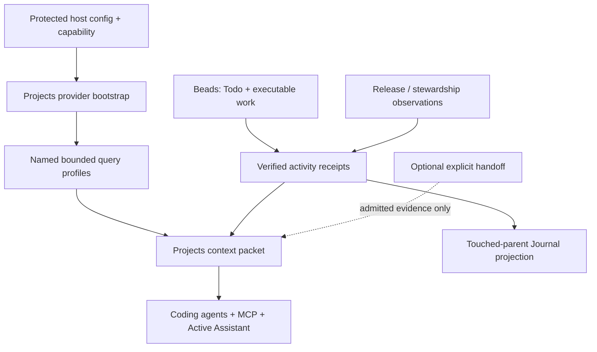
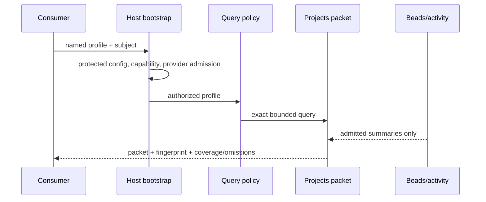

# Projects Context Cutover - Plan

## Goal Capsule

- **Objective:** Complete the Projects system as the automatic, evidence-backed context layer for jarvOS: every supported coding agent and the Active Assistant can reliably answer what Andrew worked on, is doing, and should attend to without reading raw task boards or journal project lists.
- **Primary interface:** Conversation. Projects pages, the Daily Journal, Beads Viewer, and Paperclip remain derived or specialist surfaces.
- **Authority:** Projects owns durable Project/Outcome meaning, hierarchy, priority, accepted activity, and bounded context. Beads owns executable work and Todo semantics. Domain systems own their observations and decisions. Paperclip is an optional explicit handoff projection.
- **Completion boundary:** Make the already-shipped canonical foundation discoverable and usable in ordinary hydration; admit automatic coding activity; add bounded historical activity answers; replace all-project journal listings with touched-parent projection; prove one cross-runtime cutover. Do not rebuild the release reconciler, managed-software stewardship, or the Active Assistant feature work currently owned elsewhere.
- **Stop conditions:** Stop before treating unavailable evidence as empty, exposing an unscoped project inventory, falling back to raw Beads/Paperclip/Todo/release/journal state, creating a second task lifecycle, or letting an agent choose a provider identity, secret, state root, or canonical relationship.

---

## Product Contract

### Summary

The Projects foundation exists but is not yet the normal shared context path. A selected private runtime has a valid capability receipt and canonical `jarvOS › v1.0.0 release` records, while ordinary hydration still reports “Projects provider is not configured” and continues to inject raw Paperclip current work and the Journal's all-project list.

This plan closes that operational gap. It gives all consumers one host-owned provider bootstrap and one named, policy-bounded query path. It makes accepted activity the only source for project continuity and the Journal's touched-parent links. It treats Todo as a Beads-backed execution view rather than a new Projects subsystem.

### Problem Frame

Projects cannot provide trustworthy continuity while a correct packet is available only to a specially injected test or selected host. The current fallback surfaces may be useful as non-project material, but their project facts disagree with the intended authority model and make the assistant appear informed when canonical context is unavailable.

### Requirements

**Identity, hierarchy, and priority**

- R1. Projects retains stable opaque Project and Outcome IDs, explicit parent-child relationships, revisioned names and aliases, and the established `project`/`outcome` semantics.
- R2. `jarvOS` is a Project. `v1.0.0 release` is a child Outcome. A rendered breadcrumb is never an identity key or a new top-level project.
- R3. Every Project and Outcome exposes declared and effective `high`, `medium`, `low`, or `unset` priority with inheritance provenance. Project priority informs strategic context only; it does not change Beads/Todo execution priority, readiness, or deadlines.

**Activity and execution boundaries**

- R4. Trusted coding and domain producers append idempotent, evidence-referenced Project activity at durable milestones. Reads, prompt rendering, Journal projection, and retries without a new operation identity do not create activity.
- R5. Beads remains the sole actionable local execution ledger. Todo capture, list, dependency, claim, and transition behavior resolves to Beads records linked to Project/Outcome identity; Projects records bounded evidence about that work but never duplicates its lifecycle.
- R6. Paperclip remains optional and appears only through an explicit approved handoff operation and its reference. Its absence, status, comments, or board count cannot alter Project identity or context eligibility. A successful recorded handoff may transition the linked Beads work to `external-owned`; failed, absent, or unreconciled handoffs preserve local authority.

**Context and agent parity**

- R7. Every implemented consumer—shared CLI hydration, MCP, Codex, Claude, coding-run startup, and the Active Assistant—obtains Projects through one protected host-owned bootstrap and returns the same contract, canonical scope, freshness policy, redaction class, and packet fingerprint for an equivalent request.
- R8. Consumers request named query profiles rather than caller-supplied broad queries. `orientation` answers current state, recent work, blockers, and next attention. `recent-activity` answers questions such as “what did I work on yesterday?” inside a host-issued timezone and capture window.
- R9. Empty or omitted caller scope never enumerates the registry. Missing, invalid, stale, partial, or untrusted provider state returns a structured non-enumerating result with omissions. It never falls back to raw Beads, Todo, Paperclip, release-monitor, Journal project links, or a cached rendered Projects answer.
- R10. Each answer field is independently `available`, `partial`, or `unavailable`, with freshness, coverage, evidence IDs, and truncation disclosure. A healthy-empty field requires verified source coverage.

**Derived Journal surface and rollout**

- R11. The Daily Journal Projects section is a derived, touched-parent projection: it lists only canonical parents with accepted activity occurring on that local date. It is navigation history, not an input to agent context.
- R12. Journal projection writes use the existing Obsidian-owned mutation contract with intent, idempotency, acknowledgement, reconciliation, and explicit historical repair. A failed or ambiguous Journal write does not corrupt Project activity or cause a blind retry.
- R13. The release reconciler remains the first pilot for the child Outcome `v1.0.0 release` and producer of release evidence. Managed-software stewardship remains a consumer of Projects context and owner of classification/destination/privacy/packaging decisions. Neither implementation is absorbed here.

### Actors and Flows

- A1. **Andrew:** asks an agent for current or historical work and approves canonical mutations and explicit handoffs.
- A2. **Coding agent:** obtains bounded context, performs Beads-owned work, and emits verified activity through a trusted host path.
- A3. **Projects host:** bootstraps the provider from protected configuration, verifies capability/admission, builds packets, and projects accepted activity.
- A4. **Active Assistant:** consumes the same eligible Projects packet as other agents and explains omissions rather than reconstructing project state.
- A5. **Journal projector:** writes a derived touched-parent section through the Obsidian mutation boundary.

- F1. **Recover continuity through conversation:** an agent requests `orientation` or `recent-activity`; the host issues the bounded scope and returns evidence-backed facts or explicit uncertainty.
- F2. **Record coding progress:** a protected coding integration confirms a durable Beads milestone, persists one idempotent activity receipt, and makes it available to the next context packet.
- F3. **Project today's work:** accepted activity for the local date rolls child outcomes to their parent Project and updates the Journal through the mutation contract.
- F4. **Degrade safely:** unavailable provider/bootstrap/evidence leaves project orientation unavailable or partial; ordinary hydration does not substitute raw project-state material.

### Acceptance Examples

- AE1. Given a parent `jarvOS` and an Outcome `v1.0.0 release`, a title change preserves their IDs and the child remains beneath the parent.
- AE2. Given parent priority `high` and child priority `unset`, orientation reports child declared `unset`, effective `high`, and inherited source without changing a Beads priority.
- AE3. Given the same protected configuration and subject, CLI hydration, MCP, a coding startup hook, and the Active Assistant produce the same packet contract and fingerprint.
- AE4. Given an invalid capability, missing bootstrap, stale provider, or empty caller scope, the response names the condition and does not enumerate projects or inject raw-ledger project facts.
- AE5. Given a completed Beads milestone retried with the same operation identity, one Project activity event exists and the next packet includes it once.
- AE6. Given a request for yesterday in the configured timezone, the answer contains only eligible activity within that day window and becomes partial or unavailable if bounded evidence is stale or truncated.
- AE7. Given no qualifying activity, the Journal omits the Projects list or shows a verified empty state. Given an unavailable activity provider, it preserves the last good projection with a degraded marker.
- AE8. Given 200 unrelated Paperclip rows or no Paperclip configuration, orientation eligibility and Project facts remain unchanged.

### Scope Boundaries

**In scope**

- Complete capability-backed provider discovery and consumer parity.
- Add trusted automatic activity, bounded recent-activity reads, Beads-backed Todo integration, and touched-only Journal projection.
- Finish the Project naming/hierarchy migration needed for the canonical jarvOS parent and release child.
- Define the Active Assistant integration and receipt requirements without modifying its separately owned active branch.

**Deferred to follow-up work**

- Portfolio-wide migration beyond the verified canonical mappings.
- New Project UI, dashboard, planner, or viewer product.
- A general Paperclip synchronization or automatic external handoff.
- Broader release-reconciler and stewardship domain behavior, publication, and packaging.
- Additional historical/context profiles after `orientation` and `recent-activity` prove stable.
- OpenClaw consumer parity until a concrete runtime adapter and conformance surface exist.

**Human-gated**

- Canonical identity, hierarchy, priority, trusted producer, provider scope, and Paperclip-handoff changes.
- Release publication and any managed-software destination decision.

---

## Planning Contract

### Key Technical Decisions

- KTD1. **Separate provider availability from capability authorization.** `(session-settled: user-directed — chosen over treating the selected receipt as sufficient runtime wiring: a valid receipt cannot discover or construct a provider.)` A host-owned bootstrap resolves protected configuration and validates the provider before a reader is available. Governs R7-R10.
- KTD2. **Use named host-issued query profiles.** `(session-settled: user-directed — chosen over agents constructing broad project queries: the assistant needs low-token continuity without project enumeration or caller-controlled scope.)` Profiles constrain scope, fields, limits, timezone, capture time, and freshness before the public packet builder runs. Governs R7-R10.
- KTD3. **Project priority is strategic context, not execution control.** `(session-settled: user-approved — chosen over sharing a single priority across Projects and Todo: relative importance must help the assistant without silently reprioritizing work.)` Preserve declared/effective/source provenance. Governs R3.
- KTD4. **Todo is a Beads view and intake lane.** `(session-settled: user-directed — chosen over a standalone Todo lifecycle: executable work must have one durable authority.)` Project context may link and summarize Beads work but cannot claim or transition it. Governs R4-R6.
- KTD5. **Treat the Journal as a receipt-backed projection.** `(session-settled: user-directed — chosen over an all-project daily list or Journal-first recovery: conversation is the primary interface and the Journal is only useful navigation.)` Project activity is authoritative; Journal writes are independently acknowledged and reconciled. Governs R11-R12.
- KTD6. **Cut over by withholding project orientation, not by raw fallback.** A temporary legacy route may be displayed only as non-canonical compatibility material; it cannot satisfy parity or silently answer project questions. Governs R7-R10.
- KTD7. **Keep consumer implementation ownership separate.** The Projects plan supplies contracts and conformance tests; release reconciliation, stewardship, and the Active Assistant branch retain their existing owners. Governs R13.

### High-Level Technical Design

### Sequencing

1. Diagnose and replace the missing ordinary-runtime bootstrap before changing consumer behavior.
2. Add profile/query policy and the historical activity contract before asking consumers to answer yesterday-style questions.
3. Establish the pinned, allowlisted Beads execution transport and migrate Paperclip-shaped tracker/checkpoint assumptions before attaching coding activity or Todo compatibility.
4. Attach coding/Beads activity and Todo compatibility to the established provider boundary.
5. Use accepted activity for the Journal projection through the existing vault mutation contract.
6. Prove cross-runtime parity and select a capability-bound Active Assistant route only after all other consumers pass the same conformance matrix.

### System-Wide Impact and Risks

- **Misleading availability:** capability receipt and provider bootstrap may drift. The receipt, configuration digest, provider admission, registry generation, profile revision, and packet fingerprint must be bound into cutover evidence.
- **Privacy and authority:** persisted receipts and parity evidence must be schema-whitelisted metadata. They must reject secrets, raw prompts, private provider payloads, paths, and raw Beads/Paperclip responses.
- **Historical correctness:** a prompt cannot safely filter a globally truncated current packet for “yesterday.” The historical window must be part of the query/profile contract.
- **Journal safety:** Obsidian acknowledgement may fail after activity persists. Preserve the activity and record projection pending; do not retry an uncertain same-file write under a new operation identity.
- **Migration ambiguity:** legacy `jarvOS v1.0.0 Release` may be aliased or mapped only after a dry run and explicit conflict result. Never infer a parent from title text.

### Sources and Research

- `docs/plans/2026-08-02-003-feat-agent-native-project-tracking-plan.md` defines the original authority split and conversation-first objective.
- `docs/plans/2026-08-08-002-feat-project-context-foundation-plan.md` records the implemented Project/Outcome and release-pilot foundation.
- `modules/jarvos-agent-context/src/index.js` shows the current provider injection seam and raw current-work/Journal hydration paths.
- `modules/jarvos-secondbrain/packages/jarvos-secondbrain-projects/src/projects-context.js` and `src/journal-projection.js` provide the bounded context and touched-only projection patterns.
- `docs/solutions/architecture-patterns/canonical-project-context-bounded-read-model.md`, `obsidian-owned-vault-mutation-lifecycle.md`, and `verified-cross-harness-skill-projection.md` provide the read-only, mutation, and cross-harness rollout constraints.

---

## Implementation Units

### U1. Establish the host-owned Projects provider bootstrap

- **Goal:** Make the configured private Projects provider discoverable and verifiable by ordinary shared hydration, MCP, coding startup, and the Active Assistant without caller-controlled authority.
- **Requirements:** R7, R9, R10.
- **Dependencies:** Implemented Projects package and U0.
- **Files:** `modules/jarvos-agent-context/src/index.js`, `modules/jarvos-agent-context/scripts/jarvos-mcp.js`, `scripts/lib/jarvos-projects-local-provider.js`, `config/jarvos-project-context.json`, `tests/agent-context.test.js`, `tests/active-assistant-project-context.test.js`.
- **Approach:** Add one host bootstrap that reads only protected selected-runtime configuration/state and returns a capability-verified reader or classified unavailable result. Remove reliance on in-process-only provider injection for production callers. Bind bootstrap/config/capability/registry revision identifiers into a metadata-only receipt.
- **Patterns to follow:** Existing capability verification and private local provider admission; current agent-context result normalization.
- **Test scenarios:**
  - A valid selected runtime lets direct hydration and MCP construct the same provider without test injection.
  - Missing bootstrap, malformed configuration, invalid capability, expired receipt, wrong host binding, changed mapping digest, and untrusted provider return distinct unavailable codes.
  - Caller-supplied module path, state root, producer, capability secret, or scope cannot alter bootstrap behavior.
  - Bootstrap error persists no raw configuration, secret, provider response, or rendered packet.
- **Verification:** Focused agent-context and Active Assistant provider tests demonstrate the current “provider is not configured” symptom is replaced by a valid packet or a diagnostic non-enumerating state.

### U0. Freeze the private integration dependency and handoff contract

- **Goal:** Make the selected private Projects provider and Active Assistant consumer boundary an explicit, reproducible prerequisite rather than ambient local state.
- **Requirements:** R7, R9, R10, R13.
- **Dependencies:** Existing private shadow activation and selected-runtime receipt.
- **Files:** `docs/architecture/projects-context.md`, `docs/ACTIVE_ASSISTANT.md`, `scripts/activate-jarvos-projects-shadow.js`, `scripts/lib/jarvos-projects-local-provider.js`, `config/jarvos-project-context.json`, `tests/active-assistant-project-context.test.js`.
- **Approach:** Record the owning private checkout/session, exact compatible public package revision, non-secret provider/config schema, expected receipt fields, digest inputs, provisioning command boundary, and classified blocked result if the private artifact cannot be reached. Keep secrets, mappings, and state-root paths out of the public artifact.
- **Patterns to follow:** Existing selected-runtime, capability receipt, and metadata-only semantic-evidence conventions.
- **Test scenarios:**
  - A compatible private handoff proves package revision, interface schema, provider identity, selector revision, and receipt fingerprint without disclosing private content.
  - Missing, stale, mismatched, or unavailable handoff blocks U1/U7 cutover while preserving public contract tests.
  - A selected runtime whose installed provider digest differs from its handoff fails closed.
- **Verification:** One redacted dependency receipt is accepted by both public conformance tests and the private activation test, or implementation stops with the documented blocked outcome.

### U8. Establish the Beads execution transport before Todo/coding migration

- **Goal:** Replace Paperclip-only live tracker assumptions with a pinned Beads transport that supports the executable work lifecycle safely.
- **Requirements:** R4-R6.
- **Dependencies:** U1, U2.
- **Files:** `modules/jarvos-coding/src/adapters/live/index.js`, `modules/jarvos-coding/src/adapters/live/beads-tracker.js`, `modules/jarvos-coding/src/features/session-state/index.js`, `modules/jarvos-coding/src/worktree-ownership.js`, `modules/jarvos-coding/test/live-adapters.test.js`, `modules/jarvos-coding/test/session-state.test.js`.
- **Approach:** Introduce a pinned Beads CLI transport with approved executable/version/capability checks, allowlisted workspaces and roots, bounded process invocation, and operation-ID reconciliation for uncertain mutations. Define a source-neutral tracker port and migrate Paperclip-shaped checkpoint fields without changing Project authority.
- **Patterns to follow:** Existing live tracker adapter boundaries and durable-operation/reconciliation conventions.
- **Test scenarios:**
  - No Paperclip configuration plus an approved Beads workspace supports create, claim, transition, dependency, and checkpoint operations.
  - Unsupported version, missing capability, unapproved workspace, timeout, ambiguous exit, and duplicate operation preserve work and reconcile before replay.
  - Legacy `paperclip-issue` checkpoint data migrates to a source-neutral Beads work reference without losing continuity.
  - A Paperclip tracker remains available only after an explicit approved handoff.
- **Verification:** Hermetic fake-CLI suites prove no shell interpolation, no ambient workspace discovery, bounded output, and exact-once reconciliation.

### U2. Add named profile policy and bounded historical activity reads

- **Goal:** Give every consumer equivalent safe `orientation` and `recent-activity` reads, including reliable “yesterday” answers.
- **Requirements:** R7-R10.
- **Dependencies:** U1.
- **Files:** `modules/jarvos-secondbrain/packages/jarvos-secondbrain-projects/src/projects-context.js`, `src/projects-context-capability.js`, `src/provider-contracts.js`, `modules/jarvos-agent-context/src/index.js`, `modules/jarvos-agent-context/scripts/jarvos-mcp.js`, `modules/jarvos-secondbrain/packages/jarvos-secondbrain-projects/test/projects-context.test.js`, `modules/jarvos-agent-context/test/agent-context.test.js`.
- **Approach:** Define versioned named profiles and host-issued exact queries. Add a bounded temporal activity read or versioned query extension so local-date filtering happens before sorting/truncation. Reject empty external scope; only authorized policy may resolve a default current scope.
- **Patterns to follow:** Exact-key context/capability validation and packet budget/omission behavior.
- **Test scenarios:**
  - Equivalent subject/profile/time yields the same canonical scope, query digest, packet fingerprint, and answer availability across library and MCP.
  - Empty caller scope, unknown profile, excessive time range, invalid timezone, stale capability, and out-of-scope identifier are non-enumerating.
  - Yesterday's local-day boundary includes/excludes events correctly across midnight and returns partial when provider coverage or truncation prevents completeness.
  - Healthy-empty is distinguishable from unavailable, partial, stale, unknown, and omitted for both profiles.
- **Verification:** Public Projects context and agent-context regression suites prove profile policy occurs before packet construction and no default all-record query remains.

### U3. Admit automatic coding activity and Beads-backed Todo context

- **Goal:** Make verified coding milestones automatically refresh Project context while keeping Beads as the one Todo/execution authority.
- **Requirements:** R4-R6, R10.
- **Dependencies:** U1, U2, U8.
- **Files:** `modules/jarvos-coding/src/adapters/live/`, `modules/jarvos-coding/src/features/session-state/`, `modules/jarvos-coding/src/worktree-ownership.js`, `modules/jarvos-secondbrain/packages/jarvos-secondbrain-projects/src/provider-contracts.js`, `src/projects-context.js`, `modules/jarvos-coding/test/live-adapters.test.js`, `modules/jarvos-coding/test/session-state.test.js`, `modules/jarvos-secondbrain/packages/jarvos-secondbrain-projects/test/provider-contracts.test.js`.
- **Approach:** Replace Paperclip-shaped session assumptions with a source-neutral work locator that resolves a canonical Project/Outcome plus a Beads work reference. Produce verified activity only after a durable, authorized Beads/coding milestone. Expose Todo as bounded Beads current-work summaries and intake links, not a Projects task store.
- **Patterns to follow:** Existing verified activity admission, idempotency, and current-work summary classification.
- **Test scenarios:**
  - Start, resume, block, verify, and complete a Beads-backed coding run without Paperclip configuration.
  - Duplicate receipt/retry yields one activity event; a new operation identity yields a distinct evidence-backed event.
  - Untrusted producer, mismatched workspace/project link, stale Beads summary, and failed activity admission do not change Project context claims.
  - Todo capture/list/transition routes to Beads; Projects cannot create, claim, or close the task.
  - An explicit approved Paperclip handoff transitions the linked work to `external-owned` and blocks local mutation until reconciliation or explicit return.
  - Failed handoff preserves Beads authority; Paperclip status/comments alone cannot transfer it.
- **Verification:** Coding and provider-contract tests prove automatic activity, one execution lifecycle, Paperclip absence, and clear source attribution for release versus execution state.

### U4. Cut shared hydration over to Projects-only project orientation

- **Goal:** Remove direct raw project-state aggregation from normal hydration and make Projects the only eligible orientation input.
- **Requirements:** R7-R10.
- **Dependencies:** U1-U3.
- **Files:** `modules/jarvos-agent-context/src/index.js`, `modules/jarvos-agent-context/scripts/jarvos-mcp.js`, `runtimes/codex/jarvos-session-start-hook.js`, `runtimes/claude/jarvos-session-start-hook.js`, `tests/agent-context.test.js`, `modules/jarvos-agent-context/test/agent-context.test.js`.
- **Approach:** Keep non-project Journal and note context separate, but remove the configured Projects section from the Journal payload before it is wrapped and injected. Delete or fence direct Paperclip current-work, raw Todo/Beads, release, and any Journal-project inputs from project orientation. Render a structured Projects-unavailable block when necessary; do not use legacy data to make a project claim.
- **Patterns to follow:** Shared hydrator budget/redaction reporting and MCP's existing read-only tools.
- **Test scenarios:**
  - Codex and Claude startup hooks receive the same Projects orientation block and omissions.
  - No Paperclip, 200 unrelated Paperclip rows, unavailable Journal, and missing Beads provider do not alter fresh eligible Project facts.
  - Provider unavailable, stale, partial, or expired after cutover has no raw project fallback and no cached prior answer.
  - Provider-available and provider-unavailable Journal fixtures with a `Projects` section inject only the non-project Journal sections.
  - Output budgets retain availability/omission markers and redact private data.
- **Verification:** Static consumer-boundary tests and integration snapshots prove no project-orientation path imports raw-provider calls after the flag is enabled.

### U5. Migrate canonical naming and priority without broad portfolio import

- **Goal:** Finalize the narrow canonical mapping that makes `jarvOS` the parent and `v1.0.0 release` its child, with priority provenance available to all packets.
- **Requirements:** R1-R3.
- **Dependencies:** U1, U2.
- **Files:** `modules/jarvos-secondbrain/packages/jarvos-secondbrain-projects/src/migrate.js`, `src/registry.js`, `src/priority.js`, `config/jarvos-project-context.json`, `tests/projects-migration.test.js`, `modules/jarvos-secondbrain/packages/jarvos-secondbrain-projects/test/records.test.js`.
- **Approach:** Use the existing dry-run, conflict, revision, and rollback mechanism. Map legacy release-shaped titles through explicit private configuration and retain source references/aliases. Do not bulk-import all journal or vault project names.
- **Patterns to follow:** Existing migration ledger and priority inheritance implementation.
- **Test scenarios:**
  - A dry run maps the known legacy release title to the child Outcome under `jarvOS` with no new top-level record.
  - Ambiguous title, changed parent revision, duplicate alias, inferred relationship, or unauthorized priority change becomes a conflict/proposal with no canonical mutation.
  - Parent priority inheritance and child override preserve declared/effective/source fields across reload and packet generation.
  - Rollback restores projection/mapping pointers without changing accepted activity history.
- **Verification:** Migration and record suites prove exact stable IDs, hierarchy, priority semantics, and no portfolio-wide enumeration.

### U6. Replace Daily Journal all-project listings with touched-parent projection

- **Goal:** Make the Journal a concise navigation projection of accepted activity, not a context source or always-on portfolio list.
- **Requirements:** R4, R11, R12.
- **Dependencies:** U2, U3, U5.
- **Files:** `modules/jarvos-secondbrain/packages/jarvos-secondbrain-projects/src/journal-projection.js`, `modules/jarvos-secondbrain/packages/jarvos-secondbrain-journal/src/journal-maintenance.js`, `modules/jarvos-secondbrain/packages/jarvos-secondbrain-journal/src/journal-lifecycle.js`, `modules/jarvos-secondbrain/packages/jarvos-secondbrain-projects/test/journal-projection.test.js`, `modules/jarvos-secondbrain/tests/journal-projects-section.test.js`, `modules/jarvos-secondbrain/tests/journal-maintenance.test.js`.
- **Approach:** Replace the legacy all-ongoing-project fetcher with an admitted activity projection. Compose through the canonical Obsidian mutation boundary, using a stable operation ID and separate activity-versus-projection receipts. Preserve known-good content on degraded activity evidence and make historical changes explicit repair operations.
- **Patterns to follow:** Existing touched-only projector, Journal unavailable-versus-empty safeguards, and Obsidian mutation lifecycle.
- **Test scenarios:**
  - Activity on a child Outcome renders its canonical parent once on the matching local date.
  - Untouched day, healthy-empty provider, partial provider, stale provider, duplicate event, late event, and historical repair have distinct expected output and receipt states.
  - Timeout/ambiguous dispatch, duplicate operation, external Journal edit, and acknowledgement failure preserve Project activity and avoid blind write retry.
  - Editing or deleting the Journal does not alter `orientation` or `recent-activity` answers.
- **Verification:** Journal/project projection suites prove touched-only output, source-state safety, idempotence, and Obsidian-owned mutation acknowledgement.

### U7. Prove consumer parity and coordinate Active Assistant cutover

- **Goal:** Turn the selected-runtime capability receipt into a reproducible, reversible cross-consumer proof and hand the bounded consumer contract to the Active Assistant owner.
- **Requirements:** R7-R10, R13.
- **Dependencies:** U0-U6, U8.
- **Files:** `scripts/activate-jarvos-projects-shadow.js`, `scripts/lib/jarvos-project-context-adapter.js`, `tests/active-assistant-project-context.test.js`, `modules/jarvos-agent-context/test/agent-context.test.js`, `docs/ACTIVE_ASSISTANT.md`, `docs/architecture/projects-context.md`.
- **Approach:** Build a metadata-only conformance matrix for all consumers and bind it to source revision, package/bundle digest, selected-runtime selector revision, config/mapping digest, registry generation, capability receipt, provider snapshot digests, profile revision, and packet fingerprint. The Active Assistant branch consumes this contract; this unit does not rewrite that branch.
- **Patterns to follow:** Existing capability receipt, semantic evidence, shadow activation, and reversible cutover flag patterns.
- **Test scenarios:**
  - A selected runtime proves equivalent `orientation` and `recent-activity` results for all supported consumer classes.
  - Changed package, selector, configuration, registry, capability, profile, or provider digest expires prior proof and blocks cutover.
  - Rollback returns every consumer to an explicit non-canonical/unavailable project orientation without mutating Projects, Beads, or Journal state.
  - Receipt/audit scans prove no full packets, prompts, raw ledger payloads, private mappings, paths, or secrets persist.
- **Verification:** Run focused public and private contract suites, select only the exact evidenced candidate, repeat installed-runtime proof, and complete a flag-off rollback drill.

---

## Verification Contract

| Gate | Proof | Units |
| --- | --- | --- |
| Projects contracts | `node --test modules/jarvos-secondbrain/packages/jarvos-secondbrain-projects/test/projects-context.test.js modules/jarvos-secondbrain/packages/jarvos-secondbrain-projects/test/provider-contracts.test.js modules/jarvos-secondbrain/packages/jarvos-secondbrain-projects/test/journal-projection.test.js` | U1-U6 |
| Agent hydration | `node --test modules/jarvos-agent-context/test/agent-context.test.js` | U1, U2, U4, U7 |
| Coding/Beads integration | `node --test modules/jarvos-coding/test/live-adapters.test.js modules/jarvos-coding/test/session-state.test.js` | U3, U8 |
| Journal lifecycle | `node --test modules/jarvos-secondbrain/tests/journal-projects-section.test.js modules/jarvos-secondbrain/tests/journal-maintenance.test.js` | U6 |
| Active Assistant consumer | `npx vitest run tests/active-assistant-project-context.test.js` | U1, U7 |
| Selected-runtime proof | Capability receipt plus cross-consumer conformance artifact and rollback receipt | U7 |
| Full regression | `npm test` and `git diff --check` | Completion |

Any unrelated suite failure must be reported with its exact evidence. It cannot be used to skip focused proof or claim Projects cutover completion.

---

## Definition of Done

- Ordinary hydration no longer says “Projects provider is not configured” when a selected valid runtime exists; it returns the same verified packet as other consumers or a classified safe degradation.
- The private provider/Active Assistant integration is pinned by a redacted handoff receipt; absent or mismatched private evidence blocks cutover rather than becoming an implicit local dependency.
- Every Project-context consumer uses host-issued bounded profiles and has no raw project-state fallback.
- `jarvOS` and `v1.0.0 release` retain exact parent/child identity and priority provenance.
- Coding milestones update Projects automatically and idempotently through trusted evidence while Todo remains Beads-owned.
- The Journal lists only activity-touched parents and remains a receipt-backed projection.
- The release reconciler and stewardship remain distinct owners; Paperclip remains optional.
- Active Assistant cutover is based on a current cross-consumer capability receipt and can roll back without data mutation.
- Focused suites, selected-runtime proof, full regression, privacy scans, and cleanup of superseded raw project-orientation paths pass.
