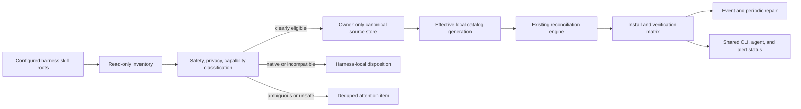

<!-- markdownlint-disable-file MD025 -->
# Automatic Cross-Harness Skill Parity

## Goal Capsule

- **Objective:** When jarvOS is installed, automatically find every eligible user-owned skill available to Codex, Claude Code, OpenClaw, or Hermes and make it available to the other supported harnesses on that machine.
- **Current gap:** The merged shared-skill engine safely distributes admitted skills, but admission is manual. On the current machine, the four configured roots contain 71 skill installations representing 52 distinct names, while only two managed skills are present in all four roots.
- **Authority:** A versioned machine-local inventory and policy decide what may be shared. The existing catalog, projection receipts, and harness adapters remain the mutation and verification authority.
- **Execution profile:** Add read-only inventory, deterministic classification, automatic admission for clearly eligible skills, attention-only handling for ambiguity, and autonomous reconciliation. Then dogfood the whole discovered matrix locally and ship the generic engine in the public jarvOS repository.
- **Stop conditions:** Never copy a skill whose source ownership, privacy, safety, portability, or canonical identity is ambiguous. Preserve locally modified and unmanaged targets. Do not report copied bytes as usable unless the harness-specific verification contract passes.

## Product Contract

### Summary

The feature is not “sync these two skills.” It is a machine-wide skill manager for supported AI harnesses.

jarvOS will inventory configured skill roots, deduplicate identical skills, classify each discovered bundle, and automatically admit every clearly safe and portable user-owned skill into a private local catalog. The existing reconciliation engine will then project that effective catalog across Codex, Claude Code, OpenClaw, and Hermes.

Skills that are built into a harness, managed by a third party, private but safe for local use, or dependent on unavailable capabilities are not silently lost. Each receives a durable disposition and plain-English reason. Andrew is notified only when a real decision or repair cannot be made safely without him.

The public repository ships the generic engine, schemas, adapters, tests, and documentation. Private skill bodies, private paths, local classifications, and machine receipts remain local.

### Requirements

- **R1. Machine-wide inventory:** Scan every explicitly configured skill root for Codex, Claude Code, OpenClaw, and Hermes, independent of the current folder, repository, session, or AI harness. Inventory only registered canonical absolute user/workspace roots with a durable root identity, ownership policy, and available/stale/unregistered lifecycle; relative adapter paths are visibility metadata, never scan targets. Never crawl arbitrary directories.
- **R2. Complete accounting:** Give every discovered bundle one durable disposition: `shared`, `already_managed`, `harness_local`, `blocked`, or `needs_input`, with a stable source identity and reason. Discovery must never silently drop a skill.
- **R3. Safe source identity:** A candidate source must be an owner-controlled regular bundle with a valid `SKILL.md`, safe ancestry and permissions, no symbolic links, hard-link ambiguity, or special files, an allowlisted tree, and an exact digest. Exclude jarvOS receipt-owned projections so copies cannot become new canonical sources. Record the original observation as `source_present`; verify and account for it, but never replace it with a managed copy or alias in the same root.
- **R4. Deterministic deduplication:** Collapse byte-identical copies into one logical skill. For divergent same-name skills, a bounded local reviewer decides whether they are drifted copies of one capability or genuinely distinct skills. Same-purpose copies collapse to one designated safe source; distinct skills receive one stable alias for the entire harness matrix and one concise heads-up. Reviewer failure or unresolved ambiguity becomes `needs_input` without projection—never an automatic duplicate alias.
- **R5. Automatic eligibility:** Automatically admit a bundle when rules prove it is user-owned, locally safe, privacy-compatible, renderer-compatible, portable to at least one supported harness that lacks a receipt-owned or `source_present` pair for that identity, and allowed by the registered root's durable trust policy. An unmanaged exact-digest copy may be adopted in place; file absence is not required. Trust is granted per root/class, not one skill at a time: `markdown-only` admits inert instruction bundles; `portable-bundles` also admits allowlisted scripts and dependencies. New executable behavior never inherits a weaker grant. Do not require Andrew to approve obvious cases one by one.
- **R6. Capability-aware classification:** Record required tools, scripts, network/egress, credentials, operating-system assumptions, plugins/MCP dependencies, interactive steps, and harness-native syntax. A missing capability may yield a per-harness exclusion without preventing safe targets from receiving the skill.
- **R7. Privacy boundary:** Private skills may be shared locally across harnesses without becoming public artifacts. Restricted content, secrets, unsafe paths, or ambiguous egress remain `blocked` or `needs_input`. One schema-validated outward-status contract serves CLI, doctor, MCP/control-plane, scheduler records, logs, receipts, errors, and notifications; it exposes opaque private identities, digests, states, and allowlisted reason codes—not private names, paths, bodies, excerpts, or parser errors.
- **R8. Existing safety preserved:** Reuse the merged reconciliation engine for atomic projection, generation checks, receipts, collision preservation, local-modification preservation, recovery, and idempotence. Inventory must not become a second copying implementation.
- **R9. Truthful availability:** Track source admitted, target installed, target discovered, and target usable as distinct states. Exact-path harnesses must prove the intended unshadowed bundle. Claude remains `verification_pending` until its supported interactive proof is authorized; this does not erase the installation result.
- **R10. Autonomous convergence:** React to supported skill-root changes and run a periodic safety reconciliation. New clearly eligible skills converge automatically. A changed digest creates a candidate only after it remains stable across the event quiescence window, and may replace the accepted generation automatically only when ownership, tree safety, privacy class, capability set, renderer, trust grant, and target eligibility are unchanged; any new or downgraded capability pauses distribution. Repeated healthy runs are silent and write no durable state.
- **R11. Attention routing:** Notify Andrew only for a new actionable transition: ambiguous ownership/privacy, unsafe source, unresolved semantic collision, local modification, unsupported required capability, failed repair, or verification regression. Dedupe repeated conditions and send one recovery notice when resolved.
- **R12. Agent-native parity:** Human CLI, scheduler, and jarvOS agent/control-plane tools must read and operate on the same inventory, plan, accepted generation, receipts, and redacted status. No harness session owns separate synchronization truth.
- **R13. Reversible retirement:** A missing source is non-mutating unless two consecutive complete observations of the same registered root confirm absence across a bounded grace interval. Partial, unreadable, timed-out, replaced-root, or overflowed scans preserve the accepted generation. Retirement uses an accepted source-store tombstone and removes only exact receipt-owned copies under one generation transaction; rollback restores only unchanged receipt-owned pairs and preserves divergent copies as `needs_input`.
- **R14. Public release and local adoption:** Land the generic implementation in the public jarvOS repository, include it in package/release checks, and activate it locally through the supported installed-runtime path only after isolated and live evidence pass.
- **R15. Owner exclusions:** Maintain a durable owner-controlled exclusion overlay keyed by logical skill identity. An excluded skill remains inventoried as `source_present` but is never projected or repaired into other roots. Owner-authorized CLI and agent primitives can exclude or re-include it without deleting its source.

### Acceptance Examples

1. A new portable writing skill appears only in Codex. The next inventory event triggers a complete multi-root generation, classifies and admits it, then projects it to Claude Code, OpenClaw, and Hermes without Andrew doing anything.
2. OpenClaw contains the private `transcribe` skill. jarvOS shares it locally where compatible, while no private body or absolute path enters the public package or outward-facing evidence.
3. Hermes contains a harness-native skill that depends on Hermes-only runtime behavior. It remains `harness_local` with a reason and creates no recurring alert.
4. Two different skills use the same name. The local reviewer selects a meaningful stable alias, both survive, all eligible harnesses receive the same names, and Andrew gets one short heads-up.
5. A target skill was edited locally. Reconciliation preserves it, marks only that pair `locally_modified`, keeps the logical skill `shared`, raises pair-scoped attention, and continues safe work for every other pair.
6. A skill source adds shell, network, credential, or plugin requirements. Automatic distribution pauses for affected targets until the new capability classification is safe.
7. A source is removed. jarvOS stages retirement, removes only exact managed copies, and can restore the prior generation if the transaction fails.
8. A healthy hourly repair performs no target, receipt, counter, briefing, or alert writes.

### Scope Boundaries

#### In scope

- The four currently supported harnesses: Codex, Claude Code, OpenClaw, and Hermes.
- Configured machine-wide user/workspace skill roots and future roots declared by versioned adapters.
- Raw skill bundles using the existing allowlist and renderer.
- Public engine/contracts/tests/docs plus private local inventory and overlay state.
- Automatic admission for high-confidence eligible skills and attention-only exception handling.

#### Deferred

- Semantic translation of arbitrary proprietary plugin formats into Markdown skills.
- Copying harness-bundled/vendor-managed skills that are not normal portable bundles.
- Sharing private skill bodies between machines or through a cloud service.
- Claiming Claude model-visible proof without a supported authorized probe.

### Assumptions

- The user's prior direction to maximize autonomy resolves the admission policy: clear cases auto-admit; only ambiguous or unsafe cases require attention.
- “All skills synced” means all eligible capabilities become available, not that every native/vendor bundle is byte-copied or falsely reported as supported.
- Configured roots may be discovered from installed jarvOS runtime adapters and local config, so behavior is independent of the current working directory.
- Local model review is optional for ordinary classification and is never the safety boundary. Static policy remains authoritative; a collision that requires semantic judgment fails closed to `needs_input` when review is unavailable.
- Existing manually admitted skills and receipts migrate in place without losing ownership or aliases.
- Installing/configuring jarvOS supplies the root-level trust decision. This machine's prior direction authorizes `portable-bundles` for explicitly registered user-owned roots; public defaults remain `markdown-only` unless an installer or owner selects the broader class.

## Planning Contract

### Key Technical Decisions

1. **Inventory precedes the catalog; it does not replace it.** Discovery observes. Policy classifies. The effective catalog authorizes. Reconciliation mutates. This keeps ambient files from becoming authority merely because they exist. Governs R1-R3, R5, R8.
2. **Use one owner-only canonical source store for admitted local bundles.** Snapshot admitted sources beneath the shared-skill control root, keyed by stable identity and digest. This removes the current single-`localSourceRoot` limitation and prevents one harness root from remaining the live authority for every other harness. Governs R3, R7-R8, R13.
3. **Classify per skill and per target harness.** One skill can be portable to three harnesses and harness-local on the fourth. The result matrix, not a single global boolean, drives reconciliation and status. Governs R2, R6, R9.
4. **Auto-admit only rule-proven cases.** Safe ownership, allowed tree, known renderer, privacy policy, and adapter compatibility are hard gates. The optional local LLM reviews meaning and naming only after those gates pass. Governs R4-R7.
5. **Persist one logical identity and reviewed alias across the matrix.** Source digests may evolve through accepted generations, but identity and effective name do not silently churn when a collision appears or disappears. Divergent same-name observations collapse only when identical bytes or the reviewer confirms the same purpose; an alias is persisted only after distinctness is affirmed. Governs R4, R8, R13.
6. **Separate installation proof from runtime visibility.** A pair can be installed while verification is pending or unsupported. Overall status must say exactly which outcome is proven. Governs R9, R11-R12.
7. **Event-driven plus periodic repair.** File/root events only coalesce wakeups. Under the mutation lease, every admission, alias, update, or retirement decision requires a complete generation over all available registered roots; partial or single-root evidence never mutates accepted state. The scheduler provides bounded catch-up and accepted-generation repair. Governs R10-R13.
8. **Public code, private data.** The npm package owns algorithms and schemas. The installed jarvOS runtime owns local roots, inventory evidence, private snapshots, reviewer inputs, and notification routes. Governs R7, R11, R14.
9. **A source observation is not a projection target.** The canonical observed path remains user-owned and is represented by a non-mutating matrix pair. Only immutable admitted snapshots are projected to other roots. Governs R2-R3, R8.
10. **Autonomous work gets a narrow service principal.** The inventory service may observe registered roots, admit only rule-proven candidates under the configured trust class, and reconcile the accepted generation. It cannot register roots, change trust/privacy policy, approve `needs_input`, enable harnesses, authorize egress, reveal private evidence, overwrite local modifications, or roll back a generation. Rollback requires an owner-authorized human CLI or separately granted owner capability. Human and agent entry points enforce the same capability matrix. Governs R5, R7, R10-R13.
11. **Owner inspection is distinct from outward status.** Exportable CLI output, agent/MCP tools, logs, receipts, scheduler records, and notifications use the redacted status contract. An authenticated owner-local inspect/explain command may reveal private names and paths needed to resolve `needs_input`, but never skill bodies or secret material by default. Governs R7, R11-R12.

### High-Level Design

### State Model

- **Observed source:** `new | unchanged | changed | missing | unsafe`
- **Disposition:** `shared | already_managed | harness_local | blocked | needs_input`
- **Projection pair:** `source_present | missing | installed | locally_modified | conflict | retired`
- **Verification:** `model_visible | verification_pending | unverifiable`
- **Attention:** `quiet | actionable | resolved`

These are orthogonal. A skill may be `shared`, `installed`, and `verification_pending` without the system pretending the last state is success.

### System-Wide Impact

- **Runtime adapters:** Gain registered scan roots, root identity, trust class, scope completeness, and per-target capability declarations. They remain format/verification adapters, not policy owners.
- **Control plane:** Gains one shared inventory/assessment/status service and a narrow autonomous principal. CLI, scheduler, and agent tools call this service rather than reimplementing decisions.
- **Persistent local state:** Adds owner-only observation generations, immutable source snapshots, assessment decisions, attention transitions, and bounded rollback generations. Public package artifacts contain schemas and logic only.
- **Existing catalog/reconciler:** Remains the sole projector and ownership authority. Generated local entries and manual entries compose into one effective accepted generation.
- **User experience:** Healthy work is invisible. Status explains what exists and why any skill is not shared; attention arrives only for a new unresolved exception.
- **First convergence:** The first successful live convergence emits one redacted summary with installed, excluded, pending, and attention counts plus the status and rollback entry points. It is a generation transition, not a recurring healthy-run message.

### Risks & Dependencies

- **Compromised source amplification:** A malicious skill in one root could otherwise spread to all harnesses. Mitigate with explicit registered-root trust classes, inert assessment, capability-change quarantine, immutable snapshots, and fail-closed policy. Assessment never executes a skill, script, interpreter, hook, or network request.
- **Filesystem races:** A source can change between inspection and copy. Admission re-attests immediately before no-follow capture into a new owner-only generation, rehashes captured bytes, and commits atomically only when the assessed and captured digests match. Projection reads only the committed snapshot.
- **Prompt/notification injection:** The optional reviewer receives bounded deterministic features, not raw bodies or secret-like excerpts, runs tool-less and network-disabled against an allowlisted local endpoint, and may only return a schema-valid decision. Notifications use the outward-status contract and reject arbitrary content/control characters.
- **False retirement:** Partial or unavailable scans cannot retire anything. Two complete authenticated absence observations and a grace period are required before a tombstone may be accepted.
- **Privacy leakage:** Existing status/doctor paths currently expose local roots. U1/U5 must migrate every outward serializer, log, exception, notification, and package fixture to the single redacted contract, backed by sentinel leakage tests.
- **Verification limits:** Exact-path proof establishes placement and precedence, not safe invocation. Claude interactive evidence is generation-bound and invalidated by source, alias, target, version, or precedence changes.
- **State growth and scheduler load:** Bound scan roots, entries, bytes, event batches, snapshot generations, rollback retention, and attention history. A healthy run must be zero-write; overflow becomes one durable actionable state rather than unbounded work.
- **Dependencies:** The merged catalog/reconciliation engine, the four runtime adapter manifests, installed jarvOS control-plane/notification bindings, and a supported local structured-review endpoint when semantic review is enabled.

## Implementation Units

### U1. Define inventory and assessment contracts

- **Goal:** Add versioned local inventory, source identity, capability assessment, disposition, matrix, generation, and attention schemas.
- **Requirements:** R1-R7, R9, R11-R12, R15.
- **Files:** `modules/jarvos-skills/schemas/`, `modules/jarvos-skills/src/config.js`, new `src/inventory-contract.js`, new contract tests.
- **Approach:** Extend config with adapter-resolved root registrations, trust classes, inventory policy, exclusion overlay, autonomous-principal capabilities, and bounded retention. Keep absolute roots and private evidence owner-only; define one outward-status contract plus the owner-local inspection boundary from KTD11. Assign a stable logical ID at first admission; physical paths are observation metadata and content digests are accepted-generation keys, so identical copies collapse without identity churn. Create and revalidate the private store, snapshots, receipts, leases, and state with owner-only directory/file modes and no-follow access; reject unsafe pre-existing ownership or permissions. Set finite defaults for roots, entries, bundle files/bytes, events per run, rollback generations, and attention retention; make reductions configurable without weakening safety. Retirement defaults to two complete absence observations at least 24 hours apart and never less than two scheduler intervals.
- **Tests:** Reject unknown versions, unsafe paths, unsupported dispositions, excess service-principal authority, private fields in every outward serializer, duplicate source identities, incomplete per-harness decisions, permissive umask, unsafe pre-created state, and ownership/mode drift.

### U2. Build bounded machine-wide inventory

- **Goal:** Discover every normal skill bundle in configured roots without treating discovery as authorization.
- **Requirements:** R1-R3, R6-R7.
- **Dependencies:** U1.
- **Files:** new `src/inventory.js`, `src/config.js`, runtime adapter skill-projection declarations, CLI dispatch/help, inventory tests.
- **Approach:** Ask each adapter for registered canonical roots, validate root identity/lifecycle, enumerate immediate skill bundles, and exclude receipt-owned projections and the canonical snapshot store. Attest with the existing bundle-tree safety primitive and retain one logical record plus per-root observations. Mark the canonical observation `source_present`. Persist an observation generation only for changed, missing, unsafe, incomplete, or overflowed evidence; a complete unchanged scan writes nothing. Record completeness before any missing/retirement decision.
- **Tests:** Cover all four adapters, registration/unregistration, relative or stale roots, duplicate physical sources, symlinks/hard links, unsafe modes, missing `SKILL.md`, oversized bundles, unreadable roots, receipt-owned copies, snapshot-store exclusion, root replacement, partial/overflowed scans, path-redacted output, and a zero-write second healthy scan.

### U3. Classify and automatically admit eligible skills

- **Goal:** Turn observations into durable dispositions and a generated local catalog generation without manual one-by-one `share` commands.
- **Requirements:** R2, R4-R7, R10-R11, R15.
- **Dependencies:** U1-U2.
- **Files:** new `src/skill-assessment.js`, new `src/source-store.js`, catalog/overlay schema evolution, `src/operator.js`, reviewer adapter, assessment tests.
- **Approach:** Parse bounded metadata and content signals without executing them, evaluate safety/privacy/capability/root-trust policy, then give an optional isolated local reviewer only redacted deterministic features for semantic duplicate and alias decisions. Credential/secret material, restricted content, unsafe paths, and ambiguous egress fail closed to `blocked` or `needs_input`. Auto-admit high-confidence bundles by re-attesting and capturing regular files into a new owner-only snapshot, rehashing the capture, and atomically committing it only on exact match. An unchanged risk/capability profile may advance a changed digest automatically as required by R10. Keep native/vendor bundles quiet; route ambiguity, insufficient trust, unsafe change, and unsupported required capabilities through R11's actionable attention state.
- **Tests:** Cover portable writing skills, script-bearing skills under each trust class, private-local skills, harness-specific dependencies, vendor-managed sources, canary secrets and prompt injection, file swaps/renames/symlink insertion during capture, divergent same-name skills, same-purpose collapse, distinct-skill aliases, non-local/timeout/malformed reviewer behavior yielding non-mutating `needs_input`, stable replay, and no public/private leakage.

### U4. Reconcile the complete accepted matrix and support retirement

- **Goal:** Feed generated catalog generations through the existing safe projector and make lifecycle operations reversible across many skills.
- **Requirements:** R4, R8-R9, R13.
- **Dependencies:** U3.
- **Files:** `src/reconciliation.js`, `src/receipts.js`, `src/collision-alias.js`, `src/harness-verification.js`, reconciliation and recovery tests.
- **Approach:** Extend receipts with inventory generation and source identity, retain bounded immutable rollback generations, and plan pairwise source-present/install/update/retire actions. Adopt an unmanaged exact-digest copy in place by writing ownership evidence without replacing bytes; a divergent unmanaged copy remains preserved with pair-scoped attention. Retirement requires an accepted tombstone backed by two complete absence observations. Preserve aliases, manual admissions, unmanaged targets, and local changes. Recover interrupted snapshot, receipt, alias, target, tombstone, and retirement transitions before new planning.
- **Tests:** Exercise multiple skills across four harnesses, non-mutating source-present pairs, one-pair failure isolation, collision-to-alias transition, crash points, source change during apply, receipt failure, local modification, shadow precedence, incomplete-scan preservation, two-observation retirement, bounded rollback, and a zero-write second reconcile.

### U5. Add autonomous triggers, shared status, and attention routing

- **Goal:** Keep the accepted skill matrix converged without requiring Andrew to remember commands or inspect Paperclip.
- **Requirements:** R10-R12, R15.
- **Dependencies:** U2-U4.
- **Files:** `src/scheduler.js`, new `src/attention.js`, `src/operator.js`, `src/doctor.js`, control-plane/MCP integration, scheduler and notification tests.
- **Approach:** Use a best-effort native file-event adapter over each registered root and its immediate skill directories, with debounce/coalescing, a bounded queue, projection-event suppression, a short digest-stability window, and watcher-loss/overflow fallback to one complete scan. Events only request work; under the lease the service scans every available registered root and refuses admission, alias, update, or retirement on an incomplete generation. The periodic scheduler remains the correctness backstop. Healthy scheduled output is ephemeral and creates no durable write. Define a public notification port and private installed binding: route resolution, redacted request, delivery receipt bound to attention fingerprint, authorization, retry ownership, and local-status fallback. Failed delivery retries with bounded backoff and remains visible locally. Add a human-only, per-skill Claude proof command whose evidence is bound to the exact generation; it sends no private body unless the owner separately authorizes that generation's egress. Expose redacted authorized CLI and agent primitives for inventory, explain, plan, repair, exclude, and include; expose rollback only through an owner-authorized surface and keep privileged local inspection outside agent parity.
- **Tests:** Cover concurrent triggers, partial-generation mutation denial, digest quiescence, capability denial, include/exclude behavior, backlog bounds, crash/restart, unchanged zero-write healthy runs, one notice per stable problem, one recovery notice, unavailable-route retry, malicious message fields, Claude proof invalidation, and exact redacted CLI/agent status parity.

### U6. Prove and merge the public implementation

- **Goal:** Ship the generic feature publicly with isolated evidence and a private-safe live preflight.
- **Requirements:** R14-R15 and all acceptance examples.
- **Dependencies:** U1-U5.
- **Files:** module README, architecture doc, runbook, dogfood/preflight scripts, package/release tests, local installed-runtime config and receipts outside the repository.
- **Approach:** Migrate existing manual catalog/receipt fixtures into the inventory contract and run isolated matrix, adapter, package, recovery, and private-boundary gates. Run only a read-only live inventory/preflight before merge and keep its private evidence out of the pull request. Merge after public tests, review, and release checks pass; do not mutate live skill roots from an unmerged checkout.
- **Tests:** Isolated fixtures account for all observations, adopt exact unmanaged copies, preserve divergent/local-modified copies, exercise the autonomous tail, and pass end-to-end sentinel checks across CLI/stdout/stderr, doctor, MCP, scheduler records, logs, reviewer input, notifications, receipts, and the packed public artifact.

### U7. Activate the merged release and converge the live machine

- **Goal:** Prove the actual user outcome from the supported installed runtime after public merge.
- **Requirements:** R14-R15 and all acceptance examples.
- **Dependencies:** U6.
- **Files:** Local installed-runtime config, owner-only inventory/snapshot/receipt state, and redacted activation evidence outside the public repository.
- **Approach:** Install the merged release through the supported runtime path, migrate existing manual receipts in place, and record a read-only would-admit/exclusion report before the first mutation. Existing exclusions are honored; absent an unresolved safety condition, the configured trust policy proceeds without per-skill confirmation. Apply the accepted generation, verify the eligible matrix, run a second zero-write reconcile, exercise root-event and periodic repair, and emit the one-time first-convergence summary with exclude and rollback entry points. Record only redacted proof in the public issue/PR trail.
- **Tests:** The live report accounts for all observed skills; every eligible pair is installed and truthfully verified or explicitly pending; every excluded pair has a reason; `transcribe` and the newsletter skill remain functional; at least one previously single-harness eligible skill reaches the other harnesses; no unrelated skill is overwritten; autonomous repair is healthy and quiet after the first summary.

## Verification Contract

| Gate | Command or evidence | Passing condition |
|---|---|---|
| Module tests | `npm --prefix modules/jarvos-skills test` | Inventory, assessment, catalog, reconciliation, scheduler, doctor, and CLI tests pass. |
| Four-harness isolation | `node modules/jarvos-skills/scripts/dogfood-skills.js --matrix --isolated` | Multi-skill matrix applies once, preserves conflicts, proves truthful visibility, and is a zero-write no-op on replay. |
| Runtime adapters | `node modules/jarvos-runtime-kit/scripts/jarvos-runtime-kit.js check all` | All four adapter declarations and roots satisfy the versioned contract. |
| Public package | `node tests/pack-manifest-test.js` and release candidate checks | New public code/docs/schemas ship; no private local data ships. |
| Live inventory | New read-only inventory/status command against installed config | Every observed bundle is counted exactly once with a disposition and no private-path output. |
| Post-merge live convergence | Installed merged release, apply followed by status and second reconcile | Every eligible pair is installed or truthfully pending; excluded pairs have reasons; second run writes nothing. |
| Autonomous tail | One root-change trigger and one forced periodic repair | Both use the installed runtime, record run evidence, stay quiet on health, and deliver one actionable test notice through the configured route. |

Root `npm test` remains a required regression gate. If it fails for a pre-existing dependency problem, record the independently reproduced baseline and require all affected package/release gates to pass before merge.

## Definition of Done

- The public repository contains the inventory, classification, automatic-admission, reconciliation, scheduling, attention, agent-parity, and documentation changes.
- The system accounts for every skill in every configured supported root; no skill is silently ignored.
- Every clearly eligible user-owned skill is automatically made available to every compatible supported harness, not merely `transcribe` and the newsletter skill.
- Harness-native, unsafe, restricted, incompatible, and ambiguous skills remain preserved with durable reasons.
- Existing local modifications, aliases, and receipts survive migration.
- Isolated, package, adapter, review, and release gates pass; the pull request is merged to public `main`.
- The merged release is activated locally through the supported runtime path, the real machine matrix converges, and a second run is a verified no-op.
- Autonomous repair is active and healthy; Andrew receives a concise notification only when action is actually required.

## Continuity and Feedback

- Paperclip tracks implementation and evidence, but is not where Andrew must remember to look.
- The first live convergence emits one redacted summary. Later healthy progress is available on demand through status and remains notification-silent.
- New actionable conditions are delivered through the configured source/owner channel with the skill, harness, reason, safe default, and exact next decision. Repeats are deduplicated.
- The public release session receives the merged commit and package evidence. The workspace-manager session receives the live finding that a feature can be merged while its local activation or tail remains incomplete; neither session owns this implementation.

## Draft Goal

`/goal Implement this plan to its Definition of Done, including public merge, supported local activation, complete live inventory accounting, automatic eligible-skill convergence, and autonomous attention-only repair.`
