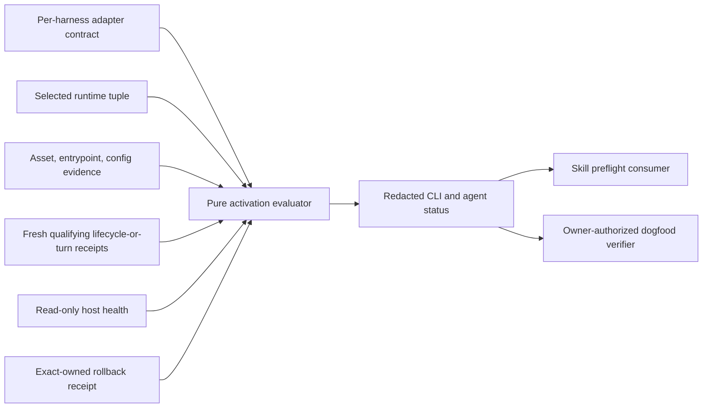
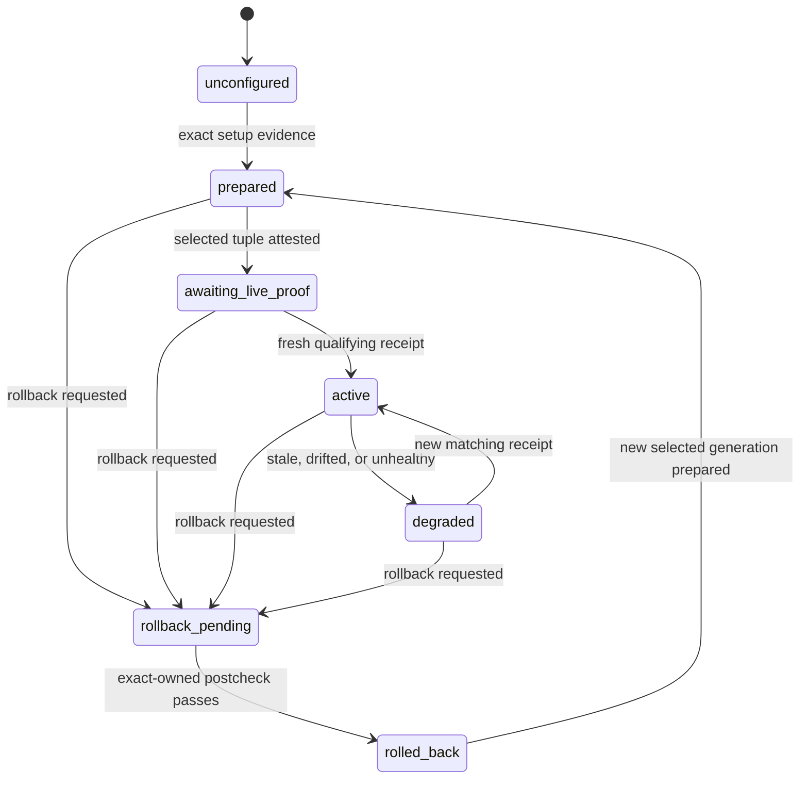

<!-- markdownlint-disable-file MD025 -->
# Managed Harness Activation

## Goal Capsule

- **Objective:** Complete Managed Harness Activation from assessment through merged implementation and safe local dogfood, with truthful per-harness activation evidence and rollback.
- **Current gap:** The local selected runtime already has `managed-launcher.json` entries for Codex, Claude Code, Hermes, and OpenClaw, and all four public adapters pass static validation. That manifest proves launcher installation, not live activation. The public adapter contract has no common way to state process ownership, qualifying live evidence, freshness, tuple binding, or rollback outcome.
- **Smallest solution:** Extend the existing per-harness adapter manifests rather than create a second harness registry. Add a pure activation-evidence evaluator and redacted status command to runtime-kit, make skill preflight consume that status without gaining activation authority, and provide an owner-authorized installed-runtime dogfood verifier.
- **Process decision:** No supported harness needs a new jarvOS-owned background process. Codex and Claude Code use native session hooks; their managed launcher is a per-session fallback, not a daemon. Hermes and OpenClaw use stable jarvOS entrypoints inside harness-owned lifecycle processes; jarvOS observes receipts but does not supervise or restart those processes.
- **Stop conditions:** Never infer live activation from static validation, installed config, plugin registration, gateway health, skill discovery, or an old receipt. Never overwrite or roll back ambiguous user-modified state. Never activate from an unmerged checkout.

## Product Contract

### Summary

jarvOS needs one truthful answer to “what is active?” without pretending that four different harnesses share one lifecycle model. The public adapter for each harness will declare who owns execution, which preparation checks apply, which causally later receipt proves a real session or turn used the selected runtime, how long that proof is current, and what exact-owned rollback can reverse.

The existing local launcher manifest remains an installation record. The adapter plus evidence evaluator becomes the activation contract. The evaluator is pure and fail-closed: it derives a public-safe state from selected-runtime identity, asset/config attestation, live receipt, health evidence where available, and rollback evidence. Host-local paths, process identifiers, session identifiers, and raw diagnostics remain private.

### Requirements

- **R1. One versioned activation contract:** Every supported runtime adapter declares a canonical harness identity, execution owner, background-process policy, preparation evidence, qualifying live-proof events, freshness bound, selected-runtime tuple fields, health policy, and exact-owned rollback policy.
- **R2. No process symmetry:** The contract explicitly records that jarvOS owns no background daemon for any of the four harnesses. Codex and Claude Code use native hooks with a per-session launcher fallback. Hermes and OpenClaw remain harness-process-owned and consume stable jarvOS entrypoints.
- **R3. Evidence-bearing state:** Derive `unconfigured`, `prepared`, `awaiting_live_proof`, `active`, `degraded`, `rollback_pending`, or `rolled_back`. Preparation never implies active. `active` requires a fresh, causally subsequent live receipt bound to the currently selected tuple.
- **R4. Exact tuple binding and re-attestation:** The activation tuple covers canonical harness identity, selected public/runtime generation, selected asset digest, stable-entrypoint digest, and installed-config binding digest. Status and dogfood recompute those digests no-follow from the live staged tree and installed binding before accepting evidence; the evidence file never attests itself. Missing, stale, replayed, mismatched, or drifted evidence fails closed.
- **R5. Mechanism-specific causal live proof:** Each dogfood or session run records an immutable preparation baseline and opaque challenge scoped to one normalized harness and run. Multiple challenges may remain outstanding independently until completion or expiry. A qualifying receipt names that correlation, event class, tuple digest, production time, and matching challenge, and must be strictly later than its baseline. Codex and Claude Code require a fresh native session-start or turn receipt. Hermes requires an ordered managed session receipt followed by a `pre_llm_call` turn receipt. OpenClaw requires an ordered managed session receipt followed by an `agent_turn_prepare` receipt; plugin registry persistence alone is not activation. Every adapter uses a 15-minute live-proof window with 30 seconds of tolerated forward clock skew; an idle harness conservatively degrades after that window until its next real lifecycle event.
- **R6. Truthful health:** Health is read-only and mechanism-specific. A host-native process or gateway observation may support status but cannot replace a qualifying live receipt. Absence of a safe health probe remains `awaiting_live_proof` or `degraded`, never guessed healthy.
- **R7. Safe rollback:** Rollback acts only on receipt-owned state, refuses modified or ambiguous targets, invalidates the rolled-back generation's live evidence, verifies post-rollback configuration/entrypoint state, and preserves worktrees, sessions, user configuration, and forensic receipts.
- **R8. Shared redacted status:** Human CLI and agent/control-plane consumers receive the same closed, schema-validated public-safe status and reason-code enum. It exposes harness, state, generation digest, evidence classes, timestamps/freshness, and allowlisted reason codes—not private paths, commands, session IDs, process IDs, or raw hook output.
- **R9. Skill-sync is downstream:** Skill installation/discovery/visibility remains orthogonal. Skill preflight may consume activation status and explain that a verification is pending, but it cannot start a harness, write activation evidence, or promote a runtime to active.
- **R10. Safe four-harness dogfood:** An owner-authorized installed-runtime flow creates a nonce-bound challenge, exercises each real harness through its declared lifecycle, validates only receipts produced after the challenge against a freshly re-attested selected tuple, verifies rollback in a disposable profile/config boundary, and emits one redacted result per harness. It never rewrites the dirty root checkout or rolls back a hook/config target still referenced by an active session.
- **R11. Merge-before-activation:** Public tests, review, CI, and merge precede local adoption. The selected runtime stages the merged public commit, re-attests exact assets, and activates only harness paths whose installed-runtime dogfood passes. A failed or unavailable path stays configured/off with a reason.
- **R12. Autonomous degradation:** Status recomputation automatically downgrades stale or mismatched evidence without mutating host processes. Recovery occurs on the next owner/harness lifecycle event; jarvOS adds no polling daemon or automatic restart loop.

### Acceptance Examples

1. Codex setup and static adapter checks pass, but no fresh Codex session receipt exists. Status is `awaiting_live_proof`, not `active`.
2. A fresh Claude session-start receipt matches an older selected generation. The evaluator rejects it as `degraded` with `selected_tuple_mismatch`.
3. Hermes's stable shell and selected assets match, but no post-challenge `pre_llm_call` receipt exists. Dogfood remains pending and no new service is started.
4. OpenClaw reports the plugin registered and the gateway reachable, but no post-install turn receipt exists. Status remains `awaiting_live_proof`.
5. A qualifying receipt expires. Read-only status changes from `active` to `degraded`; jarvOS does not restart anything.
6. Rollback encounters a user-edited config entry. It refuses that target, preserves it, reports `rollback_pending`, and does not claim success.
7. Skill projection is `model_visible` while runtime activation is unproven. Both facts appear independently and neither overwrites the other.
8. Installed-runtime dogfood passes Codex and Claude but cannot obtain safe Hermes proof. Only the proven native paths are adopted; Hermes stays off/pending with a redacted reason.

### Scope Boundaries

#### In scope

- Public activation contract, evaluator, manifest declarations, CLI/status schema, tests, runbook, and dogfood verifier.
- Codex, Claude Code, Hermes, and OpenClaw only.
- Existing selected-runtime, launcher, setup, hook/plugin, skill-sync, and exact-owned rollback mechanisms.
- Post-merge local staging and activation of only proven-safe paths.

#### Deferred

- A general daemon supervisor, restart manager, or new scheduler.
- Remote model probes as a prerequisite for ordinary runtime activation.
- Automatic rollback of user-modified state.
- Claiming an idle process is live indefinitely without fresh lifecycle evidence.

### Assumptions

- The user's explicit request authorizes owner-local four-harness dogfood and reversible activation after merge; no further approval is needed unless an unowned mutation or process restart becomes necessary.
- The selected runtime's stable launcher/bridge is the owner-local receipt producer. Public hooks/plugins emit only their declared lifecycle event through that bridge; the producer binds it to the prepared harness/run challenge and freshly attested tuple before an owner-only write. Public jarvOS defines and validates the protocol but does not publish host details.
- Detailed receipts live only beneath an explicit owner-only selected-runtime state root (`0700` directory, `0600` regular files, no symlinks or special files). Challenge and raw session/process fields are deleted on successful verification or rollback and otherwise expire after 24 hours. A redacted digest, state, reason code, and timestamps may be retained for 30 days for rollback/audit continuity.
- The existing shared skill-repair scheduler remains enabled and unchanged; this feature does not create or enable another scheduled service.

## Planning Contract

### Key Technical Decisions

1. **Extend adapters; do not add a parallel registry.** Add `managedActivation` beside `stewardshipAdapter` and `skillProjection` in each existing adapter. `managed-launcher.json` remains the local installation receipt. This is the “better equivalent” to a new global manifest because ownership and evidence stay next to the harness mechanism they govern. Governs R1-R2, R9.
2. **Collect live facts, then evaluate; do not persist an optimistic boolean.** A side-effect-free collector recomputes the current selected tuple from safe live paths, while a pure function evaluates that attestation and immutable receipts. Persisted evidence is input, not an `active: true` flag. Governs R3-R6, R12.
3. **Canonicalize harness names at the boundary.** Public runtime IDs are `codex`, `claude`, `hermes`, and `openclaw`; `claude-code` is an accepted alias only. Receipt normalization occurs before tuple comparison. Governs R1, R4-R5.
4. **A live turn is stronger than process health.** Health can explain degradation, but only a selected-tuple-bound lifecycle/turn receipt inside R5's bounded window can activate a harness. This avoids treating OpenClaw registration or Hermes gateway reachability as user-visible use. The conservative window may label a quiet process degraded; that is preferable to an indefinite live claim and recovers on the next native event. Governs R3-R6.
5. **No jarvOS daemon ownership.** `backgroundProcess.owner` is `none` for Codex/Claude and `harness` for Hermes/OpenClaw; all four declare `jarvosStartsProcess: false`. Stable launchers/wrappers remain lifecycle entrypoints, not resident supervisors. Governs R2, R6, R12.
6. **Rollback is explicit and exact-owned.** Automatic behavior is limited to read-only status degradation. Mutation requires the existing owner-authorized setup/rollback path and fails closed on drift. Governs R7, R10-R11.
7. **Activation and skill visibility are orthogonal.** Runtime-kit owns activation truth; skill-sync renders it as non-blocking downstream context only. Activation state cannot change preflight's `activating: false`, `readOnly: true`, live-gates-off posture, or package result. Governs R8-R10.

### High-Level Design

### State Model

### Per-Harness Activation Matrix

| Harness | jarvOS background process | Lifecycle owner | Preparation proof | Live proof required | Rollback owner |
|---|---|---|---|---|---|
| Codex | None | Codex native hooks; per-session launcher fallback | exact hook/config, selected assets, stable dispatcher | matching fresh `SessionStart` or turn receipt | owner-authorized exact-owned setup |
| Claude Code | None | Claude native hooks; per-session launcher fallback | exact hook/config, selected assets, stable dispatcher | matching fresh `SessionStart` or turn receipt | owner-authorized exact-owned setup |
| Hermes | None | Hermes process/gateway | exact stable shell, selected generation, config | matching managed session receipt and subsequent `pre_llm_call` receipt | owner-authorized exact-owned setup |
| OpenClaw | None | OpenClaw gateway/plugin host | exact plugin registration/assets/config; inspection remains non-activating | matching managed session receipt and subsequent `agent_turn_prepare` receipt | owner-authorized exact-owned setup |

### System-Wide Impact

- **Runtime kit:** Gains activation-contract validation, receipt normalization, pure state evaluation, redaction, and status CLI support. Owner-local evidence is read only from an explicitly named absolute regular file with safe ancestry/ownership/mode; symlinks, special files, and group/world-writable state fail closed.
- **Runtime adapters:** Gain explicit management ownership and evidence policy without changing their existing launch or skill mechanisms. Validation requires activation events/assets/entrypoints to be producible by the existing stewardship bootstrap and capability declarations, preventing a second contradictory truth source.
- **Selected runtime:** Continues to stage/install exact assets and produce owner-local evidence; it consumes the public contract after merge.
- **Receipt-production boundary:** The stable managed launcher emits `session` evidence, and the existing native hook/plugin bridge emits `turn` evidence. Both use a versioned public receipt-write protocol but resolve challenge mappings, tuple details, and storage only inside the owner-local selected-runtime state. Missing producer support leaves the harness non-activatable rather than inviting fixture or registration evidence.
- **Skill system:** Reads redacted activation status in preflight/dogfood output but remains unable to activate a harness.
- **Operations:** Status becomes conservative and self-degrading; there is no new timer, daemon, restart loop, or background-process symmetry.

### Risks & Dependencies

- **Receipt replay or tuple drift:** Require preparation baseline, challenge/causal ordering, exact tuple digest, normalized harness identity, and bounded freshness. Re-attest live assets, entrypoint, and config binding immediately before accepting proof.
- **False process claims:** Separate registration/configuration, process health, and observed live use. Only the final class permits `active`.
- **Private-data leakage:** Use a strict outward schema with allowlisted reason codes and sentinel tests across stdout, stderr, fixtures, and dogfood summaries.
- **Unsafe rollback:** Reuse existing atomic backup and exact-owned rollback. Dogfood mutates only disposable profile/config roots; any later real-profile adoption runs after the disposable proof and never rolls back a target used by an active session. Modified or ambiguous state produces a refusal, never broad repair.
- **Installed/runtime mismatch:** Dogfood must execute the staged merged runtime and record its public commit/generation; checkout tests are prerequisites, not activation evidence.
- **Harness API limits:** If Hermes or OpenClaw lacks a safe read-only health surface, rely on fresh lifecycle receipts and report health as unavailable. Do not invent or enable a service.

## Implementation Units

### U1. Add the activation contract and evaluator

- **Goal:** Define and validate the shared contract, exact tuple, redacted evidence, state transitions, and freshness rules.
- **Requirements:** R1-R8, R12.
- **Files:** new `modules/jarvos-runtime-kit/src/managed-activation.js`, `modules/jarvos-runtime-kit/src/index.js`, new `modules/jarvos-runtime-kit/test/managed-activation.test.js`.
- **Approach:** Export constants, contract validation, one closed public status/reason schema, harness alias normalization, tuple digest construction, minimal lifecycle receipt classes, receipt validation, and pure state evaluation. Define a side-effect-free attestation collector that reads only explicit safe absolute roots, rejects links/special files/unsafe ancestry, and recomputes selected asset, stable-entrypoint, and installed-config binding digests. Map each adapter's declared bootstrap/capability events to public `session` and `turn` receipt classes; an unmapped event makes that harness non-activatable. Make evidence classes orthogonal and derive state in a fixed precedence: rollback, configuration/integrity, freshly attested tuple, causal live proof, health/freshness.
- **Tests:** Cover every state, exact boundary timestamps, clock skew, missing fields, unknown versions, alias normalization, replay, future/stale receipts, tuple/asset/config/entrypoint drift, health-only false positives, rollback invalidation, modified-state rollback refusal, and private sentinel leakage.

### U2. Declare and enforce all four harness contracts

- **Goal:** Make the existing adapter manifests the complete public activation registry and expose read-only status.
- **Requirements:** R1-R6, R8.
- **Dependencies:** U1.
- **Files:** `runtimes/{codex,claude,hermes,openclaw}/adapter.json`, `modules/jarvos-runtime-kit/src/index.js`, `modules/jarvos-runtime-kit/scripts/jarvos-runtime-kit.js`, `modules/jarvos-runtime-kit/test/runtime-kit.test.js`, `modules/jarvos-runtime-kit/test/stewardship-live-adapters.test.js`.
- **Approach:** Add strict `managedActivation` declarations matching the matrix and reject missing/contradictory policies during `validate`/`check`. Require proof events to map to declared stewardship lifecycle events/assets, entrypoint identity to match bootstrap, and `jarvosStartsProcess: false` for all four. Hermes/OpenClaw health defaults to unavailable/non-probed and can only explain degradation. Add `activation-status <runtime|all> --evidence <owner-local-json> --json`; it safely loads evidence, recomputes the live tuple through U1's collector, and returns the same redacted shape exported for agent/control-plane consumers. For `all`, missing evidence is a truthful non-error state, not a fabricated failure.
- **Tests:** Prove every adapter declares the right owner/events; `jarvosStartsProcess` cannot be true; Claude aliasing normalizes; OpenClaw registration and health alone cannot activate; Hermes requires ordered session+turn proof; and CLI/library outputs match after canonical JSON serialization.

### U3. Add downstream preflight and installed-runtime dogfood

- **Goal:** Safely verify the four real harness paths without giving skill-sync or tests activation authority.
- **Requirements:** R7-R10, R12.
- **Dependencies:** U1-U2.
- **Files:** new `modules/jarvos-runtime-kit/scripts/dogfood-managed-activation.js`, new `modules/jarvos-runtime-kit/test/managed-activation-dogfood.test.js`, the four public hook/plugin entrypoints under `runtimes/`, `modules/jarvos-skills/scripts/live-preflight-checklist.js`, `modules/jarvos-skills/test/doctor.test.js`, `modules/jarvos-skills/test/dogfood-live.test.js`; owner-local selected-runtime launcher/bridge integration remains outside the public repository and is exercised in U5.
- **Approach:** Define `jarvos-managed-activation-receipt/v1`: normalized harness, correlation/challenge, event class, tuple digest, production time, and bounded public-safe outcome. The selected-runtime launcher produces `session`; existing Codex/Claude native hooks and Hermes/OpenClaw hook/plugin bridges produce their declared `turn` event through the same private bridge. Implement a two-phase dogfood flow entirely against disposable profile/config roots: `prepare` safely attests the merged selected tuple and writes an immutable owner-only harness/run baseline plus nonce/challenge without starting a process; `verify` selects that correlation, reads the resulting owner-only receipts, enforces per-adapter ordering/freshness and a second live re-attestation, expires the challenge, applies the retention policy, then exercises exact-owned rollback after the disposable session ends. The dirty root checkout and active real-profile sessions are never mutation targets. Update skill preflight to include these runtime states as non-blocking read-only context while preserving its package result, `activating: false`, `readOnly: true`, and live-gates-off posture.
- **Tests:** Use fixture receipts for all four harnesses, overlapping harness/run challenges, out-of-order dual receipts, stale/mismatched/replayed cases, unmapped producer events, no-receipt pending behavior, store ownership/mode and retention expiry, exact-owned rollback success/refusal, zero host mutations during preflight, and a private-sentinel scan of all output.

### U4. Document, review, ship, and merge the public implementation

- **Goal:** Make the activation boundary understandable and release-qualified before any live mutation.
- **Requirements:** R2, R7-R11.
- **Dependencies:** U1-U3.
- **Files:** `modules/jarvos-runtime-kit/README.md`, `docs/migration/managed-software-stewardship.md`, new `docs/runbooks/managed-harness-activation.md`, package/release manifests if required.
- **Approach:** Document the state model, matrix, redacted evidence schema, CLI, owner-authorized dogfood, rollback, and explicit no-daemon decision. Run focused and root regression gates, simplify/review the material diff, inspect the packed artifact for private data, open a PR, address material review/CI findings, and merge only a release-qualified exact head.
- **Tests:** Documentation examples validate against fixtures; runtime-kit, skill, packed-artifact, and root tests pass; PR CI is green at the merged head or has an auditable unrelated-baseline exception.

### U5. Stage the merge and activate only proven-safe local paths

- **Goal:** Dogfood the actual merged runtime, adopt passing harness paths, preserve failing/pending paths, and report concise findings to related sessions.
- **Requirements:** R10-R12 and all acceptance examples.
- **Dependencies:** U4.
- **Files:** Owner-local selected-runtime staging, activation evidence, rollback receipts, and session messages outside the public repository.
- **Approach:** Stage the merged public commit through the existing selected-runtime mechanism, add/verify its private launcher/bridge consumer for the public receipt protocol, verify exact assets and provenance, and run read-only status first. Execute the four owner-authorized disposable-profile challenges only after the bridge round-trip proves that the issued correlation can reach each real hook/plugin and return through owner-only state. A passing dogfood makes a managed path eligible for adoption; it never persists an `active` flag. Real-profile adoption occurs only through the existing exact-owned setup path and only when it does not restart an unowned process or alter a target used by an active session. Runtime state always remains read-time derived and degrades after R5's window without new proof. Do not start a background service or change skill scheduling. Send redacted findings and merged commit/CI evidence to the workspace-manager and public-release sessions without assigning work.
- **Tests:** Each harness has a redacted pass/pending/fail receipt tied to the merged public commit; every adopted path has fresh user-visible proof; every nonpassing path remains off/pending; rollback restores only exact-owned state; root checkout and active worktrees/sessions are unchanged.

## Verification Contract

| Gate | Command or evidence | Passing condition |
|---|---|---|
| Contract/evaluator | `node --test modules/jarvos-runtime-kit/test/managed-activation.test.js modules/jarvos-runtime-kit/test/runtime-kit.test.js` | State, tuple, freshness, redaction, and adapter validation scenarios pass. |
| Existing adapter safety | `node --test modules/jarvos-runtime-kit/test/stewardship-live-adapters.test.js` | Existing reversible setup/rollback and provenance guarantees remain green. |
| Runtime adapters | `node modules/jarvos-runtime-kit/scripts/jarvos-runtime-kit.js check all` | All four adapters satisfy bootstrap, stewardship, skill, and activation contracts. |
| Dogfood/preflight | `node --test modules/jarvos-runtime-kit/test/managed-activation-dogfood.test.js modules/jarvos-skills/test/doctor.test.js modules/jarvos-skills/test/dogfood-live.test.js` | Dogfood is challenge-bound and preflight remains read-only/downstream. |
| Package suites | `npm --prefix modules/jarvos-runtime-kit test` and `npm --prefix modules/jarvos-skills test` | Both package suites pass. |
| Public package | `node tests/pack-manifest-test.js` plus root `npm test` | Shipped files are complete and no private artifacts leak. |
| PR/release | Exact-head CI and review on the public PR | Required checks pass at the merge head; the PR is merged to public `main`. |
| Installed provenance | Selected-runtime tuple and side-effect-free provenance receipts for merged public commit | Local execution uses exact merged assets, not the feature checkout or an older stage. |
| Four-harness live proof | Four owner-local challenge/verify receipts | Each harness is reported independently; only fresh exact-tuple live proofs yield `active`. |
| Rollback | Exact-owned rollback plus postcheck for each activated mechanism | Owned config is restored/removed, live evidence invalidated, modified user state preserved. |

Root `npm test` remains required. A pre-existing unrelated failure must be reproduced on the unchanged merge base and cannot waive any affected runtime-kit, skill, package, or release gate.

## Definition of Done

- All four adapters define explicit, validated activation contracts and background-process ownership.
- The runtime-kit evaluator and CLI never equate installation, registration, health, skill visibility, or stale evidence with active use.
- Health, tuple drift, freshness, rollback, and redaction tests pass alongside existing adapter and skill suites.
- Skill-sync consumes runtime activation status without acquiring lifecycle mutation authority.
- The public change is simplified, reviewed, release-qualified, and merged to `main`.
- The merged selected runtime is staged locally and all four harnesses are safely dogfooded through their real declared mechanisms.
- Only harness paths with fresh exact-tuple user-visible proof are locally adopted; the rest remain truthfully pending/off.
- No new background process or scheduler is enabled, dirty checkouts and active sessions are preserved, and exact-owned rollback is proven.
- The workspace-manager and public-release sessions receive concise redacted findings and merge evidence without implementation assignments.

## Continuity and Feedback

- The isolated worktree owns all public implementation until merge; the dirty root checkout is read-only for this task.
- The selected runtime owns local staging and detailed evidence after merge. Public artifacts receive only redacted summaries.
- Workspace-manager receives the operational distinction between installed/configured and live-proven. Public-release receives the merged commit, exact-head CI, package proof, and the same redacted activation matrix.
- Andrew is notified only if a required live proof would need an unowned process restart, ambiguous config mutation, unavailable authority, or a scope change.
