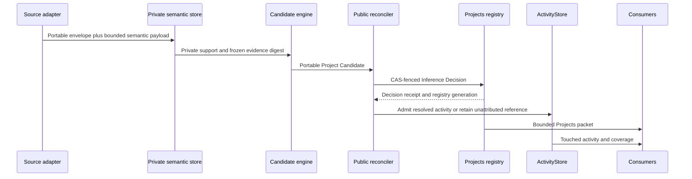
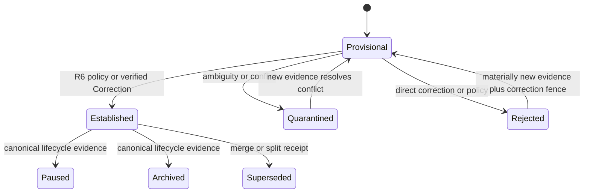
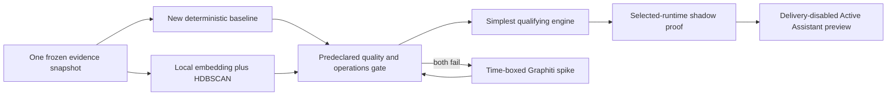
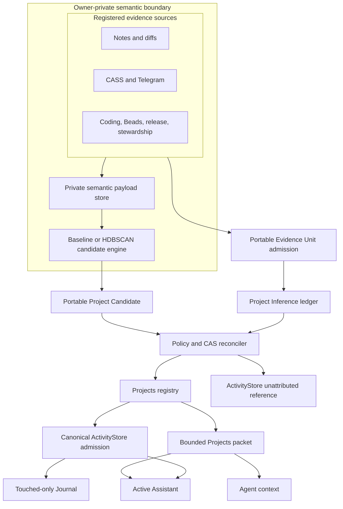

# Autonomous Project Inference - Plan

## Goal Capsule

- **Objective:** Make jarvOS autonomously discover, name, organize, and maintain Projects from the work Andrew is already doing, so Journal, agents, and Active Assistant share a stable and accurate view of his portfolio without a project-maintenance ritual.
- **Means:** Add one Projects-owned inference boundary that converts registered source observations into provisional candidates, reconciles them into the existing recursive Projects registry under a versioned policy, and proves the simplest qualifying inference engine through a shadow OSS bakeoff (KTD1-KTD9).
- **Authority:** Source systems own their observations. Project Inference owns candidate and reconciliation decisions. The Projects registry owns stable identity and hierarchy. ActivityStore owns admitted evidence after identity resolution. Beads owns executable work. Journal, agent context, and Active Assistant are consumers.
- **Execution profile:** Deep, cross-repository work. Public contracts land in jarvOS before private clawd adapters and selected-runtime activation.
- **Tail owner:** The originating Projects/Active Assistant session owns implementation through merge, selected-runtime Projects proof, rollback proof, and one successful delivery-disabled consumer preview. Software Steward enforces follow-through but does not take ownership.
- **Stop conditions:** Stop live mutation on ambiguous identity or parentage, unauthenticated correction claims, stale registry or policy revisions, incomplete source coverage used as negative evidence, private-data leakage, mismatched selected-runtime provenance, or an inference engine that fails the frozen evaluation gate.

---

## Product Contract

### Summary

jarvOS already has recursive Projects, stable IDs, activity evidence, context packets, Journal projection, CASS retrieval, and Active Assistant consumers. It does not yet have the component that turns unstructured work across notes, note diffs, chats, Telegram, coding, Beads, and stewardship into a maintained Project structure. Today those sources either need an existing canonical Project ID or remain unattributed.

This plan adds **Project Inference**. It is a source-neutral, autonomous reconciliation process between raw work evidence and the Projects registry. It can infer ongoing parent and child Projects, reserve Outcomes for bounded results, generate concise names from supported evidence, learn from ordinary user corrections, and preserve uncertainty without prompting Andrew to curate every candidate.

### Problem Frame

The previous cutover plan treated `AAF Observatory` and `jarvOS v1.0.0 release` as identity-cleanup cases and protected future identity changes behind manual intake. Those examples exposed the problem but were not the product. Projects must support books, funds, research, software, and work types that do not exist yet. Coding and release systems should contribute evidence through the same interface as notes and chats, not define the hierarchy.

The system must also avoid replacing one fragile custom pipeline with a large graph stack by assumption. The missing capability is inference and reconciliation, not another task ledger, scheduler, retrieval system, or source of truth. The implementation therefore needs a stable jarvOS contract and a bounded comparison of candidate engines before adopting new infrastructure.

### Key Decisions

- **Infer Projects autonomously from work evidence.** `(session-settled: user-directed — chosen over manual project creation and per-candidate approval: the system should organize work Andrew already does without requiring him to maintain the model.)` Governs R1-R9, R16-R20.
- **Keep the model domain-generic.** `(session-settled: user-directed — chosen over release- or coding-shaped hierarchy rules: writing a book, managing a portfolio, research, and software are all Projects, while domain systems only contribute evidence.)` Governs R2-R4, R9-R10, R19.
- **Use ordinary corrections as evidence.** `(session-settled: user-directed — chosen over a separate review interface: a correction in a supported note or conversation should update the same maintained model.)` Governs R7-R9, R16.
- **Keep the Journal touched-only and Projects-aware.** `(session-settled: user-directed — chosen over listing every active Project or treating Journal links as authority: the Journal should navigate work actually touched that day.)` Governs R14-R15, R21-R24.
- **Evaluate OSS before expanding custom infrastructure.** `(session-settled: user-approved — chosen over adopting a graph framework by reputation or continuing custom inference by default: one shadow comparison should select the simplest engine that meets the product bar.)` Governs R18-R20.

### Requirements

#### Identity, hierarchy, and lifecycle

- R1. The Projects registry remains the sole durable authority for canonical IDs, titles, aliases, hierarchy, lifecycle, and lineage, but it may admit autonomous Project Inference decisions through a revision-fenced reconciliation contract.
- R2. The existing recursive Project hierarchy is the general structure. A Project may contain child Projects; an Outcome remains a leaf beneath a Project and represents a bounded result rather than the default child type.
- R3. Inferred candidates default to `kind: project`. An Outcome is created only from a verified Correction or an explicit execution/release link that already targets an Outcome; filenames, repository layout, version-looking text, and source type never decide the kind.
- R4. `jarvos-coding`, Beads, release evidence, stewardship, notes, CASS, and Telegram are equivalent registered evidence adapters. None receives a private identity-creation shortcut.
- R5. Every new inference begins as a stable provisional candidate with opaque support references, source coverage, first and last observation time, candidate title and aliases, optional proposed parent, multi-axis confidence, and policy/engine revision. A candidate with no supported parent establishes as a root Project with `parentFit: unresolved` and is reconsidered when evidence changes.
- R6. A versioned autonomous policy establishes a candidate when either one verified Correction defines the Project, or corroboration spans at least two source classes, two distinct observation days, and three calendar days. Source classes are `note`, `chat`, `execution`, `release`, and `stewardship`; note and note-diff are one class, while CASS and Telegram are one chat class.
- R7. A Correction is a structured Evidence Unit containing target, operation, asserted change, authorship attestation, trust tier, and source revision. Verification requires an allowlisted Telegram sender, an owner-bound interactive CLI/MCP action, an Obsidian human-edit receipt with no agent operation ID, or a harness-issued owner-turn receipt; CASS text alone, agent-authored text, pasted text, and ambiguous authorship remain `unverified`.
- R8. A verified Correction takes precedence over accumulated model confidence and can rename, reparent, merge, split, reject, restore, or establish through an append-only reconciliation receipt. An unverified correction may only add support or move a candidate to quarantine.
- R9. Reconciliation preserves canonical IDs, aliases, prior parentage, evidence lineage, and suppression keys. It never destructively deletes a Project or immediately recreates a rejected structure from the same evidence.

#### Evidence and inference quality

- R10. All adapters emit a portable envelope that reuses the existing observation and verified-activity vocabulary: source class, opaque observation identity, event and observation time, source revision, evidence references, sensitivity, coverage state, and content digest. Raw note, diff, transcript, chat, path, and credential data never enter portable state.
- R11. A private semantic payload keyed by observation identity may contain a local embedding vector and a bounded privacy-classed excerpt. Candidate engines and namers run inside that owner-private boundary and return only the portable Project Candidate contract.
- R12. Candidate discovery clusters evidence before semantic naming or hierarchy reconciliation. Naming uses only bounded private support from the candidate cluster and records the model, prompt, policy, and evidence digest needed for replay.
- R13. Fresh, healthy-empty, partial, stale, unavailable, and policy-omitted source coverage remain distinct. Missing or unavailable evidence cannot demote, archive, reject, or establish a candidate.
- R14. ActivityStore remains canonical-ID evidence after reconciliation. Its unattributed lane accepts the pre-resolution Evidence Unit fields plus optional candidate or decision references but does not become a second identity store.
- R15. Only accepted activity determines touched-only Journal navigation. A touch rolls up to the root portfolio Project recorded at admission time; a later lifecycle or hierarchy change does not erase that historical touch.
- R16. Ambiguous identity, aliases, parentage, or conflicting corrections produce a durable quarantined state with alternatives and reasons. They produce no Beads work, note mutation, Journal link, release decision, or settled consumer claim.
- R17. Equivalent evidence sets produce the same candidate and reconciliation identities across replay, restart, duplicate delivery, and source ordering. Model-generated names are cached and bound to the frozen evidence digest.

#### OSS evaluation and autonomous operation

- R18. A shadow harness compares a new deterministic alias/title plus TF-IDF recurrence baseline against a local-embedding plus HDBSCAN engine on the same frozen public-safe fixtures and owner-private evidence snapshot through one Project Candidate contract.
- R19. Graphiti is a time-boxed spike only if neither primary arm meets the declared gate. It becomes a production candidate only if its quality gain justifies its Python, graph-store, model, privacy, and runtime cost.
- R20. The selected engine runs through existing bounded source events and the existing clawd reconciliation cycle. The feature adds no scheduler, poller, cache keepalive, task engine, or delivery path.

#### Consumers and visible behavior

- R21. Projects context exposes canonical records plus eligible provisional candidates, inference coverage, policy revision, registry generation, and typed omissions through bounded, capability-scoped packets.
- R22. Provisional candidates are available to agent and Active Assistant reasoning only with an explicit provisional label and support reason. They do not create notes, Journal links, Beads work, release actions, or other side effects.
- R23. An established Project receives an automatic canonical Project-note mapping on its first accepted Journal touch, not merely on establishment. The protected Obsidian mutation records the operation ID and origin candidate; Journal navigation uses the mapped target and never a title-only fallback.
- R24. Journal, agent context, and Active Assistant consume the same Projects snapshot and admitted activity watermark. Active Assistant is one read-only consumer of that packet, not an authority or a special inference path.
- R25. The current explicit correction maps `AAF`, `Amazing Abundance Fund`, and `AAF Observatory` to canonical title `Amazing Abundance Portfolio`; `Swarm Theory Book` and `Proof of Value` remain valid canonical names. These are migration and evaluation fixtures, not naming templates.

#### Rollout, privacy, and recovery

- R26. Public contracts, fixtures, receipts, and selected-runtime proof contain no private paths, raw source content, credentials, prompts, or undisclosed personal Project data. Fixtures may use the already-public canonical names in R25; all other personal evidence remains private.
- R27. Cutover evidence binds the exact public/private tuple, inference engine and policy digests, adapter profiles and watermarks, registry generation, candidate and reconciliation receipts, Projects packet fingerprint, and consumer artifact fingerprint.
- R28. Rollback disables the selected inference route and restores the prior runtime selector without deleting candidates, canonical records, accepted activity, note content, or decision lineage. Ambiguous operations reconcile from stable identities before retry.
- R29. The selected runtime must return a fresh, capability-valid Projects packet before consumer activation or any claim that Journal, agents, or Active Assistant use Project Inference.

### Domain Model

- **Evidence Unit:** A bounded, source-owned observation with opaque provenance and typed coverage. It carries no authority to create identity or work.
- **Project Candidate:** A stable provisional identity that groups supporting Evidence Units and proposes a title, aliases, kind, and optional parent.
- **Inference Decision:** An append-only, replayable result that links, promotes, reconciles, quarantines, supersedes, or rejects a Project Candidate under an exact policy revision.
- **Project:** A durable body of effort or responsibility. Projects can nest recursively.
- **Outcome:** A bounded leaf result beneath a Project.
- **Correction:** A structured, authorship-attested Evidence Unit. Only a verified Correction can directly change an inference decision without a separate review ritual.
- **Stewardship evidence:** A verified lifecycle or terminal receipt emitted by Software Steward for an already identified work item. It contributes evidence but cannot create executable work or publish a release.
- **Established:** A policy-qualified Project or Outcome that may drive mapped notes and other permitted projections. It does not imply priority, completion, or publication authority.

### Key Flows

#### F1. Autonomous observation and reconciliation



#### F2. Candidate lifecycle



#### F3. OSS selection and rollout



### Acceptance Examples

- AE1. A manuscript note edit and a related CASS chat observation converge on `Swarm Theory Book`; the note edit counts as activity even when no chat observation exists for that day.
- AE2. A weak isolated mention creates one provisional candidate. It appears only as provisional context and causes no note, Journal, Beads, or delivery side effect.
- AE3. Independent note and chat evidence on two days spanning three calendar days corroborate the same new body of work. The policy establishes one Project with a stable ID; its first accepted Journal touch creates the mapped Project note through the protected mutation lifecycle.
- AE3a. A note edit and chat mention occur on one day. They strengthen one provisional candidate but do not establish it or create a Project note.
- AE4. Coding, Beads, and release evidence describe one jarvOS release lane. The generic resolver links them beneath `jarvOS`; no SemVer-looking string or repository path creates identity by itself.
- AE5. Andrew writes that `AAF Observatory` should be `Amazing Abundance Portfolio`. The correction updates every consumer, preserves the old name as an alias, and suppresses recreation of the old structure.
- AE6. Evidence supports a parent Project but offers two plausible child assignments. The parent remains usable, the child is quarantined, and no user prompt or side effect is generated.
- AE7. Proof of Value has no accepted activity today. It is absent from the Journal but remains in whole-portfolio context; unavailable source coverage cannot be described as neglect.
- AE8. Duplicate or out-of-order observations arrive after restart. Candidate IDs, canonical IDs, and decision receipts remain unchanged.
- AE9. Graphiti recovers one more correct hierarchy but requires materially more operational infrastructure and misses the acceptance margin. The simpler qualifying engine remains selected.
- AE10. A delivery-disabled Active Assistant preview cites both current work and a portfolio tradeoff from the same fresh Projects snapshot; it performs no delivery or production mutation.

### Success Criteria

- Frozen evaluation meets the declared precision, merge/split, hierarchy, naming, and replay thresholds without private-data leakage.
- New Projects and child Projects emerge from ordinary work without a maintenance prompt, while ambiguous observations remain harmless and visible in diagnostics.
- Equivalent consumers resolve the same canonical IDs, hierarchy, inference coverage, and activity watermark.
- The Journal lists only established Projects touched that day, and Active Assistant receives a fresh whole-portfolio packet plus note and conversation evidence.
- A delivery-disabled consumer preview proves that Active Assistant can read the same selected Projects packet and ActivityStore watermark as other consumers.

### Scope Boundaries

**In scope**

- Generic Project and child-Project discovery, naming, reconciliation, correction, and promotion.
- Source adapters for note changes, CASS-backed chats, Telegram, coding, Beads, release evidence, and stewardship.
- One shadow comparison of a new deterministic baseline and local-embedding plus HDBSCAN, with Graphiti only as a bounded fallback spike.
- Canonical-note mapping, touched-only Journal projection, agent-context parity, and Active Assistant consumption.
- The AAF correction and existing jarvOS, Swarm Theory Book, and Proof of Value records as migration/evaluation fixtures.

**Outside this product's identity**

- A general workflow engine, task manager, knowledge graph authority, or replacement for Projects, Beads, ActivityStore, CASS, QMD, GBrain, or Ontology.
- Automatic creation of executable work, publication, investment actions, releases, or destructive storage mutations.
- A project-curation dashboard, recurring approval queue, or mandatory conversational ritual.
- A new Active Assistant schedule, Telegram delivery mechanism, cache keepalive, or session-hot loop.

---

## Planning Contract

### Key Technical Decisions

- KTD1. Implement one source-neutral `observe -> normalize -> cluster -> resolve -> decide -> project` kernel beside the Projects registry. Adapters cannot mutate registry identity directly. `(session-settled: user-directed — chosen over source-specific project creation: generic inference must work for books, research, portfolios, and software.)`
- KTD2. Keep Project Candidates in an append-only inference ledger separate from both the registry and ActivityStore. The ledger owns evidence-set watermarks, policy decisions, conflicts, corrections, and replay; the registry owns canonical records.
- KTD3. Use provisional stable IDs and automatic policy promotion. Side effects require `established`; only an out-of-band-authenticated verified Correction can establish or reconcile immediately, while weak, transcript-derived, agent-authored, or conflicting evidence remains provisional or quarantined.
- KTD4. Cluster before naming. Represent confidence as identity match, novelty, source diversity, temporal continuity, parent fit, and source coverage rather than one truth score.
- KTD5. Put inference inside the owner-private semantic boundary. Portable envelopes and ledgers carry opaque support; only the private engine sees bounded excerpts or local embeddings and it returns a portable Project Candidate.
- KTD6. Compare a new deterministic baseline with a local-embedding plus HDBSCAN engine behind one interface. Run a time-boxed Graphiti spike only if both fail. `(session-settled: user-approved — chosen over immediate Graphiti adoption: OSS should reduce custom code only when it improves the measured product.)`
- KTD7. Treat CASS, QMD, and GBrain as bounded evidence or enrichment sources. They do not become Project authority, and CASS lexical retrieval is not treated as exhaustive autonomous discovery.
- KTD8. Keep consumer behavior one-way: inference reconciles Projects, accepted activity records touches, and Projects packets feed Journal, agents, and Active Assistant. No consumer output is parsed back into identity.
- KTD9. Reuse the selected managed-runtime lifecycle and existing source cycles. Consumer activation proves packet parity and one delivery-disabled preview without adding a scheduler, state engine, scheduled-message gate, or diagnostic-only synthesis path.

### High-Level Technical Design



The public core defines portable envelopes, state, policy inputs, and receipts. Private clawd adapters retain raw source access and produce both portable evidence and keyed private semantic payloads. The selected engine returns the same candidate contract and cannot write the registry itself.

### Sequencing and Dependencies

1. Freeze the current registry, source inventory, corpus size, and consumer packet baseline.
2. Land public evidence, candidate, ledger, policy, and packet contracts.
3. Build private adapters and a frozen shadow evaluation without live mutation.
4. Select the simplest qualifying engine and record the decision; remove losing production code.
5. Enable autonomous reconciliation in shadow, then established-only projections.
6. Stage and select the exact tuple; prove cross-consumer parity and one delivery-disabled Active Assistant preview.

### System-Wide Impact

- **Privacy:** Raw evidence stays source-local. Portable state carries opaque IDs, digests, time bounds, source class, and decisions.
- **Authority:** Projects gains an inference admission path but remains canonical. Beads, ActivityStore, Journal, and Active Assistant retain their existing ownership boundaries.
- **Operations:** An external Graphiti path would add Python and a graph store; the evaluation gate must price that burden before adoption.
- **Agents:** Context packets gain provisional records and inference coverage. Capability scope and bounded packet budgets remain mandatory.
- **Data lifecycle:** Candidate and decision ledgers are append-only. Canonical changes preserve aliases and supersession lineage.

### Risks and Mitigations

- **False merges hide distinct work.** Quarantine ambiguous matches, require source-diverse support, preserve alternatives, and test held-out collision fixtures.
- **False splits create project clutter.** Use stable evidence clusters, replay keys, alias history, and reversible merge/supersession receipts.
- **Names churn with each model call.** Bind naming to a frozen evidence digest and model/policy revision; reuse the prior result until material evidence changes.
- **OSS adds more infrastructure than value.** Require a measured margin over the simpler baseline and include operational cost in the gate.
- **Private content leaks into portable state.** Schema-reject raw text and paths, scan fixtures and receipts, and keep raw locators behind private source adapters.
- **Missing evidence looks like inactivity.** Carry source coverage independently from inference confidence and forbid negative lifecycle decisions from unavailable sources.
- **Autonomy becomes invisible and hard to correct.** Expose concise decision reasons and lineage in agent context; treat verified ordinary corrections as highest-precedence evidence.

### Sources and Research

- `modules/jarvos-secondbrain/packages/jarvos-secondbrain-projects/src/records.js` and `registry.js` already support recursive Projects, stable IDs, CAS revisions, aliases, and cycle prevention.
- `modules/jarvos-secondbrain/packages/jarvos-secondbrain-projects/src/activity-store.js` already has canonical activity and an unattributed observation lane.
- `modules/jarvos-secondbrain/packages/jarvos-secondbrain-projects/src/projects-context.js` already provides bounded recursive context and typed provider coverage.
- `modules/jarvos-secondbrain/packages/jarvos-secondbrain-projects/src/provider-contracts.js` currently requires release and promotion targets to be Outcomes, so inference defaults to Project and admits Outcomes only through those explicit domain links or a verified Correction.
- `modules/jarvos-memory/src/lib/transcript-retrieval.js` defines CASS as bounded read-only transcript evidence, not an identity writer or changefeed.
- `docs/active-assistant/methodology.md` and `docs/active-assistant/ripeness-pipeline.md` establish cluster-before-score, frozen evidence, explicit omission, and no completion inference from silence.
- [Graphiti](https://github.com/getzep/graphiti) supplies temporal episodic graphs, entity resolution, provenance, and incremental updates, with a Python and graph-database runtime cost.
- [BERTopic](https://maartengr.github.io/BERTopic/) informs the topic-modeling option, while [HDBSCAN](https://hdbscan.readthedocs.io/en/latest/) supplies the smaller initial engine's soft clustering, outlier handling, and branch detection.
- [Microsoft GraphRAG](https://microsoft.github.io/graphrag/) is batch and retrieval oriented, so it is research context rather than a production candidate for this incremental local loop.
- [Splink](https://github.com/moj-analytical-services/splink) targets structured record linkage and explicitly does not fit single bag-of-words evidence, so it is not a candidate engine here.

---

## Implementation Units

### U0. Prove ownership and freeze the inference baseline

- **Goal:** Establish one owned worktree/issue and freeze exact public/private revisions, corpus size, registry state, source coverage, and representative evidence before implementation.
- **Requirements:** R26-R29.
- **Files:** jarvOS: `docs/plans/` and Projects contract tests; clawd: private evidence snapshot root and source inventory.
- **Approach:** Reconcile current ownership without touching unrelated worktrees. Capture the current registry, source profiles, source-class counts, unattributed observations, Journal output, and consumer packet status. Build public-safe synthetic fixtures and an owner-private frozen snapshot containing book, portfolio, software, ambiguous, correction, duplicate, unavailable-source, and prompt-injection cases.
- **Test scenarios:** Private snapshot paths and content do not enter public fixtures; repeated baseline capture yields the same snapshot digest; corpus and source-class counts are recorded; an unavailable source remains a typed state rather than an empty corpus.
- **Verification:** Run the existing Projects record, provider, and context conformance tests. Record exact baseline receipts before U1.

### U1. Add the Project Inference domain contract and ledger

- **Goal:** Create portable Evidence Unit, Project Candidate, Inference Decision, policy, lifecycle, and append-only ledger contracts beside the existing registry.
- **Requirements:** R1-R17, R26-R28.
- **Files:** `modules/jarvos-secondbrain/packages/jarvos-secondbrain-projects/src/records.js`, `registry.js`, `provider-contracts.js`, new inference modules, exports, README, and matching tests.
- **Approach:** Preserve recursive Project and leaf Outcome semantics. Add candidate origin, decision ID, `supersededBy`, suppression keys, and an explicit superseded disposition to records; extend receipts with decision ID and reason. Add deterministic candidate IDs, evidence-set watermarks, policy/engine revisions, CAS fences, aliases, lineage, trusted Correction attestations, and typed dispositions. Version any required schema change and keep registry writes behind one reconciler.
- **Test scenarios:** Duplicate, reordered, and restarted evidence converges; a Project can parent a Project; an Outcome cannot parent another record; ambiguous aliases quarantine; a verified Correction renames/reparents with the same canonical ID; transcript or agent text cannot mint a verified Correction; stale CAS and forged adapter capability fail closed; raw source text/path fields are rejected.
- **Verification:** `npm test --prefix modules/jarvos-secondbrain/packages/jarvos-secondbrain-projects` plus schema and public privacy scans.

### U2. Normalize source adapters through one admission boundary

- **Goal:** Feed note changes, CASS/chat, Telegram, coding, Beads, release, and stewardship observations through the same capability-bound evidence contract.
- **Requirements:** R4, R7, R10-R17, R26.
- **Files:** jarvOS: `modules/jarvos-coding/src/projects-activity.js`, `modules/jarvos-memory/src/lib/transcript-retrieval.js`, Projects provider contracts; clawd: private note/diff, CASS, Telegram, release, and stewardship adapters and focused tests.
- **Approach:** Keep raw source reads and semantic payloads private. Reuse the existing activity/observation field vocabulary for portable Evidence Units and typed coverage. Resolve established canonical IDs before ActivityStore admission; make `observeUnattributed` accept unresolved Evidence Units with candidate or decision references. Change unresolved coding work from a dropped `unavailable` result into an unattributed Evidence Unit. Attest verified Corrections only from owner-bound adapter provenance.
- **Test scenarios:** Equivalent observations from different source classes produce the same normalized semantics; unavailable CASS is declared rather than empty; a note body, transcript excerpt, diff, or absolute path cannot cross the portable boundary; a private engine can resolve the keyed semantic payload; coding with no resolved Project enters the unattributed lane rather than inventing an ID; retry and out-of-order events stay idempotent; a forged correction attestation fails closed.
- **Verification:** Run Projects provider-contract, ActivityStore, jarvos-coding, CASS, and private adapter suites with a public artifact privacy scan.

### U3. Build the frozen inference bakeoff

- **Goal:** Compare a new deterministic baseline with local-embedding plus HDBSCAN through one candidate-engine interface without canonical mutation, and invoke a Graphiti spike only if both fail.
- **Requirements:** R12, R17-R19, R26.
- **Files:** jarvOS: public-safe evaluation contract and fixtures; clawd: `scripts/experiments/project-inference/` adapters, runner, metrics, owner-private results, and tests.
- **Approach:** Build the baseline from exact aliases/titles plus TF-IDF recurrence clustering. Compare it with local embeddings plus HDBSCAN using the same frozen Evidence Units, time boundary, and output schema. Record the frozen corpus size. Run a maximum two-day Graphiti spike only when neither primary arm qualifies. Do not install a live graph service or expose private evidence to a hosted provider.
- **Predeclared thresholds:** Require 100% replay stability; at least 90% known-Project recovery; at least 85% parent accuracy; no critical false merge; at most 5% overall false merges; at most 10% false splits; and no privacy-boundary failure. Evaluate concise name quality against an owner-private blinded rubric with a median score of at least 4/5 and no regression from the stored accepted exemplars. This is a one-time engine-selection evaluation, not a production approval ritual.
- **Test scenarios:** Known Projects and child Projects are recovered; false merge, false split, wrong parent, weak single-source, source outage, and correction cases score separately; repeat runs preserve candidate identities; an unavailable engine yields `not-evaluable`, not a zero score; private evidence stays local.
- **Verification:** Produce a content-bounded comparison receipt with corpus size, config and result digests, held-out metrics, rubric summary, resource cost, and one explicit selected-or-no-engine decision.

### U4. Implement the simplest qualifying inference and reconciliation policy

- **Goal:** Land only the selected engine and autonomous promotion/correction policy, then remove abandoned production paths.
- **Requirements:** R1-R20, R26-R28.
- **Files:** Projects inference modules and tests; selected private engine adapter; inference policy configuration; an ADR only if the chosen external runtime adds a surprising durable dependency.
- **Approach:** Apply R6 as the default establishment policy. Cache semantic names by evidence digest. Use multi-axis confidence, deterministic policy decisions, verified-Correction precedence, and quarantine. Public tests use a deterministic fixture namer; model-backed naming exists only in the private adapter. If no engine qualifies, keep inference shadow-only and return to U3 rather than weakening thresholds.
- **Test scenarios:** One weak source remains provisional; two same-day sources remain provisional; source-diverse evidence over the required span establishes; a verified Correction establishes or reconciles immediately; an unverified correction cannot mutate; missing coverage cannot demote; ambiguous parentage quarantines; a parentless established candidate becomes a root with unresolved parent fit; corrections suppress stale recreation; restart and replay do not duplicate records or decisions.
- **Verification:** Run all U1-U3 suites plus a frozen replay whose candidate, decision, registry, and cached-name fingerprints match across two clean runs.

### U5. Connect established Projects to notes, Journal, and action systems

- **Goal:** Make established inference results drive protected Project-note mapping, touched-only Journal navigation, and canonical links for coding and Beads without making those systems authoritative.
- **Requirements:** R14-R16, R22-R25, R28.
- **Files:** `modules/jarvos-secondbrain/packages/jarvos-secondbrain-projects/src/journal-projection.js`, `projects.js`, note mapping/mutation adapters, `modules/jarvos-coding/src/projects-activity.js`, agent-context integration, and tests.
- **Approach:** Make `journal-projection.js` the sole Projects-section renderer and delete or delegate the duplicate path in `projects.js`. Remove title-only fallback. Pin the root portfolio Project and lifecycle evidence into accepted activity so later changes cannot erase or rewrite historical touches. Create or map notes only on the first accepted touch of an established Project through stable Obsidian operation IDs that record the origin candidate. Apply the explicit AAF correction as a receipt-backed migration fixture. Preserve aliases and existing notes.
- **Test scenarios:** A Swarm Theory manuscript edit touches only `Swarm Theory Book`; untouched Proof of Value stays out of Journal; an archived Project remains on its historical touched date; provisional or ambiguous candidates create no note or work; AAF aliases resolve to `Amazing Abundance Portfolio`; coding and Beads share the same canonical link after resolution.
- **Verification:** Run Journal projection, Obsidian mutation lifecycle, agent-context, jarvos-coding, and migration tests; dry-run the private mapping and exact Journal repair manifest before any mutation.

### U6. Expose inference-aware context to agents and Active Assistant

- **Goal:** Give every consumer the same bounded canonical portfolio, eligible provisional candidates, activity coverage, and inference provenance, then prove it in the selected runtime.
- **Requirements:** R21-R29.
- **Files:** `modules/jarvos-secondbrain/packages/jarvos-secondbrain-projects/src/projects-context.js`, profiles/conformance, `modules/jarvos-agent-context/src/index.js`, Active Assistant project-context adapters and synthesis tests in clawd.
- **Approach:** Add inference coverage, policy revision, registry/inference watermarks, provisional reasons, and typed omissions to capability-scoped packets. Keep Journal Projects content excluded from identity authority. Merge public then private changes, stage and select through the existing managed-runtime lifecycle, prove a fresh Projects packet, and feed one delivery-disabled Active Assistant preview the same snapshot and activity IDs as Journal projection.
- **Test scenarios:** Equivalent MCP, Codex/Claude hydration, coding, and Active Assistant requests resolve the same IDs and hierarchy; unscoped callers cannot enumerate the portfolio; provisional records are labeled and non-actionable; unavailable Projects is not empty; note activity is visible without a matching chat event; whole-portfolio guidance does not infer neglect under partial coverage.
- **Verification:** Run Projects context profile/conformance, agent context, project-context, note-activity, CASS, and `tests/active-assistant-cycle-runtime-bridge-test.js` suites. Require selected-runtime receipts for provider health, inference replay, Projects/Activity parity, one delivery-disabled preview, and rollback proof; scheduled message quality remains Active Assistant-owned follow-up work.

---

## Verification Contract

### Focused public gates

```bash
npm test --prefix modules/jarvos-secondbrain/packages/jarvos-secondbrain-projects
npm test --prefix modules/jarvos-coding
npm test --prefix modules/jarvos-memory
node --test modules/jarvos-agent-context/test/agent-context.test.js modules/jarvos-agent-context/test/projects-context.test.js
node --test tests/public-journal-boundary.test.js tests/active-assistant-cycle-runtime-bridge-test.js
```

### Repository and private integration gates

- Run the root `npm test` after focused public suites pass.
- Run the private clawd Project Inference adapters, bakeoff, Journal mutation, Active Assistant project-context, preview, managed-runtime, and rollback suites named by the implementation inventory.
- Run `git diff --check` and public artifact scans for absolute paths, note bodies, transcript/chat text, credentials, private prompts, and personal Project fixtures.

### Behavioral proof gates

- Replay the same frozen evidence twice from clean inference state and compare candidate, decision, registry, context packet, and activity fingerprints.
- Demonstrate discovery, corroboration, ambiguity, correction, merge/split lineage, source loss, restart, and rollback in the selected runtime.
- Produce one fresh delivery-disabled Active Assistant preview that reads the same selected Projects packet and activity watermark as the other consumers.
- Treat installation, tests, merge, selection, packet health, preview, and rollback as distinct claims with separate receipts.

---

## Definition of Done

- U0-U6 satisfy their stated tests and verification with no unresolved P0/P1 review finding.
- The public and private changes are merged through their normal release lanes and the exact selected tuple has a fresh capability-valid Projects packet.
- One source-neutral inference kernel handles notes, chats, Telegram, coding, Beads, release, and stewardship evidence; no adapter can bypass it.
- The OSS decision is supported by frozen held-out results, and non-selected experimental production code and infrastructure are removed.
- Weak or ambiguous evidence remains harmless; supported evidence and verified Corrections autonomously produce stable, reversible Project identity and hierarchy.
- The explicit AAF correction and generic nested-Project fixtures pass without making the product portfolio- or software-specific.
- Journal, agent context, coding, Beads links, and Active Assistant agree on canonical IDs, hierarchy, coverage, and touched activity.
- A selected-runtime delivery-disabled preview proves useful project-aware output without delivery or production mutation. Scheduled message quality remains owned by the Active Assistant plan.
- Rollback restores the previous runtime route without deleting Project records, candidates, decisions, activity, notes, or unrelated Journal content.
- No new scheduler, poller, cache keepalive, task engine, project-maintenance UI, or per-candidate human review ritual exists.
- All abandoned attempts, unused adapters, temporary fixtures, and superseded implementation paths are removed from the final diff; durable evaluation results and decision records remain.
