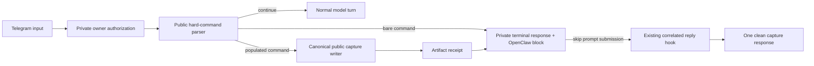

# Hard Capture Commands - Plan

## Goal Capsule

- **Objective:** When Andrew sends a strict capture command through Telegram, jarvOS stores it once, replies briefly, and does not run the language model on that command.
- **Means:** Add a small public command parser, make the private OpenClaw hook translate its result into native `block` or `pass` behavior, and replace the correlated block envelope in the existing reply hook. Reuse the existing canonical writer and artifact receipt. (KTD1-KTD5)
- **Authority:** Public jarvOS owns command meaning and storage routing. Private clawd owns Telegram authorization and OpenClaw hook behavior.
- **Stop condition:** Do not claim completion until one operator-approved Telegram command produces the expected write and no model response.
- **Execution profile:** Two focused changes in separate clean worktrees. Public implementation starts from `4c5a4bb`; private implementation starts from `88b084d`. Land public first, then sync its exact files into the private mirror.

---

## Product Contract

### Summary

Treat `Idea:`, `Note:`, `Journal:`, and `Add to Journal:` at the start of a message as capture-only commands. A populated command writes through the existing canonical capture stack. A bare command asks for content. A locally saved but unsynced write reports that exact state, while an unconfirmed write reports failure. Every recognized outcome stops before model inference. Other prose continues normally.

### Problem Frame

On 2026-08-25, `Idea: article titled “The Next Pandemic: AI Addiction”` was written to the journal, but the OpenClaw hook returned `pass`, so Grok also treated it as a writing prompt. Evidence corrects the original diagnosis in one important respect: Telegram capture ran in `before_agent_run`, not `message_received`. The capture log identified `keyword_trigger`, and a model request followed the write.

The missing stop decision is the practical defect. The absence of an always-loaded instruction may affect how a model interprets the text after fallthrough, but it is not required to explain or fix the deterministic contract failure.

### Key Decisions

- **Fix the narrow user-visible contract now.** (session-settled: user-approved — chosen over a cross-harness capture platform redesign: the broader plan cost more and introduced more risk than this defect warrants.) Governs R1-R10.
- **Keep strict commands separate from ambient capture.** Natural-language idea and note detection remains non-terminal. Governs R1, R6, R7.
- **Use existing acknowledgement evidence.** The current artifact receipt already distinguishes acknowledged and unacknowledged writes. Governs R4-R5.

### Requirements

**Command behavior**

- R1. The public parser recognizes case-insensitive leading `Idea:`, `Note:`, `Journal:`, and `Add to Journal:` commands after optional leading whitespace.
- R2. Populated commands preserve the content after the command delimiter and route `Idea:` to `## 💡 Ideas`, `Note:` to the existing standalone-note flow, and both journal forms to `## 📓 Journal Entry`.
- R3. A bare or whitespace-only command performs no write and returns a short command-specific request for content.
- R4. A populated command may say it was captured only when every user-requested artifact in the existing `jarvos.artifact-receipt.v1` result is `committed` or `already_satisfied`.
- R5. A valid receipt containing only acknowledged outcomes returns the capture confirmation. A valid receipt with local persistence but sync still pending returns `Saved locally; sync pending.` and does not claim completed capture. Missing, malformed, deferred, conflicting, or failed evidence returns a short failure response.

**OpenClaw behavior**

- R6. For an owner-authorized Telegram input, the private adapter maps every recognized hard-command outcome to a valid OpenClaw `block` decision and maps public-parser `continue` to the exact decision `{ outcome: 'pass' }`. Unauthorized input retains the existing authorization behavior and performs no capture.
- R7. Ambient prose and command words embedded later in a sentence retain their current capture and conversation behavior.
- R8. The private adapter consumes the public parser and receipt helper. It does not add another command regex or redefine command routes.
- R9. Strict commands are parsed before the existing ordinary-capture `minLength` gate, so short commands such as `Idea: AI` remain terminal commands.
- R10. Because OpenClaw wraps `before_agent_run` block messages as errors, the private adapter replaces the one correlated blocked-run reply in the existing `reply_payload_sending` hook with the exact short capture response. It must not send a second Telegram message.

### Acceptance Examples

- AE1. Covers R1, R2, R4, R6, R10. `Idea: The Next Pandemic: AI Addiction` writes one bullet under Ideas and returns `Captured to Ideas.` exactly once without a model response.
- AE2. Covers R1, R2, R4, R6, R10. `Journal: Reviewed the capture bug` writes one bullet under Journal Entry and returns `Captured to Journal.` exactly once without a model response.
- AE3. Covers R1, R2, R4, R6, R10. `Note: Capture command contract` uses the existing standalone-note route and returns `Captured as a note.` exactly once without a model response.
- AE4. Covers R3, R6, R10. `Idea:   ` writes nothing, returns `What idea should I capture?` exactly once, and does not reach the model.
- AE5. Covers R5, R6, R10. A valid `saved_locally_sync_pending` receipt returns `Saved locally; sync pending.` exactly once and does not reach the model.
- AE6. Covers R5, R6, R10. A canonical writer failure or invalid receipt returns `I couldn't confirm that capture. Please try again.` exactly once and does not reach the model.
- AE7. Covers R7. `Could you help shape this idea: AI addiction?` passes to the model unchanged.

### Scope Boundaries

**In scope**

- Public command grammar, semantic routes, exact user responses, and focused fixtures.
- Private owner authorization, OpenClaw `before_agent_run` block mapping, and correlated blocked-reply replacement through the existing reply hook.
- Existing canonical storage and artifact receipts.
- One staged temporary-vault check and one operator-approved Telegram acceptance.

**Deferred to Follow-Up Work**

- Cross-harness native interception for Codex, Claude Code, and Hermes.
- New replay ledgers, HMAC action identities, or provenance schemas.
- Immutable package installation or new public/private artifact distribution infrastructure.
- Changes to ambient salience classification.
- An always-loaded instruction projection as defense in depth.

**Out of scope**

- Raw-writing journal files or testing against the real vault.
- Restarting or instrumenting the active OpenClaw gateway during automated tests.
- Proving byte-identical incident-time plugin state when no incident-time digest exists.

### Verified Evidence and Independent Review

- The incident capture log records the strict `idea` keyword route before a real xAI model request began in the same trace. Current loaded plugin source places Telegram capture in `before_agent_run` and returns `pass` after the write. This verifies the observed write-plus-model failure path; it does not dynamically prove the unshipped `block` counterfactual.
- Installed OpenClaw 2026.7.1 source verifies that a valid `before_agent_run` block sets `skipPromptSubmission`, emits one error-marked final payload, tags it as blocked, and runs it through `reply_payload_sending` with the correlated `runId`. KTD5 is the smallest response fix supported by that path.
- An independent Claude Opus 5 review at requested `xhigh` effort challenged this plan before handoff. Integrated findings: block-envelope replacement, short-command length bypass, an explicit local-save/sync-pending response, closed HookDecision shapes, skill-contract coverage, and pinning success to validated `result.artifactReceipt` rather than `captured: true`.
- One proposed review finding was rejected after source verification: the clean public implementation base already contains `jarvos.artifact-receipt.v1`, `validateArtifactReceipt`, `receiptIsAcknowledged`, and focused receipt tests. This plan reuses that contract instead of recreating it.

---

## High-Level Technical Design

This is the directional interaction contract, not an API prescription:



The public side owns command meaning, routing, and persistence evidence. The private side owns who may invoke the command, how OpenClaw suppresses inference, and how its native error envelope is presented in Telegram.

---

## Planning Contract

### Key Technical Decisions

- KTD1. **Extend the existing public keyword router.** Add one pure hard-command parse result beside the existing ambient detection functions. The private adapter imports this result from its public-owned mirror. (session-settled: user-approved — chosen over a private-only regex fix: public jarvOS must own portable capture meaning.) Governs R1-R3, R7-R8.
- KTD2. **Extend current routing rather than add an executor.** `Idea:` and `Note:` retain their existing paths. The journal aliases add one route to the existing journal section writer. Governs R2.
- KTD3. **Use the current artifact receipt as the success gate.** Import `receiptIsAcknowledged` instead of adding a disposition schema or second persistence protocol. (session-settled: user-approved — chosen over a new receipt and provenance layer: the current receipt already carries the required truth.) Governs R4-R5.
- KTD4. **Verify at the hook seam and through one live acceptance.** Unit tests prove the registered hook returns `block` or `pass`; the live check proves the installed user-visible behavior. Do not build a custom OpenClaw QA runtime for this fix. (session-settled: user-approved — chosen over a four-arm provider harness: its complexity and state risk exceeded the value for this defect.) Governs R6-R7.
- KTD5. **Use native block for suppression and the existing reply hook for presentation.** OpenClaw 2026.7.1 turns a `before_agent_run` block into one error-marked final payload and sends it through `reply_payload_sending` with the same `runId`. Store the terminal response in the existing bounded pending-result map, then replace that correlated payload and consume the record. Do not patch OpenClaw or send an out-of-band Telegram message. Governs R6, R10.

### Sequencing

1. Implement and test the public parser and journal route.
2. Land the public change.
3. Sync the exact public-owned files into the private mirror under the existing upstream-source guard.
4. Update and test the OpenClaw gate and correlated reply replacement.
5. Install the private change through the normal managed path, then run the operator-approved live acceptance.

### Risks and Mitigations

- **Ambient prose is blocked accidentally.** Restrict matching to the start of the message and keep ambient fixtures unchanged.
- **A write failure is reported as success.** Use only `receiptIsAcknowledged` for the success response.
- **A locally persisted write is misreported as a retryable failure.** Preserve `saved_locally_sync_pending` as its own terminal, non-success response.
- **Public and private copies drift.** Land public first and sync the exact files under `UPSTREAM_PLAN` enforcement.
- **OpenClaw wraps a `block` message as an error.** Rewrite only the owner-authorized pending result with the same `runId` in `reply_payload_sending`; tests cover absent, expired, and mismatched correlation. Treat live Telegram acceptance as the final gate.
- **Dirty active checkouts overwrite unrelated work.** Use the existing clean public and private worktrees; do not edit or clean the active roots.

---

## Implementation Units

### U1. Add the public hard-command contract

- **Goal:** Make public jarvOS the source of truth for strict command parsing and all four semantic routes.
- **Requirements:** R1-R5, R7-R8; AE1-AE7; KTD1-KTD3.
- **Dependencies:** None.
- **Files:**
  - `modules/jarvos-secondbrain/packages/jarvos-ambient/src/intent/keyword-capture-router.js`
  - `modules/jarvos-secondbrain/packages/jarvos-ambient/src/routing/index.js`
  - `modules/jarvos-secondbrain/bridge/dispatch/src/capture-dispatcher.js`
  - `modules/jarvos-secondbrain/bridge/routing/src/keyword-capture-router.js`
  - `modules/jarvos-secondbrain/bridge/skills/contracts/journal-entry.js`
  - `modules/jarvos-secondbrain/tests/keyword-capture-router.test.js`
  - `modules/jarvos-secondbrain/tests/capture-dispatcher.test.js`
  - `modules/jarvos-secondbrain/tests/universal-capture.test.js`
  - `modules/jarvos-secondbrain/tests/skill-contracts.test.js`
- **Approach:** Add a pure parse result for `continue`, `needs_input`, or `capture`. Reuse existing idea and note routing. Add journal aliases to the current journal section writer. Preserve the current artifact receipt unchanged.
- **Contract update:** Expand the `journal-entry` skill trigger and target declarations so `idea` still targets Ideas while the journal aliases target Journal Entry. Keep the declarations aligned with the executable route.
- **Execution note:** Add the strict-command and ambient near-miss fixtures before changing routing.
- **Patterns to follow:** Existing `detectTrigger`, `buildKeywordRoutingPlan`, `dispatchCapture`, `appendLineToJournalSection`, and `receiptIsAcknowledged` behavior.
- **Test scenarios:**
  - Covers AE1-AE3. Each populated command parses case-insensitively, preserves payload colons, selects the expected route, and returns an acknowledged artifact receipt from the temporary-vault writer.
  - Covers AE4. Each bare command returns `needs_input` and invokes no storage adapter.
  - Covers AE5-AE6. `saved_locally_sync_pending` remains distinguishable from acknowledged, deferred, conflicting, failed, empty, and malformed receipts; only the acknowledged set satisfies `receiptIsAcknowledged`.
  - Covers AE7. Mid-sentence command words, quoted commands, and natural-language idea or journal requests do not enter the hard-command path.
  - The journal-entry skill contract accepts the new explicit journal trigger and declares the matching Journal Entry target.
  - Existing ambient idea and note tests retain their current results.
- **Verification:** Focused parser, dispatcher, universal-capture, and package tests pass with no private paths or Telegram metadata in public fixtures.

### U2. Make the private OpenClaw hook terminal for hard commands

- **Goal:** Stop Telegram hard commands before model inference and return receipt-derived responses.
- **Requirements:** R3-R10; AE1-AE7; KTD1, KTD3-KTD5.
- **Dependencies:** U1 landed and its exact public-owned files are available for sync.
- **Files in private clawd:**
  - `jarvos-secondbrain/packages/jarvos-ambient/src/intent/keyword-capture-router.js`
  - `jarvos-secondbrain/packages/jarvos-ambient/src/routing/index.js`
  - `jarvos-secondbrain/bridge/dispatch/src/capture-dispatcher.js`
  - `jarvos-secondbrain/bridge/routing/src/keyword-capture-router.js`
  - `jarvos-secondbrain/bridge/skills/contracts/journal-entry.js`
  - `jarvos-secondbrain/src/artifact-receipt.js`
  - `extensions/capture-router/index.js`
  - `scripts/capture-router-hook.js`
  - `tests/extensions/capture-router.test.js`
  - `scripts/test-capture-hook.js`
- **Approach:** Sync the public-owned files without local semantic changes. In `processBeforeAgentRun`, authorize first and parse once through the public helper before applying ordinary `minLength`. Return exactly `{ outcome: 'pass' }` for `continue`. For a hard command, capture at most once, validate `result.artifactReceipt`, derive the terminal response from that receipt rather than `captured: true`, save the response under the current owner-authorized `runId`, and return a valid block shape with a non-empty reason. In `processReplyPayloadSending`, replace the correlated block-error payload with that response and consume the pending record. Keep Telegram `message_received` observer-only.
- **Execution note:** Characterize the current registered hook return first, then change only the hard-command branch.
- **Patterns to follow:** Existing protected-identity authorization, `processBeforeAgentRun`, `_pendingCaptureResults`, `processReplyPayloadSending`, public `routeCapture`, `validateArtifactReceipt`, `receiptIsAcknowledged`, and Vitest synthetic API registration.
- **Test scenarios:**
  - Covers AE1-AE3. Authorized populated commands, including a payload shorter than `minLength`, call capture once with stripped content, validate `result.artifactReceipt`, and return `{ outcome: 'block', reason: <non-empty>, message: <non-empty> }`.
  - Covers AE1-AE4. The same `runId` rewrites the one blocked reply payload to the exact confirmation or input request, then consumes the pending record; it never sends a second message.
  - Covers AE4. Bare commands call no capture function and still return a valid `block` decision.
  - Covers AE5. A locally-saved/sync-pending receipt yields its distinct terminal response, not the success or retry response.
  - Covers AE6. Capture throw, `captured: false`, malformed receipt, missing receipt, deferred, conflict, and failed outcomes return the failure block and correlated final text.
  - Covers AE7. Ambient input returns exactly `{ outcome: 'pass' }` and creates no pending terminal response.
  - Missing, expired, wrong-run, wrong-account, and wrong-conversation correlations cannot rewrite an outbound payload.
  - Unauthorized input retains the current authorization behavior and performs no capture.
  - The `message_received` Telegram path still performs no second capture.
- **Verification:** Focused private tests pass in a temporary vault. The upstream-source guard identifies the synced public-owned files and accepts the public plan reference.

---

## Verification Contract

### Public gates

```bash
node --test \
  modules/jarvos-secondbrain/tests/keyword-capture-router.test.js \
  modules/jarvos-secondbrain/tests/capture-dispatcher.test.js \
  modules/jarvos-secondbrain/tests/universal-capture.test.js \
  modules/jarvos-secondbrain/tests/artifact-receipt.test.js \
  modules/jarvos-secondbrain/tests/skill-contracts.test.js

npm --prefix modules/jarvos-secondbrain test
git diff --check
```

These tests prove public grammar, semantic routing, acknowledgement truth, and ambient compatibility. They do not prove the installed Telegram hook.

### Private gates

```bash
npx vitest run tests/extensions/capture-router.test.js
node scripts/test-capture-hook.js
git diff --check
```

These tests prove authorization, registered-hook decision shape, temporary-vault capture, receipt-derived response selection, and correlated reply replacement. OpenClaw's installed source establishes that `block` skips prompt submission; these tests do not prove the active installed tuple or provider silence.

### Live acceptance

After the public change lands and the private managed install resolves to the tested revisions:

1. Send one harmless `Idea:` command through Telegram.
2. Record the command's `runId` and trace identifier, then confirm one Ideas bullet and one short capture response.
3. Inspect the existing gateway diagnostic trace for that same `runId`: require the `before_agent_run` blocked outcome and zero model-call/provider-request start events. Visible silence alone is not evidence of inference suppression.
4. Send one ambient near-miss and confirm normal model behavior.
5. Send one bare command and confirm no additional journal content.

Do not automate this against the real Telegram account or vault. The operator initiates and inspects the acceptance.

---

## Definition of Done

- Public jarvOS owns one tested parser for all four strict commands and the new Journal Entry route.
- The private mirror matches the landed public-owned files without a second command grammar.
- For owner-authorized Telegram input, the OpenClaw hook returns `block` for every recognized command outcome and `pass` for public-parser `continue`; unauthorized input keeps the existing no-capture behavior.
- Short commands bypass ordinary capture length filtering.
- The blocked-run error envelope is replaced once through the existing correlated reply hook; no second Telegram send is introduced.
- `Captured` responses require a validated `result.artifactReceipt` accepted by the existing acknowledgement helper; locally saved/sync-pending remains explicit and non-success.
- Public and private focused suites pass from clean worktrees.
- One operator-approved Telegram acceptance binds the hard command to one write, one short response, a blocked hook outcome, and zero provider-request starts for the same `runId`, with an ambient positive control.
- Broader replay, provenance, packaging, and cross-harness work remains outside the implementation diff.
- Experimental or abandoned code from implementation is removed before review.
