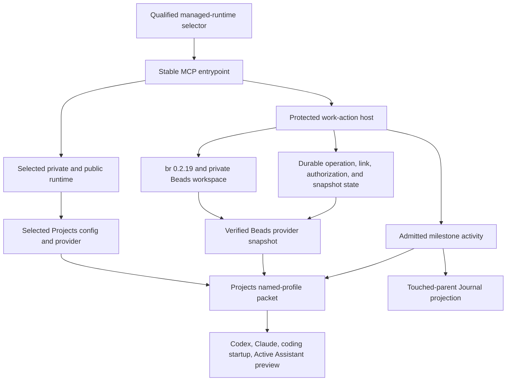
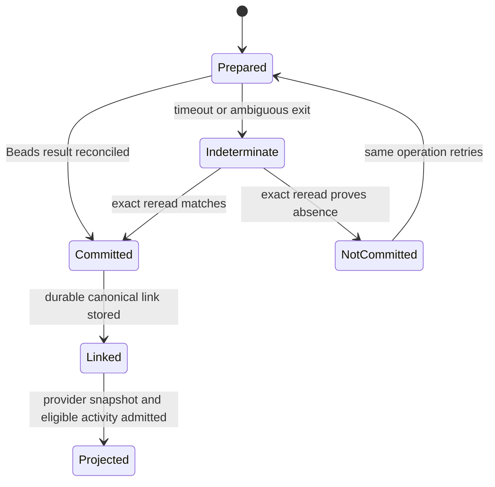

# Projects and Todo Live Unlock - Plan

## Goal Capsule

- **Objective:** Make Projects orientation and Beads-backed Todo behavior visible and trustworthy in Andrew's ordinary agent conversations, starting with Codex and the Active Assistant.
- **Means:** Repair selected-runtime binding drift, install the already-pinned Beads runtime, bind the protected work-action host, and prove one real local lifecycle without expanding the product model.
- **Authority:** Projects owns project and outcome meaning plus assistant-facing context. Beads owns executable Todo state. Coding and domain producers own verified activity. Paperclip remains an optional explicit handoff.
- **Execution profile:** Characterize first in clean public and private worktrees, land the smallest missing public contract before private activation, and treat selected-runtime canary plus rollback as the completion proof.
- **Stop conditions:** Stop before mutating a dirty checkout, broadening a capability to hide a mismatch, creating a second Todo store, inferring canonical identity from titles, persisting secrets or raw provider packets, or activating an unreviewed runtime tuple.
- **Tail ownership:** The implementing session owns review, public and private merge verification, selected-runtime activation, rollback proof, and proof-gated cleanup. An installed binary, passing unit test, open PR, or merged PR is not completion by itself.

---

## Product Contract

### Summary

The Projects and Todo foundations are substantially implemented, but the live user journey is not activated. Projects can return the canonical portfolio when its query matches the host capability, while the ordinary Codex MCP registration still points at an older immutable runtime and reads a stale workspace configuration. Todo tools, durable Beads operations, canonical execution links, and activity contracts exist on `origin/main`, but no selected host binds the work-action service and no compatible `br` binary is installed.

This plan unlocks those existing contracts. It does not redesign Projects, create a dashboard, or reintroduce a standalone Todo lifecycle.

### Problem Frame

Andrew sees no evidence that Projects or Todo is doing anything because the installed consumers and host state do not form one coherent runtime tuple. The fail-closed Projects behavior is correct but operationally opaque: a stale query/capability pair becomes `PROJECTS_PROVIDER_UNAVAILABLE`. Todo is even earlier in rollout: the tools are advertised but their host service is intentionally unavailable, so Beads, activity, and Todo provider fields remain omitted.

The system needs one activation path that selects the runtime, provider, config, capability, executable, durable stores, and canonical workspace together and rejects drift before a conversation starts.

### Requirements

**Selected-runtime Projects truth**

- R1. Codex MCP, Claude MCP, shared hydration, coding startup, and Active Assistant preview resolve Projects through one selector-resolution contract over the same currently selected managed runtime, protected configuration, provider module, capability, and profile query.
- R2. A selected-runtime transition updates consumer bindings through a stable selector-aware entrypoint; persisted consumer configuration never points directly at an immutable staged runtime directory. Long-running consumers either revalidate the selector generation per request or restart as an explicit part of the transition.
- R3. Query scope, capability scope, limits, expected generation, and deployment digests must agree exactly. Drift returns a classified non-enumerating result and a repair action rather than fallback project facts.
- R4. A parity receipt binds the selected private and public commits, installed artifact digests, config and capability fingerprints, query and capability scopes, canonical generation, profile, packet fingerprint, consumer surface, and durable-state contract versions without storing raw packet contents or private paths.

**Beads-backed Todo activation**

- R5. `br` version `0.2.19` must first pass an exact command-surface conformance check in a temporary workspace, then be installed from a signature-verified upstream artifact and invoked only through the existing non-shell, version-checked Beads adapter. A missing flag or incompatible JSON shape requires a public adapter change and cannot be hidden by a private command override.
- R6. Todo create, list, show, claim, block, resume, complete, and reopen use two namespaced durable ledgers under distinct owner-only roots: the tracker operation ledger and the work-action operation ledger. They also use one durable Projects execution-link store. No memory-only operation or link store is permitted in the live host.
- R7. Every mutation is authorized by protected host state bound to the exact operation, request fingerprint, actor class, canonical Project or Outcome and revision, pinned Beads workspace identity, and expected item revision. Caller-supplied operation IDs are accepted only when they match the host authorization receipt. Agent-observed work may become a proposal but cannot self-authorize human attestation or completion.
- R8. Terminal states cannot be reached through the generic transition action. Completion uses a host-resolved immutable receipt from a registered human-attestation, coding, or domain producer. Successful reconciled Beads mutations produce a fresh bounded Beads provider snapshot; eligible completion or coding milestones admit Project activity exactly once; indeterminate mutations produce neither a new snapshot claim nor activity.
- R9. Paperclip is absent from the local happy path. Its absence, status, comments, or assignments cannot affect Projects identity, Todo eligibility, or Beads ownership.

**Rollout and user-visible proof**

- R10. One real canary flows through the ordinary Todo MCP surface from creation to completion, appears in Projects current work, and records an explicitly authorized owner-attested activity event with wording that does not imply technical or external verification. That event touches only its canonical parent in the Journal projection.
- R11. Active Assistant proof remains delivery-disabled until the same Projects packet fingerprint and Todo facts are observed through its selected-runtime preview; proof must not send Telegram or write an unapproved journal entry.
- R12. Activation includes a rollback to the prior selected runtime and restoration of the new runtime. Failed restoration leaves the prior proven runtime selected and reports one explicit degraded state.
- R13. Public and private changes are merged and reread at exact heads before activation. Cleanup preserves dirty, ahead, active, selected, locked, ambiguous, or unreachable assets.

### Acceptance Examples

- AE1. Given the renewed whole-portfolio capability and selected config, when Codex hydration and Active Assistant preview request `orientation`, both return the same canonical records and packet fingerprint instead of `PROJECTS_PROVIDER_UNAVAILABLE`.
- AE2. Given the workspace config drifts back to the old release-only scope, when a consumer requests orientation, the request fails closed with a scope-mismatch repair code and enumerates no projects.
- AE3. Given Paperclip is unconfigured and the host has issued an exact authorization receipt, when Andrew creates, claims, blocks, resumes, completes, and reopens a Todo, exactly one Beads item and one canonical execution link survive retries and restarts. A caller-supplied operation ID that differs from the receipt is rejected before Beads I/O.
- AE4. Given a Beads command times out after external I/O, when the operation is retried, the host reconciles the immutable operation identity before replay and emits no unsupported Projects activity while the result is indeterminate.
- AE5. Given a completed canary on the `v1.0.0 release` child Outcome, when Projects and the Journal projection reread admitted evidence, orientation reports the bounded activity once and the Journal derives only the parent `jarvOS` link.
- AE6. Given the new runtime is selected, when rollback and restore run, both transitions verify their exact tuple and neither transition duplicates Beads work, activity, execution links, or Journal projection.

### Scope Boundaries

**In scope**

- Repair selector-aware Projects bindings for ordinary MCP consumers.
- Install and verify the pinned Beads runtime.
- Add the protected private work-action binding, persistent roots, provider snapshot projection, and exact authorization receipts needed by the already-shipped Todo tools.
- Run one delivery-disabled Active Assistant preview and one real local Todo canary.
- Merge public dependencies before private activation and prove rollback.

**Deferred to Follow-Up Work**

- Portfolio-wide migration or backfill of historical Paperclip, Journal, or unlinked Beads items.
- New Project or Todo dashboards, Beads Viewer installation, notifications, wakeups, and schedulers.
- Automatic project inference beyond the evidence already admitted by the current registry and inference contracts.
- Automatic Paperclip handoff or two-way synchronization.

**Outside this product's identity**

- A Projects-owned task lifecycle.
- A standalone Todo database or Todo-to-Beads promotion lifecycle.
- Treating Paperclip as required or as the source of project meaning.
- Treating configuration, test success, binary installation, or PR merge as live behavioral proof.

---

## Planning Contract

### Product Contract Preservation

The authority split, hierarchy, conversation-first interface, bounded context, optional Paperclip relationship, and touched-parent Journal behavior from the origin plan are unchanged. This successor removes work already merged and narrows execution to the remaining selected-runtime and Beads activation gaps.

### Key Technical Decisions

- KTD1. **Repair activation before adding behavior.** `(session-settled: user-approved — chosen over further Projects or Todo feature work: the existing implementation succeeds under a matching host binding and the user-visible failure is deployment drift.)` U1-U4 may change product code only when a characterization test proves the current contracts cannot support the activation.
- KTD2. **Use a shared selector-resolution module and persist consumer configuration against its stable entrypoint.** A selected runtime may change after every reviewed release, so Codex and Claude configuration call the stable owner-controlled MCP shim while Active Assistant, hydration, and coding startup consume the same selector resolution. Each consumer revalidates the generation per request or participates in an explicit transition restart. Governs R1-R4.
- KTD3. **Keep the private coordination root as the initial Beads workspace with a pinned logical workspace ID.** The private `clawd` workspace is the cross-repository coordination boundary; its Beads data and host state remain private and durable while execution links carry exact repository/worktree identity. Activation decides and tests whether `.beads` state is committed or ignored, verifies `br where` realpath equality, takes a pre-canary state backup, and never initializes Beads inside the public jarvOS repository. Governs R5-R9.
- KTD4. **Use one durable state family with separate namespaces and versioned contracts.** The tracker ledger, work-action ledger, execution links, authorization, and provider snapshots occupy distinct owner-only roots. The selected runtime supplies executable code, while state survives runtime replacement and rollback only when its recorded contract versions are compatible. Memory stores remain test fixtures only. Governs R6-R8 and R12.
- KTD5. **Make Todo activity causal, not inferred.** The work-action host writes a provider snapshot only after exact Beads reconciliation and admits activity only from an authorized durable milestone. Reads, retries, title matches, and tracker status alone create no activity. Governs R7-R10.
- KTD6. **Prove activation through ordinary entrypoints and rollback.** Package tests and injected providers remain necessary but insufficient. The release gate is fingerprint parity across ordinary MCP and Active Assistant preview, followed by a real Beads-only canary and rollback/restore. Governs R10-R13.
- KTD7. **Admit an owner-attested Todo completion as its own evidence class and producer.** The host resolves a registered immutable Andrew-approval receipt and records only that Andrew marked the work complete; it never converts this into coding, release, publication, or other technical proof. Generic transitions cannot enter terminal states. Governs R7-R10.

### High-Level Technical Design

### Sequencing

1. Prove the exact `br` command surface in a throwaway workspace and characterize selected-runtime drift before any live state mutation.
2. Fix selector-resolution parity and add a drift oracle before installing or mutating live Beads state.
3. Complete the durable public work-action host and completion contracts, then bind them privately with owner-only state and authorization.
4. Stage reviewed public and private heads, install the verified dependency, and run the real canary through ordinary entrypoints.
5. Merge in dependency order, re-stage from exact merged heads, prove rollback and restore, then clean only proof-positive disposable assets.

### System-Wide Impact and Risks

- **Selected-runtime drift:** Direct staged-runtime paths become stale silently. The stable shim and parity test make the selector the single deployment pointer.
- **Private state integrity:** Beads operations, execution links, and authorization are durable writes. Atomic replacement, owner-only permissions, revision checks, and restart tests are required.
- **Ambiguous external I/O:** `br` may mutate before a timeout is observed. Reconciliation by operation identity must precede replay.
- **Ledger collision:** Tracker and work-action receipts share an external operation identity but not a record schema. Their physical stores must remain separately namespaced and replay must traverse both without conflict.
- **Authority confusion:** Agent MCP calls are not authenticated Andrew attestations. Completion requires a host-resolved receipt, and the canary authorization must be exact and bounded.
- **Dirty coordination root:** The live `clawd` checkout may remain dirty for unrelated work. Installation and state initialization must avoid branch switches, resets, cleanup, or absorption of existing changes.
- **Cross-repository landing:** Private activation depends on the reviewed public contract. A private merge or runtime stage against an unmerged public checkout is not deployable evidence.

### Sources and Research

- `docs/plans/2026-08-12-001-feat-projects-context-cutover-plan.md` owns the product authority and bounded-context decisions.
- `modules/jarvos-agent-context/src/projects-context-bootstrap.js` and `modules/jarvos-agent-context/scripts/jarvos-mcp.js` provide the protected Projects and Todo host seams.
- `modules/jarvos-coding/src/adapters/live/beads-tracker.js` provides version negotiation, non-shell invocation, durable operation reconciliation, and timeout boundaries.
- `modules/jarvos-coding/src/features/work-actions.js` and `modules/jarvos-secondbrain/packages/jarvos-secondbrain-projects/src/execution-link-store.js` provide the work-action and canonical-link contracts.
- `examples/work-action-host-service.js` is the reusable host composition pattern but currently defaults to an in-memory execution-link store.
- The upstream `beads_rust` v0.2.19 release provides signed macOS artifacts and matches the adapter's pinned version: https://github.com/Dicklesworthstone/beads_rust/releases/tag/v0.2.19

---

## Implementation Units

### U0. Prove dependency and installed-runtime contracts before design changes

- **Goal:** Turn the two load-bearing external assumptions into executable characterization evidence before host composition or live mutation.
- **Requirements:** R1-R5; governed by KTD1-KTD2.
- **Dependencies:** None.
- **Repositories:** jarvOS and clawd read-only characterization fixtures.
- **Files:** jarvOS — `modules/jarvos-coding/test/live-adapters.test.js`, `modules/jarvos-agent-context/test/work-action-host.test.js`; clawd — `tests/scripts/jarvos-managed-harness.test.js`, a focused Beads conformance test under `tests/scripts/`.
- **Approach:**
  1. Exercise the upstream `br` v0.2.19 binary in a temporary workspace against every argv and JSON contract the live adapter uses: version, capabilities, schemas, exact workspace discovery, create with external reference, show by external reference, update, dependency, checkpoint, and operation identity.
  2. Capture the current installed-client failure by reading persisted Codex and Claude registrations, resolving the qualified selector, and comparing the runtime/config/provider each consumer would actually launch.
  3. Classify any incompatible `br` command or output as a public adapter gap. Do not use the private command-map escape hatch to make the test pass.
- **Execution note:** This is characterization-first work. Do not initialize the live Beads workspace or rewrite consumer configuration in this unit.
- **Patterns to follow:** Existing live-adapter fixtures, managed-runtime selector attestation, and installed-client doctor checks.
- **Test scenarios:**
  - The signed macOS artifact reports version `0.2.19` and satisfies every exact argv and JSON expectation used by the adapter.
  - A missing flag, changed output shape, wrong `br where` realpath, quarantined executable, or unsigned/unverified artifact stops before host composition.
  - Persisted client configuration naming an immutable staged runtime is detected even when a synthetic subprocess launched from the selected runtime succeeds.
  - A selected runtime, workspace config, and capability mismatch produces the current unavailable symptom without enumerating Projects data.
- **Verification:** The conformance matrix is green for the exact binary or the run stops with a bounded public-adapter change; the installed-runtime characterization reproduces the user's failure from persisted client state.

### U1. Make selected-runtime Projects binding authoritative

- **Goal:** Ensure ordinary Codex and Claude MCP processes use the currently selected runtime's Projects config and provider through the stable managed-harness entrypoint.
- **Requirements:** R1-R4; covers AE1-AE2; governed by KTD1-KTD2.
- **Dependencies:** U0.
- **Repositories:** jarvOS and clawd.
- **Files:** clawd — `scripts/lib/jarvos-managed-software-runtime-selector.js`, `scripts/lib/jarvos-managed-harness-mcp-entrypoint.js`, `scripts/lib/jarvos-managed-harness-dispatcher.js`, `scripts/jarvos-managed-harness.js`, `scripts/jarvos-doctor.js`, Active Assistant and coding-startup selector consumers, `tests/scripts/jarvos-managed-harness.test.js`, `tests/jarvos-doctor.test.js`; jarvOS — `runtimes/codex/setup.sh`, `runtimes/claude/setup.sh`, `modules/jarvos-agent-context/scripts/jarvos-mcp.js`, `modules/jarvos-agent-context/src/projects-context-bootstrap.js`, `modules/jarvos-agent-context/test/projects-context.test.js`, `modules/jarvos-agent-context/test/work-action-host.test.js`.
- **Approach:**
  1. Characterize the current failure: a persisted direct stage path or ambient workspace config can disagree with the qualified selector.
  2. Extract one selector-resolution result consumed by the stable MCP entrypoint, Active Assistant, hydration, and coding startup. Define whether each consumer revalidates per request or restarts during a transition.
  3. Make public Codex and Claude setup register the stable entrypoint and required non-secret host bindings. A later setup rerun must not repin either client to the setup script's immutable install root.
  4. Align the Projects config integrity rule across bootstrap and Todo host loading: a config may be owner-controlled and non-group/world-writable with trusted ancestry, while service, authorization, and secret files remain owner-only. Return a repair code that names the class of mode error without echoing a path.
  5. Add a doctor/parity read that compares selector, persisted client registrations, config query, capability scope, installed provider, canonical generation, profile, and packet fingerprint while redacting private paths and packet contents.
  6. Keep an unavailable or transition-busy selector fail-closed; never fall back to the dirty workspace provider or an older stage.
- **Execution note:** Start with an installed-runtime characterization test. This is a deployment/configuration repair; the first green proof is an MCP subprocess using the real stable shim, not an injected provider unit test.
- **Patterns to follow:** Existing selector attestation and `resolveDispatchAsset`; Active Assistant selected-provider environment binding; jarvOS protected bootstrap validation.
- **Test scenarios:**
  - Covers AE1. A qualified selector launches the selected MCP asset with its matching config and provider and returns the expected whole-portfolio packet fingerprint.
  - Covers AE2. A stale workspace config with a release-only query cannot override the selected config.
  - A selector transition, malformed selector, wrong private head, wrong public gitlink, escaped provider path, or missing selected config refuses launch without exposing a path.
  - A runtime reselection changes behavior through the stable shim; long-running consumers restart or revalidate according to the declared policy.
  - Running public setup after activation preserves the stable entrypoint rather than repinning an immutable stage.
  - A trusted `0644` Projects config is accepted consistently; a group/world-writable config or non-owner-only service module fails with a bounded mode repair code.
  - Codex and Claude setup produce selector-aware registrations and never persist capability secrets or raw receipts.
- **Verification:** Persisted Codex and Claude registrations read back as selector-aware, a real ordinary Codex startup hydration reports Projects available, and the doctor names no selector/config/provider drift or private packet data.

### U2. Bind a durable Beads-backed work-action host

- **Goal:** Turn the shipped Todo MCP tools into a durable, authorized Beads service without creating another task store.
- **Requirements:** R5-R9; covers AE3-AE4; governed by KTD1 and KTD3-KTD5.
- **Dependencies:** U0-U1.
- **Repositories:** jarvOS first, then clawd.
- **Files:** jarvOS — `examples/work-action-host-service.js`, `modules/jarvos-coding/src/index.js`, `modules/jarvos-coding/src/features/work-actions.js`, `modules/jarvos-coding/src/adapters/live/beads-tracker.js`, `modules/jarvos-coding/test/live-adapters.test.js`, `modules/jarvos-agent-context/scripts/jarvos-mcp.js`, `modules/jarvos-agent-context/test/work-action-host.test.js`, `modules/jarvos-agent-context/README.md`, `tests/pack-manifest-test.js`; clawd — `config/jarvos-project-context.json`, `scripts/lib/jarvos-project-work-action-service.js`, `scripts/lib/jarvos-project-work-action-authorization.js`, `scripts/lib/jarvos-project-beads-provider.js`, and focused tests under `tests/scripts/`.
- **Approach:**
  1. Characterize the public host example's memory-only execution links and missing work-action ledger, then extend the reusable composition seam to require separate tracker-ledger, work-action-ledger, and execution-link roots for a live binding.
  2. Export and package every durable-store implementation the installed host requires; add pack-manifest assertions for the coding entrypoint, work-action service, and Projects execution-link store.
  3. Add the private host composition that binds a pinned logical workspace ID, exact approved roots, pinned executable, separate durable stores, registered completion producers, `resolveCompletionReceipt`, and protected authorization resolver. The public MCP caller supplies no paths, authority, or evidence.
  4. Reject generic transitions into terminal statuses. Add the owner-attested Todo completion producer described by KTD7 and ensure its receipt proves only the attestation.
  5. Require external-reference equality when reconciling a create result; an empty or unrelated JSON result cannot become a committed operation.
  6. Write a bounded Beads provider snapshot only after the tracker operation and canonical execution link reconcile to the same item revision.
  7. Admit eligible activity through the registered producer boundary and operation identity. Preserve indeterminate, conflicting, stale, unlinked, and unauthorized outcomes as explicit omissions.
  8. Keep Paperclip entirely outside this service; explicit handoff remains a separate later action.
- **Execution note:** Characterize operation replay and crash boundaries before changing host composition. Use temporary Beads workspaces for tests; do not initialize the live ledger until reviewed code and private configuration are ready.
- **Patterns to follow:** File-backed Beads operation store; Projects execution-link compare-and-swap; private activity-provider generation; owner-only managed-runtime state.
- **Test scenarios:**
  - Covers AE3. With Paperclip absent, create, list, show, claim, block, resume, complete, and reopen one canonically linked item using one durable work-action service.
  - Duplicate operation IDs with identical inputs return the committed result; conflicting inputs or stale revisions fail without mutation.
  - One retry traverses the separately namespaced tracker and work-action ledgers without a record-schema or fingerprint conflict.
  - Covers AE4. Timeout after Beads I/O reconciles before replay and produces no snapshot or activity while indeterminate.
  - Restart after operation commit but before link write recovers one item and one link; restart after link write but before snapshot publication produces one snapshot generation.
  - Missing or wrong `br` version, unsupported capabilities, foreign workspace, unsafe executable, missing authorization, forged human attestation, and escaped state roots fail closed.
  - A caller-supplied operation ID that differs from the host receipt is rejected before I/O; a generic transition to a terminal status cannot bypass completion evidence.
  - An empty or unrelated `show --external-ref` result does not reconcile a create operation as committed.
  - A memory execution-link store is rejected by the live private binding while remaining available to isolated tests.
  - Provider snapshot and receipt privacy scans contain no raw Beads database, secret, prompt, private mapping, or unrelated task content.
- **Verification:** The public contract suites and private host tests pass across restart and ambiguity cases; the live binding remains disabled until reviewed merged artifacts are staged.

### U3. Activate and prove the Projects and Todo user journey

- **Goal:** Install the reviewed dependency, activate the selected bindings, and prove the user-visible conversation path with one real canary.
- **Requirements:** R1-R12; covers AE1 and AE3-AE6; governed by KTD3-KTD6.
- **Dependencies:** U1-U2 and reviewed public/private candidate heads.
- **Repositories:** clawd operational state plus the staged managed runtime.
- **Files:** clawd — `config/jarvos-project-context.json`, managed-runtime stage and selection tests, Active Assistant preview tests, Projects activity and Journal projection tests; operational outputs are metadata-only receipts under the existing owner-controlled Projects and managed-runtime state roots.
- **Approach:**
  1. Install the exact signed `br` v0.2.19 artifact for the host architecture, verify the upstream minisign signature and published checksum, clear or classify Gatekeeper quarantine, and verify the exact version through non-shell invocation.
  2. Decide and record whether `.beads` operational state is committed or ignored in the private coordination repository. Initialize without switching or cleaning the dirty checkout, prove `br where` equals the configured realpath, pin a logical workspace ID, and take a pre-canary state backup.
  3. Stage the reviewed private candidate with its reviewed public dependency and bind the stable MCP shim, selected Projects config/provider, private work-action service, separately namespaced durable state roots, registered completion producer, and exact canary authorization.
  4. Read back persisted Codex and Claude registrations, then prove Projects fingerprint parity through a real ordinary Codex startup, Claude MCP, shared hydration, coding startup where available, and delivery-disabled Active Assistant preview.
  5. Execute one canary Todo through create, claim, block, resume, complete, and reopen/complete as needed to prove revision behavior. Verify both operation ledgers, Beads, execution link, provider snapshot, owner-attested activity, Projects orientation, and touched-parent Journal preview at each eligible boundary.
  6. Revoke the canary authorization after completion and retain the Beads item and admitted activity as legitimate history.
- **Execution note:** Prefer runtime and canary proof over broad unit-test repetition. Any unexpected mutation or identity ambiguity stops the canary and preserves state for reconciliation.
- **Patterns to follow:** Signed dependency installation, selected-runtime stage/select receipts, delivery-disabled Active Assistant preview, touched-parent Journal projection.
- **Test scenarios:**
  - Covers AE1. All supported consumers return the same availability, canonical generation, profile, and packet fingerprint.
  - Covers AE3. The ordinary Todo MCP surface completes the lifecycle with Paperclip unavailable.
  - Covers AE5. Child Outcome activity appears once in Projects and derives only the parent Project in Journal preview.
  - An expired capability, changed selected head, wrong config digest, stale provider snapshot, or revoked operation authorization blocks the corresponding action without fallback.
  - A repeated canary command after restart reconciles rather than duplicates the Beads item, link, activity, or Journal projection.
  - `br where` realpath or logical workspace ID drift blocks before mutation and never orphans an existing execution link.
  - Active Assistant preview performs no Telegram delivery and no unapproved Journal write.
- **Verification:** A metadata-only canary receipt binds the installed and selected tuple, operation and item identifiers, link and activity receipts, packet fingerprint, preview result, and explicit Paperclip absence.

### U4. Land, rollback, restore, and close the activation

- **Goal:** Finish on exact merged heads with a proven reversible selected runtime and no abandoned implementation state.
- **Requirements:** R12-R13; covers AE6; governed by KTD6.
- **Dependencies:** U1-U3.
- **Repositories:** jarvOS and clawd.
- **Files:** Public and private changed files from U1-U3, existing managed-runtime transition and stewardship evidence surfaces, and this plan.
- **Approach:**
  1. Review and merge any required public change, reread the exact GitHub merge head, and rebuild the private candidate against that merged public dependency.
  2. Review and merge the private activation change, then stage and select a runtime built from both exact merged heads.
  3. Rerun the parity and Todo canary read paths from the merged selected runtime without creating a second work item.
  4. Record tracker-ledger, work-action-ledger, execution-link, and work-action contract versions. Roll back only when the prior runtime is compatible; otherwise explicitly unbind Todo during rollback while preserving state, then rebind on restore. Verify Projects remains safe and Beads state is unchanged before restoring the new runtime and its packet fingerprint.
  5. Reconcile issue, branch, worktree, and session ownership. Invoke cleanup only for exact assets the existing classifier proves merged, clean, inactive, reachable, unlocked, unselected, and otherwise disposable.
- **Execution note:** Merge and rollback evidence are release gates. Do not collapse `merged`, `selected`, `verified`, and `cleanup_verified` into one success state.
- **Patterns to follow:** Existing PR lifecycle, CI qualification, managed-runtime selector transition, rollback receipts, and proof-positive stewardship cleanup.
- **Test scenarios:**
  - Covers AE6. Rollback and restore preserve one Beads item, one execution link, one admitted activity set, and one Journal projection result.
  - A rollback target with incompatible durable-state contracts leaves Todo explicitly unavailable rather than attempting to parse or mutate newer state.
  - A public/private head mismatch, failed required check, selected-runtime digest mismatch, transition-busy state, or failed restore preserves the prior proven runtime.
  - Fresh GitHub and Git rereads prove both merged heads and dependency ancestry before activation.
  - Dirty, ahead, active, selected, locked, ambiguous, or unreachable worktrees are preserved and reported.
- **Verification:** Required PRs are merged and reachable, the restored selected runtime passes parity and read-only canary verification, and cleanup receipts exist only for proof-positive disposable assets.

---

## Verification Contract

| Gate | Units | Required evidence |
|---|---|---|
| Dependency and installed-client conformance | U0 | The exact signed `br` artifact passes every adapter argv and JSON expectation in a temporary workspace, and persisted Codex/Claude registrations reproduce or clear the selected-runtime drift. |
| Selected-runtime MCP parity | U1, U3 | Stable-shim tests, persisted-registration rereads, one ordinary Codex startup, and a live redacted doctor receipt prove selector, config, provider, capability/query scopes, canonical generation, profile, and packet fingerprint agreement across ordinary consumers. |
| Public work-action durability | U2 | Agent-context, coding live-adapter, execution-link, packaging, and restart/ambiguity tests pass with separately namespaced tracker/work-action ledgers and the live host refusing memory-only state. |
| Private host authority and projection | U2-U3 | Focused clawd tests prove exact operation authorization, pinned Beads negotiation, durable state, provider snapshot generation, activity admission, privacy, and Paperclip independence. |
| Real selected-runtime canary | U3 | One Beads-backed Todo lifecycle is visible through ordinary MCP and Projects context; Active Assistant and Journal checks remain delivery-disabled or preview-only where required. |
| Rollback and restore | U4 | Metadata-only receipts prove prior selection, rollback health, restored selection, stable packet fingerprint, and unchanged durable Todo identities. |
| Landing and cleanup | U4 | Required GitHub checks and merge rereads pass at exact heads; fresh Git ancestry is proven; cleanup preserves every non-proof-positive asset. |

---

## Definition of Done

- Ordinary Codex and Claude configuration calls a stable selector-aware jarvOS MCP entrypoint rather than an immutable staged-runtime path.
- Projects `orientation` is available from ordinary hydration and delivery-disabled Active Assistant preview with matching canonical generation and packet fingerprint.
- `br` v0.2.19 passes exact command conformance and signature verification; the live Todo host uses separate durable tracker/work-action ledgers plus durable execution-link, authorization, and provider state.
- One real Paperclip-free Todo lifecycle survives retries and restart, appears correctly in Projects current work and owner-attested activity, and produces only the expected touched-parent Journal preview.
- Public and private changes are reviewed, merged, reread, staged from exact merged heads, selected, rolled back, restored, and verified.
- No secret, raw provider packet, raw Beads database, private mapping, prompt, or unrelated work appears in public artifacts or metadata receipts.
- No dirty checkout, active session, selected runtime, or ambiguous worktree is reset, switched, absorbed, or removed.
