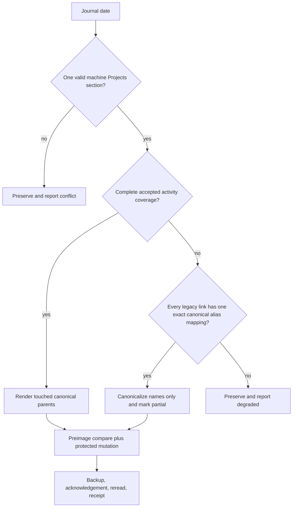

## Goal Capsule

- **Objective:** Make canonical Project identity, current work, and next attention follow Andrew reliably across Codex, Claude, Hermes, OpenClaw, and the Active Assistant, stop future overly specific Daily Journal labels, and safely apply the bounded historical label repair when Andrew approves its exact manifest.
- **Means:** Finish selected-runtime parity, bind each session to shared Projects and Beads references, refresh at native turn boundaries only when the shared revision changes, reconcile the known canonical naming corrections, stop stale Journal projection, and prepare one exact receipt-backed historical repair for Andrew's approval.
- **Authority:** Projects owns durable meaning, identity, hierarchy, aliases, and the assistant-facing read model. Beads owns executable Todo state and claims. Project Inference proposes or reconciles structure from evidence. Paperclip remains an optional explicit handoff or projection.
- **Execution profile:** Characterize installed consumers first, extend existing provider and session-bridge contracts rather than add a new service, prove cross-harness behavior with one real Beads-backed work item, then stage, merge, select, roll back, and restore exact reviewed tuples.
- **Stop conditions:** Stop on dirty or foreign worktree mutation, ambiguous Project identity or parentage, stale selector or packet provenance, caller-controlled provider scope, unverified Journal coverage, failed compare-before-write, or any proposed design that introduces a second task ledger, session inbox, scheduler, or background poller.
- **Tail ownership:** The implementing session owns public/private review, merge verification, selected-runtime activation, delivery-disabled Active Assistant proof, rollback/restore, and proof-gated cleanup. A passing package test, healthy MCP canary, merged PR, or selected runtime is not completion by itself.

---

## Product Contract

### Summary

Projects and Todo now work through the stable selected-runtime MCP path, but continuity is not yet dependable across ordinary sessions. The currently selected MCP shim returns a fresh five-record Projects packet with Beads-backed current work, while ordinary Codex hydration can still report `PROJECTS_PROVIDER_UNAVAILABLE`. Persisted Codex MCP configuration also names an older staged runtime. Codex and Claude perform full Projects hydration at session start, but their turn hooks do not refresh it; Hermes and OpenClaw turn adapters currently carry stewardship context without Projects context.

The Journal exposes the other half of the split. Its Projects section still lists legacy portfolio-wide labels such as `AAF Observatory` and `jarvOS v1.0.0 Release`, even though the canonical model treats `jarvOS` as the parent Project and `v1.0.0 release` as a child Outcome. The selected Projects registry has also retained `Amazing Abundance Fund`, while the accepted Project Inference correction names the canonical Project `Amazing Abundance Portfolio` and keeps `AAF` and `AAF Observatory` as aliases.

This plan completes continuity and repair. It does not rebuild Projects, Todo, Project Inference, Software Steward, or the Active Assistant.

### Problem Frame

The user-visible failure is caused by activation and consumption boundaries, not a missing data model:

1. The selector-aware MCP entrypoint injects the selected Projects config and provider and returns a healthy packet.
2. Native session-start and turn dispatch do not receive the same Projects binding consistently.
3. A session that hydrated once can remain stale after another harness claims or changes the same Beads work.
4. The Journal is still rendering or preserving older machine-generated labels rather than deriving touched canonical parents from accepted activity.
5. Active Assistant readiness has previously accepted provider success more readily than exact selected-runtime, portfolio-coverage, and consumer-parity proof.

The system needs a cheap shared revision boundary, not chat-to-chat forwarding. Every harness should identify the same Project and work item, read the same bounded packet, and refresh only when the durable state changed.

### Actors

- **Andrew:** works through whichever agent harness is convenient, supplies ordinary corrections, and retains authority over ambiguous canonical changes and live historical Journal repair.
- **Agent harness:** resolves session focus, reads bounded Project context, performs authorized Beads work, and reports accepted milestones without owning Project identity.
- **Projects provider:** resolves canonical identity, hierarchy, activity, current work, attention, coverage, and the composite context stamp from R4.
- **Beads:** owns executable work items, dependencies, claims, revisions, and status transitions.
- **Project Inference:** turns registered evidence into provisional or established Projects and applies verified corrections through the existing reconciliation boundary.
- **Journal projector:** renders only canonical parents touched on a date and mutates only the machine-owned Projects section through the protected Obsidian lifecycle.
- **Active Assistant:** consumes the same Projects packet and watermark as agent sessions; it does not query raw Beads, Paperclip, Journal labels, or release-monitor state for Project meaning.
- **Paperclip:** optionally receives an explicit handoff; its absence or status never changes local authority.

### Requirements

#### One selected Projects truth

- R1. Stable MCP, native session hooks, coding integration, and Active Assistant preview resolve Projects from the same currently selected private/public runtime tuple, selected config, provider module, capability, named profile, and durable registry/provider state.
- R2. Persisted harness configuration references owner-controlled stable entrypoints or selector resolution, never an immutable staged runtime directory. Native per-invocation hooks use the next selected tuple; a long-running client pinned to the prior tuple reports `tuple-mismatched` on its next probe and remains ineligible until its owner restarts it.
- R3. Provider availability is reported per consumer. One healthy MCP result cannot certify Codex hydration, Claude hydration, Hermes, OpenClaw, coding, or Active Assistant.
- R4. Every eligible Projects packet carries a composite context stamp over the focused Project chain and included provider watermarks, the current Beads work revision for any bound item, a workspace-scoped focus-resolution epoch covering eligible claim and execution-link decision inputs, and the selected-tuple digest, plus a packet fingerprint. A metadata probe compares each component for inequality, reveals only changed/unchanged/unavailable, and never enumerates Projects. A changed focus-resolution epoch reruns focus resolution before packet comparison. A host refresh hint is an optimization, never the sole change signal.
- R5. Unavailable, stale, partial, scope-mismatched, or tuple-mismatched context remains explicit and non-enumerating. No consumer substitutes raw Journal links, Beads rows, Todo output, Paperclip issues, release findings, or cached prose as canonical Project context.

#### Cross-harness session continuity

- R6. A session-focus binding contains stable harness/session identity, a non-reversible workspace digest, canonical Project ID, optional child Project or Outcome ID, optional Beads work ID, last Projects context stamp, last Beads work revision, and last packet fingerprint. It contains no raw path, provider packet, or transcript. If a native adapter exposes no stable session identity, the host may return workspace-only focus but writes no session binding. A read is eligible only for an owner-controlled installed harness whose authenticated host capability binds the selected tuple, route, actor, workspace, and requested named profile; missing or mismatched principals receive a non-enumerating unavailable result.
- R7. Session focus is resolved from protected host evidence in this order: an exact active Beads claim in the workspace, regardless of owner, plus its canonical execution link; an existing verified session binding; an unambiguous workspace/repository link stored on the canonical Project record; otherwise the bounded whole-portfolio orientation profile. A session that does not own the Beads claim receives read-only focus. Titles, chat text, branch names, cwd, and private allowlist configuration alone cannot mint identity or parentage. Same-route access is not sufficient by itself: the host revalidates the principal and capability from R6 before any focused packet is returned.
- R8. Every native harness performs a full bounded Projects read at start or resume. At each user-turn or pre-LLM boundary it performs only the metadata probe from R4; it fetches and injects a new focused packet when a component changed, the session focus changed, or a local accepted work transition requested refresh. An explicit Project question uses the existing named-profile MCP action rather than prompt classification in a hook.
- R9. No background timer, session-hot loop, chat-to-chat message, or new inbox is added. A dormant session learns changes when it resumes; an active session learns external-harness changes at its next native turn boundary.
- R10. A successful Beads create, claim, block, resume, verify, complete, or reopen response returns the authoritative work revision and a refresh hint. Only the authorized mutating action path may admit activity; hydration and metadata probes never do. Failed, stale, unauthorized, or indeterminate mutations do not advance Project context.
- R11. Cross-harness pickup uses Beads assignee/actor, claim, comment, and item-revision semantics. Normal transfer requires an authorized handoff receipt or an Andrew-authenticated pickup receipt issued by the protected host action boundary and bound to the actor, item, expected revision, prior owner, destination harness/session, workspace, and expiry. The Beads mutation boundary verifies that receipt; caller text or a harness assertion cannot substitute. Automatic reclaim is permitted only when existing session/lifecycle evidence proves the prior executor inactive and no active file reservation or coordination claim remains; it records an audit comment before a revision-fenced claim. Otherwise pickup stays read-only and surfaces one conflict. The prior harness observes an ownership, focus-resolution epoch, or work-revision change through R4 and cannot overwrite it.
- R12. The same operation, activity, and execution-link identities remain idempotent across retries, restart, compaction, harness change, and selector rollback.

#### Canonical names and hierarchy

- R13. Durable Project names describe the continuing body of work. `jarvOS` remains the canonical parent Project; `v1.0.0 release` remains a child Outcome fixture, not a top-level Project or a template for all children.
- R14. The accepted correction reconciles `AAF`, `Amazing Abundance Fund`, and `AAF Observatory` to canonical title `Amazing Abundance Portfolio`, preserving the same Project ID, aliases, evidence lineage, and prior note links. A changed user correction supersedes this through the existing verified Correction path rather than title guessing. Journal links use `[[<mapped note target>|<canonical title>]]`, so canonical display names do not require note-file renames.
- R15. Child Projects and Outcomes remain available in focused agent context as breadcrumbs, but the Journal Projects section renders only the root canonical Project note target for accepted activity on that date.
- R16. Automatic naming and hierarchy remain owned by the existing Project Inference ledger and reconciliation policy. This plan adds no title-specific heuristics, release-specific child rules, or second inference engine.
- R17. Declared and inherited Project priority survive rename, reparent, alias, and historical projection repair. This plan does not expand priority scoring or make it a work-order authority.

#### Journal projection and repair

- R18. New Journal projection uses only accepted activity pinned to its root Project at admission time and a canonical Project-note mapping. It never renders an all-active-project inventory or a child title.
- R19. The historical repair begins with a dry-run manifest over the bounded affected interval discovered from projector receipts and the first legacy output. The manifest pins registry generation, activity-ledger watermark, timezone, generation time, and each date's preimage digest, then classifies each date as `activity-backed-rebuild`, `alias-only-repair`, `already-canonical`, `degraded-preserve`, `deferred`, or `conflict`. Today's note and any note changed after manifest generation are deferred.
- R20. Complete coverage means the Journal date falls on or after the admitted-activity ledger's proven start, the provider is fresh, and its date-scoped watermark has no declared gap. Dates use the configured Journal timezone at activity occurrence. With complete coverage, repair rebuilds the Projects section as touched canonical parents. Without it, repair may perform only exact many-to-one legacy-alias replacement, deduplicating collapsed targets in first-occurrence order, and records that touched-only correctness is unproven; it must not infer what was worked on.
- R21. Repair changes only the configured machine-owned Projects section through the protected Obsidian mutation boundary. Frontmatter, Notes, Ideas, Journal Entry, comments, whitespace outside the section, and all other handwritten content remain byte-identical.
- R22. Every apply uses an Andrew approval receipt bound to the exact manifest digest, operation ID, date/preimage set, selected tuple, registry generation, and activity watermark, plus a backup, compare-before-write, Obsidian acknowledgement, reread, and result receipt. Unapproved, regenerated, altered, expired, or mismatched manifests fail before any write. If a submitted mutation lacks acknowledgement, the operation becomes `uncertain`: retain its backup and operation ID, reread through the protected Obsidian boundary, acknowledge only the exact expected result digest, classify the original preimage or any other digest as conflict, and prohibit replay or restoration until reconciliation is terminal. Any external edit, duplicate heading, malformed section, unknown alias, missing mapping, provider degradation, or digest mismatch preserves the file and yields a conflict.
- R23. Repair is replay-safe and reversible from receipts and backups. It never bulk-renames note files or deletes aliases as part of Journal cleanup.

#### Active Assistant and rollout proof

- R24. Active Assistant preview consumes the same selected Projects profile, context stamp, fingerprint, current work, attention, and typed omissions as the other consumers. Raw Beads, Paperclip, and Journal Projects text are excluded from its Project-orientation path.
- R25. Active Assistant provider qualification binds the reviewed selected-tuple digest, registry generation, context stamp, packet fingerprint, and consumer artifact digest. The selected-tuple digest already covers the private/public commits, selector, config, provider, capability, and profile revisions. Any component change invalidates prior qualification.
- R26. The implementation proves one Paperclip-free Beads work item moving from one harness to another: the second harness sees and advances it, the first harness observes the changed ownership/revision on its next turn or resume, Projects activity appears exactly once, and Journal preview derives only the canonical parent.
- R27. Public and private changes are reviewed and merged at exact heads before selection. New durable records remain readable by the previous selected tuple through additive versioning and backward-compatible readers; if that cannot be proved, selection is blocked until an evidence-backed reversible state migration exists. Activation proves that ordinary Projects consumers remain usable during rollback, then restores the new tuple without duplicating work, activity, session bindings, Project records, or Journal mutations.
- R28. Cleanup preserves dirty, ahead, active, locked, selected, ambiguous, unreachable, or unowned branches and worktrees.

### Key Flows

#### F1. Cross-harness pickup without polling

```mermaid
sequenceDiagram
  participant C as Codex session
  participant H as Host boundary
  participant P as Projects
  participant B as Beads
  participant X as Hermes session
  C->>H: start or resume
  H->>P: session-focus profile
  P-->>C: focused packet plus context stamp A
  C->>B: authorized checkpoint
  B-->>H: work revision 7 plus refresh hint
  H->>P: admit activity and reread
  P-->>C: context stamp B
  X->>H: start or resume in same workspace
  H->>B: resolve canonical execution link and current claim
  H-->>X: read-only focus while Codex owns claim
  X->>H: authenticated handoff or eligible reclaim request
  H->>B: revision-fenced authorized claim
  H->>P: session-focus profile
  P-->>X: same work at revision 7, context stamp B
  X->>B: authorized transition
  B-->>H: work revision 8 plus refresh hint
  C->>H: next native turn boundary
  H->>P: metadata revision check
  P-->>C: stamp or work revision changed; fetch focused packet
```

#### F2. Journal repair classification



### Acceptance Examples

- AE1. A stable selected MCP call and a normal Codex SessionStart in the same workspace return the same Projects profile revision and packet fingerprint; neither path names an immutable stage.
- AE2. A Codex session hydrates `jarvOS` at context stamp A and Beads revision 7. Hermes completes the linked item. On Codex's next user turn, the metadata probe observes a changed context-stamp or Beads-revision component and injects the refreshed `jarvOS` current-work view without a background poll or direct message.
- AE3. Two harnesses attempt to claim the same item at the same revision. One claim succeeds; the other receives a stale/conflict result, refreshes, and cannot overwrite ownership.
- AE4. No linked work or workspace mapping is available. The session receives bounded portfolio orientation with explicit unknown focus; it does not derive a new Project from the conversation title.
- AE5. Accepted activity targets `jarvOS > v1.0.0 release`. Agent context may show that breadcrumb, while the matching Journal date renders only the canonical `jarvOS` note link.
- AE6. The canonical AAF correction runs. The Project ID and prior aliases remain stable, agent context reports `Amazing Abundance Portfolio`, and no second Project note or registry record is created.
- AE7. A historical date has complete activity coverage and a legacy four-project list. Repair replaces only its Projects section with the touched canonical parents and preserves all handwritten sections byte-for-byte.
- AE8. A historical date lacks activity coverage but contains only `AAF Observatory` and `jarvOS v1.0.0 Release`. Repair changes those exact machine links to their canonical parent targets, records `alias-only-repair`, and makes no claim that those were the only touched Projects.
- AE9. The Journal changes after the dry-run manifest. Apply detects the preimage mismatch, writes nothing, preserves the backup/manifest evidence, and reports a conflict.
- AE10. Paperclip is absent. Cross-harness claim, transition, Projects refresh, activity admission, Journal preview, and Active Assistant preview remain eligible and source-attributed.
- AE11. Codex holds a live claim and Hermes asks to continue the same item. Hermes remains read-only while Codex is active; after an authenticated handoff, or proof-positive inactive-session reclaim with an audit comment and no reservation, Hermes wins one revision-fenced claim and Codex sees the ownership change on its next probe.
- AE12. The Projects provider or metadata probe hangs. Codex, Claude, Hermes, and OpenClaw each continue the user turn after the hard timeout, classify context as unavailable, and make no within-turn retry.
- AE13. A native adapter exposes no stable session ID. It receives workspace-only focus, writes no session binding, and cannot claim work from that weak identity.
- AE14. Rollback selects the prior tuple after the AAF correction and new binding schema exist. The old tuple's ordinary Projects consumers remain usable through backward-compatible reads without duplicating records, losing aliases, or misclassifying focus; if that proof fails, selection is blocked and the new tuple is restored.
- AE15. A legacy Journal section contains both `jarvOS` and `jarvOS v1.0.0 Release`, plus `AAF Observatory`. Alias-only repair renders one mapped `jarvOS` link and one mapped `Amazing Abundance Portfolio` link, preserving first-occurrence order and using canonical display aliases.
- AE16. Accepted activity at 23:30 in the configured Journal timezone appears on that local Journal date even when its UTC date differs.
- AE17. Projects is fresh while Beads is unavailable. Canonical identity remains usable, current work is a typed omission, and no raw Todo, Journal, or Paperclip fallback appears.

### Success Criteria

- Ordinary Codex, Claude, Hermes, and OpenClaw sessions obtain fresh canonical Projects context from the same selected runtime and update after cross-harness work on the next native boundary.
- A no-change turn performs only a bounded metadata check and injects no duplicate packet; no background process or second session ledger exists.
- `jarvOS` and `Amazing Abundance Portfolio` appear as canonical parent names, while child details remain available only where they add context.
- The Daily Journal Projects section is touched-parent-only for newly admitted activity; the bounded historical repair has an exact dry-run manifest and, when Andrew approves that manifest, either produces receipt-backed canonical output or preserves the date with an explicit reason.
- One delivery-disabled Active Assistant preview matches the cross-harness packet and current-work evidence.
- Merge, selected-runtime activation, rollback, restoration, and cleanup are proved separately.

### Scope Boundaries

**In scope**

- Selector-aware Projects provider parity across Codex, Claude, Hermes, OpenClaw, coding, MCP, and Active Assistant preview.
- Session-focus binding and boundary-driven revision refresh.
- Cross-harness Beads pickup and current-work/activity continuity.
- The already-settled AAF canonical correction and `jarvOS` parent/child presentation.
- Touched-parent Journal projection plus one bounded historical Projects-section manifest and its separately approved apply.
- Exact-tuple rollout, rollback, restoration, and proof-gated cleanup.

**Deferred to Follow-Up Work**

- Additional priority levels, scoring, automatic reprioritization, or priority-driven task scheduling.
- A dashboard, Beads Viewer integration, Project browser, session control room, or proactive notifications.
- Broader portfolio inference tuning or new inference engines beyond the existing plan and contracts.
- Backfilling unlinked historical Beads, Paperclip, chat, or note activity.
- Pushing updates into dormant chat transcripts before they resume.

**Outside this product's identity**

- A Projects-owned task lifecycle or a standalone Todo store.
- A cross-session message bus, per-session task copy, or background polling service.
- Treating Journal links, session titles, folder names, Paperclip, or release-monitor findings as canonical identity.
- Automatic publication, release-scope selection, investment action, or destructive cleanup.

---

## Planning Contract

### Product Contract Preservation

This self-contained Product Contract preserves the authority and inference decisions Andrew settled across the Projects/Todo, Active Assistant, and Project Inference work. The predecessor plan files are not present in this checkout and are therefore context, not executable provenance. Execution must verify the Projects/Beads core and Project Inference behavior from the selected runtime and its source commits. It plans only the remaining consumer parity, session continuity, canonical correction, Journal repair, and selected-runtime proof. If characterization shows a missing core contract, execution adds the smallest compatible extension and does not reopen the product architecture.

### Key Technical Decisions

- KTD1. **Use pull-on-boundary continuity, not push or polling.** `(session-settled: user-directed — chosen to make work follow Andrew across harnesses with the least machinery.)` Each native turn performs a non-enumerating metadata probe; a full read occurs only on start/resume, component change, accepted local transition, or focus change. Explicit Project questions use the existing MCP named-profile action. Governs R4 and R6-R12.
- KTD2. **Bind focus through durable work identity.** Session focus reuses canonical execution links, Beads claims, and the existing session bridge; it does not create a new session task store. Governs R6-R7 and R10-R12.
- KTD3. **Keep reads broadly available and mutations singly owned.** Multiple harnesses may read the same focused Project context, but Beads revision and claim authority decides who may advance work. Governs R7 and R10-R12.
- KTD4. **Treat canonical naming as reconciliation, not display cleanup.** The known AAF and jarvOS changes preserve IDs, aliases, hierarchy, priority provenance, and history through the existing Project Inference/registry correction path before Journal links change. Governs R13-R17.
- KTD5. **Separate historical truth from label repair.** Complete activity coverage permits touched-parent reconstruction; absent coverage permits only exact alias canonicalization and a partial receipt. Governs R18-R23.
- KTD6. **Use one selected-runtime binding for every consumer.** The stable MCP shim's successful provider injection becomes the reusable pattern for native hooks and Active Assistant, with per-surface proof rather than transitive trust. Governs R1-R5 and R24-R27.
- KTD7. **Keep Paperclip optional.** Paperclip remains an explicit handoff and projection only; its absence is part of the cross-harness acceptance path. Governs R5, R11-R12, and R26.
- KTD8. **Require useful rollback, not rejection-only rollback.** New durable records use additive versioning and backward-compatible readers so the previous tuple can still provide ordinary Projects context. A migration that cannot meet that bar must carry a separately proved reversible state transition before selection. Governs R12 and R27.

### Sequencing

1. Characterize every installed consumer and freeze the exact selected tuple before changing source or durable state.
2. Unify selected provider injection and revision metadata before adding session-focus behavior.
3. Add cross-harness focus and boundary refresh before changing canonical records or Journal history.
4. Reconcile canonical names, then qualify current and historical Journal projection against those exact identities.
5. Requalify Active Assistant, run the Paperclip-free cross-harness proof, merge, select, roll back, restore, and clean only proven disposable assets.

### System-Wide Impact and Risks

- **Harness latency:** A full Projects read on every prompt would add avoidable latency and token use. The metadata probe targets 100 ms p95 with a 250 ms hard timeout; changed-state full hydration targets 1 second p95 with a 2 second hard timeout. Timeout fails open for the user turn, injects no stale replacement, records `unavailable`, and receives no within-turn retry.
- **Stale ownership:** Two sessions may be open on the same work. Beads claim and revision checks must block stale mutation while allowing both sessions to read.
- **Identity leakage:** Session bindings and receipts can expose personal project names or paths. Persist stable IDs, revisions, digests, and classified status only.
- **Journal data loss:** Historical normalization can collide with handwritten edits. Section-only transforms, preimage CAS, Obsidian acknowledgement, backups, and conflict preservation are mandatory.
- **False historical claims:** Old all-project sections do not prove those Projects were touched. Dates without complete activity remain explicitly partial after alias-only repair.
- **Runtime drift:** Persisted stage paths and long-running MCP clients can survive a selector change. Installed-client parity and explicit tuple-mismatch behavior must be tested from real config; this plan does not add restart orchestration.
- **Inference duplication:** Adding special-case title rules would conflict with the existing autonomous inference program. All name changes route through correction/reconciliation.
- **Active Assistant overclaim:** Provider success with narrow or stale coverage can produce confident but incomplete coaching. Exact packet coverage, fingerprint, and omissions are part of readiness.

### Sources and Research

- `STRATEGY.md` establishes one-brain, evidence-over-assertion, and multi-runtime proof as jarvOS's product bar.
- This plan's Product Contract is the durable local statement of the session-settled Projects/Beads authority model, domain-generic naming, recursive hierarchy, verified corrections, and explicit AAF correction; predecessor plan paths discussed in earlier sessions are not treated as readable dependencies in this checkout.
- The currently selected staged public artifact contains `modules/jarvos-agent-context/src/projects-context-bootstrap.js` and `modules/jarvos-agent-context/src/index.js`, which provide selected provider discovery, named orientation, packet fingerprinting, and hydration. These files are absent from this checkout, so U1 must resolve their owner-controlled source commit before edits.
- The selected artifact's Codex and Claude start/turn hooks show that Projects hydration occurs at start while turn hooks carry only bridge inputs.
- The selected artifact's Hermes pre-LLM hook and OpenClaw next-turn plugin show that current native turn paths do not yet consume Projects context.
- `modules/jarvos-coding/src/features/work-actions.js`, `modules/jarvos-coding/src/projects-activity.js`, and the Projects execution-link store provide the existing work/activity identity to reuse.
- The official beads_rust workflow documents explicit actor/assignee claims and evidence-backed reclaim rather than silent takeover: https://github.com/Dicklesworthstone/beads_rust/blob/main/AGENTS.md
- `modules/jarvos-secondbrain/packages/jarvos-secondbrain-projects/src/journal-projection.js` already supports admitted-root touched-parent rendering and exact canonical note mappings.
- `modules/jarvos-secondbrain/packages/jarvos-secondbrain-journal/src/journal-maintenance.js` provides machine-section ownership, preservation, and date-scoped backfill patterns.
- Recent Projects/Todo, Active Assistant, autonomous-inference, and Hermes-parity sessions show repeated code-versus-installed-runtime drift and prove that cross-harness behavior must be tested through each native adapter rather than inferred from one green surface.

---

## Implementation Units

### U1. Establish selected-runtime and consumer parity

- **Goal:** Make the currently selected Projects binding discoverable and identical across every installed consumer before adding refresh behavior.
- **Requirements:** R1-R5 and R25; governed by KTD1 and KTD6.
- **Dependencies:** None.
- **Repositories:** jarvOS and clawd.
- **Files:** First resolve the owner-controlled source checkouts for the selected public/private commits. Candidate public paths, present in the selected artifact family but absent from this checkout, are `modules/jarvos-agent-context/src/projects-context-bootstrap.js`, `modules/jarvos-agent-context/scripts/jarvos-mcp.js`, agent-context/runtime-kit tests, and native runtime adapters. Candidate private paths are `scripts/lib/jarvos-managed-harness-dispatcher.js`, `scripts/lib/jarvos-managed-harness-mcp-entrypoint.js`, `scripts/jarvos-managed-harness.js`, and focused tests. Replace candidates with verified paths in the execution ledger before editing.
- **Approach:**
  1. Resolve each selected public/private commit to an owner-controlled clean source checkout and record its source path, head, artifact digest, and consumer paths. Stop rather than reconstruct an adapter if any selected artifact lacks a verifiable source counterpart. Then characterize the selected stable MCP, persisted Codex/Claude registrations, native start/turn dispatch, Hermes/OpenClaw adapter installation, coding startup, and Active Assistant preview as independent consumers.
  2. Generalize the MCP entrypoint's validated selected config/provider/public-root environment into the dispatcher/runtime-selection boundary without allowing caller-selected modules or paths.
  3. Reconcile persisted MCP and hook registrations to stable entrypoints. For an already-running client, expose `tuple-mismatched` until the owner restarts it; do not add restart orchestration.
  4. Emit a metadata-only parity receipt per consumer with exact tuple, profile, context stamp, and fingerprint.
- **Execution note:** Begin with an installed-path characterization that reproduces healthy stable MCP beside unavailable ordinary hydration. Do not change the durable registry or Journal in this unit.
- **Patterns to follow:** Stable selected MCP shim, owner-controlled provider bootstrap, managed-runtime selector attestation, per-harness provenance probes.
- **Test scenarios:**
  - Covers AE1. Stable MCP and ordinary Codex/Claude startup return the same named profile revision, fingerprint, and canonical record count.
  - Persisted configuration naming an old stage is detected and repaired to a stable entrypoint.
  - Selector transition changes the next native-hook request; a long-running client reports `tuple-mismatched` and remains ineligible until owner restart.
  - Invalid selector, config, capability, provider artifact, or tuple returns a non-enumerating unavailable result.
  - A green MCP receipt does not mark a failing Hermes, OpenClaw, coding, or Active Assistant consumer healthy.
- **Verification:** Every named consumer has an observed eligible or classified-unavailable receipt from the same selected tuple; no persisted registration names an immutable stage.

### U2. Add durable session focus without a new ledger

- **Goal:** Let every harness resolve the same relevant Project and work item from existing Projects, Beads, execution-link, workspace, and session-bridge state.
- **Requirements:** R6-R7, R11-R12, and R16; governed by KTD2-KTD4.
- **Dependencies:** U1.
- **Repositories:** jarvOS and clawd.
- **Files:** jarvOS — `modules/jarvos-secondbrain/packages/jarvos-secondbrain-projects/src/execution-link-store.js`, `modules/jarvos-secondbrain/packages/jarvos-secondbrain-projects/src/projects-context.js`, `modules/jarvos-secondbrain/packages/jarvos-secondbrain-projects/src/projects-context-profiles.js`, `modules/jarvos-coding/src/features/session-state/index.js`, `modules/jarvos-coding/src/features/work-actions.js`, `modules/jarvos-coding/test/session-state.test.js`, `modules/jarvos-agent-context/test/projects-context.test.js`; clawd — the existing stewardship session-bridge modules and their focused tests.
- **Approach:**
  1. Characterize the source and stability of native session identity for each harness, then define a metadata-only `session-focus` binding over stable IDs, workspace digest, Project/work identity, context stamp, work revision, and packet fingerprint.
  2. Authenticate the installed harness principal and named-profile capability, then resolve focus through exact Beads claim plus canonical execution link, existing session binding, and repository/workspace links stored on the Project record, with bounded portfolio orientation as the unknown-focus fallback.
  3. Store or update the binding through the existing session bridge and CAS rules; do not copy provider packets or Todo state into it.
  4. Keep Project Inference evidence and provisional candidates read-only until its existing promotion/correction policy establishes identity.
- **Patterns to follow:** Projects named profiles, canonical execution-link CAS, stewardship exact owner/session binding, source-neutral work locator.
- **Test scenarios:**
  - A claimed Beads item linked to a child Outcome resolves the same root Project and breadcrumb in Codex and Hermes.
  - Covers AE4. Missing focus yields bounded portfolio orientation with unknown focus and no identity inference.
  - Stale execution-link revision, mismatched workspace, foreign session binding, ambiguous repository mapping, or quarantined Project returns conflict/unavailable without mutation.
  - Restart and compaction preserve stable focus IDs and reread current revisions rather than cached packet contents.
  - A second harness may read the focus but cannot mutate without winning the authorized Beads claim.
  - Missing, forged, expired, or mismatched host capability, route, actor, workspace, or named-profile authorization returns non-enumerating unavailable and no packet.
  - Covers AE13. Missing stable native session identity yields workspace-only focus, no persisted binding, and no claim authority.
- **Verification:** The same durable work identity resolves to the same Project focus across all harness adapters, with no new task/session ledger and no title-derived identity.

### U3. Add the context-stamp probe and Codex/Claude refresh

- **Goal:** Prove the composite metadata probe and boundary refresh end to end through Codex and Claude before adapting the other harness envelopes.
- **Requirements:** R4 and R8-R12; governed by KTD1-KTD3.
- **Dependencies:** U1-U2.
- **Repositories:** jarvOS and clawd.
- **Files:** jarvOS — `modules/jarvos-agent-context/src/index.js`, Projects context/provider metadata contracts and tests, `runtimes/codex/jarvos-session-start-hook.js`, `runtimes/codex/jarvos-session-turn-hook.js`, Claude hook counterparts, `modules/jarvos-coding/src/features/work-actions.js`, `modules/jarvos-coding/src/projects-activity.js`, `modules/jarvos-runtime-kit/test/stewardship-live-adapters.test.js`, `modules/jarvos-agent-context/test/agent-context.test.js`; clawd — selected dispatcher/bridge composition and focused tests.
- **Approach:**
  1. Add the composite, non-enumerating context-stamp probe from R4, including the workspace focus-resolution epoch, to the host-issued Projects profile contract.
  2. Perform full focused hydration at start/resume and after focus change; at user-turn boundaries, compare the stamp components with the session binding. A changed focus-resolution epoch reruns R7 before the focused packet is compared or injected.
  3. Return authoritative Beads revision and refresh hints from accepted work actions and admitted activity, causing an immediate focused reread through the same host path while remaining detectable without the hint.
  4. Inject updated context only when changed or explicitly requested. Record unchanged, refreshed, partial, and unavailable outcomes as bounded metadata.
  5. Enforce the 100 ms p95/250 ms hard metadata budget and 1 second p95/2 second hard full-read budget. Timeout lets the user turn proceed, reports unavailable, and performs no within-turn retry.
  6. Ensure stale claims and indeterminate mutations request reconciliation, not context advancement.
- **Execution note:** Measure the unchanged path. It must avoid provider packet construction and model-visible duplicate context.
- **Patterns to follow:** Native SessionStart/UserPromptSubmit/pre-LLM hooks, Projects fingerprinting, Beads operation reconciliation, bridge next-turn inputs.
- **Test scenarios:**
  - Covers AE2 with a synthetic external Beads revision advance; Codex and Claude receive the new current-work view on their next native turn without a timer or direct message.
  - An unknown or differently focused session observes a new qualifying external workspace claim or execution link on its next turn, reruns focus resolution, and binds the new focus only when authorized.
  - Covers AE3. Concurrent claim attempts yield one owner; the loser refreshes and cannot overwrite the newer revision.
  - A no-change turn performs one metadata check and emits no Projects context block.
  - An accepted local create, claim, block, resume, verify, complete, or reopen causes one reread and no duplicate activity.
  - Failed, unauthorized, stale, timed-out, or indeterminate work action does not advance the context watermark.
  - Dormant sessions perform no work; resume fetches the latest focused packet.
  - Covers AE12. Provider timeout lets Codex and Claude continue, records unavailable, and does not retry or inject stale context.
- **Verification:** Codex and Claude fixtures plus an installed no-change latency trace prove the probe contract, changed-state refresh, exact-once activity, fail-open behavior, and absence of background polling.

### U7. Adapt Hermes and OpenClaw to the same boundary contract

- **Goal:** Give Hermes and OpenClaw the same safe context-stamp and changed-packet behavior without creating harness-specific Project logic.
- **Requirements:** R1-R5 and R6-R12; governed by KTD1-KTD3 and KTD6.
- **Dependencies:** U1-U3.
- **Repositories:** jarvOS and clawd.
- **Files:** jarvOS — `runtimes/hermes/jarvos-pre-llm-hook.js`, `runtimes/hermes/plugins/jarvos-context/__init__.py`, `runtimes/openclaw/jarvos-next-turn-plugin.js`, Hermes/OpenClaw setup and artifact declarations, `modules/jarvos-runtime-kit/test/stewardship-live-adapters.test.js`, `modules/jarvos-runtime-kit/test/openclaw-stewardship-hook.test.js`; clawd — stable installed adapters and focused conformance tests.
- **Approach:**
  1. Adapt the U3 host-issued probe and envelope rather than calling provider internals from either harness.
  2. Bind stable native session identity when the harness proves it; otherwise follow R6's workspace-only/no-binding path.
  3. Preserve each harness's native pre-LLM/turn lifecycle, fail-open semantics, and timeout budget.
  4. Prove the installed plugin/artifact digest and selected tuple independently for Hermes and OpenClaw.
- **Patterns to follow:** Existing Hermes route-bound context plugin, OpenClaw typed session context, selected dispatcher artifacts, U3 safe envelope.
- **Test scenarios:**
  - Hermes and OpenClaw observe a changed external Beads revision and inject the same focused Project facts as Codex/Claude.
  - Unchanged stamp emits no packet and performs no provider packet build.
  - Covers AE12-AE13. Timeout or missing session identity lets the turn continue with unavailable/workspace-only context and no binding mutation.
  - Malformed native session identity, foreign route credential, tuple mismatch, or stale plugin digest fails closed for Projects while the harness turn continues.
- **Verification:** Installed Hermes and OpenClaw traces match U3's stamp, fingerprint, changed/unchanged, and fail-open behavior without model-visible credentials or raw packets.

### U4. Reconcile canonical parent names and mappings

- **Goal:** Make canonical Project names and parent/child presentation consistent before Journal history is repaired.
- **Requirements:** R13-R17; governed by KTD4.
- **Dependencies:** U1-U3. U7 may proceed in parallel once the shared envelope is stable.
- **Repositories:** jarvOS and clawd.
- **Files:** jarvOS — existing Project Inference correction/reconciliation modules and tests, `modules/jarvos-secondbrain/packages/jarvos-secondbrain-projects/src/registry.js`, `records.js`, `projects-context.js`, `priority.js`, `modules/jarvos-secondbrain/packages/jarvos-secondbrain-projects/test/`; clawd — Projects mapping/config, registry migration adapter, and focused tests.
- **Approach:**
  1. Characterize current registry, aliases, note mappings, inference decisions, and consumer output for `jarvOS` and AAF without mutating them.
  2. Apply the existing verified Correction and reconciliation path so `Amazing Abundance Portfolio` keeps the current Project ID and prior names as aliases.
  3. Preserve `jarvOS` as the parent and `v1.0.0 release` as its child Outcome; ensure canonical note mappings target the parent Project notes.
  4. Reread registry generation, context fingerprints, and note mappings before permitting Journal repair; confirm existing priority fields are unchanged without expanding priority behavior.
- **Execution note:** Do not add name-specific inference logic. If the settled correction conflicts with a newer verified Andrew correction, stop and surface the conflict.
- **Patterns to follow:** Append-only inference decisions, verified corrections, registry CAS, explicit migration mappings, canonical note mapping.
- **Test scenarios:**
  - Covers AE6. AAF rename preserves Project ID, aliases, lineage, existing priority fields, and linked evidence while creating no duplicate record or note.
  - Covers AE5. jarvOS child activity retains its breadcrumb in focused context but resolves its Journal root to jarvOS.
  - Stale registry generation, conflicting verified correction, duplicate alias, missing note mapping, or inferred title-only parentage produces no mutation.
  - Rollback restores the prior selected decision pointer without deleting aliases, accepted activity, or note content.
- **Verification:** All consumers resolve the same canonical parent titles and IDs from a fresh registry generation; canonical note mappings are complete for affected parents.

### U5. Repair forward touched-parent Journal projection and prepare bounded history

- **Goal:** Stop future overly specific Project labels and produce a safe, exact dry-run manifest for the known historical machine-generated Projects sections.
- **Requirements:** R18-R23; governed by KTD4-KTD5.
- **Dependencies:** U4.
- **Repositories:** jarvOS and clawd.
- **Files:** jarvOS — `modules/jarvos-secondbrain/packages/jarvos-secondbrain-projects/src/journal-projection.js`, `modules/jarvos-secondbrain/packages/jarvos-secondbrain-journal/src/journal-maintenance.js`, `modules/jarvos-secondbrain/packages/jarvos-secondbrain-journal/src/journal-lifecycle.js`, `modules/jarvos-secondbrain/packages/jarvos-secondbrain-projects/test/journal-projection.test.js`, `modules/jarvos-secondbrain/tests/journal-projects-section.test.js`, `modules/jarvos-secondbrain/tests/journal-maintenance.test.js`; clawd — `scripts/journal-maintenance-selected-runtime.js`, the protected Journal mutation adapter, a one-time repair manifest/runner, and focused tests.
- **Approach:**
  1. Make the Projects projection the sole renderer for the Journal Projects section and bind it to the selected Projects/activity revision and canonical note mappings.
  2. Render mapped note targets with canonical display aliases, collapse many-to-one aliases with stable deduplication, and use the configured Journal timezone for date attribution.
  3. Generate a dry-run manifest for the receipt-derived affected interval and classify each date using R19-R20.
  4. Persist a manifest digest and an approval-envelope schema that binds the exact operation, dates, preimages, selected tuple, registry generation, and activity watermark. Do not apply historical changes in this unit.
  5. Prove the mutation adapter's acknowledged, conflict, and uncertain-outcome reconciliation paths against fixtures, including exact-result reread after a missing acknowledgement.
- **Execution note:** Add characterization coverage for the current stale four-project Journal output before changing the renderer. Historical apply is a distinct U8 checkpoint and is not a prerequisite for cross-harness continuity rollout.
- **Patterns to follow:** Admission-time root pinning, canonical note mappings, journal machine-section ownership, compare-before-write, owner-managed backups.
- **Test scenarios:**
  - Covers AE7 in preview. Complete date-scoped activity rebuilds only touched canonical parents and preserves every other byte in the proposed result.
  - Covers AE8 in preview. Missing activity coverage permits exact alias-only canonicalization and records partial truth without filtering by guessed touches.
  - Covers AE15. Many legacy aliases collapse to one mapped note target in first-occurrence order with the canonical title as the displayed alias.
  - Covers AE16. Activity uses the configured Journal timezone across UTC midnight boundaries.
  - Covers AE9. Preimage mismatch, duplicate heading, malformed Markdown, unknown alias, missing mapping, provider degradation, or pre-submit Obsidian failure writes nothing.
  - A submitted write with no acknowledgement enters `uncertain`; exact-result reread acknowledges it, while preimage or any other digest blocks replay and restoration as conflict.
  - Missing, forged, expired, regenerated, or tuple-mismatched manifest approval fails before any write.
  - Fresh healthy-empty activity removes stale navigation; partial, stale, or unavailable activity preserves known-good content.
  - Replaying an applied manifest is a no-op with the same receipt; restore recovers the exact preimage.
  - New child Outcome activity renders its root parent once; no all-active list or child title returns.
  - CRLF, BOM, missing/final newline, and trailing whitespace outside the Projects section remain byte-identical; backups are stored outside the vault.
- **Verification:** Future selected-runtime maintenance produces touched-parent-only Projects sections. The historical dry-run manifest and protected adapter prove that an exact later approval can be applied safely, but no historical note is changed in this unit.

### U8. Apply the approved historical Journal manifest

- **Goal:** Apply only the exact historical repair Andrew reviewed, without blocking cross-harness continuity if approval is deferred.
- **Requirements:** R19-R23; governed by KTD5.
- **Dependencies:** U5 and an Andrew approval receipt bound to the exact manifest digest. U6 does not depend on U8.
- **Repositories:** clawd, using the selected jarvOS projection and Journal packages.
- **Files:** The protected Journal mutation adapter, selected-runtime Journal maintenance runner, approval/receipt store, and exact generated manifest. No raw Daily Journal write path is permitted.
- **Approach:**
  1. Reread the selected tuple, registry generation, activity watermark, manifest digest, approval receipt, and every date preimage immediately before apply.
  2. Apply one date at a time through the protected Obsidian boundary, retaining the operation ID and backup until acknowledgement and exact-result reread are terminal.
  3. Stop the remaining batch on conflict or uncertain outcome. Reconcile uncertainty before any retry or restoration.
  4. Produce per-date and batch receipts, then verify idempotent replay and exact backup restoration in a fixture before any live restoration is considered.
- **Test scenarios:** Covers AE7-AE9 and AE15-AE16 for exact approved applies; rejects altered approval/manifest tuples; preserves external edits; reconciles missing acknowledgements; rerun is a no-op.
- **Verification:** Every changed date has an approval-bound manifest entry, backup, acknowledgement, exact-result reread, and replay-safe receipt. Deferred or conflicted dates remain unchanged with explicit status.

### U6. Requalify Active Assistant and prove cross-harness continuity

- **Goal:** Demonstrate the complete user-visible behavior through ordinary installed surfaces before merge/selection is called finished.
- **Requirements:** R24-R28; governed by KTD6-KTD8.
- **Dependencies:** U1-U5 and U7. U8 is an independent approval-gated tail.
- **Repositories:** jarvOS and clawd.
- **Files:** jarvOS — `modules/jarvos-agent-context/test/projects-context.test.js`, `modules/jarvos-runtime-kit/test/stewardship-live-adapters.test.js`, Projects provider conformance and Journal tests; clawd — `scripts/lib/jarvos-active-assistant-project-context-adapter.js`, `scripts/active-assistant-nightly-synthesis.js`, `tests/active-assistant-project-context.test.js`, managed-runtime stage/select/rollback evidence surfaces.
- **Approach:**
  1. Stage reviewed public and private heads and qualify every consumer against the exact selected tuple.
  2. Run one Paperclip-free Beads work item through start in one harness, pickup and transition in another, stale-owner refresh in the first, completion/activity admission, Journal preview, and delivery-disabled Active Assistant preview.
  3. Compare context stamps, canonical IDs, current work, attention, activity identity, and fingerprints across consumers without persisting raw packets.
  4. Merge public then private dependencies, stage from exact merged heads, select, prove that the prior tuple's ordinary consumers remain usable against the additive durable-state versions, restore the new tuple, and rerun the ordinary installed proof.
  5. Reconcile ownership and clean only exact proof-positive disposable assets.
- **Execution note:** No Telegram delivery, publication, release scope change, or Paperclip handoff is needed for this proof.
- **Patterns to follow:** Managed-runtime exact-tuple qualification, delivery-disabled Active Assistant preview, Beads canary reconciliation, selector rollback/restore, cleanup guard.
- **Test scenarios:**
  - Covers AE10. With Paperclip absent, the cross-harness item, Projects packet, Journal preview, and Active Assistant preview remain eligible and correctly attributed.
  - Covers AE2-AE3. The second harness advances work once; the first refreshes and cannot overwrite it.
  - Covers AE11. Active-owner pickup stays read-only until an authorized handoff or proof-positive reclaim; the prior owner observes the resulting revision change.
  - Missing, forged, expired, or mismatched read-principal, handoff, or pickup authorization cannot expose focused context or transfer a claim.
  - Active Assistant sees the same context stamp, fingerprint, current work, and omissions as the selected agent context.
  - Changed selector, config, capability, provider, registry, profile, Journal mapping, or consumer digest invalidates prior qualification.
  - Rollback and restore duplicate no Beads item, activity, session binding, Project record, or Journal mutation.
  - Covers AE14. The prior tuple reads the versioned post-correction registry and binding records well enough for ordinary Projects context, then restoration resumes without duplication; rejection-only behavior blocks selection.
  - Dirty, ahead, active, selected, locked, or ambiguous assets are preserved during cleanup.
- **Verification:** One installed exact-tuple receipt set proves cross-harness continuity, canonical naming, touched-parent projection, Active Assistant parity, merge, rollback, restoration, and safe cleanup independently.

---

## Verification Contract

| Gate | Required evidence | Governs |
|---|---|---|
| Selected provider | Installed stable MCP plus native start/turn receipts bind the same selected tuple, profile revision, context stamp, and fingerprint | U1 |
| Session focus | Cross-harness fixtures resolve one canonical Project/work identity and reject ambiguous or stale bindings | U2 |
| Boundary refresh | Native Codex, Claude, Hermes, and OpenClaw tests prove start/resume hydration, unchanged metadata-only turns, changed-state injection, and no timer | U3, U7 |
| Probe cost | Unchanged metadata probe is at most 100 ms p95 and 250 ms hard timeout, builds no packet, and opens no registry body; timeout lets the turn proceed with no retry | U3, U7 |
| Work continuity | Beads/work-action tests prove claim CAS, indeterminate reconciliation, refresh hints, and exact-once activity | U2-U3, U6 |
| Naming | Registry/inference tests prove stable IDs, aliases, hierarchy, priority provenance, and note mappings | U4 |
| Journal | Projection, maintenance, lifecycle, protected-mutation, historical dry-run, replay, and restore tests prove section-only change, approval binding, uncertainty reconciliation, and conflict preservation | U5, U8 |
| Active Assistant | Delivery-disabled preview matches agent-context stamp, fingerprint, current work, attention, coverage, and omissions | U6 |
| Installed rollout | Exact merged heads are staged and selected; rollback and restoration rerun the ordinary consumer proof | U6 |
| Repository integrity | Focused suites, full applicable public/private suites, package/artifact verification, lint/static checks, and diff hygiene are classified separately | U1-U8 |

### Proof Artifacts

- Metadata-only consumer parity receipt set.
- Cross-harness canary receipt linking Project, child/Outcome when present, Beads item, execution link, two stable session IDs, work revisions, activity ID, and context stamps.
- Canonical correction and registry-generation receipt.
- Historical Journal dry-run manifest, approved apply receipts, backups, conflicts, reread evidence, and restore proof.
- Delivery-disabled Active Assistant parity receipt.
- Public/private merge, selected tuple, rollback, restoration, and cleanup eligibility receipts.

---

## Definition of Done

- Every ordinary Projects consumer uses the same selected provider contract and has an independent current receipt.
- Codex, Claude, Hermes, and OpenClaw resolve relevant Project work on start/resume and refresh it after a cross-harness change on the next native turn boundary without background polling or direct messaging.
- Beads remains the single Todo/work authority; Projects, session bindings, and Journal contain no duplicate task lifecycle.
- Canonical Project output uses `jarvOS` and `Amazing Abundance Portfolio`; prior labels remain aliases, and child Outcomes appear only in focused context.
- Future Journal entries render touched canonical parents only.
- The bounded historical repair has an exact dry-run manifest and protected apply proof. If Andrew approves the manifest, the applied repair preserves all handwritten content and records partial truth rather than inventing missing activity; if approval is deferred, cross-harness continuity can still complete and the unapplied manifest remains explicit follow-up work.
- Active Assistant delivery-disabled preview matches the selected agent-context packet and does not read raw fallback sources for Project meaning.
- Public and private changes are reviewed, merged, staged from exact merged heads, selected, rolled back, restored, and reverified.
- Cleanup removes only exact, inactive, clean, merged, unselected, and otherwise eligible assets; all ambiguous assets remain preserved.

---

## Deferred Implementation Notes

- Exact helper and receipt names may follow the current selected runtime's session-bridge and provider conventions; the contracts and authority boundaries above are fixed.
- The repair interval is computed from durable projector/Journal receipts and the first confirmed legacy machine output during U5. It is not a hard-coded calendar range.
- If current native harness APIs cannot inject changed context mid-session, the adapter may expose the refresh through the nearest documented pre-LLM/user-turn boundary; it may not add a timer or transcript mutation.
- Priority remains informational context. Any future priority-driven scheduler requires its own plan and authority review.
