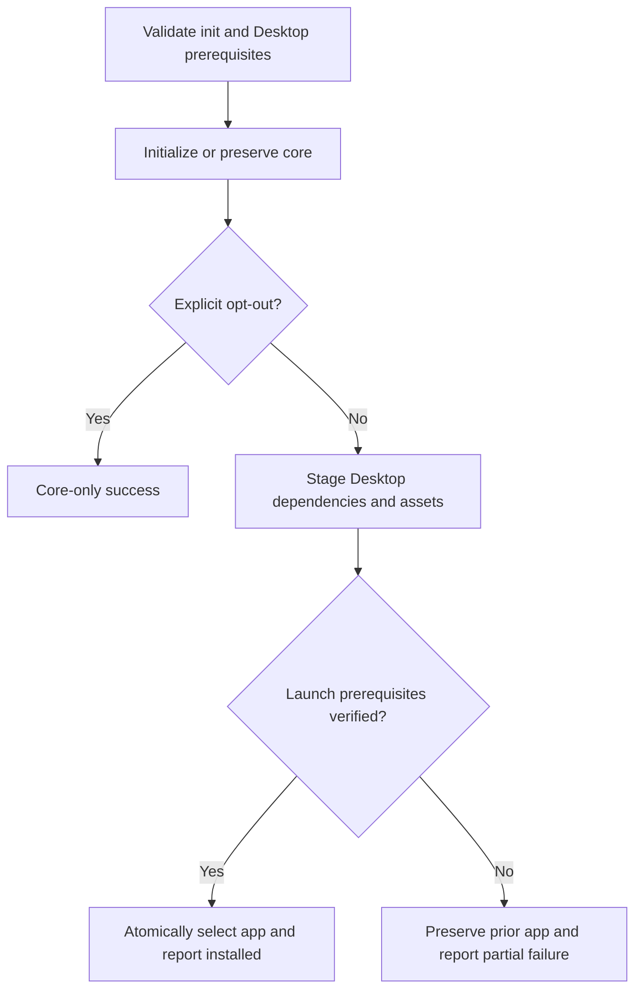

<!-- markdownlint-disable-next-line MD025 -->
# Desktop Bundled Installation - Plan

## Goal Capsule

Users completing the standard jarvOS installation can launch its Desktop companion without separately cloning or assembling it.
Harnesses remain the primary interfaces.
The existing Desktop child project owns this outcome.
Fable 5.1 drafted the approach; the lead integrates and verifies bounded Grok 4.5/4.6 implementation through the user-selected codex-router transport.
Source submission follows normal review and merge gates; public release, live installation, runtime changes, and archival of the old repository are excluded.

Routing recovery: the earlier router trial was cloned but never executed. The first U1 attempt incorrectly used the legacy direct adapter and hit its eight-turn limit without an accepted result; disclosed native fallback completed U1, and native U2 continued independently. Before any further Grok call, qualify the exact subscription route in an isolated trial. Do not silently change transport, substitute paid API access, reconfigure live Codex, or duplicate accepted units. The lead continues authorized local integration while that route is unproven.

## Product Contract

### Summary

Include Desktop in this repository and in the installer package, with an explicit headless opt-out and a launch command.

### Problem Frame

The separate app requires manual assembly and can drift from the jarvOS capabilities it presents.

### Requirements

- R1. Preserve Desktop source history and the reviewed System-page improvements while importing into `apps/desktop`; preserve all existing worktrees and running processes.
- R2. Standard initialization installs a launchable Desktop by default; `--no-desktop` or `JARVOS_NO_DESKTOP=1` explicitly skips it without installing its dependencies.
- R3. Desktop requires Node 22.12 or newer; headless core retains Node 18 support, with prerequisite failures detected before new initialization writes.
- R4. App updates preserve user configuration and the prior working app; failed Desktop installation is clearly partial, nonzero, and safely retryable without rewriting core or vault files.
- R5. Doctor and harnesses work with Desktop closed or absent; the app continues consuming existing published health and Projects contracts.
- R6. Ship no personal paths, account/project IDs, credentials, generated host bindings, or user state as current package defaults.

### Key Decisions

**Companion, not primary interface** (session-settled: user-directed — chosen over Desktop as the main interface because harnesses are primary). Governs R5.
**Installed by default, use optional** (session-settled: user-directed — chosen over separately opting into installation to avoid assembling two products). Governs R2.

## Planning Contract

- KTD1. Import the existing history without squash and reconcile source heads `011e75e` and `e6fe82d`; verify ancestor reachability and tree equivalence, not a misleading path-log count. Keep unrelated voice/feedback worktrees intact. Implements R1.
- KTD2. Keep Desktop as a nested package with its own lockfile, not a new workspace framework. Include its required source and existing prebuilt chat assets in the root tarball; package validation detects missing/stale assets. Root installation never runs a hidden npm postinstall. Implements R2/R6.
- KTD3. The shared installer stores versioned, content-identified app copies under the installation workspace's `.jarvos/desktop`, not inside a global/npx package or vault. Build/install into a private staging directory, verify required assets and Electron executable, then atomically select it. Preserve the prior selection on failure; take an exclusive install lock and refuse unsafe/symlinked targets. Remove only a verified, failed staging directory owned by the current attempt; never clean prior versions, foreign stages or interrupted-attempt evidence automatically. No background updater. Implements R4.
- KTD4. `jarvos desktop install|status` accepts the installation workspace; bare `jarvos desktop` launches its selected app. Standard init aliases and direct bootstrap use the same installation helper. Explicit install provides retry/update; `sync` and Doctor remain read-only. Never launch Desktop automatically. Implements R2/R4/R5.
- KTD5. `config.default.json` is portable; installed workspace-derived settings live outside versioned app bytes and are written only when absent. `JARVOS_DESKTOP_CONFIG` selects an explicit override, shared by server and Electron. Respect `PORT` and existing Projects override semantics. Unconfigured integrations remain unavailable rather than binding to the developer's services. Implements R6.

### Installation flow

macOS receives actual desktop-launch acceptance here. Linux and Windows paths must be platform-aware and tested where available; do not claim native acceptance on an untested platform. Unsupported platforms fail before writes unless opted out. Electron download needs network access; no paid service, signing, or native installer framework is introduced.

## Implementation Units

### U1. Preserve and relocate the companion

**Files:** `apps/desktop/**`, specifically `server/config.js`, `electron/main.js`, `config.default.json`, `package.json`, lockfile, `.gitignore`, `test/config.test.js` under that directory.
**Dependencies:** none.
**Approach:** host performs history-preserving Git integration; Grok adapts shared configuration loading and portable defaults. Reuse existing app architecture and UI. Follows KTD1/KTD5 and R1/R6.
**Scenarios:** source commits remain ancestors; current imported tree matches reconciled source before adaptations; default config has no account bindings; explicit override controls both server and Electron; malformed/missing explicit override fails clearly; no vault reads when unconfigured.
**Verification:** existing Desktop tests plus configuration tests and build; source worktree statuses unchanged.

### U2. Install and launch safely

**Files:** `lib/jarvos-desktop.js`, `lib/jarvos-cli.js`, `tests/desktop-install-test.js`, `tests/cli-smoke-test.js`.
**Dependencies:** U1.
**Approach:** Grok implements KTD3/KTD4 with injected process execution for tests; reuse existing CLI parsing and path safety patterns rather than a new service. Host tests the installed app, not just the marker. Follows R2–R6.
**Scenarios:** fresh install; identical content no-op; changed content upgrade; failed npm or missing Electron preserves previous selection; interrupted staging retry; concurrent install refused; symlink/config preservation; workspace paths with spaces; status never mutates; launch from another cwd; Node 18 rejects Desktop while headless core works.
**Verification:** focused tests plus disposable real dependency installation and Electron readiness.

### U3. Connect standard installation and packaging

**Files:** `bootstrap.js`, `bootstrap.sh`, `package.json`, `README.md`, `tests/init-safety-test.js`, `tests/pack-manifest-test.js`, existing shell smoke tests, scoped CI configuration if necessary, `apps/desktop/README.md`.
**Dependencies:** U2.
**Approach:** route every supported init entrypoint through the shared helper after core verification, with Desktop preflight before writes. Keep explicit skip parity and partial-result exit status. Preserve compatible-existing core semantics and root Node 18 tests via opt-out. Document launch, retry/update, prerequisites, and no background updates. Follows R2–R5.
**Scenarios:** tarball contains complete launch assets but no dependency tree/user config; default init actually installs; every alias honors opt-out; existing-vault safeguards hold; Desktop failure cannot print overall success; `sync --dry-run` and Doctor do not install or launch anything.
**Verification:** packaged, disposable fresh/rerun/upgrade/headless flows through real entrypoints, not only injected unit tests.

### U4. Accept the integrated result

**Files:** bounded evidence under `docs/evidence/GH-293/`; fixes restricted to preceding units.
**Dependencies:** U3.
**Approach:** lead runs package, browser and native launch checks; one targeted independent review covers install/config safety. Complete normal source submission and merge only with required gates clean.
**Scenarios:** installed app renders its existing pages on an isolated port; close it and verify Doctor still works; bad/missing provider evidence remains visibly unavailable; previous app/config survive an upgrade failure.

## Verification Contract

- Run `npm test` in the root and `npm test` / `npm run build` in `apps/desktop`; retain actual exit codes and distinguish pre-existing failures.
- Run focused `node --test tests/desktop-install-test.js tests/pack-manifest-test.js` plus CLI/init safety coverage.
- Inspect a real `npm pack` tarball, install it into a temporary prefix, initialize a disposable workspace, and launch that installed copy. Do not substitute the source dev server.
- Rehearse headless, identical rerun, upgrade, failed upgrade and safe retry; compare core/vault/config hashes.
- Capture rendered and process evidence without disturbing the running Desktop. Verify source ancestry and exact PR-head CI.

## Definition of Done

R1–R6 hold in the integrated source and disposable installed-package rehearsal; required tests and scoped review pass; no abandoned implementation remains; the aligned source PR is merged and GH-293 has evidence and any genuine remaining delivery boundary. No public release or live rollout is implied.
